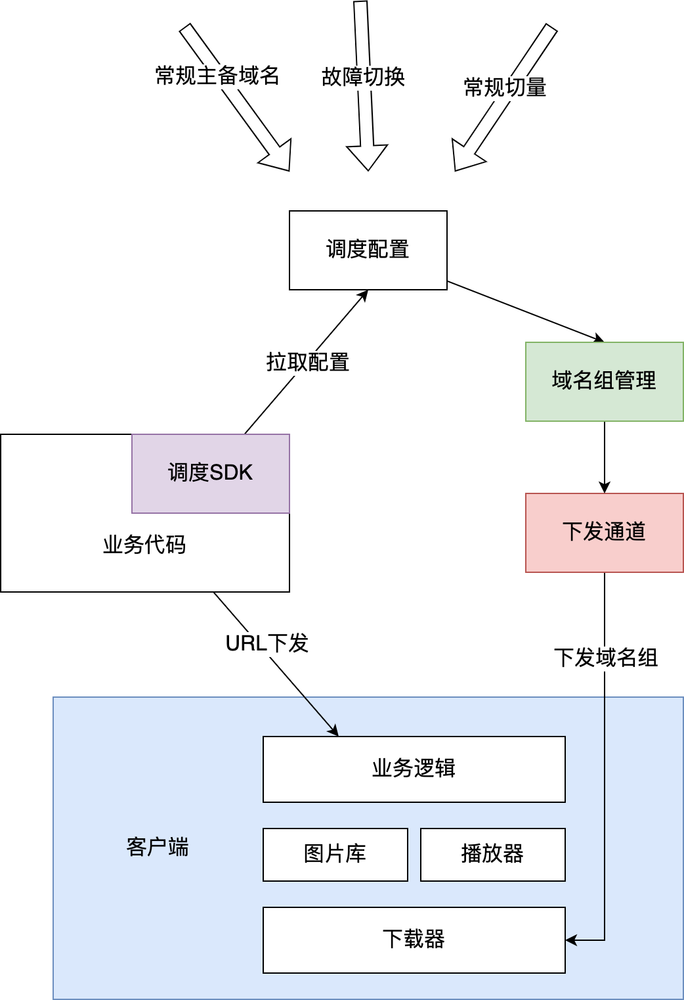
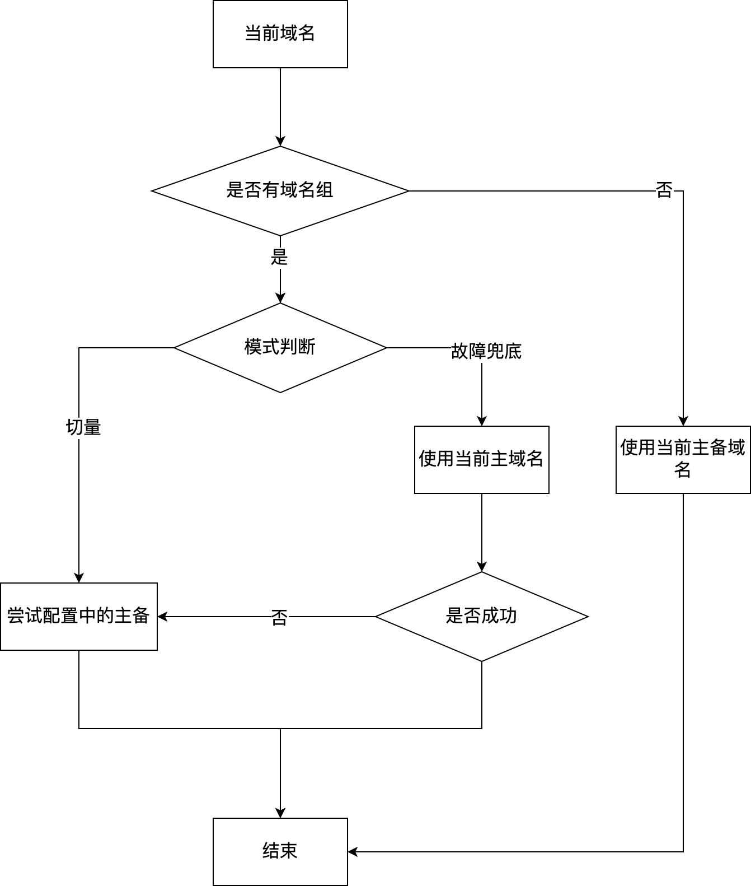
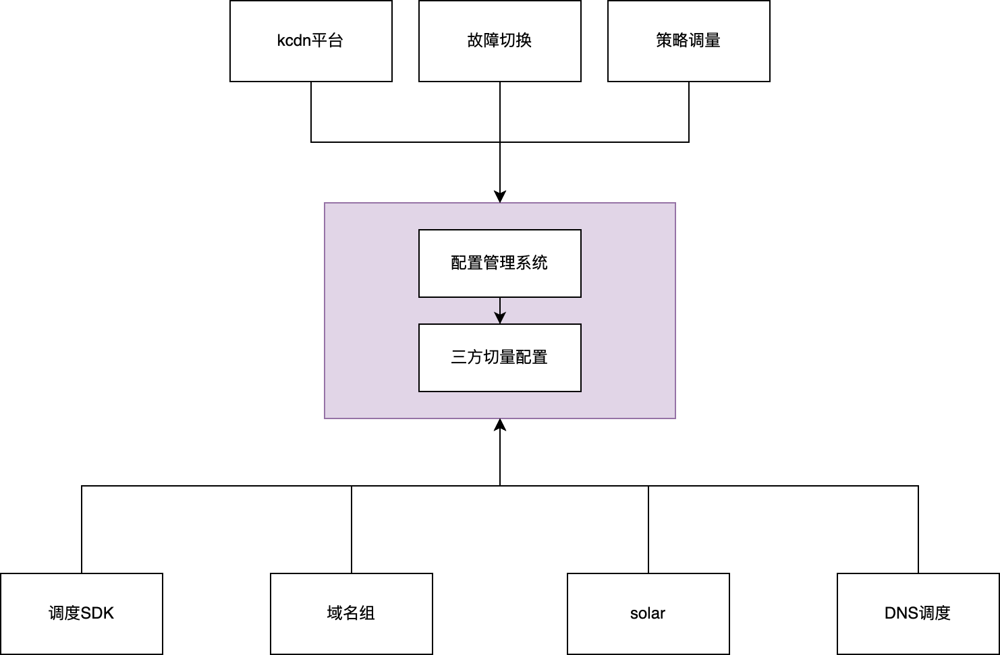

**Native 客户端容灾调度方案设计**

前期调研[Native 客户端容灾调度方案调研](https://docs.corp.kuaishou.com/d/home/fcAD2nXqJY1EHb5LwUgwIiubn)

## **背景**

目前静态流量的域名逃生能力主要依赖于服务端在下发URL时的调度切量能力。在域名逃生和线上切量的场景中，发现有大量切换无法生效的情况，主要分为以下几种情况：

1. 配置不合理，缺少可切换域名，导致无法切换【域名治理方案中解决】
2. 客户端写死域名，导致无法切换
3. 客户端缓存域名，包括业务缓存、下载器缓存。导致切换后延迟生效（10分钟～N天）

对于2、3点，有两个改造方案：

1. 推业务和客户端进行改造，针对所有缓存、写死的情况进行治理。
2. 联合下载器/网络库，在客户端实际发生下载事件之前将域名进行替换

## **实现方案对比**

| 方案 | 方案一：业务改造                           | 方案二：下载器替换域名                                       |
| ---- | ------------------------------------------ | ------------------------------------------------------------ |
| 优点 | 覆盖面广CDN侧改造量很小                    | 在下载器下载之前替换，切换效率高业务无需改造                 |
| 缺点 | 周期太长，不确定性太多很多业务不一定能改造 | 很多实验比较难以实现，现有部分开关无法在客户端实现不能覆盖所有业务告警依赖播放器和图片库，在下载器替换域名，会影响告警准确性无法支持防盗链和url加密客户度逻辑会比较重 |

## **联合Native方案目标**

1. 解决现有服务端下发技术方案下，部分场景切换生效慢、不生效的问题
2. 主要覆盖以下场景

| 场景           | 说明                                                         |
| -------------- | ------------------------------------------------------------ |
| 客户端自动逃生 | 部分业务没有下发主备域名，或者写死了主域名，在请求主失败后不能自动兜底到备份域名，当前方案填补这部分能力 |
| 故障切换       | 资源故障或者常规切换下发域名后，有大量因为客户端缓存、写死导致的无法切换。需要用本方案在资源下载前替换掉域名，保证切换即时生效 |
| CDN常规切量    |                                                              |

## **整体架构**

1. 调度配置



## **实现细节**

### **域名组**

#### **定义**

1. 一个业务场景（电商前端、电商后端、商业化前端。。）下所有域名构成的组合，下载器可以根据URL下发的域名来判断当前请求归属的域名组
2. 每个配置可以开启/关闭是否下发域名组，如果下发了域名组，就会变成后端下发URL（URL中的域名）+域名组同时生效，域名组优先级更高
3. 下发通道根据不同客户端信息（地区、运营商、UID等）判断实际下发的域名组列表

#### **配置转域名组**

1. 获取配置中所有域名，作为域名组中全量域名列表
2. 将现有配置不同省份运营商的接量域名进行分组，对应区域客户端只能拉取到对应区域的配置
3. 将区间转换为权重数据（目前photoId哈希的资源无法接入，端上不可能每个资源都来后端请求）


```
// 原来配置
name = "kcdnActivityBackendSafety"
baseNum = 1000
overseas = false

[dispatchMode]
statical = "USER_ID_HASH"
image = "USER_ID_HASH"
video = "USER_ID_HASH"

[[nodes]]
provider = "ALI"
[[nodes.products]]
product = "NORMAL"
[[nodes.products.domains]]
nodeName = "ali"
image = {domain = "p2-pro.kskwai.com", https = true, imageProcess = true}
video = {domain = "v2-pro.kwaicdn.com", https = true, imageProcess = false, authType = "TYPE_PKEY"}
[[nodes.products.domains]]
nodeName = "alibak"
image = {domain = "p2-pro.gskwai.com", https = true, imageProcess = true}
video = {domain = "v2-pro.etoote.com", https = true, imageProcess = false, authType = "TYPE_PKEY"}

[[dispatches]]
product = "NORMAL"
[[dispatches.rules]]
cdnType = "DEFAULT"
china = [
    {isp = "all", province = "Beijing", hash = [[800, 999]], nodes = ["ali", "bd"]},
    {isp = "all", province = "all", hash = [[0, 299]], nodes = ["ali", "hw"]},
    {isp = "all", province = "all", hash = [[300, 599]], nodes = ["hw", "ali"]},
    {isp = "all", province = "all", hash = [[600, 799]], nodes = ["bd", "js"]},
    {isp = "all", province = "all", hash = [[800, 999]], nodes = ["js", "bd"]},
]

// 生成两个域名组：image、video。以下为image示例
{
  	"group": "ad-group-image",
    "mode": "fallback",               // 模式：故障兜底、常规替换，人工设置
    "domainList": ["p1-pro.gskwai.com", "P2-pro.gskwai.com", "p3-pro.gskwai.com"]
    "rule": [
  		{ 
				"isp": "all",           // 兜底命中此规则
  			"province": "all",
  			"domains": [
  				{
						"domain": "p1-pro.gskwai.com",
  					"weight": 1
					},
					{
						"domain": "p2-pro.gskwai.com",
  					"weight": 1
					},
					{
						"domain": "p3-pro.gskwai.com",
  					"weight": 1
					},
					{
						"domain": "p4-pro.gskwai.com",
  					"weight": 1
					}
  			]
			},
			{                       // 北京命中此规则
				"isp": "all",
  			"province": "Beijing",
  			"domains": [
  				{
						"domain": "p1-pro.gskwai.com",
  					"weight": 1
					},
					{
						"domain": "p2-pro.gskwai.com",
  					"weight": 2
					},
					{
						"domain": "p3-pro.gskwai.com",
  					"weight": 1
					}
  			]
			}
  	]
}
```


#### **域名组下发格式**

**配置方案1:** **端上仅进行匹配和替换，由后端决定每个客户端实际读取到的配置**


```
{
	"code": 0,
  "updated_at": 124354985, // 秒级
  "rules": [
  	{
      "group": "ad-group-img",
      "mode": "fallback",    // 模式：故障兜底、常规替换
      "domainList": ["ali.cc.com", "tx.cc.com", "js.cc.com"]
      "effective_domains": [ // 需要按照顺序尝试
        {
          "domain": "ali.cc.com"
        },
        {
          "domain": "tx.cc.com"
        }
      ]
  	}
  ]
}
```


- domainList为域名组，下载器下载的域名命中后，需要走到此配置
- 支持的模式

| 模式     | 说明                                                         |
| -------- | ------------------------------------------------------------ |
| fallback | 域名故障场景下才触发，优先使用后端下发的域名后端下发域名失败后，再尝试effective_domains（优先用后端下发） |
| normal   | 只要命中域名组，就使用effective_domains（优先用域名组）      |

- 根据不同客户端所在省份、运营商、uid等拉取到对应的effective_domains，按照顺序进行替换
- 特殊情况

- 如果effective_domains为空，或者格式不对。继续使用原来的域名。需要进行日志上报【可降采样】

**配置方案2: 需要端上进行部分权重运算。配置份数比较少，适合keyconfig**


```
[
  {
  	"group": "ad-group-img",
    "mode": ["fallback"],    // 模式：故障兜底
    "domainList": [
      {
      	"domain": "ali.adkwai.com",
        "weight": 2,
        "status": "normal"  // 状态，是否可用
      },
      {
      	"domain": "ali.adkwai.com",
        "weight": 1,
        "status": "normal"
      }
    ]
  },
  {
  	"group": "ad-group-img-video",
    "mode": ["fallback"], 
    "domainList": [
      {
      	"domain": "ali1.adkwai.com",
        "weight": 2,
        "status": "normal"
      },
      {
      	"domain": "ali1.adkwai.com",
        "weight": 1,
        "status": "normal"
      }
    ]
  }
]
```


### **下发通道**

1. 根据不同客户端拿到不同的内容，需要支持的纬度：
   1. 基础：运营商、省份、uid
   2. 后续优化：免流、实验标签

#### **自研通道 VS keyconfig**

|          | 自研通道                                                     | keyconfig                                                    | kswitch ??? |
| -------- | ------------------------------------------------------------ | ------------------------------------------------------------ | ----------- |
| 实现方式 | 方案一：基于http实现（socket连接数负载过大），走定期拉取配置的方式方案二：复用部分公司下发通道，结合部分自研代码实现 | 复用keyconfig进行下发，目前支持省份、运营商、UID             |             |
| 优点     | 定制化程度高                                                 | 链路稳定，开发成本低                                         |             |
| 缺点     | 开发量大，需要客户端和CDN侧都进行大量开发来支持这个通道稳定性相对keyconfig较差，需要较长时间优化 | 定制化低，后期可能会有部分功能难以实现，比如：一些实验调优需求特殊灰度要求 |             |
| 现有问题 | 目前下载器拿不到uid                                          |                                                              |             |

### **Native客户端命中逻辑**



- 需要的打点上报【降采样】
  - 当前命中的域名组
  - 源域名->命中后的域名
  - 命中失败的情况
  - 配置同步情况

### **现有告警改造【待定】**

> 底层替换域名，会导致播放器和图片库的准确性

1. 底层是否可以向播放器和图片库返回实际域名，用于日志上报

> 只依赖下载器和网络库的日志做告警源

## **改造升级思路**

### **写死类项目**

1. 先推动业务将写死域名改为对应域名组中的域名，再打开对应域名组的能力

### **现有接入调度SDK的业务**

1. 本次改造应该是在域名治理之后，在业务收敛完域名后，针对新的域名组生效
2. 后端管理开关
   1. 需要开启的业务才会生成域名组
   2. 需要支持按照uid级别的灰度，命中灰度的客户端才能拉取到配置
3. 客户端需要加入开关
   1. 只有命中灰度的客户端才会尝试获取下发域名组和执行替换逻辑

## **待优化的点&&解决方案**

1. 无法覆盖的业务

| 业务         | 原因                                                         | 替代方案                       |
| ------------ | ------------------------------------------------------------ | ------------------------------ |
| 防盗链项目   | 防盗链和域名相关，替换域名后防盗链失效                       | 此类业务比较实时，缓存问题较小 |
| 主站视频     | 主站视频基于photoid选择资源，如果替换域名会导致回源升高（只能做fallback） |                                |
| 非下载器项目 | 没有接入下载器的项目                                         | 涉及到的流量较小，不是关键痛点 |

1. 未来配置格式是否进行优化？
   1. 当前配置格式结构不合理（资源类型、免流、国家等纬度层级设置比较混乱，代码理解、人工维护都有一定难度）
   2. 文件区间没有保存的必要，影响配置效率，容易出错
   3. 基于当前配置生成域名组，权重等信息比较难算出来
   4. 一套配置适用于所有场景，方便管理维护



1. 实验如何实现？
   1. 基于UID的实验当前可以cover，如果基于keyconfig，针对不同uid有不同配置，可能导致keyconfig的压力过大
   2. 基于其他纬度的实验，需要客户端配置。例如客户端基于kswitch获取实验参数，将参数传递给通道，通道基于参数下发域名组（依赖自定义通道）

1. 现有的成本拆分如何处理
   1. 目前成本拆分方案有url参数、path前缀来实现，如果在下载器进行域名替换，这部分会不准
   2. 需要当前的成本拆分方式完全基于域名实现或者在下载器修改url参数

1. 自建CDN如何接入这套方案
   1. 目前看只有走DNS调度的部分可以接入，其他部分因为无法识别域名组，无法命中

1. 部分业务是基于调度SDK生成的URL来做一些策略（商业化站内广告依赖url的结尾是.js来判断是不是可执行文件，不确定是否有业务会基于域名做一些事情）。可能会存在一些隐患
   1. 是否能做到上游无感知域名

人员

hodor @黄通

调度 @李爽 （@李平）