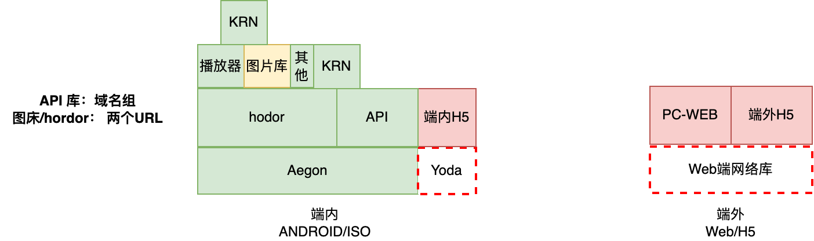
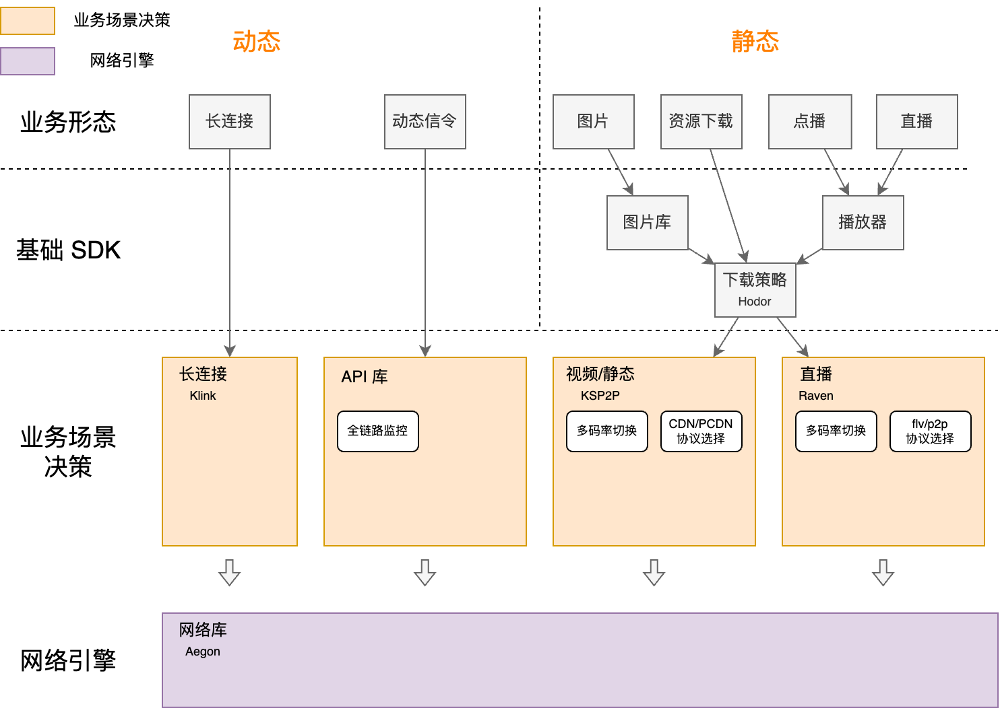

**Native 客户端容灾调度方案调研**

**背景：**

​	流量中心在推进业务进行域名逃生的治理（[静态流量域名的现状与治理方案](https://docs.corp.kuaishou.com/d/home/fcACGBX_FSHaffkLJLnVBNm18)），目前静态流量的域名逃生能力主要依赖于服务端在下发URL时的调度切量能力，但是业务的使用场景经常无法调用我们的调度SDK，有很多场景需要缓存或者写死域名。这种情况当CDN出现故障时我们就无法止损，因此想建设客户端的域名逃生能力。设想方案参考：[网络库（Native + Web）CDN 调度与降级支持](https://docs.corp.kuaishou.com/d/home/fcADakerA-R29aRvWwQpq-Mxo)。目前web端的网络库已经在开发中了。本文主要讨论Natvie场景的支持链路。动态目前是客户端方案：[IDC域名逃生方案](https://docs.corp.kuaishou.com/d/home/fcAAhVqtaLHRB9L8wy_tgxen5)

**调研问题？**

### **问题1: 这个能力应该做到hodor还是Aegon 那个更合适？**

​	参考网络库的未来规划，[网络库优化讨论](https://docs.corp.kuaishou.com/d/home/fcAApbRYpZjGGZqJi6p4XgbAL)， Aegon 不参与策略相关的决策，似乎放到hoder更加合适。但是hodor 目前无法覆盖KRN的场景。未来是否有考虑将KRN的内容接入Hodor呢？或者说我们要hodor + KRN 一起做这些事情。

​	

​	KRN ：静态资源的访问是走hodor的

​	yoda 的离线包/播放器走hodor

​	**暂定放到Hodor内部实现。** 

网络库的未来规划：

### **问题2: 底层更换域名上层是否要感知，如何感知？ 例如 底层更换域名对上层的日志上报是否有影响？**

​	**hodor上层调用情况：**

点播播放器（直接给两个url）

​	直播播放器（上层有重试）

​	资源（yada/kds/krn/直播资源下载，hodor）

​	图床(Q2 ANDROID 能完成，Q3 iphone 接入 hoder)

​	

​	**是否要感知？**

​	1 需要确认目前故障报警是否参考了 hodor以上的故障切量。

​		点播静态：**播放器/图片库**的日志都被参考了。报警是使用的，确认日志如何被使用 @李爽

​		成本拆分：依赖播放器的日志。@刘利川

​	2 播放器/图床的打点有没有其他用处，是否需要感知。

 	需要确认点播静态是否能感知，如何技术上实现@黄思培

​	3 资源类的一般不需要感知

​		确认哪些业务是必须要感知的 @唐堃

​	4 直播场景

​		暂时不考虑

​	**如何感知？**

​	1 技术上可以实现，返回结果时通知上层使用的是那个域名。

### **问题3:底层更换域名和现在的双URL给到网络库是否冲突？有什么好的办法兼容处理。**

初步定的策略：

**1 直接给多个URL的，hodor直接在两个URL重试 （一般直播，以及点播有防盗链的内容是如此，这类资源一般无法替换域名直接用）**

2 调用给一个URL， 这里分两种情况；

​	1 业务上层有多个URL，且自己写了重试逻辑，例如直播播放器。

​	2 业务上层没有多个URL，没有重试逻辑，例如一些资源下载。

**两种情况是否能区分？有没有必要区分**

​	**可能要支持用户设置不允许替换。**

​	

### **问题4: 是否要在客户端进行一定的调度能力，还是说我们只做failover的能力。**

​	**如果要调度：（建议）**

服务端需要拿到userid等信息，对不同的用户返回不同的域名组顺序，网络库按顺序使用。 

1 失败了才重试 

2 请求前就替换 

​	**如果不要调度：**

服务端不需要拿到userid等业务信息，对所有的用户返回相同的域名组内容。网络库随机选择使用。

### **问题5:  下发通道如何建设，是否有现成的通道可以使用，还是需要独立建设？**

​	**复用现在的keyconfig 通道：**

后端不用建设，服务端可以直接拿到userid，但是依赖主站业务，和业务绑定

​	**建设独立的通道：（推荐）**

后端需要建设。需要hodor拿到userid等信息，但是可以独立于业务存在。适用范围更广泛。

**结论：和动态保持一致（目前动态主app是 keyconfig）**

​	

### **问题6: 业界有没有这么做的，有没有什么坑？**

​	字节的直播是如此做的，直播直接下发的feed都不是url，url是在客户端生成拼接成的。

​	

​	1 兜底的域名必须有量。也应该有一定的量及，也会自然产生一些量级。

​	2 URL加密/防盗链 就一定不能用；后端保证不能下发到客户端。

​	3  2个URL 重试还失败的，自建的考虑再补充一个URL 

​	

​	

​	