**电商直播质量优化--南北方基建**

# **highlight**

1、电商直播开播失败率从2.10%降至0.9%(01-04~10结算周期，达成1%以内目标)，但南方比北方差0.38pp(南方1.19%，北方0.81%)，需持续优化开播失败率并针对南方等电商重点场景进行优化

| **开播失败口径：「用户停留1s以上且无首帧画面」+「播放器报错&无首帧画面」+「观众进入直播间时主播已关播」** |
| ------------------------------------------------------------ |
| 时间周期：20240801～20250110电商 2.10%->0.90%，正向下降 1.2pp |

2、对电商南方开播失败率归因分析，核心要解的是冷流和弱网问题，预期通过架构和基建来优化；新建三线机房和专线预计成本增加 +5800万，通过回源率优化和将高价三方CDN切到低价自建CDN优化预计可优化成本 -5800万，预估总成本可以与预算基本持平，不需要额外增加成本 

3、整体项目排期：软件层面：4月完成软件架构层面开发；基建建设：三线节点4月覆盖电商南方用户带宽50%，7月覆盖80%，10月覆盖90%

4、大V开播失败率较差(根因还在进一步分析中，本文主要是从南北方差异的视角优化冷流和弱网基建问题)，目前已分析到的特征和强插变多(强插开播失败率高)、冷启动前十刷变多(冷启前十刷开播失败率本身高)、主站精选页面和极速版本发现页面拉流占比变多(两个页面的的开播失败率高)、南方变多(南方本身开播失败率高)这几个因素相关

# **一、背景**

**背景：**我们在优化电商直播开播失败率项目过程中，分析发现南北方的开播失败率存在显著差异，其中南方比北方差0.38pp（01-04~01-10数据，南方：1.19%，北方：0.81%）（24年12月数据，南方：1.66%，北方：1.06%）；并且业务对南方用户体验优化和提升南方GMV也有强诉求，因此我们对南方开播失败率进行深度归因并从架构和基建方向针对南方进行优化

# **二、南北方差异归因分析**

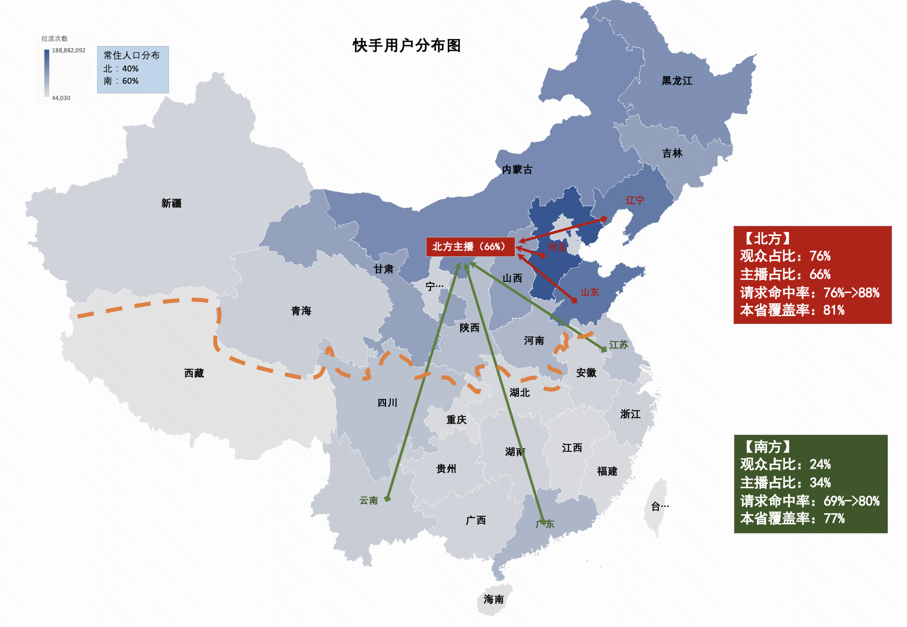

- **观众特性**
  - 南方观众少（北方：76%，南方：24%），南方的单CDN节点每路流平均观众数少于北方（南方：0.8人/路流/节点，北方：2.7人/路流/节点），造成南方命中率比北方低（北方：76%~88%，南方：69%~80%）；
  - 未命中比命中开播失败率高122%，绝对值差0.27pp

- **主播特性**
  - 南方主播少（北方：66%，南方：34%），南方CDN节点需要大面积公网跨长途回源北方源站，
    - CDN回源源站成功率 (北方机房99.61%, 南方机房99.30%）
    - CDN回源源站建联耗时（北方机房23.6ms，南方机房32.9ms)

- **网络覆盖特性**
  - 南方本省覆盖率比北方低（北方：81%，南方：77%）
  - 开播失败率对比，本省覆盖优于跨省覆盖
    - 本省覆盖-请求命中：0.40%，本省覆盖-请求未命中：0.6%
    - 跨省覆盖-请求命中：0.46%，跨省覆盖-请求未命中：0.68% 

（这里是客户端命中数据，客户端收到响应才知道是否命中，有部分开播失败是没有收到响应，因此值比实际的开播失败率要偏低）

- 
- 南方网络分0-15用户比例高于北方（北方：10%，南方：12%）
- [南北方-数据明细](https://docs.corp.kuaishou.com/s/home/fcADluiNP3SM5xsKnJFIG27Eh)

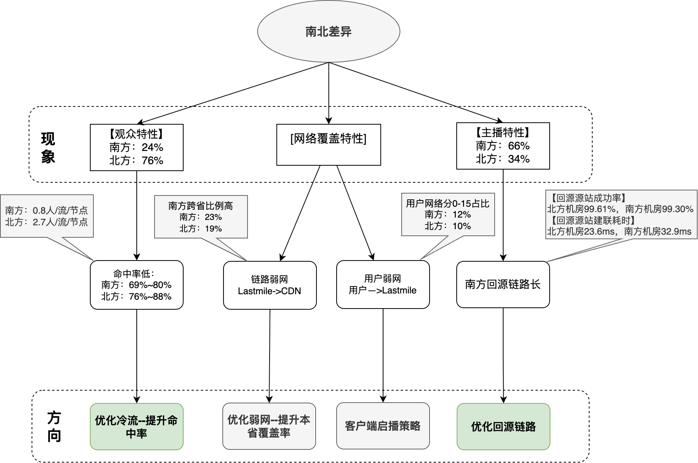

# **三、解决方案**

## **3.1 技术方案**

### **3.1.1 解决思路**

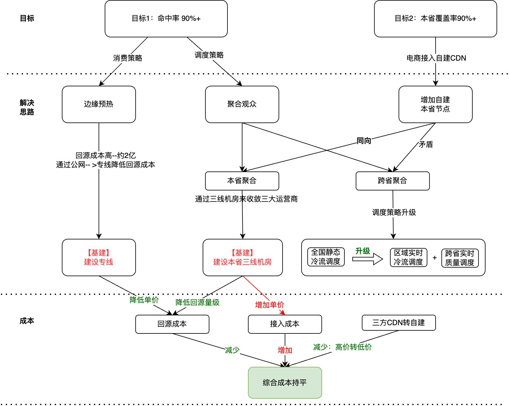

> **※** 成本上涨 = 预热的节点数*预热的房间数（acu 100-10000）*平均档位数*平均码率*回源带宽单价 = (90*50%)*12485*3.08*1799*单价=3.1T*单价=约2亿年化

> **※** 策略：电商acu 100-1000的1.2w个房间共计3.8w路流，全量预热到较冷的45个边缘节点

### **3.1.2 演进示意图**

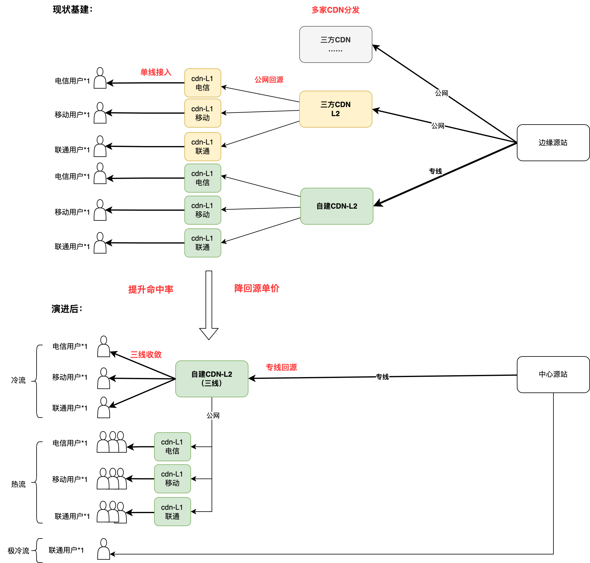

### **3.1.3 架构示意图**

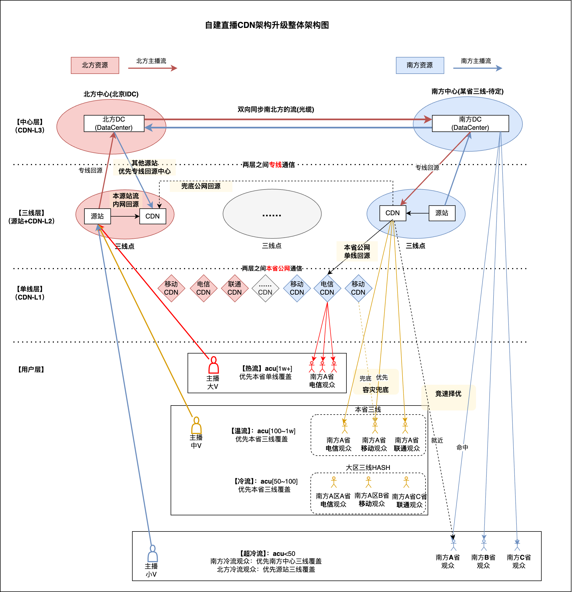

- **整体架构：分为三层架构**
  - 中心层 ：中心汇聚各源站流，通过光缆进行双向同步【覆盖南方超冷流】
  - 三线层 ： 通过内网+专线回源，节点覆盖三大运营商观众，回源成本较低，接入成本高【覆盖冷流】
  - 单线层 ：通过本省公网回源，节点只能覆单运营商观众，回源成本高，接入成本低【覆盖热流观众】

- **稳定性容灾：**
  - 接入：本省单线、本省三线 + 邻省三线、邻省单线兜底，保障节点的容灾
  - 回源：中心源站和跨南北光缆异常兜底到公网回源流所在三线源站

- **质量调度：**
  - 观众：本省覆盖，进行竞速CDN优选，保障用户接入最优链路；初始最优解为本省+命中的情况，根据公网和专线容量建设调度模型选择最优线路
  - 主播：本省推流，可以进一步优化主播推流质量

### **3.1.4 软件架构开发排期**

| **1月**                              | **2月**                                                      | **3月**                                                  | **4月**                                              |
| ------------------------------------ | ------------------------------------------------------------ | -------------------------------------------------------- | ---------------------------------------------------- |
| 自建节点服务支持区域实时热度统计上报 | 直播专线回源适配改造直播中心架构适配改造cdn回源监控埋点数据改造 | 调度支持区域实时冷、热调度自建调度支持本省、跨省兜底容灾 | 调度接入跨省实时质量数据完成区域实时冷、热流调度调优 |

## **3.2 基建建设和成本**

### **3.2.1 资源建设方案**

- 为了离南方用户更近、解决南方用户访问链路长的问题，需要 **新建1个南方中心**、**建设南北互通的专线（南北骨干）**；

- 为了提升本省覆盖率、解决弱网问题，需要 **扩容13个存量节点**、**新建8个三线节点**；
- 网络架构变化：从单中心架构演进为双中心架构；资源分布变化：三线机房，从13个增加到21个

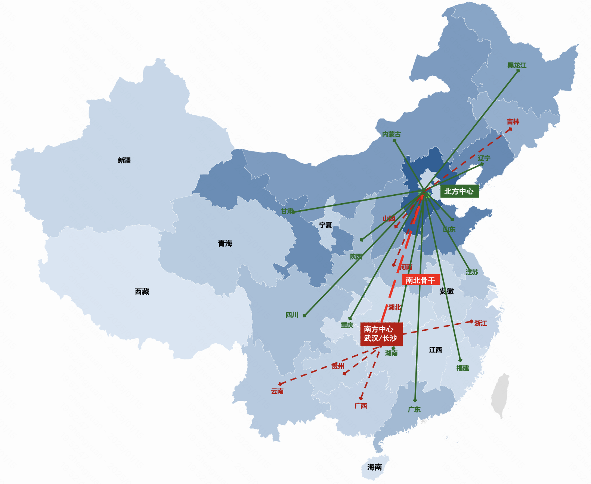

### **3.2.2 南方中心选点**

考虑骨干网分布，建议在【武汉、长沙、广州】中选择网络质量和成本较优的作为南方中心：

- 网络质量对比：长沙 ~ 武汉 > 广州（南方省份用户分别对 武汉、长沙、广州 发起拨测，对比rtt指标；
- 预估成本对比：武汉 > 长沙 > 广州（租用光缆成本 + 采购设备成本 + 三线带宽成本）

综合对比后，质量方面，长沙与武汉持平、广州最差；成本方面，武汉成本最优、广州最差；

因当前成本为初步摸底，不是最终定标结果；建议在武汉和长沙之间PK，正式发起寻源，质量都测试通过的情况下，选择成本更优的区域作为南方中心。

| **方案选型**         | **方案一：武汉**                          | **方案二：长沙**                          | **方案三：广州**                          |
| -------------------- | ----------------------------------------- | ----------------------------------------- | ----------------------------------------- |
| **光缆链路**         | 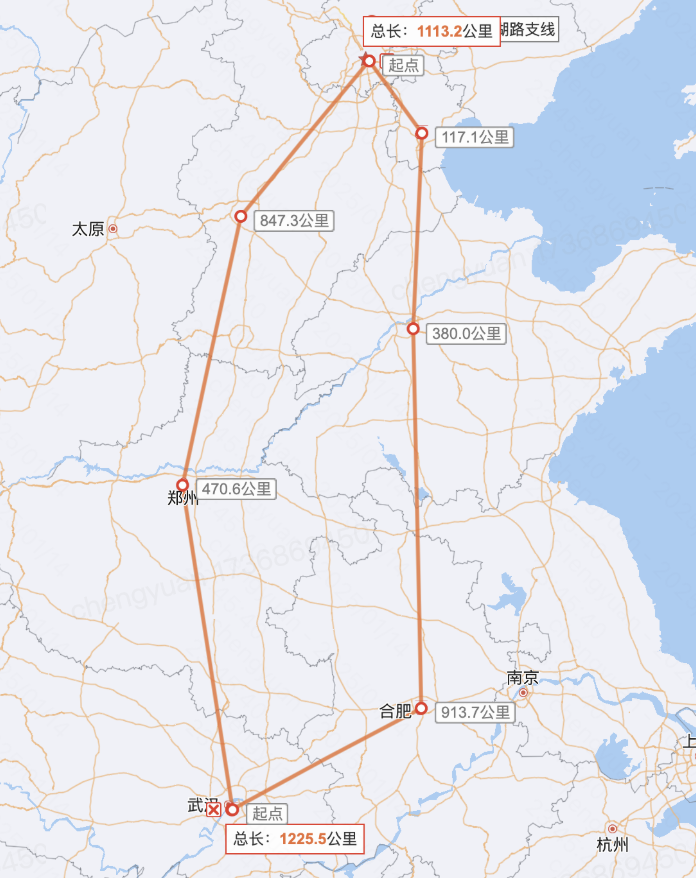 | 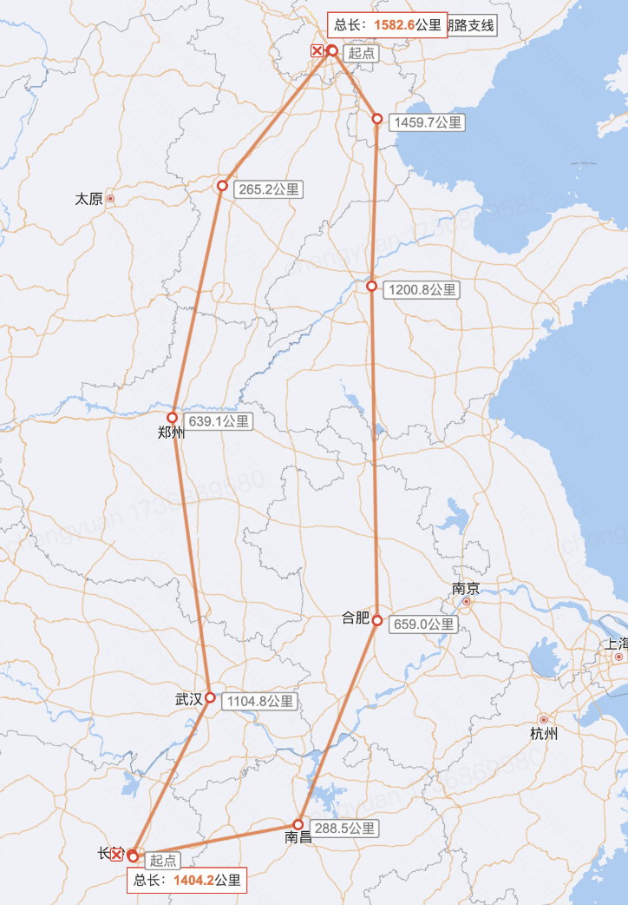 | 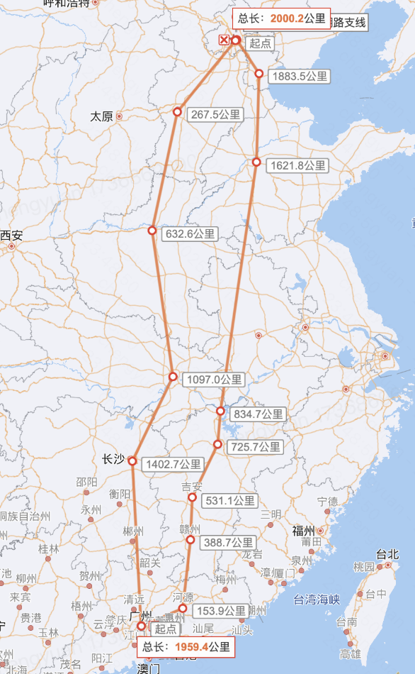 |
| **网络质量**         | 南方观众加权 **rtt: 34.08**               | 南方观众加权 **rtt: 33.72**               | 南方观众加权 **rtt: 37.20**               |
| **预估成本**         | **485万/月**                              | **515万/月**                              | **699万/月**                              |
| **成本① ：租用光缆** | **182万/月**                              | **235万/月**                              | **314万/月**                              |
| **成本② ：采购设备** | **23万/月**                               | **40万/月**                               | **45万/月**                               |
| **成本③ ：三线带宽** | **280万/月**                              | **240万/月**                              | **340万/月**                              |

### **3.2.3 资源建设排期**

#### **整体建设排期**

- **业务需求：**期望【25年4月】扩容13个存量节点、【25年8月】新建8个三线节点、新建南方中心和南北骨干
- **建设评估：**考虑市场情况&建设节奏后，激进预估：【25年7月】扩容13个存量节点、交付南方中心和南北骨干；【25年12月】新建6个三线节点的；【26年】新建2个三线节点

- **风险预警**
  - 建设节奏激进，需要采购同学并行寻源、需要IDC和网络同学并行建设（24年最激进建设节奏是1.5个月/节点，25年需要1个月/节点）
  - 此方案南北骨干成本按两路由进行评估，存在一定断网风险。建议按照三路由评估，预计成本增加至1.5-1.8倍；如果考虑三路由成本较高，可以高风险路段单独拉小段三路由做加固

| **月份**       | **业务需求**           | **建设评估**                                      |
| -------------- | ---------------------- | ------------------------------------------------- |
| **2025年4月**  | 扩容 13个 存量三线节点 | 扩容 7个 存量三线节点                             |
| **2025年7月**  |                        | **扩容 13个 存量三线节点**新建 南方中心和南北骨干 |
| **2025年8月**  | 新建 8个 三线节点      |                                                   |
| **2025年12月** |                        | **新建 6个 三线节点**                             |
| **2026年2月**  |                        | **新建 8个 三线节点**                             |

#### **南北骨干交付排期**

> *整体网络规划：*[*快手全国IP骨干网*](https://docs.corp.kuaishou.com/d/home/fcAAQp98TpRrZe3pLIVGTwjY7#section=h.raj1aagjviv8)

涉及端到端光缆资源选型、优化、设备选型和测试、招标、约数十个站点的资源现场核查安装和调试等环节，经评估，整个建设周期需要4~5个月，具体排期如下：

| **阶段**                  | **负责团队**                         | **主要内容**              | **起止时间**    |
| ------------------------- | ------------------------------------ | ------------------------- | --------------- |
| 选型与招采                | 基础网络                             | 线路技术选型，光缆优化    | 2025.2.16～3.15 |
| 基础网络                  | 验证测试技术方案，确定配置与技术评分 | 2025.2.16～3.15           |                 |
| 采购部+供应链+IDC采购中心 | 线路商务选型、发标、评标、定标       | 2024.3.16～3.25           |                 |
| 建设交付                  | 基础网络                             | 线路/机房核验，偏差项整改 | 2025.3.26～5.15 |
| 供应链                    | 发货到货                             | 2025.3.26～5.15           |                 |
| 基础网络                  | 工程实施                             | 2025.5.16～6.31           |                 |
| 基础网络                  | 系统建成试运行                       | 2025.7.1                  |                 |

### **3.2.4 项目成本**

考虑资源建设节奏后，预计总成本可以与预算持平，不需要额外增加成本：

- 专线建设(包含南北骨干)，预计成本上涨（A）**+5800万**
- 自建直播回源从公网切换为专线，预计成本优化（B） **-3200万**
- 自建直播多承接三方直播量级，预计成本优化（C） **-2600万**

| **科目**                              | **25年预算：不考虑南方优化项目****①（亿元）** | **25年预算：考虑南方优化项目****②（亿元）** | **② - ①（亿元）** |
| ------------------------------------- | --------------------------------------------- | ------------------------------------------- | ----------------- |
| **成本上涨：专线（A）**               | 1.33                                          | 1.91                                        | 0.58              |
| **成本优化：自建直播回源（B）**       | 1.18                                          | 0.86                                        | -0.32             |
| **成本优化：自建多承接三方量级（C）** | 10.72                                         | 10.46                                       | -0.26             |
| **成本上涨：自建直播（C1）**          | 3.91                                          | 4.94                                        | 1.03              |
| **成本优化：三方直播（C2）**          | 6.81                                          | 5.52                                        | -1.29             |
| **汇总**                              | **13.23**                                     | **13.23**                                   | **-0.0016**       |

## **3.3 建设观测指标体系主动发现质量问题**

流量联合音视频进行直播体验指标的深度挖掘分析和优化，并做好防劣化：

- 分析核心qos指标对qoe的影响关系
- 分析核心qos指标的优先级（敏感人群/非敏感人群）
- 做好核心qos指标的监控归因

# **附录：**

## **1、南方的网络质量比北方差观测指标**

1）南方的下速速度比北方低

| 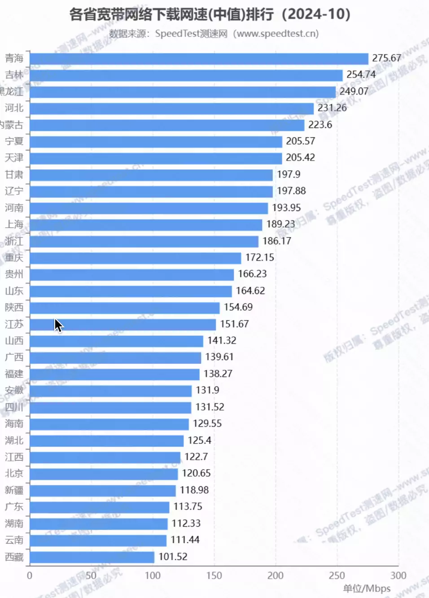 |      |
| ----------------------------------------- | ---- |
|                                           |      |

2）api请求(和cdn无关)：南方的api请求成功率比北方低

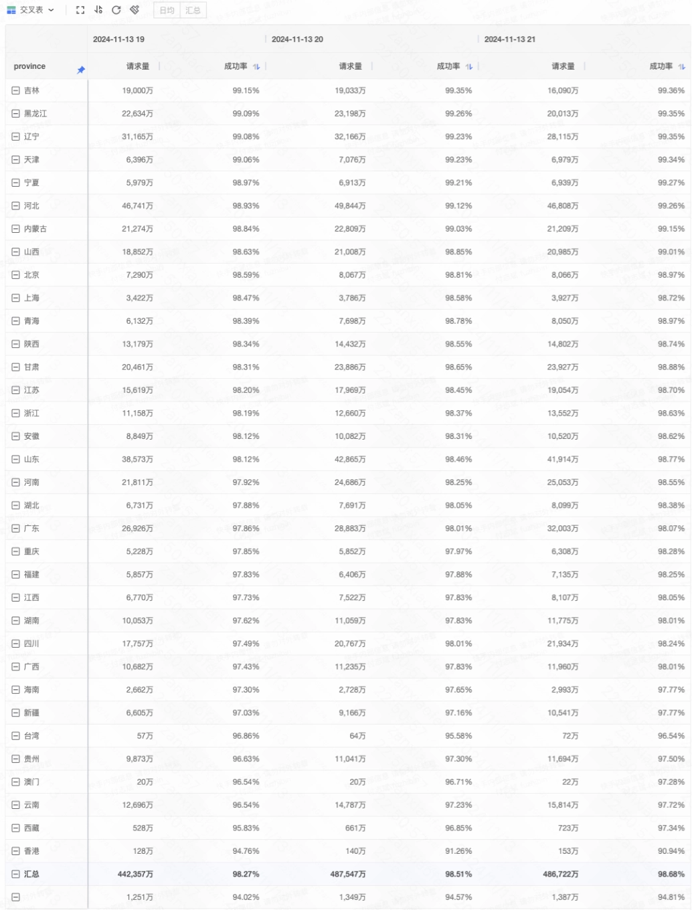

3）抖音首帧耗时--> 南方比北方差

山东：315ms VS 广东360ms

从差到好排序：西藏 新疆 广西 海南 青海 广东 贵州 内蒙古 重庆 湖南 四川 云南 甘肃 福建 吉林 宁夏 湖北 江西 陕西 黑龙江 河北 山西 北京 山东 安徽 河南 浙江 辽宁 江苏 天津 上海

## **2、机房建设评估逻辑** 

[三线本省覆盖项目改造方案](https://docs.corp.kuaishou.com/d/home/fcACD1SwdMAOmhcv1m6R0McLz#section=h.ctkxg9wjqnfc)

[南方各省拨测-佛山-长沙-武汉数据-第二轮](https://docs.corp.kuaishou.com/s/home/fcACaa1mlrREBvrln5yvasFf6?section=990227645)

## **3、开播失败拆解**

| 南北方-电商 | 开播失败率 | 观众拉流次数 | [请求命中率](https://kwaibi.corp.kuaishou.com/pc/dashboard/preview?dashboardId=2089750&filterConfig=34133093&insight-chart=5905009&insightConfigId=42136216&sheetId=207542) | 同省覆盖率 | 用户体验首屏P90（ms） | 码率（kbps） |
| ----------- | ---------- | ------------ | ------------------------------------------------------------ | ---------- | --------------------- | ------------ |
| 北方        | 0.82%      | 76%          | 88%                                                          | 81%        | 503                   | 2,191        |
| 南方        | 1.21%      | 24%          | 81%                                                          | 77%        | 574                   | 2,427        |

| 南北方-秀场 | 开播失败率 | 观众拉流次数 | [请求命中率](https://kwaibi.corp.kuaishou.com/pc/dashboard/preview?dashboardId=2089750&filterConfig=34133093&insight-chart=5905009&insightConfigId=42136216&sheetId=207542) | 同省覆盖率 | 用户体验首屏P90（ms） | 码率（kbps） |
| ----------- | ---------- | ------------ | ------------------------------------------------------------ | ---------- | --------------------- | ------------ |
| 北方        | 1.34%      | 67%          | 76%                                                          | 59%        | 602                   | 1,857        |
| 南方        | 1.95%      | 33%          | 74%                                                          | 55%        | 657                   | 2,160        |

[南北方-数据明细](https://docs.corp.kuaishou.com/s/home/fcADluiNP3SM5xsKnJFIG27Eh)

[开播失败-基建归因分析](https://docs.corp.kuaishou.com/d/home/fcAAuugwGTXAmCbeqzIRYBsSF)

[网络打分现状](https://docs.corp.kuaishou.com/d/home/fcAACZtUBIOjkbmxg6UyQnMgW)

[启播专项——南北方差异、大促大V分析](https://docs.corp.kuaishou.com/d/home/fcABsEc0maJ8z-5Zl7QK_Zre2#section=h.l3pbwmnfyldl)

[开播失败率数据盘点24.08](https://docs.corp.kuaishou.com/d/home/fcAD7OLR9Q3GYq9RqIdWfc2RB)

**4、CDN回源数据**

**三方CDN回源数据**

| **区域** | **建联耗时（毫秒）** | **请求耗时** | **首帧耗时** | **成功率** |
| -------- | -------------------- | ------------ | ------------ | ---------- |
| **北方** | **23.6**             | **75.3**     | **109.82**   | **99.61%** |
| **南方** | **32.9**             | **97.0**     | **140.35**   | **99.30%** |

[**三方直播回源监控数据导出-20250111**](https://docs.corp.kuaishou.com/s/home/fcADHJzSQ8UuzVjnS0omfz351?section=1050501357)

[**CDN回源监控打点建设**](https://docs.corp.kuaishou.com/d/home/fcAB6baIw9ZwgMp7Ox9IZY3Ie#section=h.v5vrfmejrj8u)

**5 、现状架构与问题**

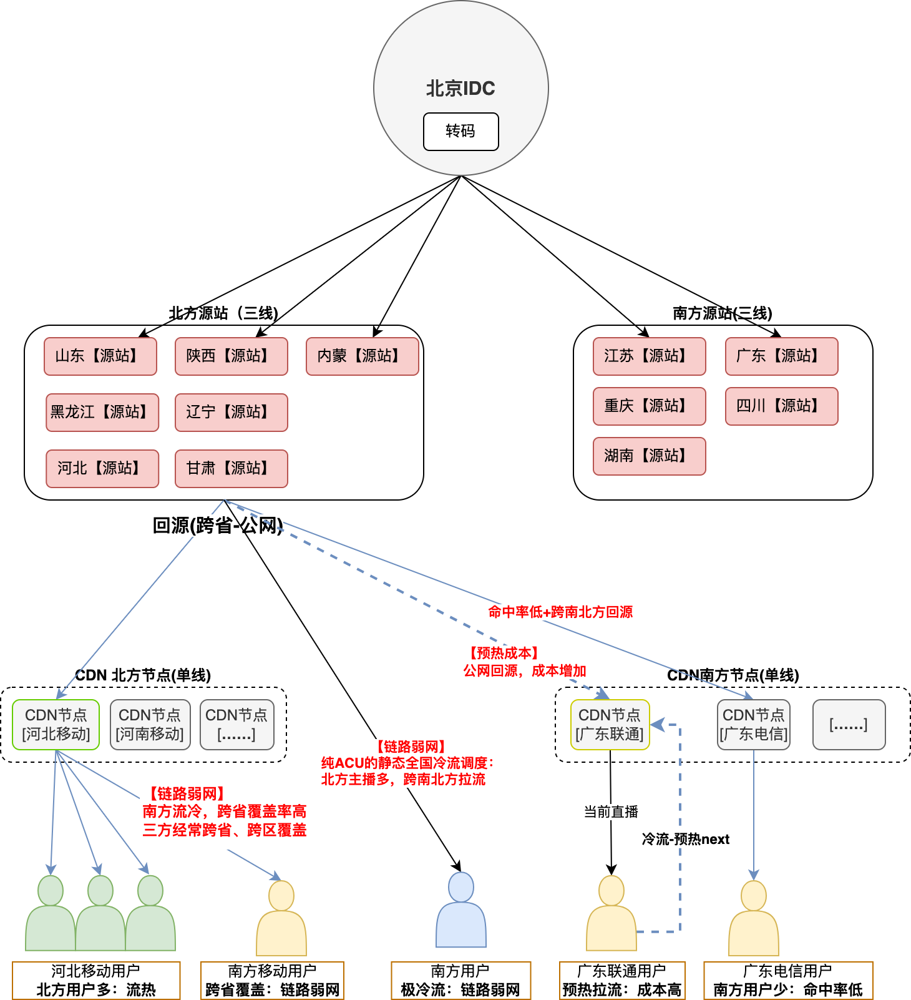

## **6、资源建设评估**

- > 南北骨干建设方案：[25年网络传输整体技术方案](https://docs.corp.kuaishou.com/d/home/fcAAMt3fMFXLM5ymcclE4zKM5)

- 资源概览
  - 资源现状：13个 三线机房（14T端口）+ 6.4T 专线 + 1个北方中心（北京IDC）
  - 25年资源预估：**21个 三线机房（26T端口，+12T）** +  **10.4T 专线（+4T）** **+** **1个南方中心（800G端口）** + **1个南北骨干（2T）** + 1个北方中心（北京IDC）
  - 资源明细

| **资源类型**       | **当前资源**         | **25年资源**       | **25年资源 vs 当前资源** |                    |                      |           |
| ------------------ | -------------------- | ------------------ | ------------------------ | ------------------ | -------------------- | --------- |
| **机房数量（个）** | **容量****（Gbps）** | **机房数量（个）** | **容量****（Gbps）**     | **机房数量（个）** | **容量****（Gbps）** |           |
| **自建三线**       | 13                   | 14104              | 21                       | 25774              | 8                    | 11670     |
| **边缘专线-100G**  | 64                   | 6400               | 104                      | 10400              | 40                   | 4000      |
| **南方中心**       | 0                    | 0                  | 1                        | 800                | 1                    | 800       |
| **南北骨干**       | 0                    | 0                  | 1                        | 2000               | 1                    | 2000      |
| **汇总**           | **77**               | **20504**          | **127**                  | **38974**          | **50**               | **18470** |

- 业务资源需求 vs 资源建设评估

| **月份**                 | **资源需求预估 from 业务** | **资源建设评估 by 资源** |                      |                          |              |                      |                      |      |
| ------------------------ | -------------------------- | ------------------------ | -------------------- | ------------------------ | ------------ | -------------------- | -------------------- | ---- |
| **总端口****（含专线）** | **机房数量**               | **完成率：****端口**     | **完成率：****机房** | **总端口****（含专线）** | **机房数量** | **完成率：****端口** | **完成率：****机房** |      |
| **2025年1月**            | 0                          | 0                        | 0%                   | 0%                       | 0            | 0                    | 0%                   | 0%   |
| **2025年2月**            | 580                        | 6                        | 3%                   | 10%                      | 900          | 6                    | 5%                   | 11%  |
| **2025年3月**            | 3300                       | 13                       | 19%                  | 31%                      | 2650         | 8                    | 20%                  | 25%  |
| **2025年4月**            | 8550                       | 18                       | 60%                  | 61%                      | 1700         | 5                    | 29%                  | 35%  |
| **2025年5月**            | 420                        | 3                        | 62%                  | 66%                      | 2150         | 4                    | 42%                  | 42%  |
| **2025年6月**            | 4710                       | 9                        | 85%                  | 80%                      | 4380         | 12                   | 66%                  | 64%  |
| **2025年7月**            | 1240                       | 6                        | 91%                  | 90%                      | 3200         | 5                    | 84%                  | 73%  |
| **2025年8月**            | 1810                       | 6                        | 100%                 | 100%                     | 670          | 3                    | 88%                  | 78%  |
| **2025年9月**            |                            |                          |                      |                          | 720          | 3                    | 92%                  | 84%  |
| **2025年10月**           |                            |                          |                      |                          | 520          | 3                    | 95%                  | 89%  |
| **2025年11月**           |                            |                          |                      |                          | 510          | 3                    | 98%                  | 95%  |
| **2025年12月**           |                            |                          |                      |                          | 420          | 3                    | 100%                 | 100% |
| **汇总：****2025年**     | **20610**                  | **61**                   |                      |                          | **17820**    | **55**               |                      |      |