**域名&调度管理的终态应该是什么样子的？**

# **1 背景：**

## 	**这个文档的目的**

写这个文档，是最近在思考快手的**域名治理**相关的工作有很多内容，所以想先对齐一下，我们域名治理 或者说 CDN对业务产品 最终状态是什么样子的，然后**以终为始**去指导我们现在的路应该怎么走。

## 	**域名&调度治理的目**

1 CDN出现故障，能够通过切量到其他的CDN域名。 【故障切量】

2 CDN域名被封禁，能够切到同厂商的备用CDN域名。【封禁换域名】（就了解目前报警中很多不是封禁场景，且 执行自动切量基本都是按照域名故障来执行的并非封禁）

3 用户能够按照自己的需求去拆分业务的带宽用量。【成本拆分】

4 CDN的域名配置规范，配置对齐，满足业务差异化的需求。【配置规范】

5 能够高效长期的维护，并方便扩展，支持新的业务，包括上面四种情况的支持。【长期维护，易扩展】

# **2 生态现状：**

## **2.1  文件的上传方式不统一**

目前已知有5种上传方式

1. blobstore SDK 上传：[BlobStore SDK 文档](https://halo.corp.kuaishou.com/help/docs/1c670b535d935129fe10012ae1e85e17)
2. 通用上传： [通用上传接入手册](https://docs.corp.kuaishou.com/k/home/VAOGYxc37-Ao/fcACuV0hQf74VIGxrADjIvsbn)
3. KCDN上传：包括RESTful接口上传 + SDK上传[KCDN上传接入文档](https://kcdn.corp.kuaishou.com/doc/#er_shangchuanwenjian)
4. 点播云上传：[点播云接入流程](https://docs.corp.kuaishou.com/k/home/VcNBoRbTUBIo/fcABu2hmcB7mmTQu7K0QCXHtJ)
5. npm 包上传：[【npm包】上传文件](https://kcdn.corp.kuaishou.com/doc/#4_npmbao_shangchuanwenjian)

## **2.2  快手在存储消费上没有业务隔离**

​		快手所有的桶的内容，通过快手的域名都可以访问到，并没有隔离。

​		源站、L2、接入层都没有对 域名能够访问哪些资源进行控制。也就是说**几千个国内域名理论上都能够访问到所有，放开回源权限的资源**。

**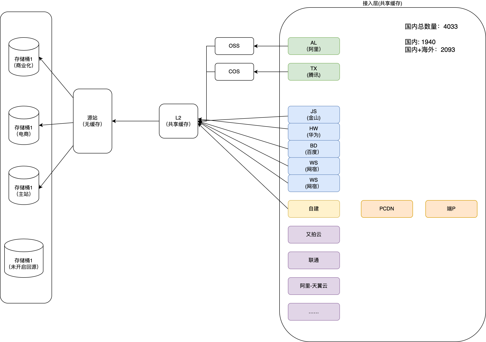**

## **2.3  快手使用的厂商支持能力上有较大的差异**

| **分类**     | **国内超级大厂**                                             | **国内普通大厂**                                             | **自建**                                                     | **国内小厂**                                                 | **海外厂商**                                                 | **ECDN** | **端P** |
| ------------ | ------------------------------------------------------------ | ------------------------------------------------------------ | ------------------------------------------------------------ | ------------------------------------------------------------ | ------------------------------------------------------------ | -------- | ------- |
| **厂商**     | **阿里、腾讯**                                               | **金山、百度、网宿、华为、天翼**                             | **自建**                                                     | **又拍云、微软、联通……**                                     | **aws akamai google cloudflare ……**                          |          |         |
| **支持差异** | **通用能力**H2HTTPSgzip支持跨域option 支持Range支持Cache-Control 配置timing-allow-origin 配置 **定制能力**图片处理回源改写kos/proj-xxx路径带宽统计kos/xxxpkey防盗链ksc2 URL加密webp支持 | **通用能力**H2HTTPSgzip支持跨域option 支持Range支持Cache-Controltiming-allow-origin **定制能力**图片处理回源改写kos/proj-xxx路径带宽统计kos/xxxpkey防盗链ksc2 URL加密webp支持(不支持) | **通用能力**H2HTTPS （静态支持，视频ip编码支持）gzip支持 (未验证)跨域 option 支持Range 支持Cache-Control 配置timing-allow-origin 配置 **定制能力**图片处理 （异常较多，后续接图床）回源改写kos/proj-xxx  （支持，未放量）路径带宽统计kos/xxx （支持，未放量）pkey防盗链URL加密 （支持，未放量）webp支持(不支持) | **通用能力**H2HTTPSgzip支持跨域option 支持Range支持Cache-Controltiming-allow-origin **定制能力**图片处理回源改写kos/proj-xxx （不支持）路径带宽统计kos/xxx（不支持）pkey防盗链（不支持）ksc2 URL加密（不支持）webp支持（不支持） | **通用能力**H2HTTPSgzip支持跨域option 支持Range支持Cache-Controltiming-allow-origin **定制能力**图片处理回源改写kos/proj-xxx （不支持）路径带宽统计kos/xxx（不支持）pkey防盗链（不支持）ksc2 URL加密（不支持）webp支持（不支持） |          |         |

## **2.4  业务的使用方式多种多样**

### **2.4.1 直接调用调度SDK**

​	

### **2.4.2  通过服务接入调度SDK**

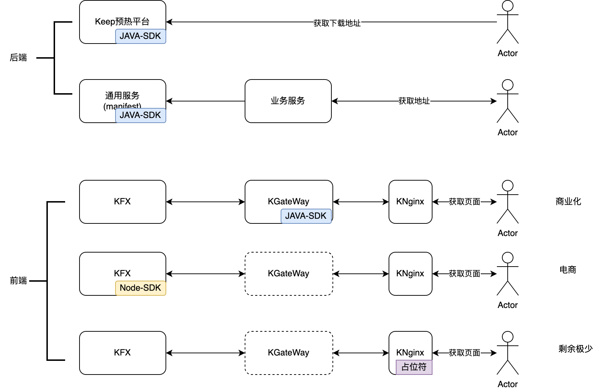

### **2.4.3 写死场景**

典型的有下面四种：

**2.5  调度：配置多、SDK的历史版本多**

**2.5.1 配置多**

**数量多**：kcdn目前线上存在1500+份配置（基本上每个业务申请的项目都对应一个kconf配置），大规模切量平台可以缓解问题，提高效率，但是不能根治

**类型多**：当前主流存在三大类配置，kcdn、kdd、solar（还有部分待废弃配置如 占位符等）三种配置相互差异较大，代码割裂。每种需求（防盗链、切换逻辑、分量逻辑等）都需要多次开发

**2.5.2 SDK版本多，能力有差异**

node版本：不支持省份运营商切量，不支持资源类型匹配（kfx 固定传静态）

java版本

新版SDK：目前主力

旧版SDK：老的接入方式，https 不支持分省份运营商。

**2.6 URL 路径加密改写现状&潜在风险**

**2.6.1 KSC1/KSC2的URL加密**

​	**参考** [**防盗链V2版本介绍**](https://docs.corp.kuaishou.com/d/home/fcADRe5zu6oC33vstvxGvU-J2)[**KSC2防盗链和普通防盗链方案对比**](https://docs.corp.kuaishou.com/d/home/fcACdwqDQqxHN8cKSe9YDBwEi)

​	

# **3  我们以前都做了哪些**

## **3.1 黑产治理**

​	解决黑产带宽问题，参考：[CDN安全现状与规划](https://docs.corp.kuaishou.com/d/home/fcAC-gcX2za3BV5Q9SabUbbOP)

​	**生产侧：**

​		上传管控： 

1 增加上传信息(request URI、userId、clientIP)；

2 预览签发KSC2 的 加密地址； 

3 文件后缀检查；

4 自动触发黑产白名单检查

​		多种上传方式接入：

1. blobstore SDK 上传：[BlobStore SDK 文档](https://halo.corp.kuaishou.com/help/docs/1c670b535d935129fe10012ae1e85e17)
2. 通用上传： [通用上传接入手册](https://docs.corp.kuaishou.com/k/home/VAOGYxc37-Ao/fcACuV0hQf74VIGxrADjIvsbn)
3. KCDN上传：包括RESTful接口上传 + SDK上传[KCDN上传接入文档](https://kcdn.corp.kuaishou.com/doc/#er_shangchuanwenjian)
4. 点播云上传：[点播云接入流程](https://docs.corp.kuaishou.com/k/home/VcNBoRbTUBIo/fcABu2hmcB7mmTQu7K0QCXHtJ)
5. npm 包上传：[【npm包】上传文件](https://kcdn.corp.kuaishou.com/doc/#4_npmbao_shangchuanwenjian)

​	**消费侧：**

​		支持pkey： 防盗链的域名 712个域名

​		支持ksc2： URL加密的域名  233 个域名 【**ksc2 需求引入**】，

ksc2 带来的两个问题：

​	1  部分端上要支持cache_key 需求；[20230215 主站HLS支持防盗链2.0](https://docs.corp.kuaishou.com/k/home/Vc7MO7BSz9AY/fcABnscysZbfWgVQLClA-zqLb)

​	2 很多需要反解析原始URL 无法拿到video_id photoid等信息，需要提供反解析能力。

## **3.2  【非直播】CDN域名规范化治理**

​	解决域名爆炸问题，参考：[【非直播】CDN域名规范化治理](https://docs.corp.kuaishou.com/k/home/VU_D5pQbQ-IA/fcAAh9uUvpJ4M018kdzjr79CQ)，引入 **回源改写** 和 **路径带宽统计** 需求依赖

​	目前正在**推进商业化接入该方案**

​	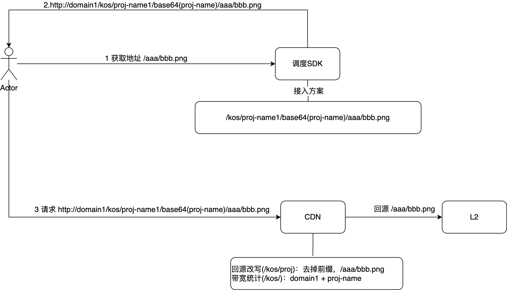

## **3.3  大规模切量**

​	解决配置太多，不容易切走的问提： [大规模切量第一阶段方案](https://docs.corp.kuaishou.com/d/home/fcAAwPIoB3POcRfiHIuCjM7n4)

​	执行条件：

​		1 所有调度配置应该有都多家厂商的配置 （现状是有很多不规范的配置）

​		2 同一份配置内的多家厂商的域名配置是对齐的

​		3 目标厂商内部，和 L2 扛得住回源。

# **4  我们最终的生态是啥？**

## **4.1 我们最终的目标是啥?**

### **4.1.1 整体链路从生产到消费能够隔离的 （支持按需求拆分成本）**

​	1 源站桶隔离快捷支持能力

​	2 L2 缓存隔离和拆分能力

​	3 cdn 域名归属管理，直接归属某个业务

​	4 给大的业务只分配二级域，三级域名由业务申请。 具体域名cname到那家厂商资源，我们来确定。

### **4.1.2 容灾/切量/调量 能够覆盖所有的业务 （容灾/切量 彻底干净）**

1. 我们能让所有业务都接入调度吗？  
   1. 后端的也许能做到，但是前端基本做不到。
   2. 从使用成本上来说接入CDN调度成本较高。而且无法限制用户使用，历史的存量也太大了。
2. 调度可以任何维度的一键切量/调量
   1. 最精细的维度：厂商+省份+ISP
   2. 最粗的粒度：厂商

### **4.13 融合CDN厂商可以规范的接入 （接入管理规范）**

1.  除通用需求外，应该尽量避免厂商的定制需求，**避免定制需求依赖**
2. 厂商接入等级管理，不同厂商只能接入对应业务的限制

​	

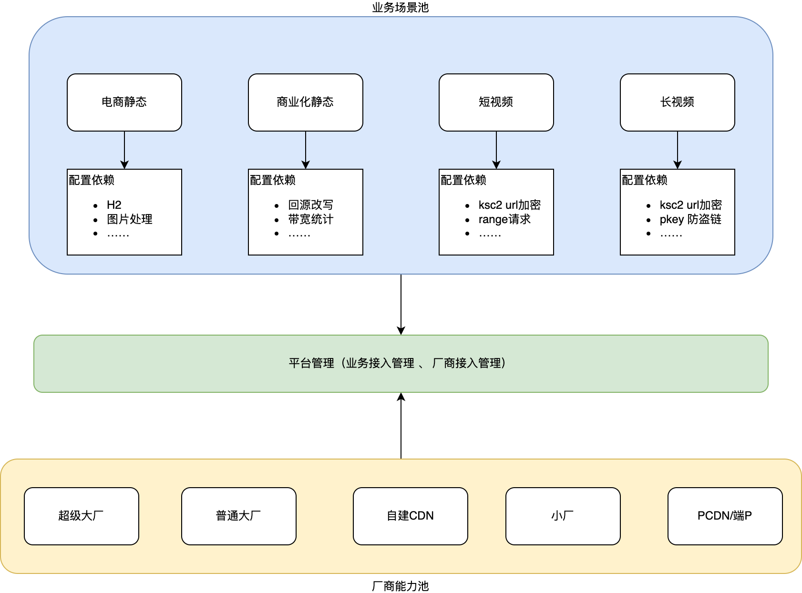

## **4.2 我们现在有哪些方案**

### **4.2.1 方案1：普通域名方案**

#### **方案：现在商业化的方案 ， 例如：商业化域名，共计约 50个域名。**

[【非直播】CDN域名规范化治理](https://docs.corp.kuaishou.com/k/home/VU_D5pQbQ-IA/fcAAh9uUvpJ4M018kdzjr79CQ)

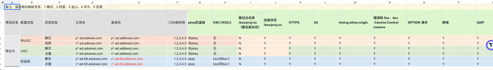

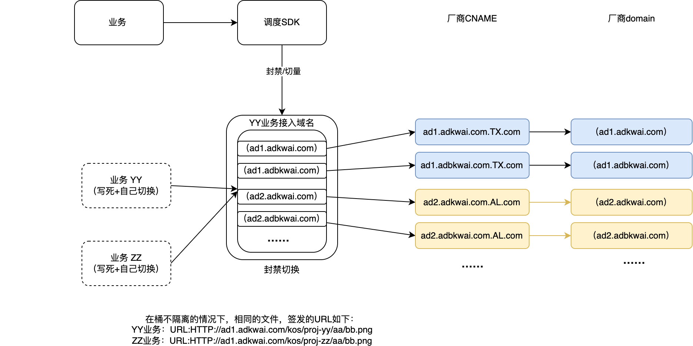

### **4.2.2 方案2：融合域名解析方案 （字节多云toB的做法）**

#### 	**方案：融合域名方案**

现在[static.yximgs.com](http://static.yximgs.com) 域名的方案，每个域名分配一个主备域名。然后cname到多家，通过调整cname 解析比例调整厂商分量，无法完全覆盖被封禁的场景。

​	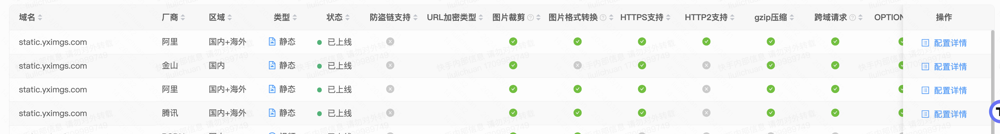

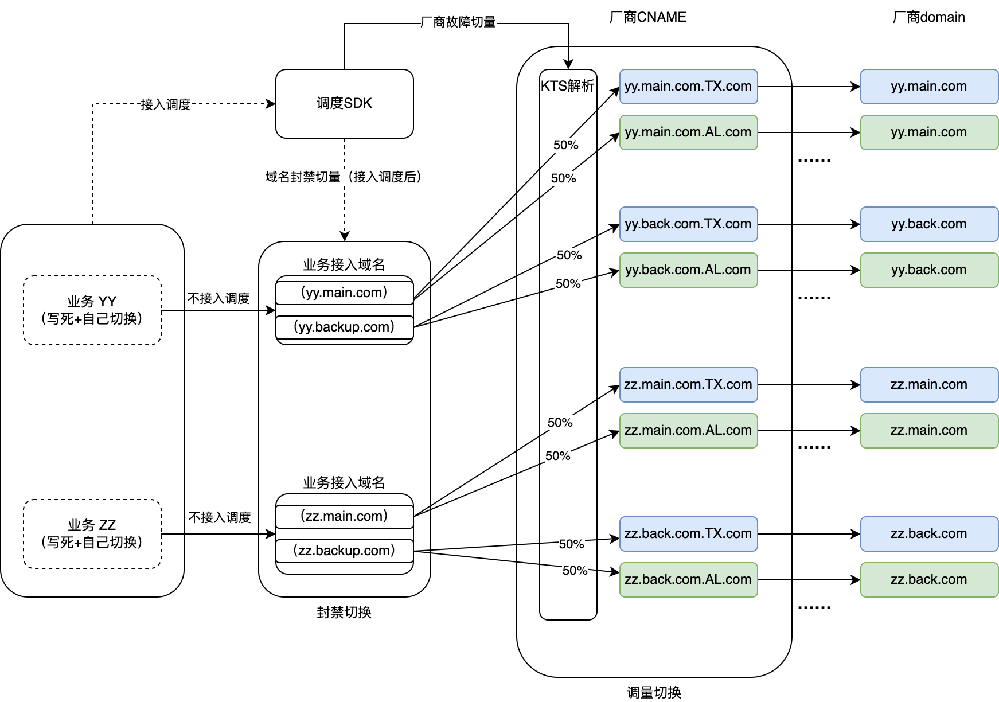

### **4.2.3 方案3：泛域名方案**

#### 	**方案1：相同泛域名**

目前电商的方案，泛域名方案同方案1 类似，只是使用泛域名分配业务，不使用路径区分。只是弱依赖CDN的带宽泛解析域名的统计能力。

​	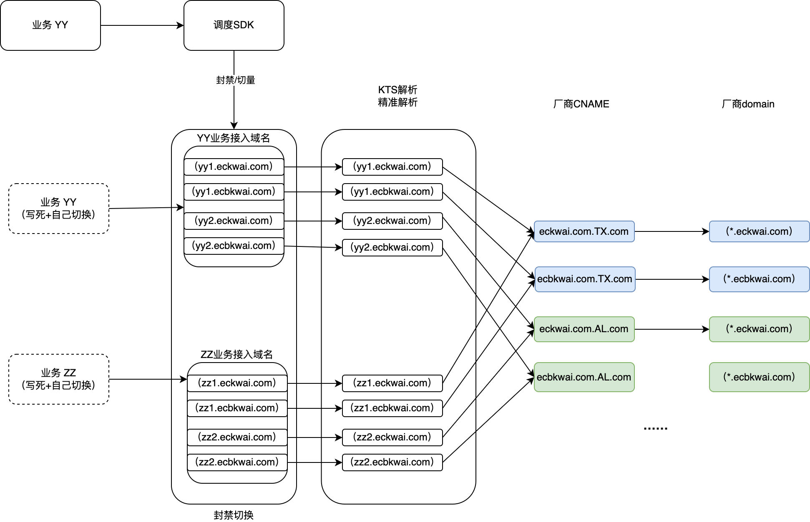

#### **方案2：不同泛域名**

- 通过泛域名就可以区分出域名属于哪家厂商。
- 然后调度侧支持泛域名调度，一份常规兜底调度配置覆盖整个大业务
- DNS 使用泛解析，每个项目都有自己的子域名，成本拆分到项目。

缺陷：

一个项目（子域名）的请求量请求量极小，导致单个项目的报警数据波动较大。

DNS使用泛解析，可能存在乱用泛域名的风险。

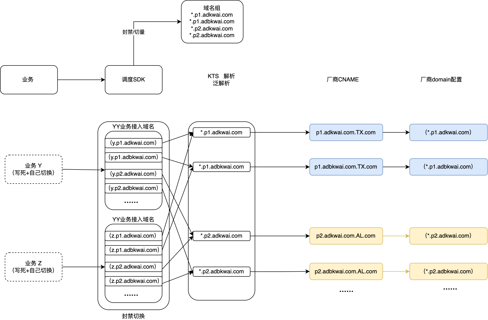

**一个大业务：30个二级域名，精准域名3级。**

**一个大业务：2个二级域名 + 30个三级域名， 精准准域名4级。**

**泛域名调度：**

​	**单个域名故障不可见，可能量很大。**

​	**厂商挂了：切泛域名**

​	**有故障，产生子业务的调度表，优先级大于泛域名，KCDN不负责故障标记。**

​	

**定制需求：**

​	**只能用独立域名；**

#### **方案3 不同的泛域名进阶： 域名组+成本组**

结合上面的缺点进行改进

域名组下增加一层成本组概念，上次多个项目聚合成一个成本组，一个成本组使用一套子域名。

每套子域名采用精准解析的方式，避免乱写。同时保证该解析下的所有精准解析解析同泛解析一致。

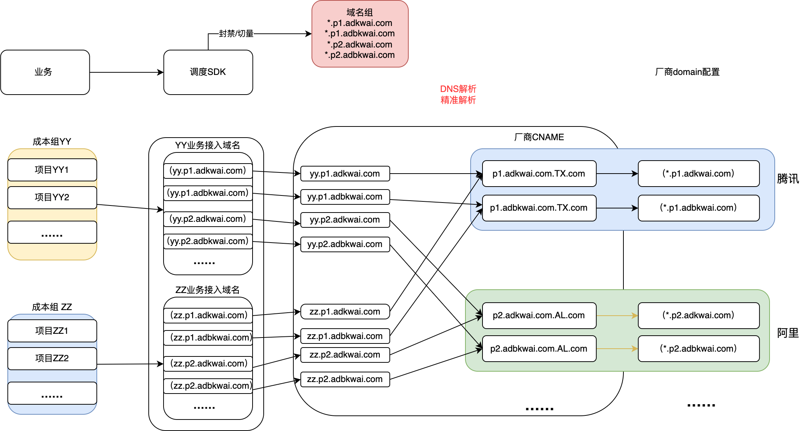

**业务拆分如下图所示**

**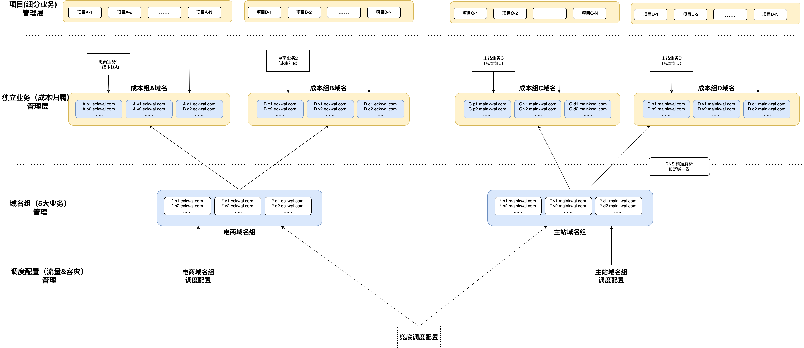**

## **4.3 四种个方案对比**

| **方案****场景分类：****前端、后端、防盗链** **域名分类：****前端：静态****后端：静态/视频/下载****防盗链：静态/视频/下载** **每个域名：主、备** | **普通域名方案** 简介：(商业化当前方案）大业务一套域名（50～70个域名）每个小业务共用这一套域名 | **融合域名方案** 简介：一个大业务7个二级域（域名分类7个场景）一个小业务2～6个域名每个域名按比例cname到不同厂商 | **泛域名方案1：多厂商同泛域名** 简介：（电商当前方案）大业务一套泛域名（7个），泛域名不区分厂商每个小业务一套子域名（10～30）每个子域名cname一家厂商,每个子域名单独配置解析 | **泛域名方案2：多厂商不同泛域名** 简介：大业务一套泛域名（50～70个），泛域名区分厂商每个小业务一套子域名（10～30）每个子域名cname一家厂商所有子域名使用一条泛解析 |
| ------------------------------------------------------------ | ------------------------------------------------------------ | ------------------------------------------------------------ | ------------------------------------------------------------ | ------------------------------------------------------------ |
| **带宽用量拆分****（小业务维度）** **【普通域名方案】****小厂商接入****变更的稳定性风险** **海外厂商定制化基本都不支持** **自建：实现了，没放量。****加前缀：只有商业化****支持改写：五大厂商所有域名。** | 【拆分方式】: path拆将projectName放到路径中源URL：/aa/bb.png修改后URL： /kos/proj-(项目名称)/base64(proj-(项目名称))/aa/bb.png 【厂商支持情况】：支持数量：7家(阿里、腾讯、金山、百度、网宿、华为、天翼) 实现难度：较大，需要改写 【其他风险】：之前跟厂商约定过最多不超过 500个细分projectName。 支持的厂商，所有域名都要支持，否则可能出现无法访问的情况。**存量 国内 非直播 域名都支持。** | 【拆分方式】: 普通域名拆分【厂商支持情况】：支持数量：全部实现难度：无【其他风险】：无 | 【拆分方式】: 泛解析域名拆分【厂商支持情况】：支持数量：2家（阿里、腾讯）实现难度：低【其他风险】：无 | 【拆分方式】: 泛解析域名拆分【厂商支持情况】：支持数量：2家（阿里、腾讯），实现难度：低【其他风险】：无 换域名有风险。 |
| **容灾切量** **域名量很小，封禁能发现吗？****电商/商业化域名无论大小都是配置的白名单。****提醒业务注意拆分业务量必要太细。** | 【容灾接入】厂商故障：强依赖接入调度SDK域名封禁：强依赖接入调度SDK 【封禁影响】封禁隔离：封禁业务不隔离封禁切了：单域名封禁：切换单个备域名二级域封禁：切换整套域名（35个） 【规模故障】修改配置数量： 3个影响域名数量： 7 个 | 【容灾接入】  厂商故障：不依赖业务改造，只修改KTS  域名封禁：强依赖接入调度SDK  【封禁影响】封禁隔离：封禁业务隔离封禁处理：单域名封禁：切换单个备域名二级域封禁：切换所有备用域名 （项目数） 【规模故障】修改配置数量： 项目数 （优化难度大）影响域名数量： 项目数 | 【容灾接入】厂商故障：弱依赖业务改造，可以兜底改CNAME 域名封禁：强依赖接入调度SDK 【封禁影响】封禁隔离：封禁业务隔离封禁处理：单域名封禁：切换单个备域名二级域封禁：切换所有备用域名 （项目数*厂商数） 【规模故障】修改配置数量： 项目数 （优化难度大）影响域名数量： 项目数个子域名，7个泛域名 | 【容灾接入】厂商故障：强依赖接入调度SDK域名封禁：强依赖接入调度SDK 【封禁影响】封禁隔离：封禁业务隔离封禁处理：单域名封禁：切换单个备域名二级域封禁：切换所有备用域名 （项目数*厂商数） 【规模故障】修改配置数量： 项目数 （优化难度小）影响域名数量： 项目数个子域名，7个泛域名 |
| **运维管理**                                                 | 【厂商接入】厂商接入强依赖定制需求**回源改写** 【域名总数量】一个大业务 50～70个域名，随业务拆分增长 【业务感知】业务感知域名-厂商关系 | 【厂商接入】厂商接入无明确依赖 【域名总数量】项目数 * 2  【业务感知】业务不感知域名-厂商关系 | 【厂商接入】厂商接入可选依赖泛解析子域名带宽统计 【域名总数量】项目数量*厂商数量 【业务感知】业务感知域名-厂商关系 | 【厂商接入】厂商接入可选依赖泛解析子域名带宽统计 【域名总数量】项目数量*厂商数量 【业务感知】业务感知域名-厂商关系 |
| **长期风险**                                                 | 改变路径风险较大                                             | 消费数据测报警，无法报出哪家厂商（优化难度大）无法精准调度   |                                                              |                                                              |
| **预解析**                                                   | 收敛域名，简单方便                                           | 域名较多，依赖网络库优化                                     | 域名较多，依赖httpdns 支持泛域名（难度大）                   | 域名较多，依赖httpdns 支持泛域名（难度小）                   |
| **方案优化**                                                 |                                                              | 配置数量多优化：依赖调度进行重构，将厂商分量与具体业务调度拆分，难度很大。 消费数据测报警：需要网络库上报CNAME，有些场景可能无法覆盖，数据不统一等情况，实现难度较大。 | 配置数量多优化：依赖调度支持泛域名调度，但由于泛域名无法识别厂商，因此实现同时依赖KTS准确的配置，并同步子域名关系表，难度很大 另外支持实现时，对单个子域名的故障的封禁切量可以通过，在KCDN对单个子域名标记故障切量方式实现。 httpdns 支持泛解析：同上依赖，依赖KTS准确的配置，并同步子域名关系表，难度很大 | 配置数量多优化：依赖调度支持泛域名调度，泛域可以识别厂商，实现简单难度小  另外支持实现时，单个子域名的故障的封禁切量可以通过，在KCDN对单个子域名标记故障切量方式实现。 httpdns 支持泛解析：同上依赖，难度很小 |
| **2024/02/13讨论问题**                                       | 改写风险较大，引起缓存，回源错误等潜在风险。源站改写的化无法实现：cdn边缘会缓存多分，缓存问题没有解决办法。 源站支持 ，兜底改写，缓存小。 | 不支持细粒度的调度，相当于功能退化，用户id调度，AB实验很多依赖域名到不同的厂商。cname 粒度的数据上报有可能无法实现 | 可以继续推广演进，电商初步建议使用这套方案域名数量的增长需要能够在全链路包括调度/httpdns/kts/甚至数据等多个层面能够当成一个泛域名去处理，且是真正的泛解析域名。 |                                                              |
| **最终方案**                                                 |                                                              |                                                              |                                                              | 【推荐】厂商 @刘利川@闫子京 调度 @李爽1 调度SDK配置格式调整2 配置管理，故障切量调整  一层兜底，一层故障切量，3 告警规则：大规模的判断，泛域名检测，泛域名下的每个子域名的规则。4 自建接量（toB模式）  数据统计，  泛域名支持5 调度策略里很多是用精准域名做的规则。也需要调整。6 solar 支持泛域名302  源站 @曾令明1 兜底改写；2  KCDN @刘利川自动分配 项目+泛解析域名 关联泛域名的调度id |
| **风险收集**                                                 |                                                              |                                                              |                                                              | 1  KSC2 防盗链签发 密钥管理冲突   目前密钥是 精准域名。 2 如何防止业务乱写子域名。 3 |

## **五、我们的最终的状态方案怎么选？**

**多厂商不同泛域名方案**

| **厂商改造**            | **调度改造**                                                 | **节点&源站**                             | **httpDNS 预解析支持**                         | **KCDN**                                                     | **其他代价&风险**                                            |
| ----------------------- | ------------------------------------------------------------ | ----------------------------------------- | ---------------------------------------------- | ------------------------------------------------------------ | ------------------------------------------------------------ |
| 带宽统计     状态码统计 | 调度SDK配置格式调整支持泛域名格式故障切量调整一层兜底，一层故障切量告警规则调整大规模的判断，泛域名检测，泛域名下的每个子域名的规则。自建接量（ToB模式接量）数据统计， 泛域名支持自建接量（ToB模式接量）调度策略支持泛域名solar 支持泛域名302 | 兜底改写 /kos/proj-自建支持泛域名带宽统计 | 后缀匹配泛域名进行预解析使用时后缀匹配发起请求 | 自动分配 项目+泛解析域名 关联泛域名的调度id命名限制：来自阿里 https://help.aliyun.com/document_detail/158601.html?spm=a2c4g.128693.0.0.c5fa37c1ZSLvmt最大长度200，最小级数为1顶层域名长度限制2-63字符，**其余级限制1-63字符****支持中划线，下划线，数字，小写字母，且必须以数字或小写字母开头**  新增下线上传的kos改写 | **域名成本：** 2级域名2个，30个三级域名：30分证书。  **DNS配置支持情况：**KTS解析配置支持KTS防止乱写支持 **防盗链适配：**ksc2 只能签发固定域名，需要支持泛解析域名的签发和改写调度SDK支持 CDN厂商支持  **数据侧的支持：**精准和泛域名混用的情况能避免差异不大。报警：是按照精准的还是聚合的。（目前是按精准，需要聚合可以支持？） |

**六、我们的怎么达到最终态（节奏怎么走）**

现在有下面几个说法和目标有下面几个。

- 大规模切量
- 腾讯切量
- 域名治理
- 调度重构

但其整体还是一件事情。无论单独解决那个问题，可能都涉及到用户的配合，并有更换域名的风险。

因此我们**期望整个过程能够只让用户感知一次，一步到位解决问题。**

**以腾讯切量**为例子：如果我们要单独以腾讯的切量为目标，（涉及到tx的项目）

1 我们检索top的腾讯域名的所有配置，补充华为的域名，目前是修补调度配置（约300份），[腾讯域名治理-需要优化的配置](https://docs.corp.kuaishou.com/s/home/fcADrgG-H6aK-RKtHpy9x2yFK?section=794740086)

2 把华为的配置和对齐域名配置（约20个），执行切量， 在调整300份配置的时候，需要通知业务，让业务观察。（中主要的域名都是主站_消费业务目录的的）[腾讯切量-备用域名准备](https://docs.corp.kuaishou.com/s/home/fcADvruULK6xMuMreXtMikJ40)

做大**规模切量**，（涉及不规范配置的项目）

同样要上面的操作。需要再让业务感知一次，又一次更换域名的风险

做**域名治理**，（涉及到不规范的项目）

也要整体来一次，又一次更换域名的风险。

因此我们建议的解决思路，充分讨论，选好方案，与业务沟通，准备好标准的域名和调度id配置，推动业务一次完成迁移式改制，这样虽然周期长，但是能够一次性彻底解决问题。