**域名调度迁移合并混跑调度方案**

# **一、背景**

当前快手内部静态&下载业务接入自建的方式，主要有两种：标准域名调度 和 混跑调度。

## **1，调度方式简介**

二者逻辑简介如下：

### **1.1，标准域名调度**

#### **1.1.1，业务接入和解析方式**

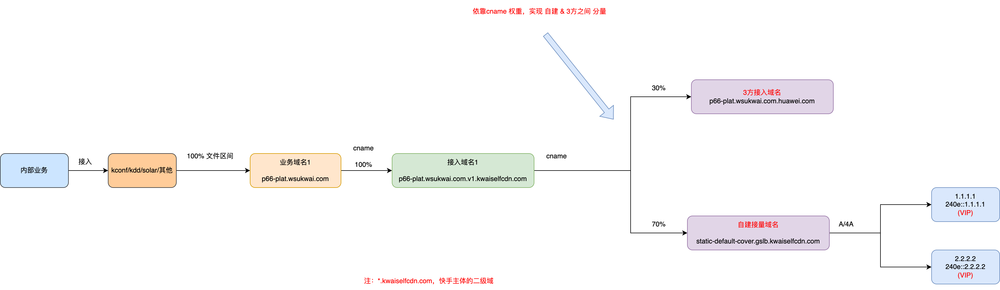

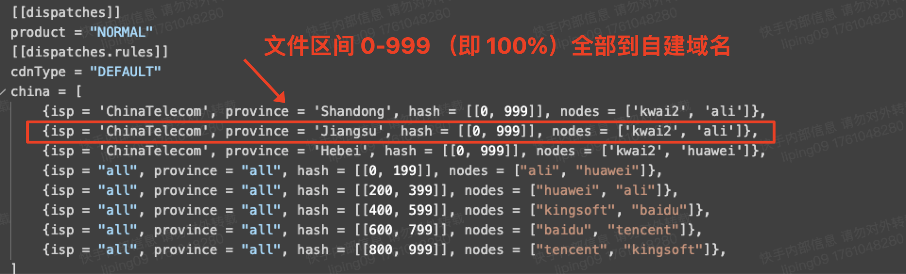

#### **1.1.2，跑量和回源**

### **1.2，混跑调度**

#### **1.2.1，业务接入和解析方式**

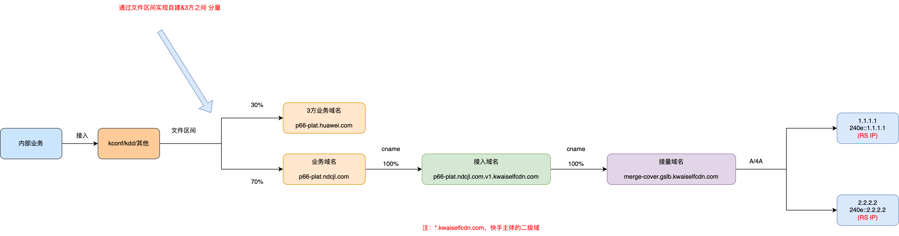

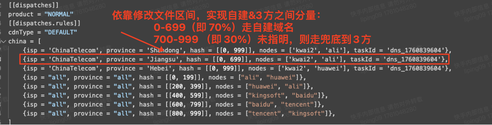

#### **1.2.2，跑量和回源**

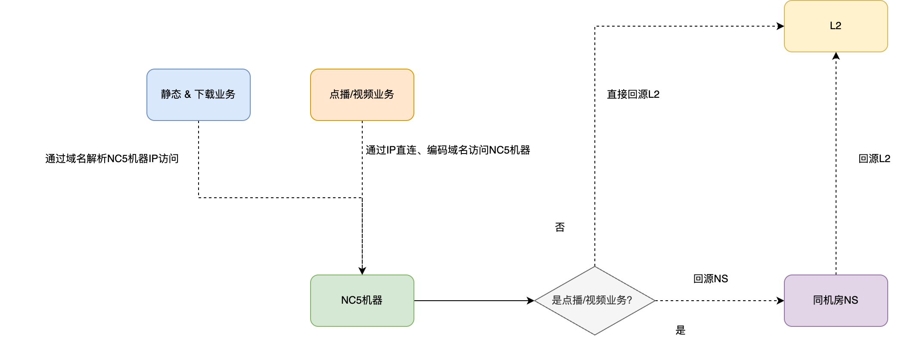

## **2，调度方式对比**

两种调度方式对比，差异点总结如下述表格：

| 调度类型     | 解析IP类型 | 后端机器类型 | 如何在3方和自建调量             |
| ------------ | ---------- | ------------ | ------------------------------- |
| 标准域名调度 | VIP        | NC8          | 通过调整接入域名的cname解析权重 |
| 混跑调度     | 机器IP     | NC5          | 通过调整kconf或kdd 文件区间实现 |

## **3，存在的问题**

当前存在的问题和潜在风险：

（1）底层机器资源跑量类型不同：nc8机器只跑静态&下载，nc5机器跑点播&静态&下载；不利于运维、调度 和 充分利用机器资源；

（2）解析IP类型不同：当前标准域名调度通过VIP接入流量，混跑调度通过机器IP直连接入流量；二者不兼容；

（3）当前混跑调度，通过域名直接解析机器IP的方式，受DNS协议影响，实际可使用的IP个数有上限；如果某个地区有多个机房，不能完全用于静态&下载跑量。

## **4，改造的目标**

（1）**统一 nc8 & nc5机器资源 跑量和调度 方式**：均可跑点播&静态&下载，提升运维、机器资源利用率；

（2）**统一业务接入方式**：快手内部业务通过混跑调度模式接入；提升运维效率、调度研发效率，避免维护两套系统；

（3）**统一域名解析方式**：支持域名既可以解析VIP，也可以解析机器IP：

（3.1）在流量大，或机器多的地区/机房，通过在多台NC5/NC8机器前，挂载VIP的方式，优化"当前域名直接解析机器IP，受限于DNS协议影响，无法实际使用过多IP的问题"；做到可充分使用多台机器进行跑量；

（3.2）在流量小，或机器少的地区/机房，可直接解析到NC5/NC8机器IP，节省K机器资源成本。

目前暂定的流量大小的地区/机房界定标准：机房跑量 >= 60G 为流量较大的地区；< 60G为流量较小的地区。

# **二、统一方案**

鉴于以上背景和问题，并考虑到快手自建CDN发展规划，拟对当前的 标准域名调度 和 混跑调度进行统一。

## **1，调度侧变化**

### **1.1，调度策略系统**

#### **1.1.1，整体架构**

统一后的调度系统架构如下：

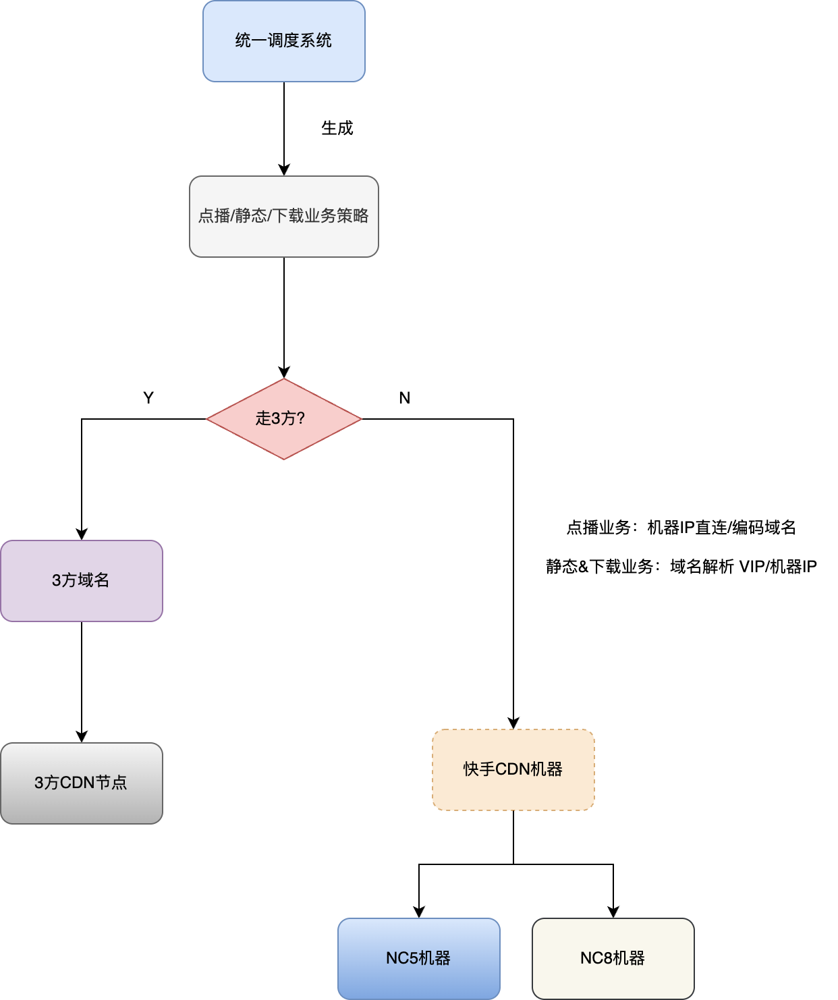

#### **1.1.2，静态&下载业务分量执行方式**

依靠修改 kconf/kdd 文件区间下发的域名，来实现自建 & 3方间分量。

## **2，节点侧变化**

节点侧的变化，主要有两点：
（1）nc8机器，既可以跑静态&下载，也可以跑点播；

（2）nc5机器前面，可以挂VIP。

整体逻辑如下图所示：

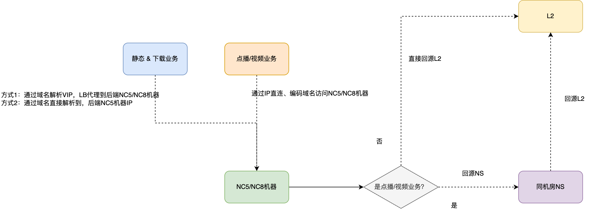

**分机房说明如下：**

（1）只有NC5机器，没有LB/VIP（K机器）的机房

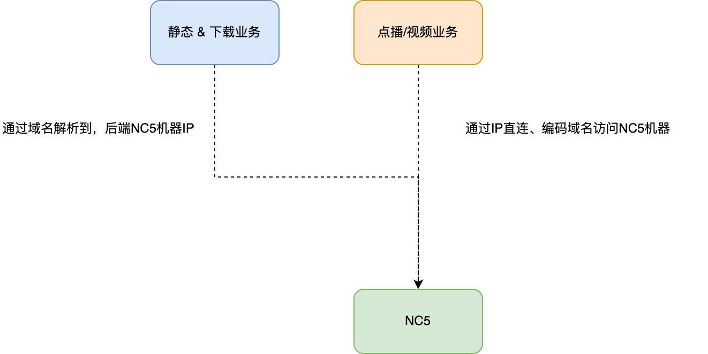

（2）有NC5机器，并且有LB/VIP（K机器）的机房

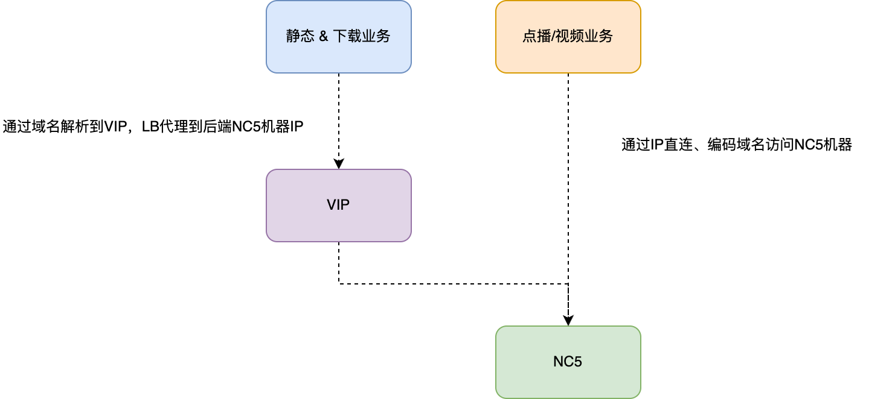

（3）有NC5 & NC8机器，并且有LB/VIP（K机器）的机房

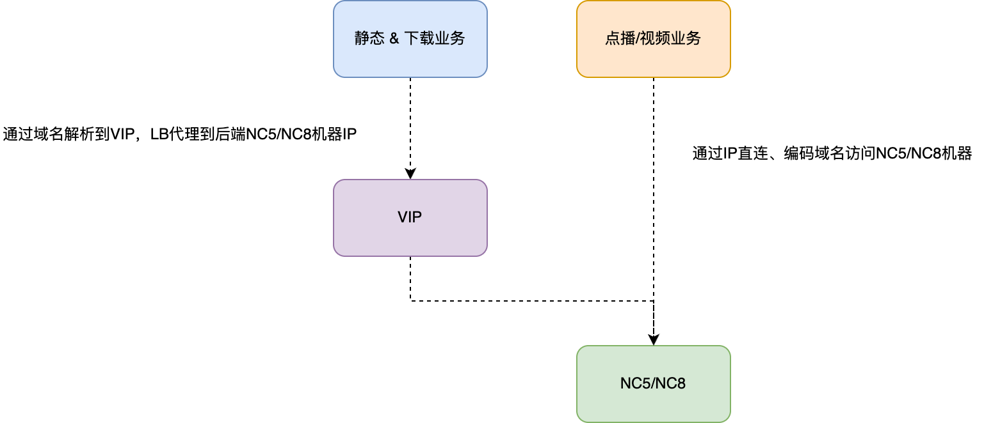

## **3，对比总结**

相比于现在，主要变更有以下几点

（1）**对于点播、静态&下载而言，跑量不再区分机器类型**：

nc5可以同时跑点播&静态，nc8机器也可以；

（2）**对于调度而言，不再区分机器类型，生成不同的调度策略。由一套调度系统，统一进行策略生成；降低 运维 和 调度配置 复杂度**；

（3）**功能支持**：自建域名当前所有线路要么解析出来的全是 机器 IP，要么全是 VIP，不支持可选配置；

迁移合并后，支持可选配置，部分线路支持解析机器IP，部分线路支持解析VIP。(即：无论机房是否有VIP (K机器) 都支持)

​	可**优化 “因受DNS协议影响，实际可使用IP个数有限，无法充分利用多个机房进行静态&下载跑量”的问题**。

最终，**内部静态&下载业务接入 和 域名解析的链路如下图所示**：

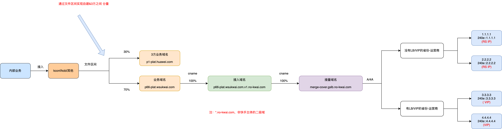

注：如果某个省份-运营商，有多个机房，其中一部分机房有VIP，另外一部分机房没有VIP。对于这种特殊情况，解决思路如下：

（1）只用有VIP的机房进行跑量；或者只用 没有VIP的机房进行跑量；

（2）对于有VIP的机房，视作无VIP，与其他无VIP的机房，直接解析到机器IP，进行统一调度跑量。

# **三、各方改造支持**

## **1，cdn console & sre**

（1）允许一台机器既在 点播调度里，也在LB下；

（2）非直播OC调度配置里，支持：

（2.1）同时配置nc5&nc8机器；

（2.2）只配置nc5机器；

（2.3）只配置nc8机器。

（3）支持调整机器的状态时，联动调整该机器在LB下的挂载；

（4）非直OC调度配置下，支持绑定LB；

（5）过渡阶段，需要支持通过打标方式区分 混跑的LB 和 纯静态LB。打标到 LB 上，并且在 list_resource_unit 接口里返回。

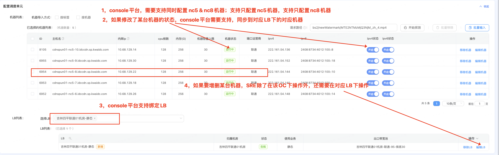

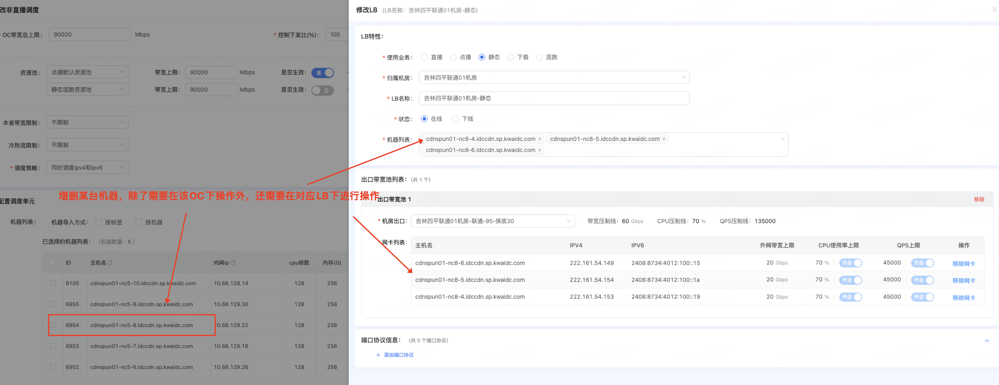

## **2，域名采购及更换**

（1）采购至少2组非快手主体二级域，用于接入域名和接量域名配置；

（2）将当前 业务域名的主体，从非快手 更换为 快手的；接入、接量域名的主体，从快手的 更换为 非快手的。

## **3，调度系统**

（1）系统支持 有LB机房 和 无LB机房的策略生成和控量；（高优）

（2）接量域名下发支持：部分地区全解析出机器IP，部分地区全解析出VIP（不会在解析中，出现某个地区，VIP和机器IP同时存在的情况）；（高优）

（3）告警切换：支持根据告警类型和内容，单独关闭非直播OC下 点播 和 静态&下载 接量；（中优）

（4）系统支持同时生成3方和自建内部分量策略；（低优）

（5）支持下掉kdd和kconf 3方策略配置；（低优）

（6）solar接入混跑，当前不支持按照 省份-运营商 放量3方或自建；只支持修改兜底线路（all-all）百分比，需要予以支持。[Solar支持省份、运营商规则调度，方案梳理](https://docs.corp.kuaishou.com/d/home/fcAAZHACeIkeJN3ckTd7Uu9rH)

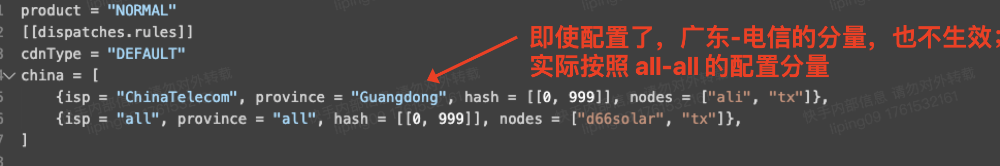

# **四、迁移已存在的LB&NC8机器流程**

迁移已存在的LB&NC8机器，是指 将当前已有的NC8机器，从只跑静态&下载，改造为 可混跑（点播&静态&下载）；LB只挂载NC8机器，改造为同时挂载NC8&NC5机器。

## **1，切走LB流量**

（1）手动调整NC8接量域名的解析，并关闭LB的状态 以及 点播调度里对应的配置，待流量全部切走；

（2）删除 点播调度配置里，和待迁移的LB有关的配置。

## **2，配置LB&NC8机器支持混跑**

（1）SRE同学、节点研发同学 配置NC8机器支持混跑（点播 & 静态 & 下载）；

（2）如该机房有NC5机器，配置NC5机器挂载到LB上；

（3）配置完成后，QA同学做下验收。

## **3，混跑放量LB**

（1）调整LB的用途：“静态” --> "混跑"

（2）在"非直播调度"里的对应OC里，绑定该LB；

（3）放量：观察机器跑量、状态、业务质量、流量统计等数据是否正常。

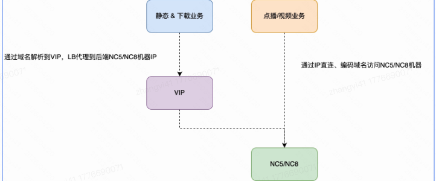

# **五、新增LB的流程**

​	根据规划，后期其他部分NC5机房 或OC，也会配置有LB（K机器）。对于这部分机房，LB可挂载NC5机器。

## **1，切走NC5机器上流量**

（1）关闭NC5机器所在的OC，切走点播流量，或混跑流量。

## **2，配置LB挂载NC5机器**

（1）SRE同学配置LB挂载NC5机器，并设置LB的用途为 “混跑”。

## **3，放量LB**

（1）在"非直播调度"里的对应OC里，绑定该LB；

（2）放量：观察机器跑量、状态、业务质量、流量统计等数据是否正常。

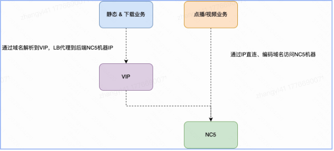