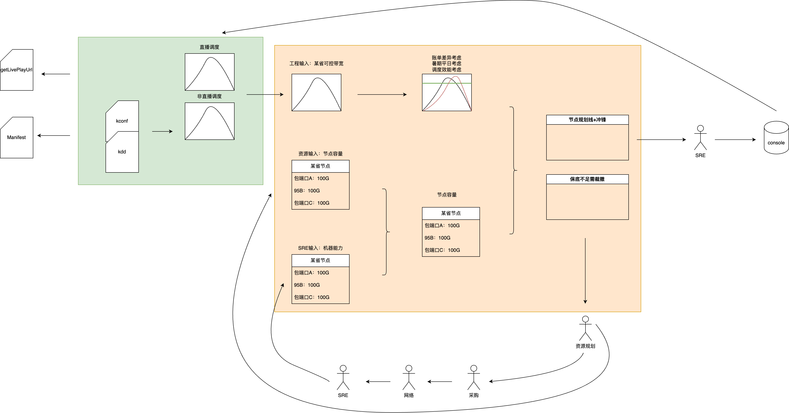
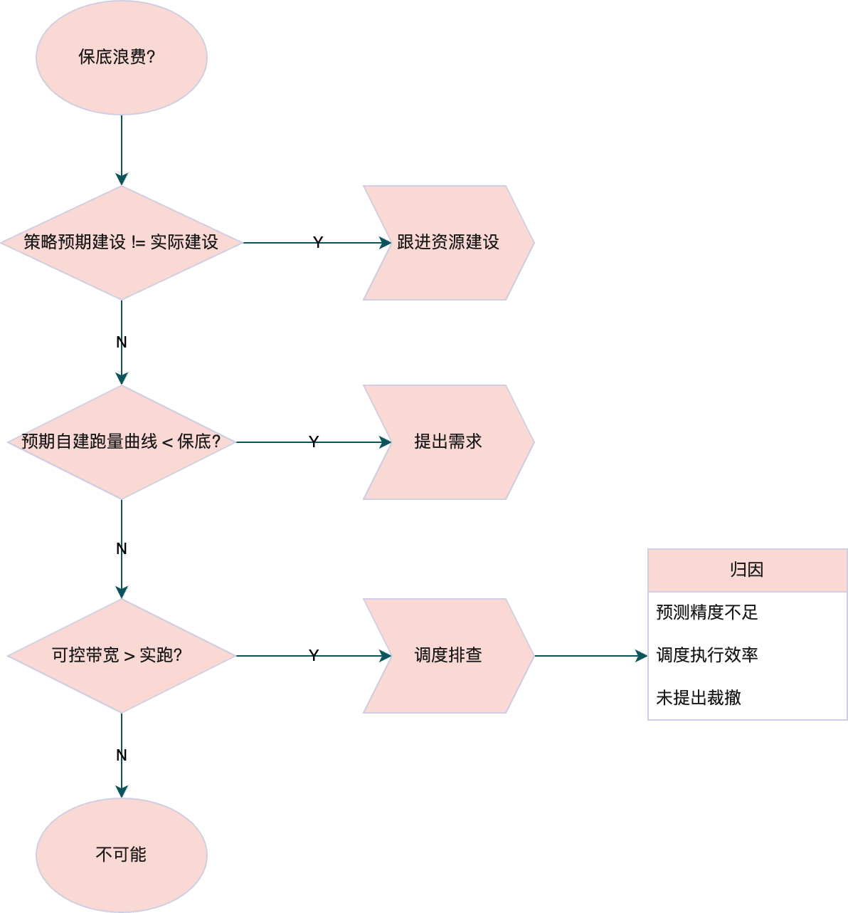
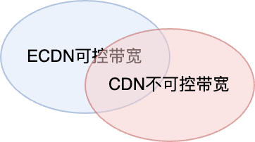
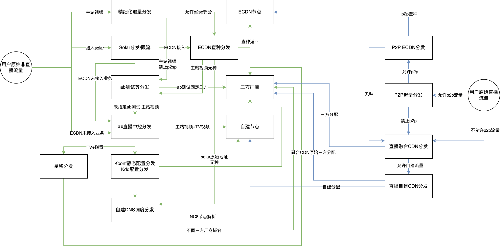
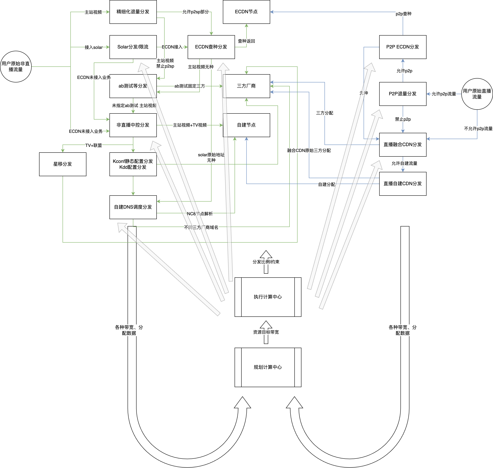
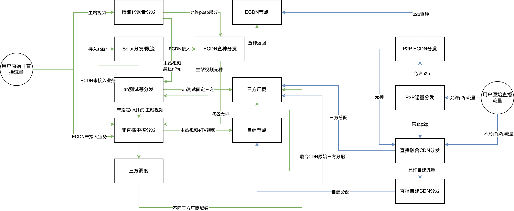
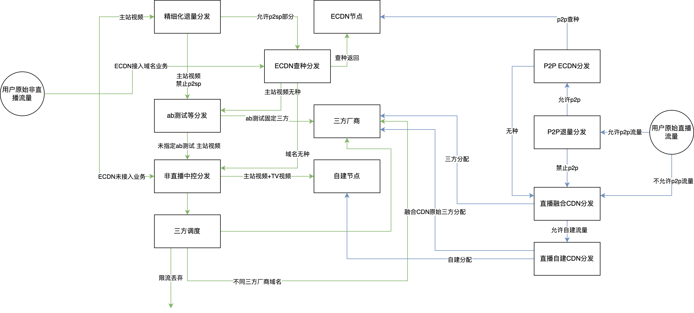
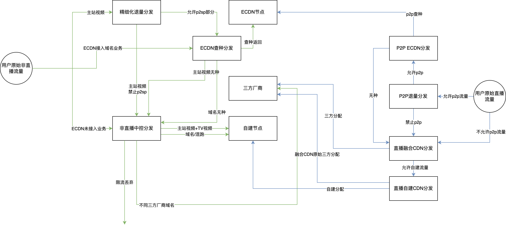
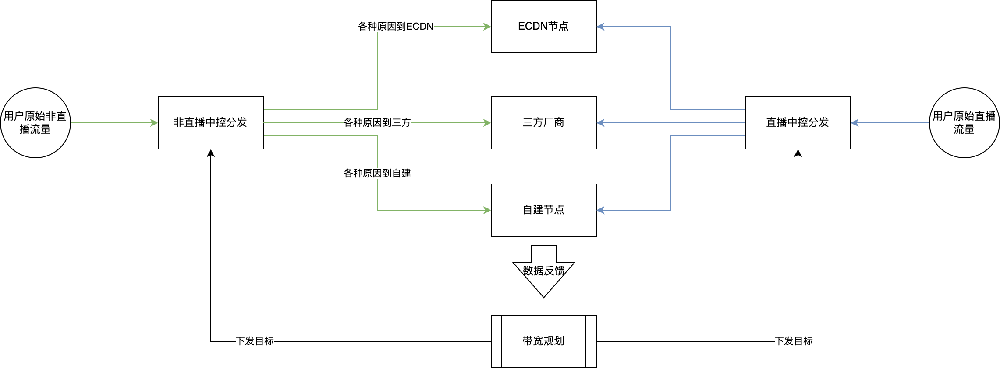

**基于可控带宽的建设-规划-调度全链路建设方案**

# **目标**

使用统一的一套策略规划系统，生成每个节点需要跑多少带宽，每种类型带宽分别跑多少比较合理。

整合自建划线、三方划线和建设带宽输出三个子模块，联动起来，实现以下能力：

1.  聚合所有CDN可控带宽，可以在月初计算出自建和三方复用率、账单差异率的规划数据
2.  提供计算能力可以支持在资源变化、输入带宽变化等情况下，计算各指标的规划上限
3.  将计算结果输出到调度下游工程系统执行

# **建设部分**

## **流程**

建立以可控带宽为核心的规划、建设、调度体系。


## **指标建设**

账单差异率：已有

保底浪费率：根据工作日日95低于保底的值平均得到，目标是每个节点15G以内，？

执行效率：

## **执行流程**



- **整体流程**：调度工程给出所有业务的可控带宽历史值，构成带宽曲线，用于调度策略计算最优节点分配带宽，策略根据账单差异率，未来一个月的自然流量周期变化等产出节点的划线，并对无法覆盖保底的区域提出裁撤需求，资源根据需求新建与裁撤对齐需求下发任务，采购网络SRE执行
- **新增上量**：调度工程对可控带宽负责，可控量级的准确性由工程负责。新增业务后，调度工程需将其体现在可控带宽中，可控带宽作为新增量级的唯一入口

## **运营与监控**



如果发生保底浪费，则优先看策略预期的资源容量是多少，排查是否是资源还未裁撤完毕；如果没问题，则看是否是预期跑量曲线本身小于保底且没有提出裁撤，策略补裁撤需求，并优化预期跑量曲线的预测逻辑；最后看可控带宽是否比实跑高很多，则排查工程给出的数据是否准确，调度执行是否存在问题。

# **规划部分**

## **规划算法**

假设我们拥有每个省份的可控带宽未来预期曲线：X(b,p,i) 为未来i时刻b业务p省份的可控带宽，F(b,s,i) 为未来i时刻b业务s节点的不可控带宽，特别的F(b,s,p,i)代表F节点在i时刻来自p省份的不可控带宽，显然有：

F(b,s,i) = \sum_p F(b,s,p,i)

这里对于三方CDN厂商也认为是一个节点，P(s)为节点的单价，以日95月平均计费的节点集合为{daily95}，以月95计费的节点集合为{month95}。考虑到我们实际的可控带宽是总带宽的一个可控子集，通过ECDN退量和P2P退量其实可以整体来控制。例如大盘b业务在i时刻p省份的总带宽为T(b,p,i)，由于对于CDN而言的不可控带宽和对ECDN的不可控带宽并不一致，两者是相交的：



于是需要估计出一些输入参数，设ECDN的b业务在i时刻可控带宽为E(b,p,i)，那么需要参数beta，用于表明ECDN可控带宽中CDN不可控的比例，即：

T(b,p,i) = \sum_s F(b,s,p,i) + (1-\beta)E(b,p,i)

考虑可控带宽，可控带宽其实是由ECDN的调度决策和退量决策共同决策的，这里以点播为例，ECDN调度本身假设消耗为固定值C(ecdn,b,p,i)，假设退量比例为b^，这个比例其实是ECDN中长短视频部分设为V(s,p,i)，则可控带宽为：

X(b,p,i) = (1-\beta)(E(b,p,i) - C(ecdn,b,p,i))

有了可控带宽之后，我们考虑可控带宽在CDN的分配策略，以降低最终计费，显然有最终计费，Q为quantile函数：

\$ = \sum_{s\in\{\text{daily95}\}}{{P(s) \sum_{d}Q_{date(i)=d}(X(s, i) + F(s,i), 0.95)}} + \sum_{s\in\{\text{month95}\}}{{P(s) Q(X(s, i) + F(s.i), 0.95)}}

其中X(s,i)为i时刻分配到节点s的带宽，规划的目标即是给出此值，以供调度逼近到此值。于是可以表示出账单差异率，计费点差异率等值。为表示方便，用B(s)代表s节点的账单，即：

B(s) = \begin{cases}  {P(s) \sum_{d}Q_{date(i)=d}(X(s, i)+F(s,i), 0.95)}, & \text{if} \quad s \in \{\text{daily95}\} \\ {P(s) Q(X(s, i)+F(s,i), 0.95)}  & \text{if} \quad s \in \{ \text{month95}\} \end{cases}

同样的，区分业务的话，则为：

B(b, s) = \begin{cases}  {P(s) \sum_{d}Q_{date(i)=d}(X(b, s, i)+F(b,s,i), 0.95)}, & \text{if} \quad s \in \{\text{daily95}\} \\ {P(s) Q(X(b, s, i)+F(b,s,i), 0.95)}  & \text{if} \quad s \in \{ \text{month95}\} \end{cases}

定义U(r)为r供应商的所有节点集合，那么b业务的计费点差异率为：

\delta_b =  \frac{\sum_r \sum_d {Q_{date(i)=d}(\sum_{s\in U_r} X(s,b,i)+F(s,b,i), 0.95)} }{\sum_d {Q_{date(i)=d}(\sum_s X(s,b,i)+F(s,b,i), 0.95)}} - 1

b业务整体的账单差异率为：

\Delta_b =  \frac{\sum_r \sum_{s \in U_r} B(s,b)}{\sum_r \sum_d {Q_{date(i)=d}(\sum_{s\in U_r} X(s,b,i) + F(s,b,i),0.95)} } - 1

于是可以自行制定目标函数和限制条件，例如要降低计费点差异率和账单差异率，但是必须要保障退量qos实验能通过，例如退量比例必须大于y，则为：

\text{opt.} \qquad \min \sum_b (\delta_b + 1)(\Delta_b + 1) \newline \text{s.t.} \begin{cases} \qquad \hat{b} \geq y & (1) \\ \forall_i \forall_b \sum_s X(s,b,i) + F(s, b, i) \leq U(s)  & (2) \\ \forall_i \forall_b \sum_s X(s,b,i) + F(s,b,i) = X(b,p,i) & (3) \end{cases}

这里只写了几个比较重要的限制，其他限制条件可以根据实际情况添加。其中1式为退量比例限制，2式为不可控带宽影响，3式为每个时刻承载所有业务量，用前述等式展开后含有b^。如果我们综合考虑退量因素为一个目标，可以设置权重，或者我们用最终价格替换账单差异率和计费点差异率：

\text{opt.} \qquad \min \sum_s B(s) - \eta \hat{b} \newline \text{s.t.} \begin{cases}  \forall_i \forall_b \sum_s X(s,b,i) + F(s, b, i) \leq U(s) & (2) \\ \forall_i \forall_b \sum_s X(s,b,i) + F(s,b,i) = X(b,p,i) & (3) \end{cases}

可以看到删除(1)，根据qos和钱的计费比例与退量带宽得到eta，也可以作为综合考虑目标。如此我们可以将整个流量调度建立一个数学模型，并根据业务诉求增加限制条件，修改目标函数。并可以mock各种变化参数，从而推导出预期的目标变化。

**工程求解**

这里主要讲一下如何求解最小值，上述建模式子显然不线性，Q函数的存在导致求解较为困难，如果采用无梯度求解算法，例如模拟退火、遗传算法等启发式算法，性能较差（求解速度+解的质量），但由于Q函数的特性以及我们业务实际参数（例如自建大量节点，三方节点较少）的特性，可以采用一些手段将其转化为部分线性问题或整数规划问题。

Q函数的实际意义是95计费，如果规划好5%的时间如何使用，则问题变成了简单的线性规划（甚至在不考虑跨省问题时为简单贪心），于是考虑5%的时间如何规划。我们解决的问题是用一个决策变量L(s)作为B(s)的规划值，L(s,d)则为d日的日95计费资源的B(s,d)的规划值，即规划目标为：

\forall_{s\ in \{\text{daily95}\} } \forall{d} L(s, d) \leftarrow B(s, d) \qquad \forall_{s\in \{ \text{month95}\} }L(s) \leftarrow B(s)

 规划同时需要决策s在i时刻是否使用5%的时长，则为G(s,i)=0/1，但实际我们进行调度又要极力避免突上突下，于是我们采用p(s,d)和q(s,d)来代表在d日的开始时刻，即：

G(s,i) = 1 & \text{if} & p(s, d) \leq i \leq q(s, d) 

s节点的容量假设为U(s)，保底为N(s)，则有：

N(s) \leq L(s) \leq U(s) & (1) \\  L(s) + G(s, i) (U(s) - L(s)) \geq X(s, i) + F(s,i) & (2) \\ \forall_{s\in \{ \text{daily95} \} } \forall_{d} \sum_{date(i)=d} G(s, i) \leq 0.05I_d &(3) \\ \forall_{s\in \{ \text{month95} \}}  G(s, i) \leq 0.05 I_m & (4)

(1)式为基本容量限制，(2)式为容量限制，即转化Q函数到线性的关键，规划使用5%时间时使用上限限制，Id和Im是日度和月度时刻数，取决于我们想使用的精度，（3）和（4）是日95的限制函数。于是我们考虑如何规划开始和结束，对于时刻i来说，(2)式转化为p(s,d)和q(s,d)之后，移动p(s,d)和q(s,d)对于其影响，假设步长为t，变化量为p'(s,d)，q'(s,d)表示是否+1/-1/+0：

opt. \min \qquad \sum_s L(s)+G(s,i)(U(s)-L(s)) - X(s,i) \\ s.t. \qquad X(s,i) \leq  \begin{cases}  U(s) \qquad \text{if} \quad p(s,d)+tp'(s,d) \leq i \leq q(s,d) + tq'(s,d) \\ L(s) \qquad \text{otherwise} \end{cases}

从而通过迭代+MILP求解。当然也可以结合其他方法，例如先通过剩余时长选择一批以减少高计费风险，这是个背包问题，先定义剩余时长为(3)和(4)式剩余的空间，日95由于必须使用，不需要选择，月95则可以按天(d)来选择，planday是当前迭代规划的日期，O(s)为是否本日选择s，选择目标可以根据具体情况调整，例如下式用了e的剩余时长负幂，这个目标可以尽量选择较多且时长剩余较多的节点，如果想根据实际情况调整，例如想要更多大节点也可以改成log等其他函数：

\phi(s) = 0.05 I_m - \sum_{i \leq \text{planday}} G(s, i)  \quad \text{if} \quad s\in \{ \text{month95} \} \\ \text{opt.} \qquad \min \sum_s e^{-\phi_s} \\ \text{s.t.} \qquad \sum_s O_s (U_s - N_s) + N_s \geq \lambda \max_{i \in \text{planday}} \sum_s X(s, i)

该问题可以通过经典背包算法求解, f*是最优化函数，S是已求解集合，W是st式子中的右边限制：

f^*(S, W) = \min ({f^*(S\wedge s, W - (U_s - N_s)) + e^{-\phi_s}, f^* (S \wedge s, W)})

## **纠偏算法**

上文建模之后，将可控带宽与节点带宽预期联系在了一起，从而推导出与目标计费及其他质量因素的关联关系。但实际在调度及运营过程中，面临输入数据的偏差，决策执行的偏差，这里讨论对偏差的纠错。输入数据一定存在不对齐、丢点等问题，可以用一些预测方法来解决，构造足够特征即可很有效解决。另外对于不同步的问题通常是线性问题，可以用PID、LPC等方法解决，这里重点讨论决策算法。

纠偏的主要点在于月95计费节点，月95计费在某日可能已经耗尽时长，可能已经与规划时候不符，这时可以有如下方法来纠偏，首先s节点的时长和规划计费目标L(s)是非线性负相关，定义损失为：

\gamma(s, b) = 0.05I_m - \text{rank}(b)

可以看到，b为B(s)时，则为之前定义的phi，即免费时长，通过调整B(s)，从而使得免费时长足够满足规划算法中的限制，也是一个背包问题通过最小的计费变量来满足市场要求W（W的评估可以是规划模型，也可以是基于事后的拟合模型）：

f^*(S, W) = \min ({\min_b{f^*(S\wedge s, W - (U_s - N_s)\gamma(s, b) ) + b}, f^* (S \wedge s, W)})

# **实施计划**

## **规划数据**

### **可控带宽数据**


```
with base_data as (
    with arrayJoin(JSONExtractArrayRaw(biz_unit_allocates)) as biz_unit_allocates_info
    select
        timestamp_second,
        toStartOfFiveMinute(toDateTime(timestamp_second)) as ts_5min,
        cdn_service_type,
        JSONExtractString(biz_unit_allocates_info, 'province') as province,
        JSONExtractString(biz_unit_allocates_info, 'isp') as isp,
        toInt32OrZero(
            JSONExtractString(
                biz_unit_allocates_info,
                'biz_bw_mbps'
            )
        ) as biz_bw_mbps,
        JSONExtractString(rule_allocate_info, 'rule_id') as rule_id,
        toInt32OrZero(
            JSONExtractString(
                rule_allocate_info,
                'allocate_bw_mbps'
            )
        ) as allocate_bw_mbps
    from
        ks_cdn.cdn_uniform_flow_allocate_result_v3
    ARRAY join JSONExtractArrayRaw(JSONExtractString(biz_unit_allocates_info, 'rule_allocates')) as rule_allocate_info
    where timestamp_second >= {} and timestamp_second <= {}
),
-- 步骤2: 获取总时间点数量
total_points as (
    select
        ts_5min,
        cdn_service_type,
        province,
        isp,
        COUNT(DISTINCT timestamp_second) as total_point_count
    from
        base_data
    group by ts_5min, cdn_service_type, province, isp
),
-- 步骤3: 获取每个规则的数据
rule_data as (
    select
        ts_5min,
        cdn_service_type,
        province,
        isp,
        rule_id,
        SUM(allocate_bw_mbps) as oc_bw_sum
    from
        base_data
    group by ts_5min, cdn_service_type, province, isp, rule_id
),
-- 步骤4: 获取总带宽数据
total_bw_data as (
    select
        ts_5min,
        cdn_service_type,
        province,
        isp,
        SUM(biz_bw_mbps) as total_bw_sum
    from
        (
            select
                distinct timestamp_second,
                ts_5min,
                cdn_service_type,
                province,
                isp,
                biz_bw_mbps
            from
                base_data
        )
    group by ts_5min, cdn_service_type, province, isp
),
rule_results as (
    select
        r.ts_5min as ts_5min,
        r.cdn_service_type as cdn_service_type,
        r.province as province,
        r.isp as isp,
        r.rule_id as rule_id,
        t.total_bw_sum / p.total_point_count as total_biz_bw_mbps,
        r.oc_bw_sum / p.total_point_count as allocate_bw_mbps
    from
        rule_data r
        join total_points p on r.ts_5min = p.ts_5min
        and r.cdn_service_type = p.cdn_service_type
        and r.province = p.province
        and r.isp = p.isp
        join total_bw_data t on r.ts_5min = t.ts_5min
        and r.cdn_service_type = t.cdn_service_type
        and r.province = t.province
        and r.isp = t.isp
)

select
    ts_5min, cdn_service_type,province,isp,rule_id,
    sum(allocate_bw_mbps) as allocate_bw_mbps
from rule_results
group by ts_5min, cdn_service_type,province,isp,rule_id  
order by ts_5min, cdn_service_type, province, isp
```


#### **当前问题**

1. 当前获取方式，查询ck，需要大量子查询嵌套，高负载查询不利，建议做一些聚合操作，flink计算聚合，方便后续运算
2. 直播和静态的可控带宽数据差距很大，目前静态的可控带宽数据因为未接入全部业务以及异构，无法准确获取，直播的目前比对差距还很大，这个问题导致没有可靠的数据进行建设规划
3. 三方的部分，没有明确给出每个域名的分配量（自建调度不管三方的分配），无法与三方带宽进行核算调度准确性，DNS调度和星移都控制了三方域名的分配（当前一个处理静态一个处理tv，没有冲突，但未来还存在问题）
4. Solar、ECDN、P2P的控制开关及分配结果，没有并入主逻辑，无法计算全量带宽
5. 点播没有考虑abtest数据

#### **需求**

1. 当前可控带宽相关：

1. 对ck数据进行聚合，形成如下类型**明细表**：
   1. timestamp: 时间戳，**维度**
   2. resource_type: 大的业务类型，点播、直播、静态，**维度**
   3. client_isp: 客户运营商，**维度**
   4. client_prov: 客户省份，**维度**
   5. biz_name: 小的业务类型，例如点播里面的tv、长视频、短视频及免流子类型，静态里面的各个规范域名组，直播里面的acu档位，**维度**
   6. destination: 目标地，例如自建的OC，或者三方的域名，**维度**
   7. provider: 目的地供应商，自建/三方/ECDN等，**维度**
   8. allocate_bw: 分配带宽，预期要分配过去的带宽值，**值**
2. 校准直播和静态压制到三方的数据，从分配给三方的域名带宽和实际带宽做对比，修正当前数据的问题，把abtest的数据也并入，从而得到三方每个域名中写死的带宽有多少
   1. timestamp: 时间戳，**维度**
   2. resource_type: 大的业务类型，点播、直播、静态，**维度**
   3. client_isp: 客户运营商，**维度**
   4. client_prov: 客户省份，**维度**
   5. domain: 三方域名/自建OC，**维度**
   6. provider: 目的地供应商，自建/三方/ECDN等，**维度**
   7. allocate_bw: 分配带宽，**值**
   8. log_bw: 真实的日志带宽聚合，**值**
3. 配合双端差异率，调查客户端带宽调度分配带宽的差距：

1. timestamp: 时间戳，**维度**
2. client_isp: 客户运营商，**维度**
3. client_prov: 客户省份，**维度**
4. resource_type: 大的业务类型，点播、直播、静态，**维度**
5. domain: 三方域名/自建OC，**维度**
   1. provider: 目的地供应商，自建/三方/ECDN等，**维度**
6. allocate_bw: 分配带宽，**值**
7. client_bw: 客户端带宽聚合，**值**

1. 需要新增的可控带宽相关：
   1. 构建ECDN退量相关的可控带宽**明细表：**
      1. timestamp: 时间戳，**维度**
      2. resource_type: 就是点播，**维度**
      3. client_isp: 客户运营商，**维度**
      4. client_prov: 客户省份，**维度**
      5. provider: 供应商，这里必须给出全供应商的信息，方便聚合，没控制的供应商则按照原始值来，**维度**
      6. control_ratio: 控制比例，退量百分比，**值**
      7. expect_provider_bw: 预期的供应商退量后带宽，**值**
   2. 根据实际的客户端带宽及服务端带宽，可以再聚合一个比对表：
      1. \+ client_bw: 客户端带宽聚合，**值**
      2. \+ log_bw: 服务端带宽聚合，**值**
   3. 增加Solar的可控带宽分配明细表：
      1. timestamp: 时间戳，**维度**
      2. resource_type: 大的业务类型，主要是点播和静态，**维度**
      3. biz_name: 小的业务类型，例如点播里面的tv、长视频、短视频及免流子类型，静态里面的各个规范域名组，直播里面的acu档位，**维度**
      4. client_isp: 客户运营商，**维度**
      5. client_prov: 客户省份，**维度**
      6. destination: 目标地，例如自建的OC，或者三方的域名，或者自建的域名，**维度**
      7. provider: 供应商，这里必须给出全供应商的信息，方便聚合，没控制的供应商则按照原始值来，**维度**
      8. allocate_bw: 分配带宽，预期要分配过去的带宽值，**值**
      9. reject_ratio: 拒绝比率，**值**
      10. reject_bw: 预期拒绝掉的带宽，即如果不做Solar操作，估计有多少带宽还可以进来，长期来应该和allocate_bw反算的结果一样，**值**
   4. 根据实际的客户端及服务端带宽，一样增加一个比对
      1. \+ client_bw: 客户端带宽聚合，**值**
      2. \+ log_bw: 服务端带宽聚合，**值**
   5. 增加星移的可控带宽分配明细表，DNS调度的三方部分，也放到这个表里面（待定，也可以星移统一来处理，但需要一个角色来出）：
      1. timestamp: 时间戳，**维度**
      2. resource_type: 就是点播，**维度**
      3. client_isp: 客户运营商，**维度**
      4. client_prov: 客户省份，**维度**
      5. provider: 供应商，这里必须给出全供应商的信息，方便聚合，没控制的供应商则按照原始值来，**维度**
      6. domain：域名，隶属于这个供应商的一个域名，**维度**
      7. control_ratio: 分配比例，**值**
      8. expect_provider_bw: 预期的该域名分配后带宽，**值**
   6. 根据实际的客户端及服务端带宽，一样增加一个比对
      1. \+ client_bw: 客户端带宽聚合，**值**
      2. \+ log_bw: 服务端带宽聚合，**值**

#### **下一步规划**

做完可控带宽的数据完善，就可以计算出来我们在每个维度（省份运营商、供应商）下能够调度的带宽总大小，结合Solar及ECDN的甚至可以是一个范围，后续可以把Solar、ECDN的控制，与自建三方的控制一起来决策处理。在规划时，根据建设等信息，规划出ECDN和CDN的整月跑量，ECDN退量、P2P退量及Solar与实时调度一起去执行规划出来的额外容量。

举个例子，月初规划根据上述模型计算出每个资源的预期跑量值之后，例如A机房有15G划线，三方的Provider阿里-非直播，有25G划线，但是A省非直播的可控带宽，只有10G，剩余5G，那么就可以去操作ECDN和Solar的带宽来填补这5G。三方的也是同理，先通过星移的三方调度来计算，计算后再采用ECDN的退量来补充。相当于实时调度里面包含了非直播、直播、Solar、ECDN退量和P2P退量一起，来做规划的执行落地。这样可以同一个优先级来处理所有的控量开关。

### **域名带宽数据（主要目标是计算不可控那部分）**

当前获取方式：


```
def get_provider_bandwidth(start_ts: int, end_ts: int):
    df_list = []
    for st in range(start_ts, end_ts, 24*3600):

        host = "http://kcdn-test2.test.gifshow.com"
        apiPath = "/api/kcdn-bandwidth-openapi/v1/template-api"
        apiName = "getGroupIspRegionBandwidth"
        token = "fed264a6675d11ee89062f18e94ab5ad"
        param = {
            "st":str(st),
            "et":str(min(st + 24*3600, end_ts-1)),
            "cdn_type": ["2","3","5"],
            "is_oversea": 0,
            "flow_type": ["oc_access"],
            "group": ["virtual_provider_id", "client_isp_id", "client_region_id"],
        }
        req_body = {
            "apiName": apiName,
            "token": token,
            "param": param
        }
        header = {"content-type": "application/json"}

        resp = requests.post(host+apiPath, headers=header, json=req_body)
        df = pd.DataFrame(resp.json()["data"])
        df_list.append(df)
    return pd.concat(df_list, axis=0, ignore_index=True)
```


#### **当前问题**

1. 不好区分写死带宽，需要确定多少带宽写死在每个运营商才能计算可腾挪带宽，更好做划线；目前静态只能用DNS域名后缀来判断，数据分析较为复杂，Solar分配出去的带宽则更是难以处理
2. 点播压制出去的带宽，也没有直接关联起来，用来快速判断哪些域名是点播压制出去的。点播带宽统计存在以下问题：
   1. 长视频和短视频的域名有重叠共用，部分短视频图片业务也在使用点播调度下发
   2. 一个域名内同时存在写死的和跟随调度的
   3. TR和kvq修正，导致从下发量估算带宽难度较大
   4. 预取抽离了部分带宽进行了重新分配，没有完全走点播调度中控
   5. 存在防盗链映射，一个域名一部分映射出来这个域名，一部分映射出来另一个
   6. 存在abtest逻辑，没有完全按照正常的逻辑走
3. 直播压制到三方的带宽与预期严重不符，直播还存在p2p的分量到三方

#### **需求**

为了简化问题，先把静态、点播和直播的域名完全分离开，避免混用，具体如下：

1. 静态域名带宽
   1. 拆分通过短视频封面下发的静态业务域名，全部使用DNS调度下发（当前全部使用点播中控在下发），避免无法从域名区分出是哪部分带宽
      1. 例如ali2.a.yximgs.com，数据分析时无法总是将其算入静态，但是又不走DNS调度，导致无法与DNS调度发布的可控带宽数据对应
   2. 维护统一的一份DNS调度控制范围配置，支持对所有的project业务类型，下发了哪些域名，哪些是接入了DNS调度的，哪些是没有受到DNS调度控制的
      1. 当前是否有DNS在控制某个业务的一些带宽，是散落在很多个不同的kconf里面，需要维护一份配置方便同步维度表
      2. 创建一个**维度表**来维护这份DNS控制范围，类似如下字段覆盖全部**非Solar**的三方域名：
         1. project_name_list: 项目名，一组，规范域名治理后作为一个整体的调度单元，如果是未治理的则直接全部打包放入
         2. is_controlled: 是否已经接入DNS调度并控制了
         3. domain_name: 域名，一个项目有很多域名，在规范域名治理后，理论上一组域名不会被其他规范域名组使用
   3. 处理Solar分配到三方的带宽，能够计算出solar给三方多少带宽，这部分当前直接认为是写死的，等待Solar接入到正常三方调度逻辑后，作为控制带宽来处理
      1. 维护一份Solar目前控制的总带宽配置，当前散落在不同的kconf和数据库里面
      2. 创建一个**维度表**来维护Solar的控制范围，类似如下字段覆盖全部**Solar**的三方域名：
         1. project_name_list: 项目名，一组，规范域名治理后作为一个整体的调度单元，如果是未治理的则直接全部打包放入
         2. resource_type: 因为Solar同时接入了静态和点播的预取，所以这里还需要额外展示资源类型
         3. domain_name: 域名，一个项目有很多域名，在规范域名治理后，理论上一组域名不会被其他规范域名组使用
2. 点播域名带宽
   1. 拆分域名，从而避免长短视频用同样的域名，以及静态混用的域名
   2. 维护一份点播的域名分配**维度表**：
      1. project_name_list: 项目名，一组
      2. ftt_type: 各免流类型
      3. client_net_type: 客户端网络类型
      4. domain_name_raw: 域名，防盗链映射前
      5. domain_name_crypto: 防盗链后域名
      6. crypto_ratio: 防盗链映射比例
   3. 处理Solar分配到三方的带宽，能计算出solar给三方多少带宽，后续并入点播分配的主逻辑
      1. 维护一份Solar目前控制的总带宽配置，当前散落在不同的kconf和数据库里面
      2. 创建一个**维度表**来维护Solar的控制范围，类似如下字段覆盖全部**Solar**的三方域名：
         1. project_name_list: 项目名，一组，规范域名治理后作为一个整体的调度单元，如果是未治理的则直接全部打包放入
         2. resource_type: 因为Solar同时接入了静态和点播的预取，所以这里还需要额外展示资源类型
         3. domain_name: 域名，一个项目有很多域名，在规范域名治理后，理论上一组域名不会被其他规范域名组使用
   4. 维护一份abtest的分配**维度表**：abtest抽流量的逻辑待确认
3. 直播域名带宽
   1. 直播域名很少，等待直播融合调度重构后维护一份域名分配**维度表**，以此可以计算直播未预期的写死带宽
      1. acu_range: acu区间
      2. live_type: 秀场/电商/伴侣
      3. domain_name: 域名

### **三线带宽数据**

> 三线的配额如何规划呢，这部分对于CDN而言就是个固定带宽 ---作用于规划---> 实时调度使用Solar、退量等手段填空

## **资源数据**

### **三方覆盖关系**

部分三方厂商，尤其是DJ厂商，对接入的业务类型有限制，比如只能用长视频，这部分限制数据需要能够拿到，才能对三方调度进行规划：

1. project_name_list: 项目合集
2. resource_type：资源类型
3. provider_list: 可用的供应商
4. domain_list: 可用的域名列表

## **工程架构**

### **现状**

以实际流量分发优先级的视角（**非实际流量请求的先后路径**）来看，当前我们的流量分发模式如下图，箭头指向为流量分发顺序，例如非直播的流量，最上游是Solar、主站视频和ECDN暂时没有去分发的一些静态内容，这三者是**相互独立**的，以相互独立的链路继续下去。



1. Solar会按照一定的比例，分配自建和三方的域名，这里虽然CDN调度在链路上先下发，但是分发之后其实会被ECDN进行抢量，ECDN无种的部分，才会真正是CDN调度作用的部分，**所以solar分配后的这部分带宽ECDN的分发其实是CDN调度的上游**，ECDN分发完这部分带宽之后，不需要的部分，则由自建DNS来分发，决定去自建还是三方。
2. 主站视频这条分发路径，则是先通过了精细化退量，精细化退量禁止的部分，直接下游就是CDN调度，而非禁止的部分，则是先过ECDN，再过CDN调度。CDN调度进来后，先会通过ab测试分发一部分到三方，分发之后剩余的再漏给非直播中控，非直播中控再去分发给自建或者三方，分发到三方的部分又是两种不同路径。一种是TV和联盟，从星移分配到三方，另一种是非星移部分，通过KDD和Kconf的配置到三方。这时到三方的域名有些是配置在DNS调度的，则会**通过DNS再度分发一部分给自建，**一部分给三方。
3. 最后一套较为干净的链路就是ECDN也不介入，直接过了非调度中控去分发的，较为干净。

### **当前问题**

例如我们要控制一个三方厂商的节点带宽，从下游往上游去溯源，会收到ECDN分发、自建DNS分发、TV+联盟分发、非直播中控分发等多个不同路径下来的多路流量，当前这种**一个目的地有多路多级分发的流量，却没有统一控制**的现象存在于很多个目标实体，规划即使已经拿到了所需要的所有数据，执行的问题仍然很大。

### **需求**

按照当前的路径分发模式，相当于需要统一解一个很复杂的网络流（流图与上述架构图完全一致），并统一决策各个分发开关的分量行为，才能实现精细化控制。这里给两种可能的模式，第一种就是保持当前现状，由计算中心统一计算出每个开关应该分配的值，从而实现规划的效果，类似下图。演进过程中部分正交的部分，可以用比例或者负反馈模拟（例如ECDN无差别不区分流量属性抢量的话，可以当他不存在，每个分发中心按一个固定比例去估算，类似当前点播中控估算文件大小的模式）



第二种则是延续之前的统一工程架构思路，将非直播和直播中控做成合并的统一负责的模块，即我们之前提到的NCDN方案。具体演进，可以先通过将部分相似功能合并，例如先把三方调度和星移的部分合并：



然后再去把Solar分发到三方的这条链路和三方调度合并，走统一链路：



再把ab测试加入到三方调度逻辑中，形成统一的非直播调度：



最后通过NCDN的方法，直播非直播ECDN和CDN调度决策合并：

