# **一、点播cdn介绍**

## **1.CDN**

CDN（Content Delivery Network）即内容分发网络，是在现有Internet基础上增加一层新的网络架构，通过部署边缘服务器，采用负载均衡、内容分发等功能，使用户可以就近访问获取所需内容，从而解决网站拥塞情况，提高用户访问响应速度。

## **2.点播cdn**

加速的内容是录好的视频、图片、应用程序、zip包等静态资源。

## **3.点播cdn架构**

接入、存储、L2上部署的都是同一套服务: kms2

# **二、kms2大体实现**

## **1.架构**

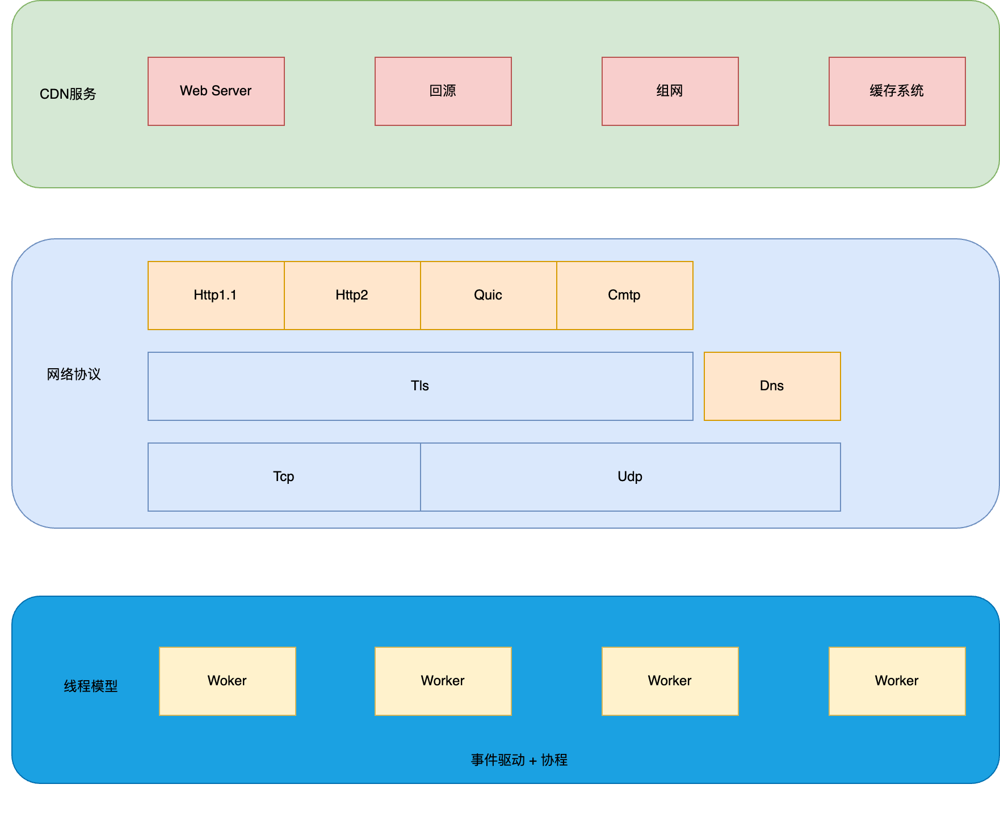

## **2.线程模型**

### **2.1 one eventloop per thread**

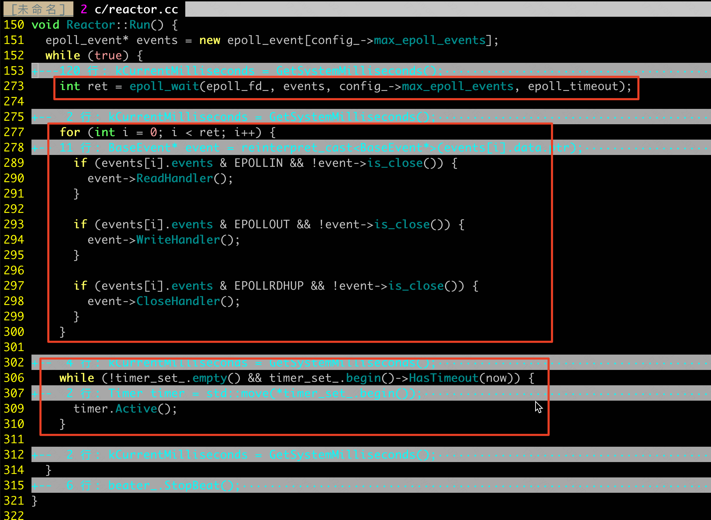

**好处**：

避免跨线程资源竞争、减少编码复杂性

### **2.2 协程**

1处处理当前线程抛过来的任务

2处处理其他线程抛过来的任务

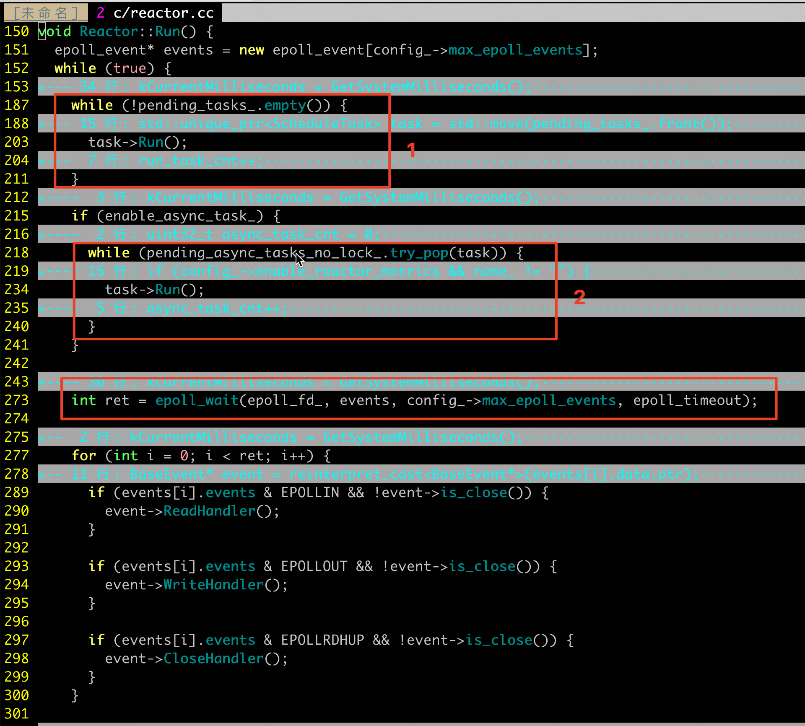

用ThenXXX 表达协程的执行顺序，用promise、future封装协程的执行结果

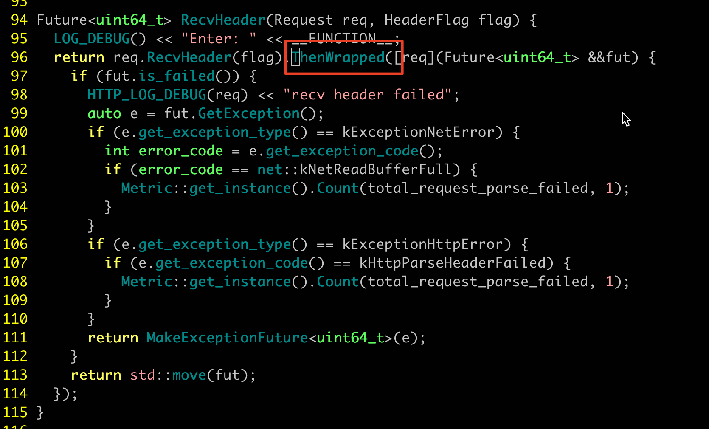

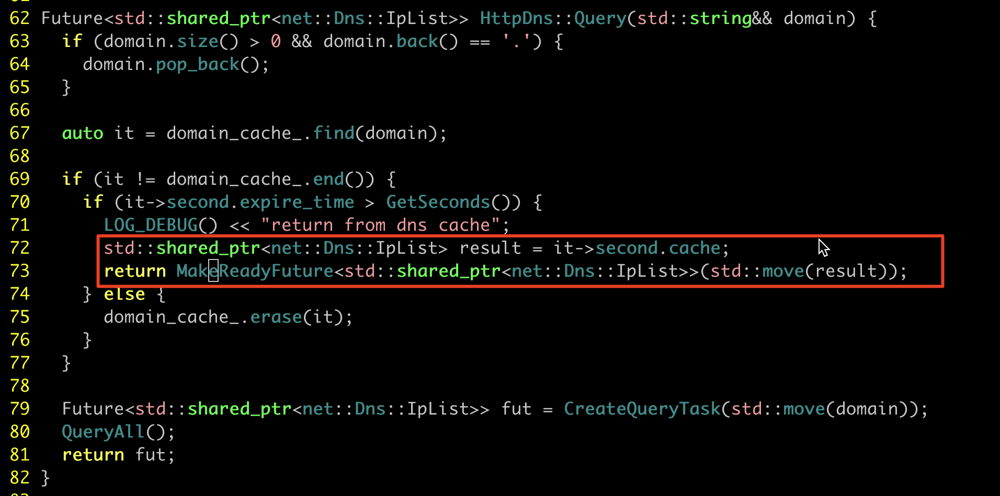

**协程好处**：

- 是对runInLoop、queueInLoop的封装和扩展，能更直观地体现异步任务的执行顺序，抛弃了回调的方式，使得等待异步任务的结果变得更清晰，代码易阅读、易维护
- 结合智能指针、移动语义：减少copy的同时，方便地解决了变量的生命周期问题

**ThenXXX 的缺点**：

- 同Js，"回调地狱"问题

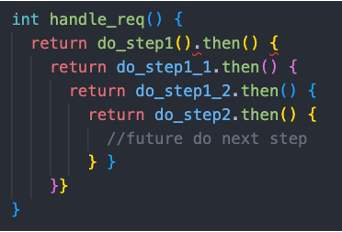

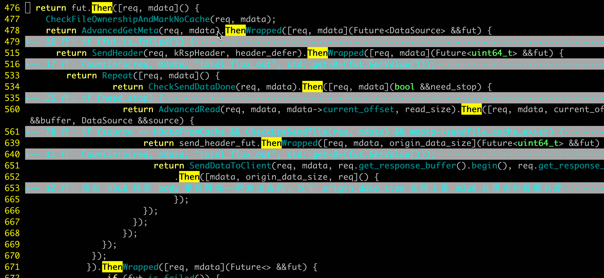

怎么解？

接入c++20：co_async、co_await等协程特性

## **3.web server**

- 同ngx，tcp server: multi thread listen + multi thread accept，解决惊群问题，提高qps
- 协程 + 移动语义 + jemalloc：避免了回调的方式，避免了对复杂buffer的使用、对高水位回调函数的使用，简化了应用层程序与网络层的交互逻辑，且未损失性能  

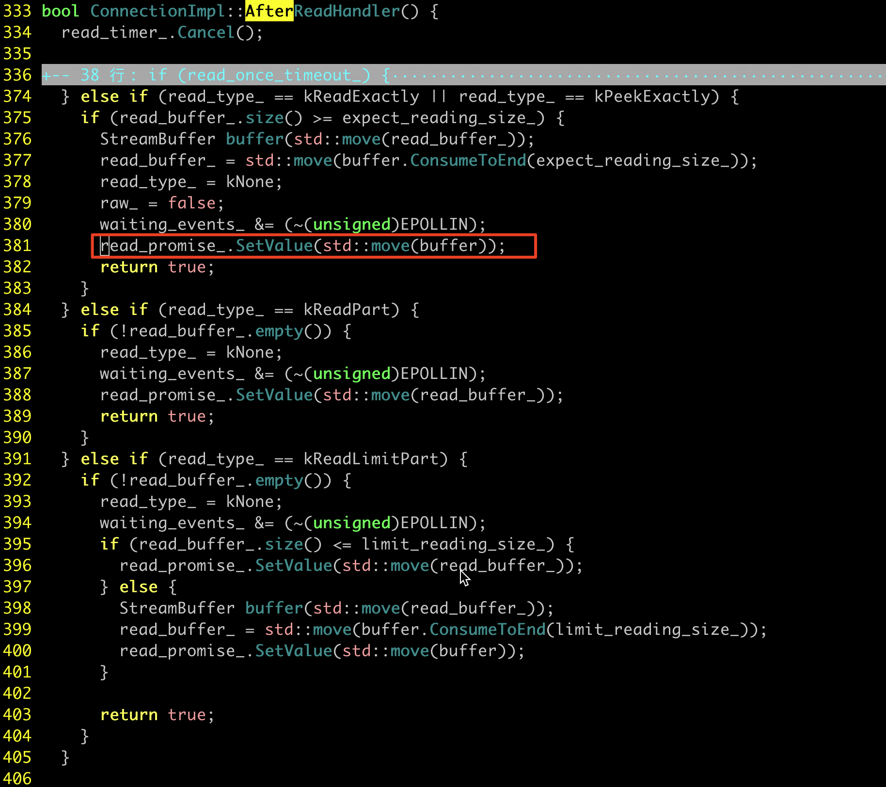

并发测试数据：

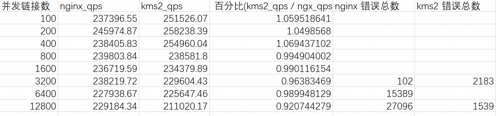

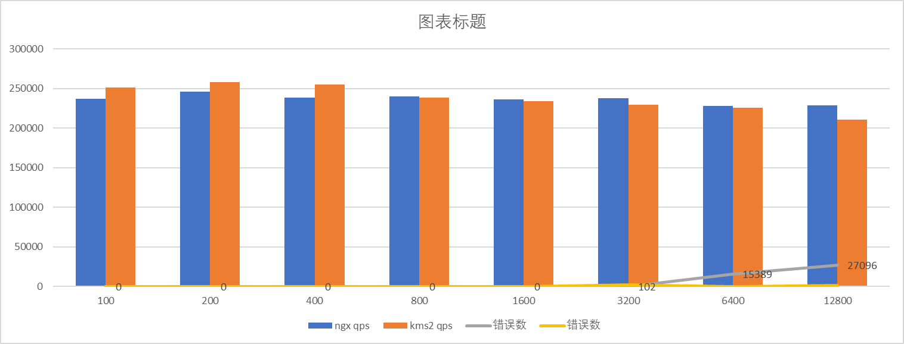

qps能和ngx达到相同的量级。

## **4.组集群**

为了保证不重复存储，集群节点需要做一致性hash，机房内的实例有相互识别的需求，需要组集群能力：

- 单播：每个服务实例 根据配置的内网网卡ip及配置的ip掩码，计算出要单播的集群范围，对每个机器发送集群在线请求，告诉其他机器"我在线，我是接入机/存储机/L2"

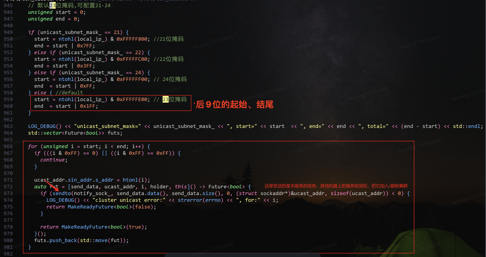

- 组播：集群内的机器都监听组播消息以接收其他节点的消息、都向组播地址发送自身的状态消息，消息内容和单播一样

特点：

- 掩码范围比较大的时候，单播可能引起交换机阻塞，此时需要用组播
- 同机房的机器组网是自行发生的，不需要中心服务参与
- 设有接口，可以从外部插手管理部分机器进入/退出集群 

## **5.回源流程**

### **5.1 接入机**

接入、存储、L2，同一套服务，配置有差异

### **5.2 存储机**

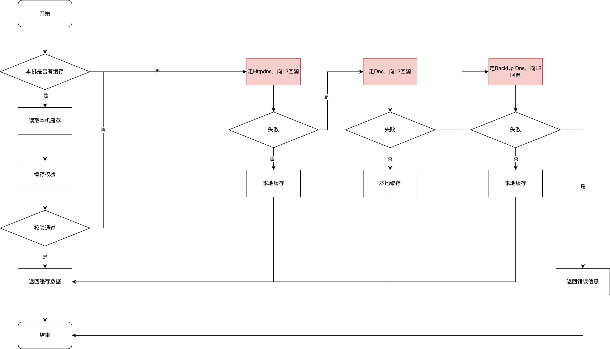

### **5.3 L2**

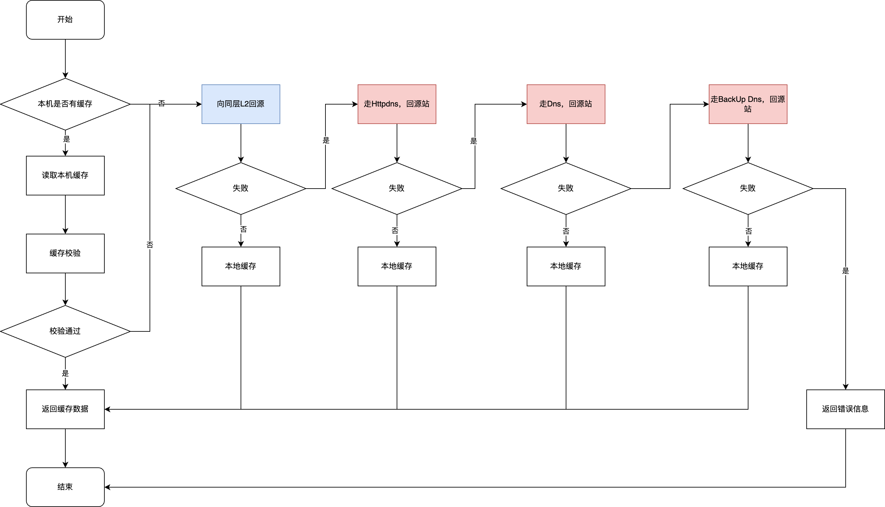

## **6.缓存系统**

### **6.1 为什么自研缓存系统，不使用文件系统**

考虑：

- 缓存系统更关注命中率，使用文件系统不便于实施缓存淘汰算法
- 文件系统有很多元数据，会增加额外的IO，存在IO放大问题
- 大量调用open、unlink等系统调用也会性能瓶颈

### **6.2 自研缓存系统**

#### **6.2.1 缓存策略介绍**

可以看做一个薄的文件系统

- 有元数据，也就是索引数据
- 元数据与文件数据隔离

> 缓存系统是Squid COSS （Cyclic Object Storage Scheme，循环对象存储方案）方案的演进版本。

> LRU类似的算法不适合基于磁盘的缓存系统，比较贴近磁盘的缓存算法基本都是FIFO的变种，都把盘分块，看做一个Strip（条带）。

缓存算法是FIFO2，该算法也是将一块盘分成很多chunk块，整个盘看做一个strip。

#### **6.2.2 FIFO2算法---盘怎么管理、缓存怎么标记、怎么淘汰**

- 盘的每个块对应一个引用计数，用来表示这块当前存储内容的热度，FIFO2算法最大热度值等于2。

- 初始的时候每个块引用计数都是0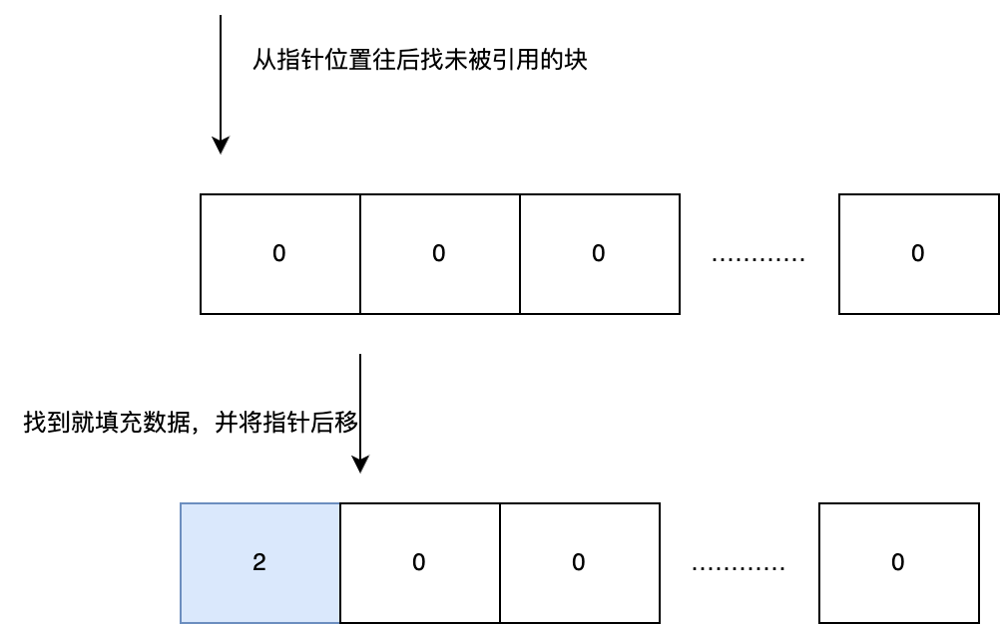
- 用一个指针记录下一个空闲块的位置，找空闲块的时候，从当前指针位置往后扫描，找到引用计数等于0的块，就用了，然后将对应块引用计数标位2，指针后移一下
- 如果指针指向的位置引用计数大于1，就将该块的引用计数减1，指针继续向后，直到找到等于0的块，才能直接用。
- 惰性删除，淘汰一个块，只会直接覆盖，不存在块的移动

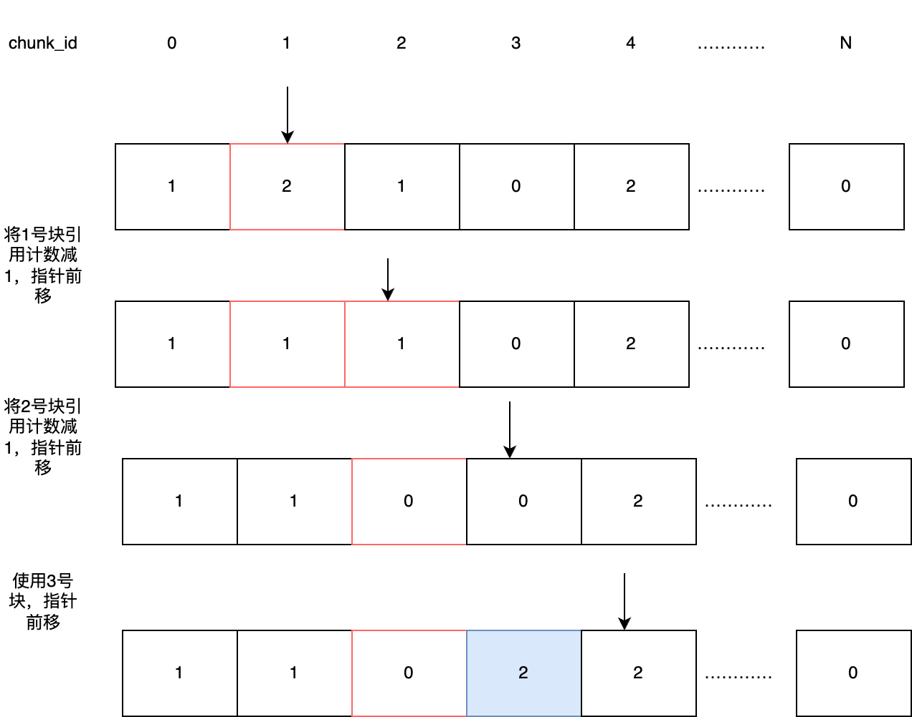

- 指针前进方式：idx = (idx + 1) % chunk_num

#### **6.2.3 索引结构是怎样的---怎么快速找到盘的chunk块**

索引文件是一个大文件，包含了很多信息，及3个关键的数组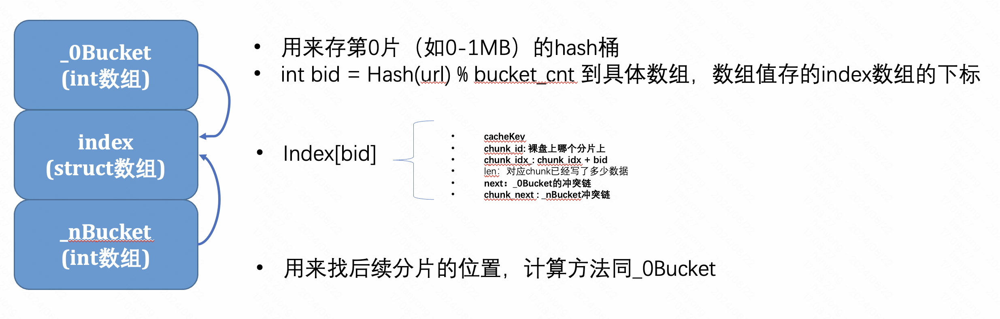

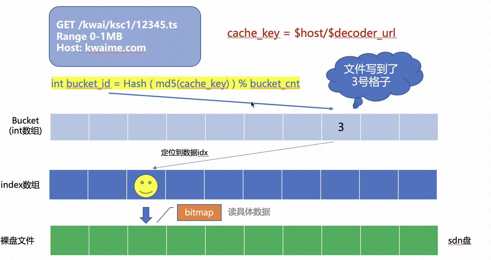

内核核心数据可以看做2个这样的hash表：

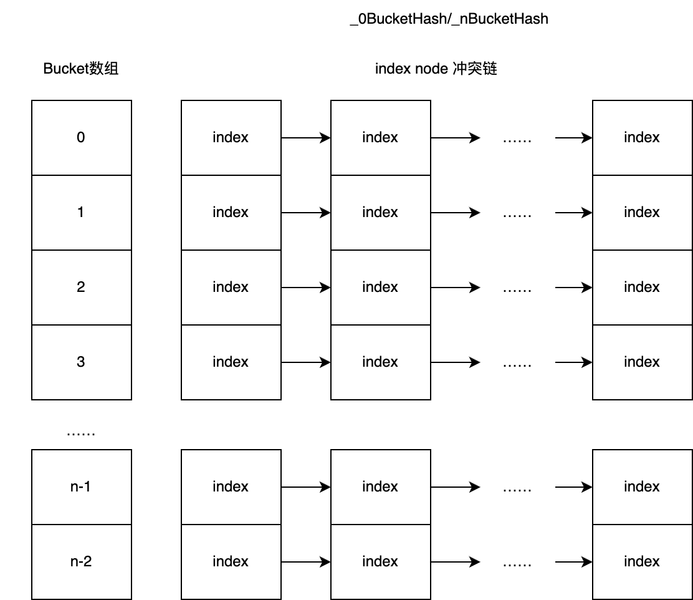

#### **6.2.4 FIFO2算法的特点**

> 好的缓存算法需要同时考虑：算法性能和缓存命中率。

> 要有好的缓存命中率，需要考虑：热度、时间局部性。

- 算法简单，没有块的移动，没有LRU那种读引起的写放大问题
- 性能消耗小
- 引用计数限制，考虑到了热度
- FIFO结构考虑了时间局部性，热度相同的话，存地早的文件先被淘汰

缺点  or 可改进的地方：

- 最大热度数值是2，热度区分不明显、没有热度分层
- 找空闲块的算法不够快，可以改进

可以考虑采用多级FIFO队列，将chunk内容按热度分层，空闲块不够的时候，可以直接淘汰部分低级的FIFO队列。

#### **6.2.5 分级缓存**

根据机型的差异，我们采用了不同的分级缓存策略：

**非一体机**：

接入机: 1~2块百GB左右的ssd盘，用来存索引、记实时日志，数块xxTB 的ssd盘 用来存数据

存储机/L2: 1~2块百GB左右的ssd盘，用来存索引、记实时日志，几十块xxTB 的hdd盘 用来存数据

**一体机**：

1~2块百GB左右的ssd盘，用来存索引、记实时日志，数块TB的ssd盘、数块TB的hdd盘 用来存数据。

采用：mem + ssd + hdd的分级缓存策略，mem中采用LRU算法，ssd和hdd中均采用FIFO2算法，缓存依次淘汰入下一级低速设备。