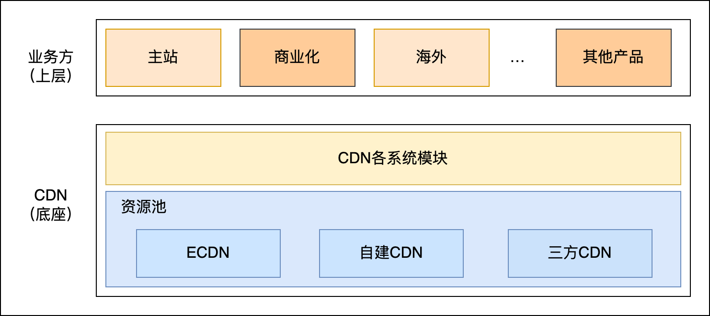
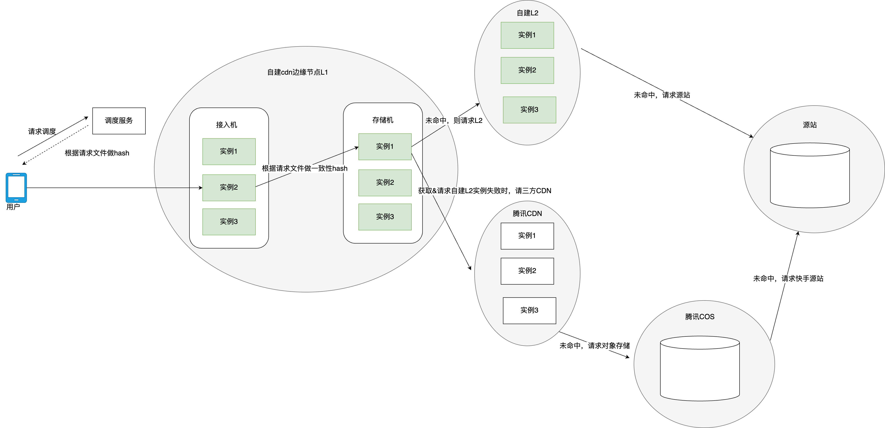
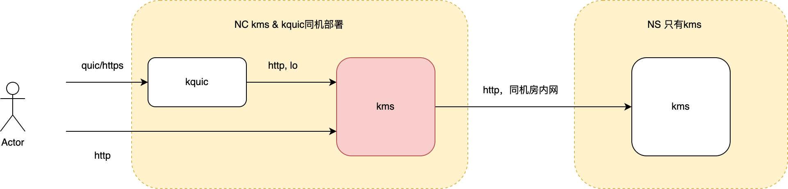
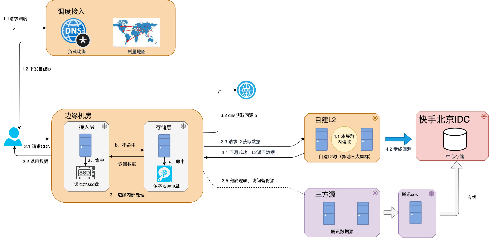
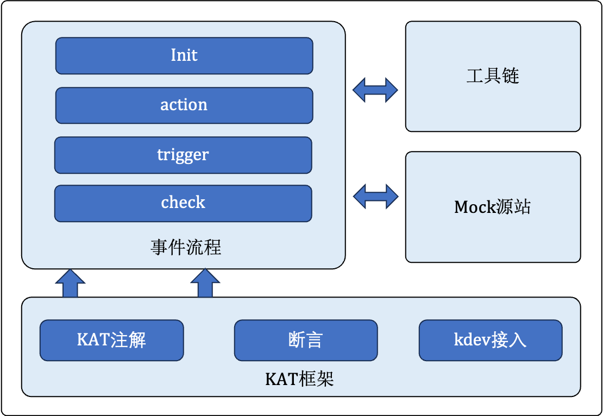

**点播CDN异常测试自动化**

## **一、背景**

​	CDN在公司内部属于基础支撑类服务，作为业务方的底座提供支持工作。目前公司的CDN资源主要分为三大类：ECDN、自建CDN以及三方CDN，其中自建CDN是基于公司的IDC资源进行搭建的服务。



自建CDN服务由于机房众多、机型多样，在线上场景中可能出现多种不符合预期的异常结果。突发的异常可能在短时间内影响大量机器，核心机房出现问题会给整个CDN系统带来风险。因此，在功能测试之外，需要对CDN节点上部署的服务程序进行尽可能全面化、常态化的异常测试，以确保线上运行的稳定性。

**二、业务概述**

1. ### **点播CDN**

​	CDN（Content Delivery Network）即内容分发网络，是在现有Internet基础上增加一层新的网络架构，通过部署边缘服务器，采用负载均衡、内容分发等功能，将内容缓存到离用户最近的服务器上，使用户能够从最近的服务器获取内容，从而显著减少加载时间，解决网站拥塞情况，提高用户访问响应速度。

点播CDN针对的加速内容是录好的视频、图片、应用程序、zip包等静态资源。

- **整体架构图**



- 自建点播CDN共分为两层架构：边缘节点L1和缓存节点L2。其中，边缘节点是真正服务用户的节点。
  - 边缘节点L1：
    - NC为接入机，用来对外提供服务并缓存部分热点文件。
      - kquic：接入quic协议，将基于quic协议的请求，转为http协议后转发给kms2
      - kms2：接入http协议，处理缓存和回源部分



- NS为缓存机，配置大容量磁盘，用于缓存尽可能多的冷门文件，降低边缘节点的整体回源率，从而减少延迟，节省回源带宽。
  - kms2：处理缓存和回源部分
- 缓存节点L2：部署kms2程序

1. ### **KMS2**

- **流程**



1、客户端根据调度给出的ip地址向边缘nc机器发起资源请求，根据不同的接入协议分别请求kquic和kms2程序。其中quic协议会由kquic将其转换成http后本机转发给kms2。

2、如果nc命中本地资源，则直接将资源返回给客户端；如果没有命中，则基于一致性hash算法，向同集群内的ns设备发起回源，命中则返回数据。

3、如果边缘节点的ns设备也没命中，则依次向L2缓存节点和源站回源。回源结束后会将数据逐层写入本地缓存，并发送给客户端。

- **主要作用**：接入http协议；接受响应；缓存；回源
- **可能涉及到的异常环境**：
  - http相关异常
  - 资源异常
  - 网络异常
  - 压力测试
  - 服务异常

**三、测试**

1. ### **测试项**

- 涉及到什么样的异常case？

​	需要尽量覆盖到上述分析中出现的异常场景，单个功能中出现的异常场景不进行讨论。

| **异常分类** | **注意事项**                                                 |
| ------------ | ------------------------------------------------------------ |
| 线上问题     | 随时跟进                                                     |
| http请求异常 | 覆盖常用的请求头、请求头对应值的异常类型、请求url异常、请求方法不合法等情况 |
| http响应异常 | 覆盖响应头、响应码（特殊响应码）、响应头的值、返回的字段是否全面等 |
| 网络异常     | 普通网络异常以及业务中需要关注的异常                         |
| 资源异常     | CPU、内存、磁盘、资源文件状态等                              |
| kms2状态异常 | 服务异常状态                                                 |
| 压力测试     | 文件类型、文件状态、大小等；正常/异常请求                    |


- 应该有什么样的预期结果？

| **异常分类** | **预期结果**                                                 |
| ------------ | ------------------------------------------------------------ |
| 线上问题     | 具体分析                                                     |
| http请求异常 | 服务不挂，回源日志以及操作日志正常（是否出现额外的回源操作等），响应码符合预期 |
| http响应异常 | 服务不挂，回源操作正常，日志正常                             |
| 网络异常     | 服务不挂，日志正常                                           |
| 资源异常     | 服务不挂，日志正常                                           |
| kms2状态异常 | 异常状态下返回的响应符合预期                                 |
| 压力测试     | 尽量确定性能上限                                             |

1. ### **Case构建**

#### **2.1 点播自动化测试框架** 

- ##### **框架结构**



- KAT框架

点播自动化测试框架基于KAT自动化测试平台研发，KAT是快手自研自动化测试框架，一个基于Java Junit5封装的自动化测试框架，在Junit5 原生能力的基础上加入了Kat注解标识，kdev接入，数据驱动，断言等适配快手技术基建的能力，提供了一个封装完整，功能强大且可扩展性强的框架。[KAT自动化测试用户文档](https://docs.corp.kuaishou.com/d/home/fcABGMlQk6ST6ux5Pegk6Yrle)

- 事件流程

将每个用例按照事件流程抽象成init、action、trigger、check四部分，不同部分解决不同阶段的测试需求。实际测试中根据验证流程组成完整的自动化测试用例，使得测试用例的编写过程模版化、精简化。


```
case001:
  - title: 用例001；预期结果：返回200响应码
  # 初始化：通常用于发布/修改kconf配置
  - init: 
      initKconf: MergeStrategyAllFalse.txt
 # 动作：与shell配合，用于下发/修改/验证部署在云主机上的配置或资源文件
  - action:
      exec_cmd_python: Init_kms2_conf:./src/main/resources/new_kms2_conf/exception/kms2_server.conf>kms2_server.conf,conf
 # 触发：构建http请求
 - trigger:
      request:
        uri: /1.jpeg
        options: -vo /dev/null
        request_env: addrKms2
 # 验证：解析并校验http resp/日志字段/kms2指标
  - check:
      response:
        code: 200
```


- 工具链

结合KMS2的业务特性和需求，同时方便测试框架调用，基于python、shell等构建，用于支持配置文件修改、资源文件校验、结果校验、并发操作、发压等业务场景。

- Mock源站

在KMS2测试验证过程中，需要提供Mock源站响应的能力。因此，框架使用Python中的http.server模块来编写测试所需的各种Http响应，可支持mock多种类型的正常与异常响应：响应码、响应头、响应体、过期、Range、Chunck、压缩、响应耗时以及302跳转场景。


```
# 302定向场景
def return302(self):
    params = parseRequestParam(self.path)
    location = params.get("url", "http://defaulturl.com")  # 获取重定向的 URL
    self.send_response(302)
    self.send_header("Location", location)
    self.send_header("Content-Length", "0")
    self.end_headers()
```


#### **2.2 case样例**

##### **2.2.1 http请求异常**

​	构建测试用例中需要的http请求。根据需求自行指定需要携带的请求头字段等，自动化测试的框架会对case文件进行键值匹配，构建一个curl指令发送到匹配到的kms2地址。

| **分类**       | **测试用例**                                                 |
| -------------- | ------------------------------------------------------------ |
| 请求头字段异常 | if-modified-since/if-unmodified-since 字段值时间早于1970.01.01、时间格式错误等 |
| 请求头字段混用 | If-Match 和 If-None-Match混合使用；If-Range与Range混合使用   |
| 异常的协议     | 特殊协议、非法协议、异常协议版本                             |
| 特殊的URL      | url含有特殊的转义字符（%20；%22）、含有非法查询参数等        |
| 请求方式       | kms2不支持的请求方式                                         |
| 请求状态       | 请求中断、超时、连接被拒绝                                   |


```
case001:
  - title: 请求携带if-modified-since/if-unmodified-since，字段为空/时间格式错误/时间早于1970.01.01；预期结果：正常返回结果
  - action:
      exec_cmd_python: Init_kms2_conf:./src/main/resources/new_kms2_conf/exception/kms2_server.conf>kms2_server.conf,conf
  - action:
      exec_cmd_python: Init_kms2_conf:./src/main/resources/new_kms2_conf/exception/default.conf,bu
  - trigger:
      request:
        uri: /kms2Init?clear_log=1&kms2_index=1&kms2_restart=1
        request_env: addrHttpServer
        options: -v
  - sleep: 2000
  - trigger:
      request:
        uri: /1.jpeg
        headers:
          - If-Modified-Since:""
        options: -vo /dev/null
        request_env: addrKms2
  - check:
      response:
        code: 200
```


##### **3.2 http响应异常**

使用http.server模块来mock源站可能出现的异常响应。编写时也要注意规避错误，如正常的case中不要漏写/错写其他不对应的响应字段。

| **分类**                   | **测试用例**                                                 |
| -------------------------- | ------------------------------------------------------------ |
| 响应码异常                 | 非法响应码；非200、非常见的响应码                            |
| 响应报文中结构体缺失       | 响应码、响应头、响应体缺失                                   |
| 特殊/常用响应头异常        | 条件响应头；Date；Accept-Ranges；Content-Length；Content-Type等 |
| 响应码和响应头、响应体不符 | 1XX信息性响应携带消息体；200响应码下内容长度错误；204响应码但有内容返回 |
| 响应头字段异常             | 不符合键值对的格式；大小写有误；实际类型与预期类型不匹配；缺少某些响应码下的必要字段 |
| 特殊请求的异常响应         | chunked编码；Range请求的异常响应；                           |


```
    def codeBodyLenNotMatch(self):
        '''mock get请求响应码和body长度不符异常'''
        params = parseRequestParam(self.path)
        # 需要mock的异常类型
        code = int(params.get("code", 200))
        # 异常类型细化
        types = params.get("type", None)
        chunk_type = int(params.get("chunk_type", 1))
        server_type = int(params.get("server_type", 1))

        # mock 200响应码下的异常情况
        if code == 200:
            # mock 内容传输中断&内容长度错误
            if types == "content":
                #指定长度的随机body
                body = get_body(10)
                self.send_response(200)
                self.send_header('Content-Type', 'text/plain')
                self.send_header("Content-Length", "%d" % (len(body)-2))# 设置长度与实际body长度不符
                self.end_headers()
                self.wfile.write(body.encode())
            # mock 传输过程中进行压缩，传输长度与解压后的实际长度不一致
            if types == "compress":
                body = get_body(300)
                # 压缩body
                buf = io.BytesIO()
                with gzip.GzipFile(fileobj=buf, mode='wb') as gzip_file:
                    gzip_file.write(body.encode('utf-8'))
                zip_res = buf.getvalue()
                self.send_response(200)
                self.send_header('Content-Type', 'text/plain')
                self.send_header('Content-Encoding', 'gzip')
                self.send_header('Content-Length', "%d" % len(body)) # 设置长度为没有压缩的body长度
                self.end_headers()
                self.wfile.write(zip_res)
            # mock 使用chunked头，但chunked编码未正确结束或内容不完整
            if types == "chunked":
                if chunk_type == 1:
                    # 设置响应头
                    self.send_response(200)
                    self.send_header('Content-type', 'text/plain')
                    self.send_header('Transfer-Encoding', 'chunked')
                    self.end_headers()

                    # 缺少结束标志
                    self.wfile.write(b'4\r\nKwai\r\n')
                    self.wfile.write(b'5\r\nMedia\r\n')
                if chunk_type == 2:
                    # 设置响应头
                    self.send_response(200)
                    self.send_header('Content-type', 'text/plain')
                    self.send_header('Transfer-Encoding', 'chunked')
                    self.end_headers()

                    # 发送不完整的chunk
                    self.wfile.write(b'4\r\nKwai\r\n')
                    self.wfile.write(b'5\r\nMedia')
                    self.wfile.write(b'0\r\n\r\n')
```