## **自建直播CDN架构升级方案**

### **HighLight:**

1. 随着直播源站下沉边缘，直播CDN二级源保持传统的树型架构会出现用户两次跨区回源场景，因此需要升级直播CDN二级源架构保持和直播源站同站点部署。
2. 快手直播当前冷流比例高，其中acu小于10的主播占了80%+，acu 小于100的主播占比 95%+，导致直播CDN回源率高，引起CDN成本高，因此需要架构升级解决冷流问题。
3. 按当前acu【0-10】推自建源站8w路冷流切到新架构，每个月节省成本约130w+；直推三方cdn【0-10】有13.5w路流，都切到自建的话，三方总体回源命中率提升6%（阿里数据：52.61%->58.61%），三方直播CDN是否能降价?
4. acu【0-10】优化完后，是否能继续扩大至acu[0-200]，ROI如何待计算

### **一、 目前架构&部署现状**

目前快手直播自建CDN的架构和部署如下图，从自建的角度看，直播流媒体分发，从上到下分了三个层次，其中：

最上层——源站

​	边缘源站：主要是中大V为主，粉丝数大于20w，acu 2000以下主播、以及需要转码的推边缘源站

​	中心源站：主要是大V为主，目前acu 2000以上的主播推中心源站

​	直接推CDN：主要是小V为主，目前，另外有部分大V推源站网络抖动或者其他原因失败也会降级到直接推CDN保底。

​	*具体推流到哪里是随业务变化的，参考* [*主站推拉流策略*](https://docs.corp.kuaishou.com/d/home/fcACttzJQKZzgl4hAEN7oyK1d)

​	

中间层——SOC

​	主要是汇聚回源，降低源站压力，中间层其实还有一层DC

​	DC ： 主要负责协议转换，将http-flv协议转换为私有协议，方便OC层切换回源点时流对齐

​	SOC：主要的汇聚回源，减少回源源站的数量，一般和DC同机房部署

​	

​	最底层——OC

​	OC层就是我们各种运营商的边缘机房，观众直接的拉流点，目前大概有23个接入点。是某个区域的回源汇聚层。

​	目前为了减少 OC 将同一路流回源到多个SOC机房，OC在选择SOC回源时采用的是一致性hash的方式。

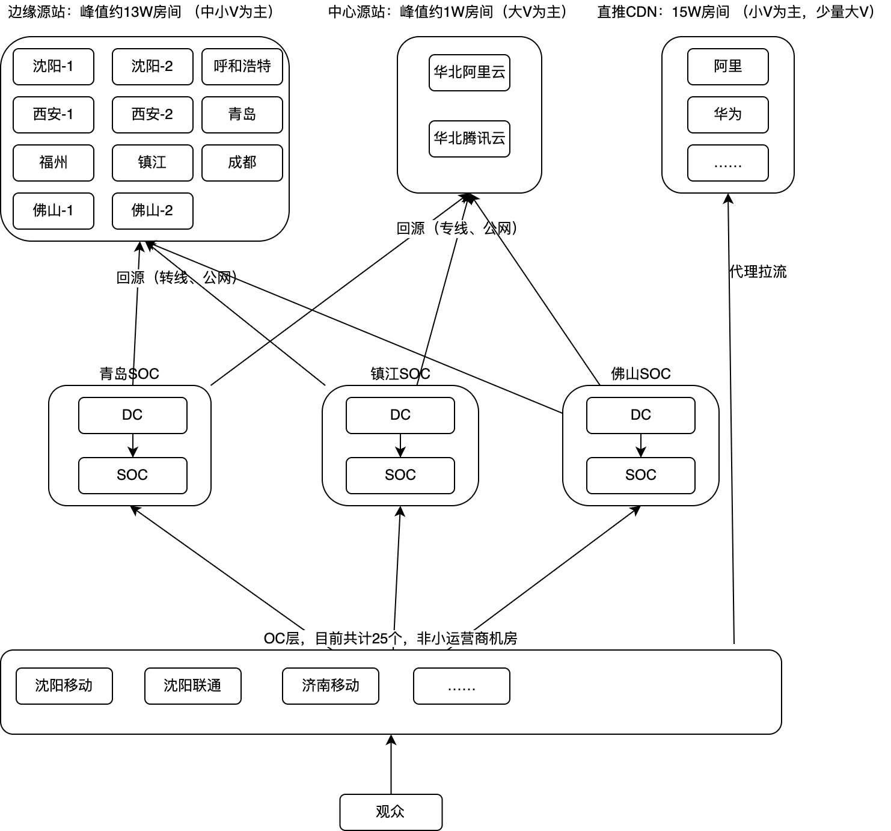

### **二、目前架构面临的主要问题**

#### **2.1 随着直播源站下沉边缘，直播二级源SOC数量与边缘源站数量倒挂**

​	从上图中可知，边缘源站已经有11个点，而SOC的接入点只有3个，而不是一个逐渐放大的树状结构，这样的架构，有两方面不足。

​	1 SOC回源带宽成本，比如OC和边缘源站更近，其实没有必要走SOC绕行。

​	2 回源质量，目前OC层回源采用了一致性hash的方式，可能出现两次跨区回源的情况。

​	例如 ： 东北的主播推流到东北边缘， 东北的观众观看，可能回走到佛山的SOC回源，佛山的SOC再回源到东北源站，

*（OC层采用一致性hash的方式回源，是为了减少SOC层到源站的回源数量）*

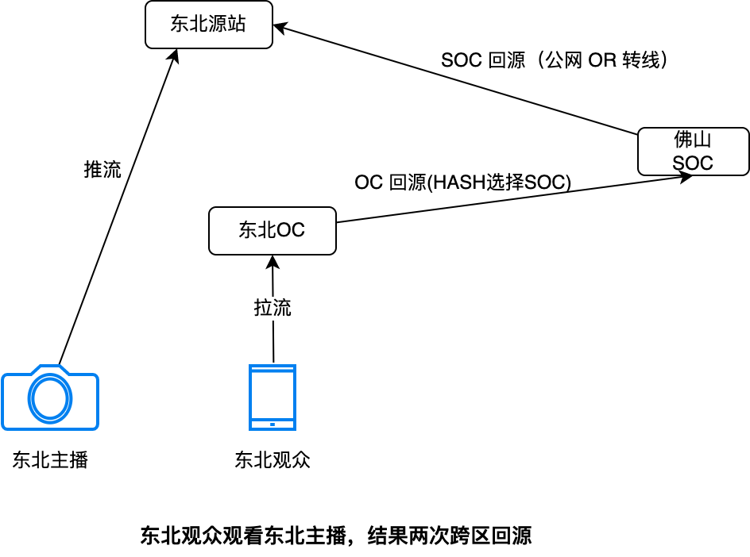

#### **2.2 冷流问题**

快手通过目前acu对主播的热度进行评估（acu指*平均同时在线观众数=拉流时长求和/主播推流时长，一般用近一周数据计算*），由于CDN的多层架构，冷流的主播会导致CDN的回源比例高，观众拉流命中率低，不仅没有起到放大作用，单个观众的拉流成本更高，下面是快手7月8号晚高峰时推流主播acu分布情况如下，可以看到，acu小于1的 占27%，acu小于10的主播占了80%+，acu 小于100的主播占比 95%+。

| 高峰期acu档位（7月8号） | 推源站 | 推CDN  | 总量   | 占比   |
| ----------------------- | ------ | ------ | ------ | ------ |
| 0～1                    | 23289  | 46374  | 69663  | 27.20% |
| 1～10                   | 59964  | 76289  | 136253 | 53.2%  |
| 10～100                 | 31081  | 8620   | 39701  | 15.5%  |
| 100～1w                 | 9320   | 966    | 10286  | 4.0%   |
| 1w~10w                  | 74     | 4      | 78     | 0.03%  |
| 10w+                    | 4      | 0      | 4      | --     |
| all                     | 123732 | 132253 | 255985 |        |

下图冷流和热流的对比图，可以看到冷流的单个观众平均带宽成本一般是热流的2～3倍

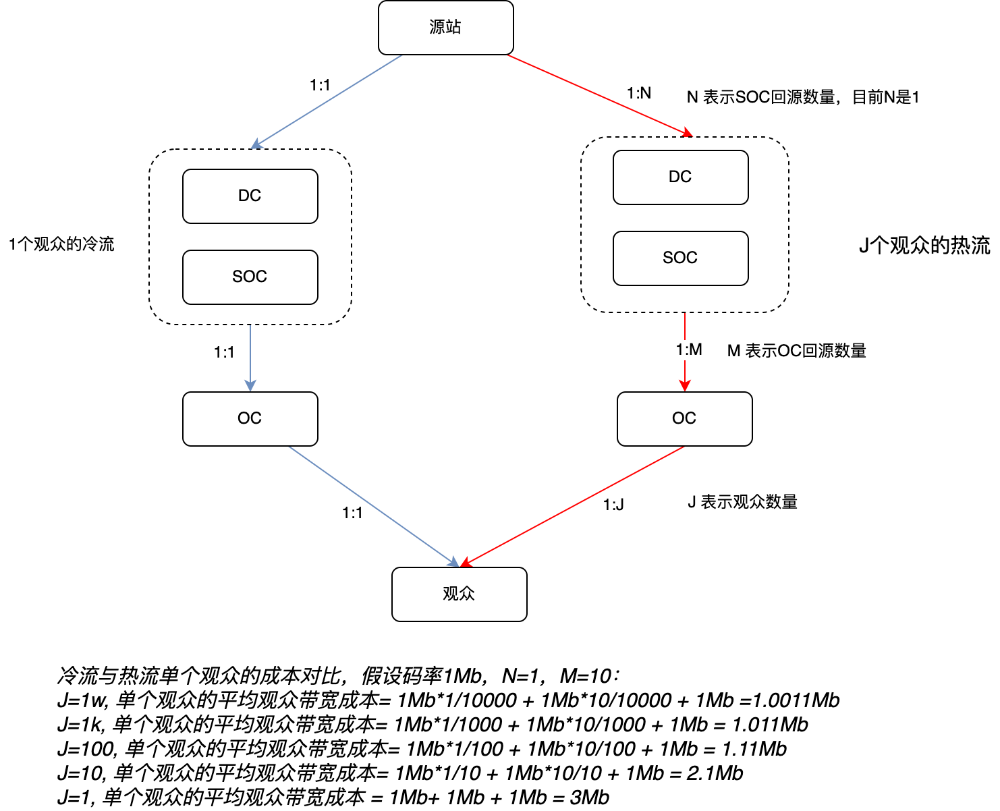

​	冷流的问题不仅仅是自建的问题，而是整个快手直播的问题。由于快手冷流推CDN的更多，p2p&pCDN等又基本都是针对热流的降本手段，导致走三方CDN的流更冷，我们的直播命中率在三方CDN那里比字节要低20%～30%。三方CDN也不再愿意接快手的量（目前金山、百度、网速、华为等承接的直播量很少，只有阿里一个量较大），CDN的冗余非常紧张，解决自建冷流的成本问题后，源站+自建可以承担更多快手冷流的量，也可以提高三方CDN的命中率。增加与三方CDN谈判的筹码。

### **三、直播CDN架构升级设计思路**

​	1  增加源站SOC，与边缘源站同机房部署，源站SOC默认情况下只负责本源站流的分发，走内网。

2  中心源站仍然保持走公共SOC回源的逻辑

​	3  冷流（acu < n，初步设定n=10，目前SOC层的放大比是10）尽量用SOC层覆盖，OC层只负责热流

​	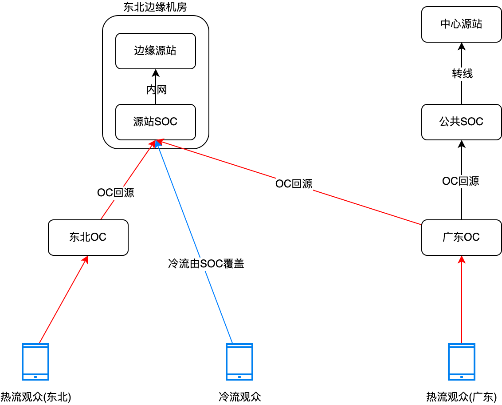

### **四、实现方案**

#### **4.1 源站SOC需要根据当前边缘源站峰值数量部署等量的SOC资源**

根据设计方案源站SOC回包含两部分带宽，1 冷流观众拉流带宽，2  热流OC回源带宽

2022.07.25 - 2022.08.07 峰值带宽最高的的是7.30最高，

**冷流观众总带宽 502Gb，其中 移动:221Gb，电信: 136Gb, 联通:119Gb，广电：21Gb，其他：4Gb**

由于目前OC回源带宽统计没有办法分源站处理，因此暂时按照 当前OC回源总带宽 * 源站的房间比例计算

7.30日 **OC 回源总计****：472Gb  移动:324,电信:75, 联通:76** 

最终总体物理机房带宽变化如下：

| **物理机房带宽变化估算（不考虑冗余）** |           |           |           |        |
| -------------------------------------- | --------- | --------- | --------- | ------ |
| **物理机房**                           | **移动**  | **电信**  | **联通**  |        |
| **沈阳**                               | **81.0**  | **17.5**  | **35.3**  | 133.8  |
| **呼和浩特**                           | **103.4** | **29.5**  | **40.0**  | 172.8  |
| **西安**                               | **70.5**  | **25.3**  | **14.4**  | 110.3  |
| **镇江**                               | **-48.8** | **-5.8**  | **-10.2** | -64.8  |
| **青岛**                               | **-90.9** | **-19.4** | **-17.8** | -128.1 |
| **福州**                               | **30.9**  | **10.4**  | **9.2**   | 50.5   |
| **佛山**                               | **-8.3**  | **2.2**   | **4.8**   | -1.3   |
| **成都**                               | **38.2**  | **13.4**  | **7.4**   | 59.1   |
| 总计：                                 | 175.9     | 73.2      | 83.1      | 332.2  |
|                                        |           |           |           |        |

机器资源：

| **机器资源估算****1 机器估算按照50%KLP + 50%HTTP，cpu 70%上限计算，40c 对应 13g****2 机器估算冗余按照20%计算 且 不考虑源站腾退机器****3 优先独占方式部署****4 下面计算机器数量，向上取整，分别计算了三种机型需要的机器数量，根据实际情况选择** |             |                         |                          |                         |
| ------------------------------------------------------------ | ----------- | ----------------------- | ------------------------ | ----------------------- |
| 需要扩容机器的机房                                           | SOC服务带宽 | 40c/10Gb机型（上限8Gb） | 64c/25Gb机型（上限20Gb） | 4C0C/25Gb机型(上限13Gb) |
| 沈阳                                                         | 165         | 25                      | 10                       | 16                      |
| 呼和浩特                                                     | 217         | 33                      | 14                       | 21                      |
| **西安**                                                     | 130         | 20                      | 8                        | 12                      |
| **福州**                                                     | 63          | 10                      | 4                        | 6                       |
| 成都                                                         | 72          | 11                      | 5                        | 7                       |
| 总计                                                         |             | 99                      | 41                       | 62                      |

**算明细：**

[自建CDN升级方案-冷流优化资源计算](https://docs.corp.kuaishou.com/s/home/fcAB8ofMmVAaCfwyB_K4W4m40)

[2022.07.24-2022.08.10 主播范围圈定与数据摸底](https://docs.corp.kuaishou.com/k/home/VRIi3x2zDCLc/fcADKG9BEYqn4DgQfI95EpEWC#section=h.lo735b2gcrww)

#### **4.2  OC回源边缘源站的流根据sidc选择SOC**

​	sidc参数是由直播server根据流所在源站位置，在生成观众的url中填写的参数，对与边缘源站是边缘源站的数字机房id，对中心源站则用alihb表示中心源站，txhb表示华北腾讯中心源站。如果sidc被篡改，或者bug导致sidc错误，则源站SOC可以自动转化为普通SOC回源

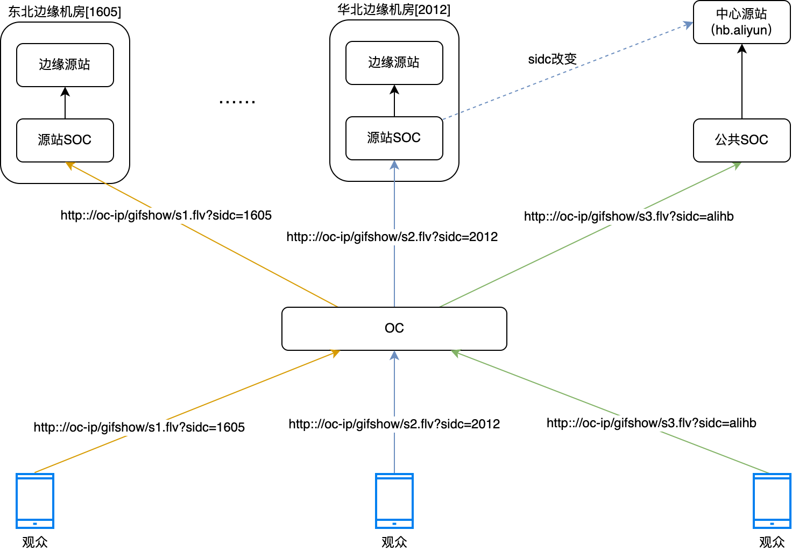

#### **4.3  自建调度支持SOC覆盖冷流**

​	目前自建对直播的调度都是对OC的调度。可以将现在的OC调度理解为热流调度规则，将SOC调度作为冷流调度规则

自建增加直播的冷流调度规则，冷流都首先由SOC覆盖。同时为避免冷流估计错误，调度同时也返回一个备用的OC-IP，已支持SOC的302降级。

​	1 自建增加冷流调度规则

​	2 直播server服务调用自建调度SDK时，携带acu(或其他标识冷流的信息）、以及sidc参数

​	3 自建调度对冷流同时使用冷流调度规则+热流调度规则， 返回一个soc-ip 和 一个 备用oc-ip

​		冷流规则：按照机房id和sidc匹配，流位置匹配； 中心源站的冷流使用公共SOC匹配。

​		热流规则：即现在的规则，观众就近匹配

​	4 直播server将备用oc-ip作为参数填写到下发给观众的url中

​	5 SOC 设置对观众单路冷流覆盖的设置并发上限，例如：acu*2，超过上限则302到备用oc-ip上 （SOC要能区分是观众拉流还是 OC拉流，只对观众拉流限制单路并发上限）

​	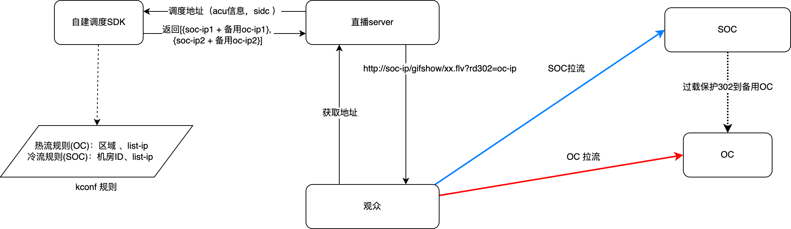

#### **4.4  SOC的自保护**

​		由于新的方案中一方面SOC要根据源站的量级进行预估，所有该源站的流都优先从这个SOC分发，而源站又常会有切量、跨区兜底等情况；另一方面，SOC又要覆盖冷流的观众，因此影响SOC请求量因素比较多，对SOC的容量预估比较困难。而目前的调度，并没有对SOC进行带宽管理。所以SOC要增加一套自保护机制，同时保障满载时的降级处理，如下图所示。

​	1 SOC 增加自身容量上限设置,支持自熔断。

​	2 SOC 对观众请求，总量到达容量上限 或 单路流到达上限(4.3中) ，则302到oc-ip

​	3 SOC 对OC请求，总量到达容量上限后 返回503

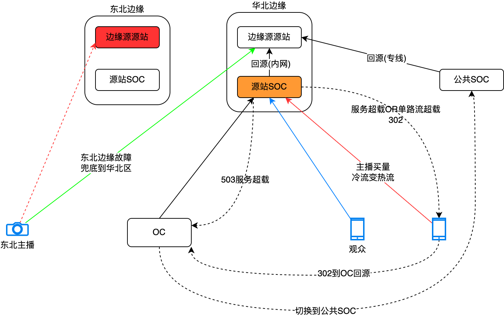	

### **五、其他问题**

#### **5.1 小运营商冷流观众怎么处理**

目前自建小运营商的覆盖方式，基本都是将北京鹏博士OC作为所有小运营商OC的回源点，其网络拓扑结构如下图所示，由于北京鹏博士无法直接覆盖广电观众，而源站目前没有小运营商的下行带宽，因此在我们完善小运营商的覆盖之前只能妥协处理。 

1 先只对三网冷流观众放量

2 然后，视资源和收益情况，决定是否用北京鹏博士覆盖全国冷流的鹏博士观众。

3 广电回源目前要么专线免费，要么走内网代理拉流，都没有费用，因此暂时不考虑改造。

[冷流小运营商接入架构图](https://docs.corp.kuaishou.com/d/home/fcAAalNk6gqRr4Pvq3JokBkL7)

​	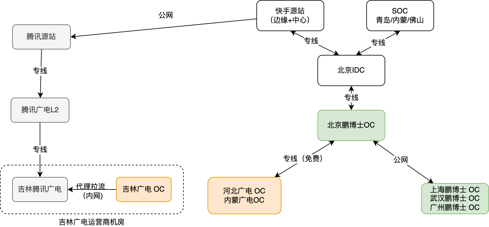

#### **5.2 冷流观众跨大区覆盖质量问题**

冷流观众的覆盖应该使用同区就近接入的方式，但是由于源站覆盖，流未知固定，同时SOC覆盖区域有限，因此不可避免的出现跨区拉流的情况。
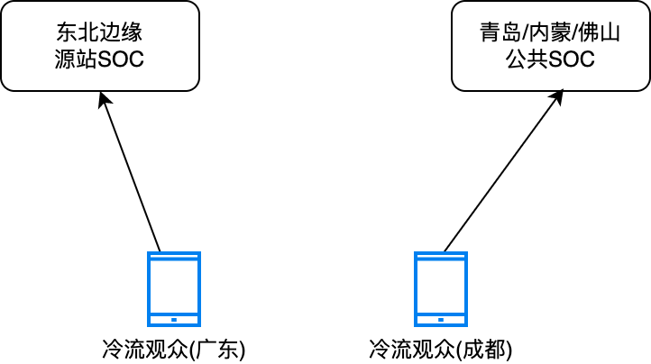

这种情况的比例入下表所示，根据以往边缘跨区推流，以及全国BGP直接推流到源站的经验，临近区域质量差异不大，且目前自建质量目前优与三方，SOC覆盖中间环节更少，预计卡顿、开播失败等指标持平。

|          |       | 2022.07.24 18:00～22:00观众分布 比例 |          |          |          |          |          |          |          |
| -------- | ----- | ------------------------------------ | -------- | -------- | -------- | -------- | -------- | -------- | -------- |
|          |       | **东北**                             | **华北** | **华东** | **华南** | **华中** | **西北** | **西南** | **总计** |
| 主播分布 | 东北  | 71.3%                                | 11.7%    | 8.7%     | 2.3%     | 3.0%     | 1.3%     | 1.7%     |          |
| 华北     | 9.9%  | 63.7%                                | 11.3%    | 3.3%     | 5.0%     | 3.5%     | 3.3%     |          |          |
| 华东     | 13.0% | 12.6%                                | 49.8%    | 6.1%     | 6.3%     | 3.9%     | 8.4%     |          |          |
| 华南     | 10.2% | 14.5%                                | 18.1%    | 34.7%    | 7.7%     | 3.3%     | 11.5%    |          |          |
| 华中     | 10.6% | 20.4%                                | 20.5%    | 9.1%     | 25.9%    | 3.3%     | 10.2%    |          |          |
| 西北     | 4.0%  | 6.0%                                 | 6.1%     | 2.4%     | 2.3%     | 77.1%    | 2.1%     |          |          |
| 西南     | 5.8%  | 10.6%                                | 13.8%    | 7.8%     | 4.0%     | 3.4%     | 54.7%    |          |          |

后期实验，若发现有部分区域覆盖质量确实不可接受，则可以根据实际情况考虑对跨区情况进行划分例如下图：

1  参考推流临近区兜底方式，临近区跨区直接覆盖，例如西北和西南直接覆盖

2 非临近区不能兜底，如东北和华南，不能直接覆盖，则使用Hash就近SOC覆盖

3 用一致性hash，是为了尽量减少跨区回源的情况，一次回源至少覆盖3个临近区

*也可以考虑通过接入质量地图来处理跨区情况*

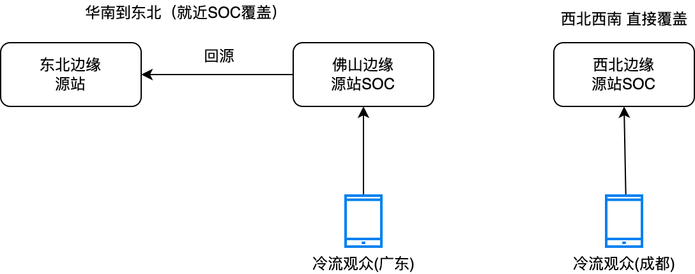

### **六、成本与收益数据核算**

#### **6.1 冷流的判断条件**

acu 在 [0~10] 且 粉丝数小于10W。 排除新生主播，

此条件下：7月-30日晚高峰(21:35)

冷流总房间数 21.5W, 推源站：8W, 推CDN13.5W

#### **6.2 ROI预估**

##### **6.2.1 成本收益：（**预计共节约187.5Gb源站回源带宽，同时约500Gb 由CDN带宽转为自建三线带宽**）**

上述冷流条件下，各段带宽成本如下图所示，改造后源站冷流有198Gb的cdn回源带宽收益，(小运营商大王卡等免流月占 27.95%)，实际收益约**142.5**

**(补充：免流卡去重房间占比27.95%，但观众实际带宽才14Gb，因此预计实际收益大于 142.5Gb)**

​		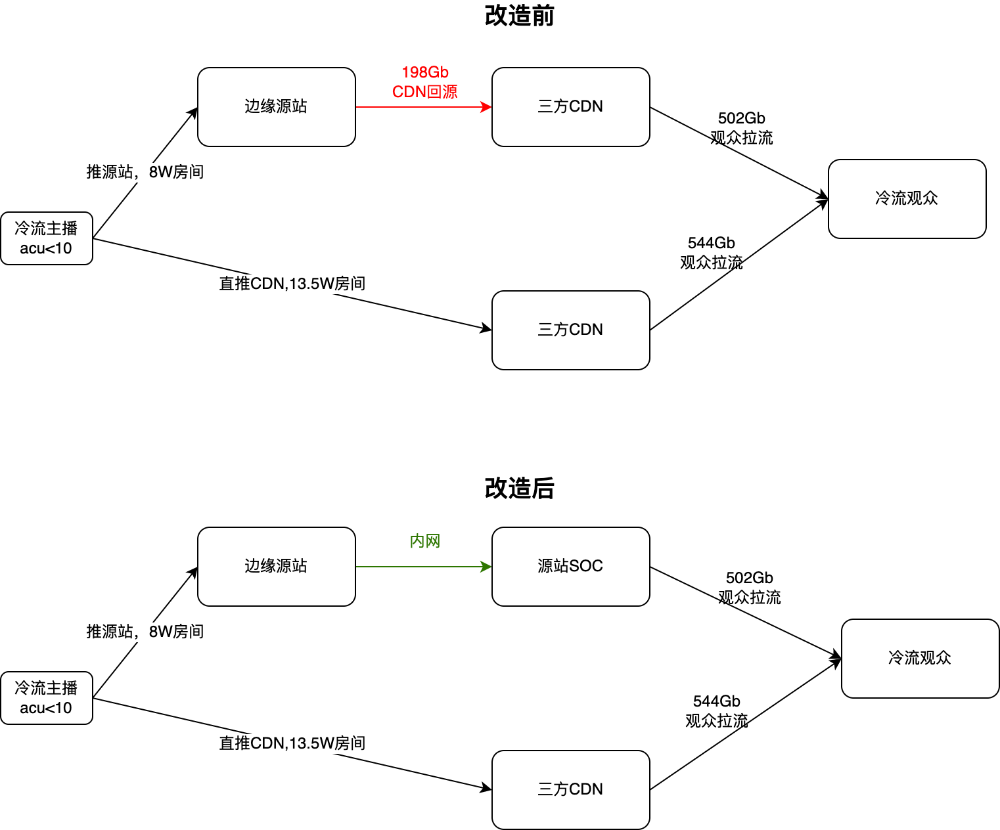   

自建回源源站带宽，增加源站SOC后的收益，45Gb 

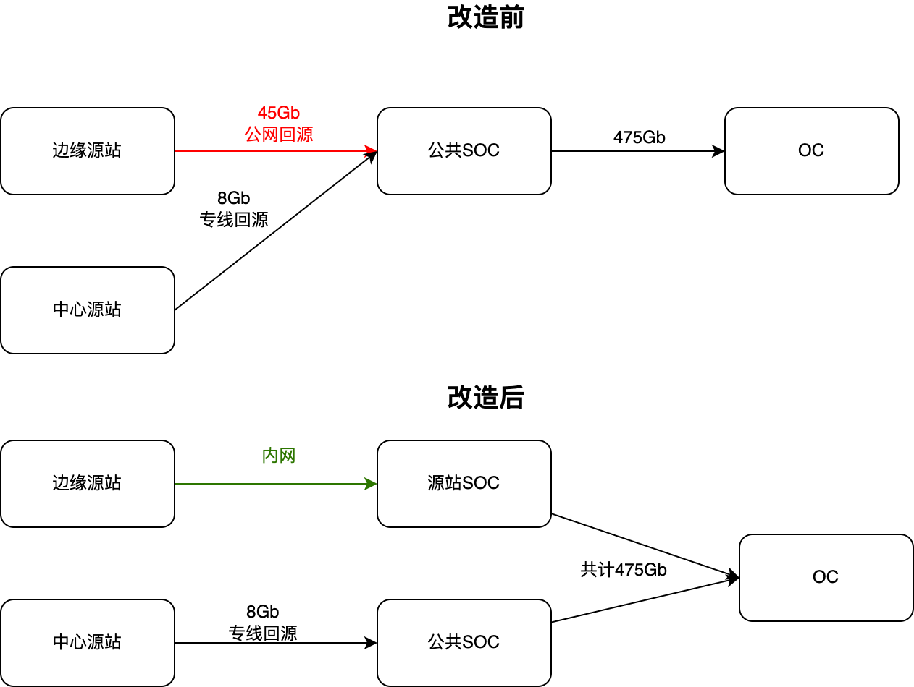

##### **6.2.3 质量损益** **（预计 首屏提升，卡顿持平，需实验验证）**

​	1 冷流直接SOC覆盖，观众首屏提升
​	2 OC回源回源质量预计有提升（大部观众为同区，不再有两次跨区回源）。

3 冷流观众SOC覆盖可能存在跨区覆盖问题，但自建质量优与三方，且中间环节少，预计基本持平。

##### **6.2.4 其他收益**

​	快手自建覆盖大量冷流，可以大幅提升三方CDN命中率，增加与三方的谈判筹码，三方增加给快手的冗余量，或者降价的可能。

| **domian**** ****冷流 acu 【0～10】**                        | **优化前**  | **冷流**    | **优化后**  | **优化前**  | **优化后**  | **预估命中率提升** |                  |        |        |
| ------------------------------------------------------------ | ----------- | ----------- | ----------- | ----------- | ----------- | ------------------ | ---------------- | ------ | ------ |
| **L1带宽G**                                                  | **L2带宽G** | **L1带宽G** | **L2带宽G** | **L1带宽G** | **L2带宽G** | **domain命中率**   | **domain命中率** |        |        |
| [ali-origin.pull.yximgs.com](http://ali-origin.pull.yximgs.com) | 1670        | 755         | 184         | 151         | 1486        | 604                | 54.79%           | 59.35% | 4.56%  |
| [ali-adaptive.pull.yximgs.com](http://ali-adaptive.pull.yximgs.com) | 832         | 461         | 120         | 86          | 712         | 375                | 44.59%           | 47.33% | 2.74%  |
| [ali.pull.yximgs.com](http://ali.pull.yximgs.com)            | 736         | 351         | 279         | 231         | 457         | 120                | 52.31%           | 73.74% | 21.43% |
| origin+adaptive                                              | 2502        | 1216        | 304         | 237         | 2198        | 979                | 51.40%           | 55.46% | 4.06%  |
| origin+adaptive+pull                                         | 3238        | 1567        | 583         | 468         | 2655        | 1099               | 51.61%           | 58.61% | 7.00%  |
| 单价(/M/月/元)                                               |             |             | 7           | 10          |             |                    |                  |        |        |
| 带宽 G->M                                                    |             |             | 1000        |             |             |                    |                  |        |        |
| **origin+adaptive业务**                                      |             |             |             |             |             |                    |                  |        |        |
| L1带宽减少(元)                                               |             |             | 2128000     |             |             |                    |                  |        |        |
| L2带宽减少                                                   |             |             |             | 2370000     |             |                    |                  |        |        |
| 预估L3带宽减少(假设是L2带宽的一半)                           |             |             |             | 1185000     |             |                    |                  |        |        |
| **预估收益**                                                 |             |             |             | **1427000** |             |                    |                  |        |        |
| **origin+adaptive+pull业务**                                 |             |             |             |             |             |                    |                  |        |        |
| L1带宽减少(元)                                               |             |             | 4081000     |             |             |                    |                  |        |        |
| L2带宽减少                                                   |             |             |             | 4680000     |             |                    |                  |        |        |
| 预估L3带宽减少(假设是L2带宽的一半)                           |             |             |             | 2340000     |             |                    |                  |        |        |
| **预估收益**                                                 |             |             |             | **2939000** |             |                    |                  |        |        |

| **domian****冷流 acu 【0～100】**                            | **优化前**  | **冷流**    | **优化后**  | **优化前**  | **优化后**  | **预估命中率提升** |                  |        |        |
| ------------------------------------------------------------ | ----------- | ----------- | ----------- | ----------- | ----------- | ------------------ | ---------------- | ------ | ------ |
| **L1带宽G**                                                  | **L2带宽G** | **L1带宽G** | **L2带宽G** | **L1带宽G** | **L2带宽G** | **domain命中率**   | **domain命中率** |        |        |
| [ali-origin.pull.yximgs.com](http://ali-origin.pull.yximgs.com) | 1670        | 755         | 528         | 322         | 1142        | 433                | 54.79%           | 62.08% | 7.29%  |
| [ali-adaptive.pull.yximgs.com](http://ali-adaptive.pull.yximgs.com) | 832         | 461         | 294         | 180         | 538         | 281                | 44.59%           | 47.77% | 3.18%  |
| [ali.pull.yximgs.com](http://ali.pull.yximgs.com)            | 736         | 351         | 409         | 279         | 327         | 72                 | 52.31%           | 77.98% | 25.67% |
| origin+adaptive                                              | 2502        | 1216        | 822         | 502         | 1680        | 714                | 51.40%           | 57.50% | 6.10%  |
| origin+adaptive+pull                                         | 3238        | 1567        | 1231        | 781         | 2007        | 786                | 51.61%           | 60.84% | 9.23%  |
| 单价(/M/月/元)                                               |             |             | 7           | 10          |             |                    |                  |        |        |
| 带宽 G->M                                                    |             |             | 1000        |             |             |                    |                  |        |        |
| **origin+adaptive业务**                                      |             |             |             |             |             |                    |                  |        |        |
| L1带宽减少(元)                                               |             |             | 5754000     |             |             |                    |                  |        |        |
| L2带宽减少                                                   |             |             |             | 5020000     |             |                    |                  |        |        |
| 预估L3带宽减少(假设是L2带宽的一半)                           |             |             |             | 2510000     |             |                    |                  |        |        |
| **预估收益**                                                 |             |             |             | **1776000** |             |                    |                  |        |        |
| **origin+adaptive+pull业务**                                 |             |             |             |             |             |                    |                  |        |        |
| L1带宽减少(元)                                               |             |             | 8617000     |             |             |                    |                  |        |        |
| L2带宽减少                                                   |             |             |             | 7810000     |             |                    |                  |        |        |
| 预估L3带宽减少(假设是L2带宽的一半)                           |             |             |             | 3905000     |             |                    |                  |        |        |
| **预估收益**                                                 |             |             |             | **3098000** |             |                    |                  |        |        |

*数据来源详情：*[2022.07.24-2022.08.10 主播范围圈定与数据摸底](https://docs.corp.kuaishou.com/k/home/VRIi3x2zDCLc/fcADKG9BEYqn4DgQfI95EpEWC#section=h.lo735b2gcrww)

### **七、开发人力投入与时间  (预计：约60人/天)**

1 跑数据ROI  7 人/天

​	1 冷流判定规则@张文亚 (done)

acu<10 & 粉丝数<10w

​	2 资源预估 @刘利川  （done）

​		[自建CDN升级方案-冷流优化资源计算](https://docs.corp.kuaishou.com/s/home/fcAB8ofMmVAaCfwyB_K4W4m40)

​		[音视频带宽&服务器扩容需求](https://docs.corp.kuaishou.com/s/home/fcADVSYnJ4fIKEFNRVOZnTMSe)

​	3 成本核算 @张杰@刘利川 @陈凯@程媛 (done)

​		回源带宽减少 240Gb，500Gb的三方带宽变成自建三线带宽。

2 媒体服务改造：[自建架构升级——cdn媒体服 务开发方案&细节](https://docs.corp.kuaishou.com/d/home/fcACVvHgSO8_jcLGdDqB0hoNh#section=h.iecgxjncarea)

- OC改造支持根据sidc拉流，降级公共SOC拉流 @陈凯 	预计工作量：5人/天
- SOC 支持自保护【配置容量，单机熔断，返回503 302】 @陈凯@刘利川 预计工作量：15人/天
- 自建边缘源站部署SOC @陈凯@刘利川  预计工作量：5人/天

​	

3 自建调度冷流规则配置  @周星航 预计工作量：1人/天 

- 配置规则支持优先对冷流的调度SOC，OC兜底。对热流只调度OC。
- 配置规则支持对某区域冷流观众不使用SOC覆盖 OR 使用本区SOC覆盖的开关。

4 自建调度SDK&直播server 接口升级，返回 SOC-ip + OC-ip，

- 直播server  @赵飞翔  预计工作量：5人/天
- 自建调度SDK @周星航 预计工作量：4人/天
  - 新建接口返回结构体（SOC+OC），
  - 入参添加枚举参数表示冷热流。

5  AB实验 @刘利川 预计工作量：15 人/天

### **八、现有服务资源情况与影响**

​	源站总公网专内网带宽 198+45 = 243Gb

​	**1  西安【6442 + 206077】**，18台机器 64c/10G，冷流占比：9.97%，公网转内网总带宽：24.2Gb

​		西安源站服务现状：公网入：36Gb，公网出：57Gb， 内网入：17Gb， 内网出：33Gb

​		改造完推流录制后预计： 公网入36Gb，公网出：57Gb，  内网入：17Gb， 内网出69Gb

​		增加源站SOC后预计：  公网入36Gb， 公网出57-24.2 = 32.8Gb， 内网入：17Gb， 内网出 69+24.2 = 93.2Gb

​		最高的是内网出 按照每台机器8Gb计算，10%的冗余，至少需要 93.2/8*1.1 = 13台，共计13台。

​		需求20台，目前机器可以节省5台，

 现有可用5台，缺口15台

​	**2  沈阳 【1605、201230】**20台机器 64c/10G，冷流占比：17.55%， 公网转内网总带宽  42.7Gb

​		沈阳源站服务现状：，公网入：62Gb， 公网出：89Gb， 内网入：37Gb， 内网出：111Gb

​		增加源站SOC后，预计：公网入：62Gb， 公网出：89-42.7 = 46.3Gb， 内网入：37Gb， 内网出：111+42.7 = 153.7

​		  源站服务需要 153.7/8*1.1 = 22台，缺少2台

​		源站SOC需求25台，共计27台

​		

​	**3** **呼和浩特【2012】**21台机器64c/10G，冷流占比：22.30%， 公网转内网总带宽54.2Gb

​		呼和浩特源站服务现状：公网入：78Gb， 公网出：144Gb， 内网入：44Gb， 内网出：78Gb

​		改造完推流录制后预计：  公网入：78Gb， 公网出：144Gb， 内网入：44Gb， 内网出：156Gb

​		增加源站SOC后预计：  公网入：78Gb， 公网出：144-54.2=89.8Gb， 内网入：44Gb， 内网出：156+54.2 = 210.2Gb

​		  源站服务需要，210.2/8*1.1 = 29台，现有21台，缺少8台。

​		源站SOC需求33台，源站服务缺8台， 共计 41台

​	

​	**4** **福州 【5907】，**10台 64c/10Gb机器， 冷流占比6.40%， 公网转内网带宽 15.6Gb

​	  福州源站服务现状：公网入：33Gb， 公网出：38Gb， 内网入：17Gb， 内网出：60Gb

​	  增加源站SOC后预计：公网入：33Gb， 公网出：38-15.6=22.4Gb， 内网入：17Gb， 内网出： 60+15.6=75.6Gb

​	  源站服务需要 75.6/8*1.1 = 11台， 缺少1台

​	  源站SOC需要10， 共计11台

​	**5** **成都【207615】**，7台64c/10Gb机器， 冷流占比8.16%， 公网转内网带宽 19.9Gb

​	   成都源站服务现状：公网入：30Gb， 公网出：44Gb， 内网入：17Gb， 内网出：56Gb

​	   增加源站SOC后预计：公网入：30Gb， 公网出：44-19.9=24.1Gb， 内网入：17Gb， 内网出：56+19.9 = 75.9Gb

​	  源站服务需要 75.9/8*1.1 = 11台， 缺少4台

​	  源站SOC需要11台，共计 15台

​    

​	**6  镇江【5242】**，11台64c/10Gb机器， 冷流占比8.30%， 公网转内网带宽 20.2Gb

​	 镇江源站服务现状：公网入：37Gb， 公网出：47Gb， 内网入：20Gb， 内网出：69Gb

​	 增加源站SOC后预计：公网入：37Gb， 公网出：47-20.2=26.8Gb， 内网入：20Gb， 内网出：69+20.2=89.2Gb

​	源站服务需要 89.2/8*1.1 = 13台， 缺少2台

​	当前湛江SOC情况 32台， 

​	

​	**7** **青岛【205492】，**11台64c/10Gb机器，  冷流占比11.27%， 公网转内网带宽 27.4Gb

​	 青岛源站服务现状：公网入：41Gb， 公网出：58Gb， 内网入：23Gb， 内网出：76Gb

​	 增加源站SOC后预计：公网入：41Gb， 公网出：58-27.4=30.6Gb， 内网入：23Gb， 内网出：76+27.4=103.4Gb

​	源站服务需要 103.4/8*1.1 = 15台， 缺少4台

​	当前青岛SOC情况 46台

​	

​	**8** **佛山【4001，204180】，**13台64c/10Gb机器，  冷流占比10.76%， 公网转内网带宽 26.2Gb

​	 佛山源站服务现状：公网入：50Gb， 公网出：70Gb， 内网入：28Gb， 内网出：94Gb

​	 增加源站SOC后预计：公网入：50Gb， 公网出：70-26.2=43.8Gb， 内网入：28Gb， 内网出：94+26.2=120.2Gb

### 	源站服务需要 120.2/8*1.1 = 17台， 缺少4台

​	当前佛山SOC情况 27台

​	根据资源情况，建议

​	1 优先搞西安边缘源站、分担OC回源，不接冷流

​	2 改造佛山、青岛、镇江 源站SOC，优先承担各自源站的量，然后作为公共SOC提供服务。 接入少量冷流

​	3 部署其他源站的SOC，全面承接冷流

## **阿里云的冷流中心优化方案**

### **一、背景**

在我们筹划基于自建的冷流优化方式时，发现了阿里针对快手冷流提出了基于其冷流中心优化方式，原始方案如下图所示

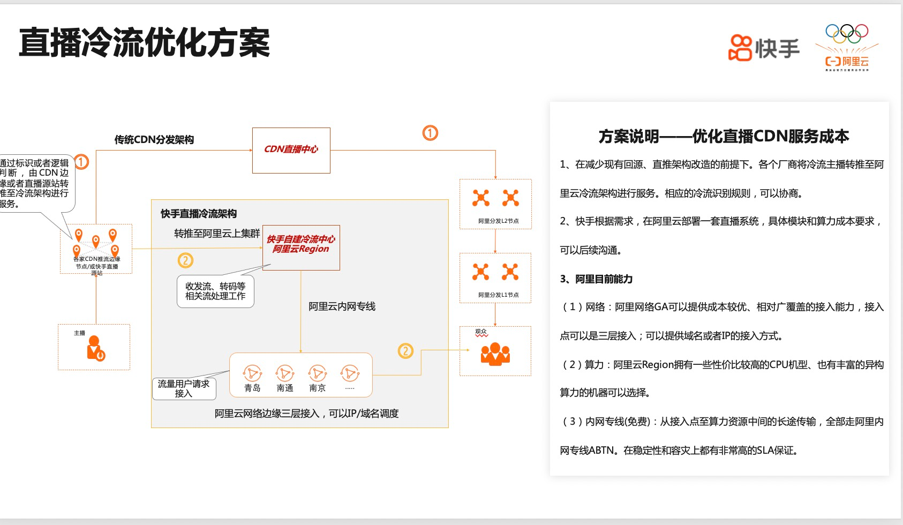

首先阿里云的冷流中心（图中阿里云Region）和现在的阿里云源站是相同的。北京和广州的Region和快手的IDC机房有免费的专线。区别在于上下行通过阿里云的网络三层的POP点接入，目前国内有4个POP点，9月份预计扩容10个pop点，未来预计能覆盖全国各大区。Region和Pop点之间通信走阿里的ABTN（免费专线，SLA 99.95%）， 观众通过POP点接入，四层网络直接链接Region的服务，并通过DNS调度不同区域的观众到就近的接入点。

冷流优化一阶段主要针对 acu【0-10】的主播，自建的冷流优化前期也只针对推源站的8W路主播，推CDN13.5W的冷流的主播优化投入周期比较长，因此可以考虑将对推CDN的13.5W路主播用阿里冷流中心的方式覆盖，两个方案可以同时搞，一方面可以进行故障切换和兜底保障，另一方面保持和发展自建的方案，避免对阿里的过度依赖。

### **二、方案设计**

​	[阿里冷流资源部署实现方案](https://docs.corp.kuaishou.com/d/home/fcAA60HFVotJqrP1pIbQBcYOw)

​	

方案1: KTP上行、自建SOC下行（KLP+http）； 上行调度走kes的区域调度， 下行调度走自建的冷流调度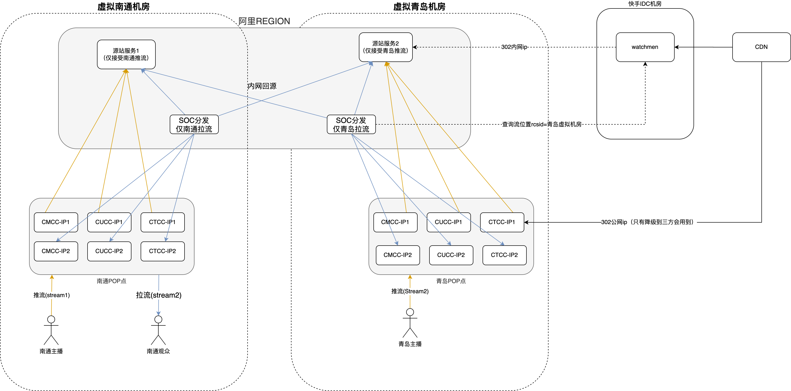

​	

### **三、收益&成本&质量**

​	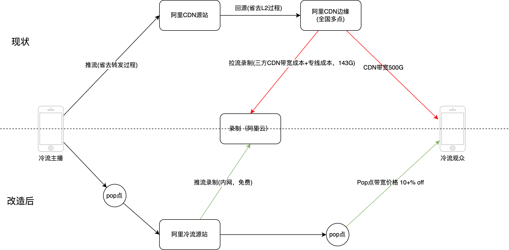

#### 	**1 收益**

- 阿里云的pop点带宽价格总体比CDN的价格便宜10+%左右，目前acu(0~10)的这部分带宽大概544Gb左右，
- 主播在阿里云，那么少了拉流录制的带宽成本（1 是三方CDN的下行带宽，二是边缘到IDC的转线带宽，推到CDN的流都要从CDN拉回来进行录制，acu 0～10 总计 143Gb）
- 总计收益：改造前成本（544+143)*三方CDN单价+143*专线单价 - 544*三方CDN单价*0.9， 三方单价月8k/Gb/月，专线单价约3k/Gb/月

(544+143)*0.8+143*0.3 - 544*0.8*0.9= 200.82W//月

#### **2 成本**

- 全量13.5W 的直推冷流主播，500Gb的带宽，预计需要200台 32c/10Gb的机器，其中80台router，90台srs，10台redis，20台冗余，预计单机1000元/月，
- 总计成本：20W/月

#### 	**3 质量预测**

​		传统CDN的优势在与全国布点，点更多；而冷流源站的方案优势在于环节少，没有中间L2、L3 第次回源的过程。

对于冷流来说大部分情况是需要触发回源的，因此预计冷流方案在延迟、首屏、开播失败等方面有优势，由于冷流源站和POP点之间是专线通信，连路质量有保障，但是POP点到观众的最后一步跨度较大，因此整体卡顿情况预计是持平的状态

另外具阿里同学介绍，下行质量回比传统CDN的要好，但没有没有明确的对比数据。

总体收益： 182.82W/月

### **四、实现方案**

#### 	**1 实现方式**

​		上行：

​		用watchmen调度，使用KTP推流，相当于增加了一个边缘源站。【调度怎么处理？ 不同机器绑定不同区域的pop点，然后机器本身上报了区域，由watchmen 选择？，还是 kes distach 调度？】

​		下行：

​		这个冷流源站的流都直接由冷流源站直接分发。 （类似测试源站的情况）

​		下行通过域名调度，域名在不同的区域绑定不同的ip。  域名故障点剔除的延迟问题？

​		下行纳入自检的调度系统，仍然返回ip，故障剔除依赖自检的探测。 

​		

#### 	**2 故障降级方案**

​		1 单POP点故障，改DNS解析？ OR 自检探测 剔除ip？ 

​		2 阿里冷流源站故障， 降级到推流到三方CDN + 自检冷流兜底方式， 兜底冗余太多或不足。 考虑多个region冷流源站。

3 直接推CDN 需要转码的很少（主要fallback + 265）。  阿里cdn的免费转码 转移给 冷流源站。 @程媛

​			1 现在免费转码资源量

​			2 阿里能给冷流源站多少免费转码。 	

#### 	**3 冷流突发变热的降级方案**

​		方式1 ： 直播server直接监控并发人数，或者下发频率， 超过的直接返回 CDN的回源域名， 相当于降级到中心源站回源方式

​		方式2 ： 直播server给的地址中携带302的CDN公网域名，源站SRS监控并发房间数超过的302到CDN回源方式。（是否断开已有链接看情况），如果是302，那302 后是否要通知直播server？

​		两种方式都需要降级到 中心源站回源方式，即BGP的出口带宽，如果大量降级价格回比较贵，可以和阿里云洽谈，回源免流或者和阿里CDN搭建专线等。@程媛

​		降级到三方CDN分发的流，三方CDN可以通过BGP或者POP点接入。 源站搞两个备用地址，一个POP点，一个BGP。

​		POP点内网地址，怎么降级，直播server 分发三方CDN地址来302 ，还是通过自检调度302

​		

​		

#### 	**4 小运营商、免流卡怎么搞**

​		pop点代理拉流？是否会增加成本。 rwk ，pop 点移动ip报备。

### **五、开发人力投入**

​	

​	1 资源筹备&服务部署  2周？

​	2 直播server改动

​	3 AB实验

## **整体冷流优化AB实验方案**	

### **一、自建冷流优化vs推源站冷流**

​		由于自建冷流的资源受限制，实验阶段不是所有源站都能完成部署，因此尽量选用一个区域的acu 0-10的主播进行实验。

​	例如 先部署好西安源站，则西安源站所有acu 0～10的主播放入实验， 实验分 4组

1. base1、base2，推西安边缘，CDN分发
2. exp1、exp2， 推西安边缘，走自建SOC分发

​	除整体qos/qoe质量外，重点关注以下几项：

​	1 跨区观众与非跨观众的对比

​	2 出现超载的情况概率，即实验组中真正走SOC分发的比例，并找到合理的单路流阈值

​	

​	目标：QOS 首屏正向、开播失败、卡顿率正向或持平。

​	[**自建冷流实验**](https://docs.corp.kuaishou.com/d/home/fcAA73srGVJhjdhmFlIiQlXAq)

### **二、阿里冷流优化vs直推CDN** 

​		由于阿里冷流推流侧初期暂时不能进行KTP推流，因此初步确定暂时和直推CDN对比，在直推CDN的主播当中选取20%+的 acu 0-10的主播进行实验，实验分四组

1. base1、base2 直接推三方CDN，CDN分发
2. exp1、exp2 推冷流源站域名，冷流源站Pop点分发

​	

​	出整体qos/qoe质量外，重点关注以下几项

​	1 主播上行质量的单独对比

​	2 观众下行质量的单独对比

​	3 分大区的观众下行质量对比，【有pop点的区域、没有pop点的区域】

​	4 是否有域名解析问题、pop点不对的情况。

​	目标：观众侧QOS 首屏正向、开播失败、卡顿率正向或持平。

[**阿里POP冷流实验**](https://docs.corp.kuaishou.com/k/home/VFAsDYoUPbi8/fcABj526wuLMWNB2Lvw1X6CTZ)

## **两种冷流优化方案对比**

先看一下两种方案的部署架构图：

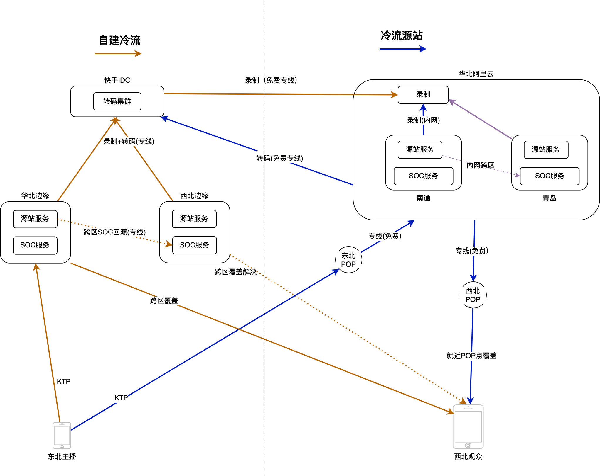

**自建冷流：**

1 上行KTP协议，就近接入

2 放大使用SOC服务，有一定的并发支持能力

3 一阶段需要跨区覆盖，后期可以通过大区间专线，或者绕行中心的专线覆盖。

4 录制+转码都要走边缘到IDC的专线，有专线成本

**冷流源站冷流**

1 上行KTP接入，就近POP接入

2 没有放大，全部有源站服务扛并发

3 早期POP点较少，后期POP点多了可以更好的覆盖，ABTN 专线接入

4 专线免费，录制目前基本都在阿里云是内网，而阿里云和IDC之间的专线目前也是免费的。

**对比：**

自建冷流优势： KTP上行、有一定并发

冷流源站优势：专线免费、跨区覆盖简单

结合上面的方案，若两个AB实验都符合预期的话，那么未来在自建资源充足的情况下，可以考虑将acu分三档，并做如下分配

冷流(acu 0~10，主播数占比80%)：走冷流源站；

- 基本不需要并发，即使跨区覆盖带宽也不大。
- 80%主播数占比，可以省去8成的录制+转码专线成本 和 8成的回源成本

温流(acu 10~100，主播数占比15%): 走自建冷流源站

- 若用OC覆盖，OC数量本身就比较多，分到每个OC后大多就是冷流，通过SOC覆盖，使SOC上温流命中率和OC的热流差不多。
- 若用冷流源站覆盖，冷流源站的并发集中到一点，单点的波动比较大不好控制
- 15%的主播占比，节省15%的回源成本

热流(acu>100): 自建CDN+三方CDN分发

- 使用多层分发，保证比较高的命中率。但是源站的回源带宽等只有5%

通过精细的区分对待，使得成本&质量达到最佳的平衡。

## **方案落地**

一、成本收益

​	整体收益情况，详情参考	[冷流项目收益计算](https://docs.corp.kuaishou.com/k/home/VFoXtC3j3r0s/fcAATqmrdEqPbU4nvSd9-ZMSy)

​	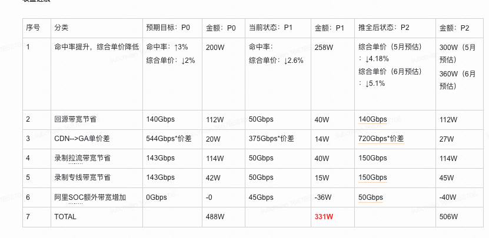

二、质量情况

​	AB试验的结果：详情参考[**自建冷流实验**](https://docs.corp.kuaishou.com/d/home/fcAA73srGVJhjdhmFlIiQlXAq)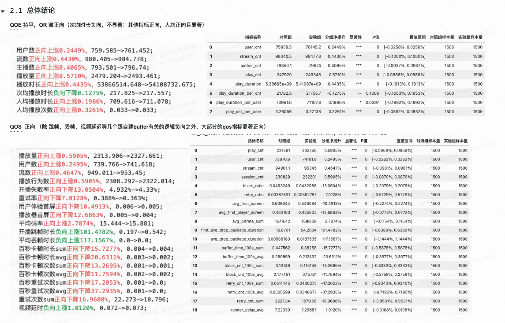

内网&专线带宽优化[边缘源站服务内网出带宽优化 （专线优化）](https://docs.corp.kuaishou.com/d/home/fcABsq37uNykTGB867zkC7fIn)

[自建冷流实验](https://docs.corp.kuaishou.com/d/home/fcAA73srGVJhjdhmFlIiQlXAq)

[20221116 阿里冷流源站测试报告](https://docs.corp.kuaishou.com/d/home/fcAA2GIVSK_TC4Lr2lV-FdhlF)

[阿里全国pop拨测数据](https://docs.corp.kuaishou.com/s/home/fcAAK6vVk2dYRvsbp8sosccHv#section=2062158190)