**自建调度统一流模型**

# **一、背景**

快手目前对于自建机房的调度，针对不同业务类型，有“直播”、“静态DNS、“点播” 三个调度中控，共同调度机房流量。 相互之间存在策略打架、成本优化困难等问题。

同时，静态业务接入较为繁重，静态放量流程较为复杂，我们希望优化整体链路，做到静态业务快速接入。

需求：

- 点播、静态的混跑事项，给自建补量
- 静态的快速接入事项

最终目标：直播、静态、点播 合并成一套，降低维护人力。

# **二、理想架构**

我们基于当前的业务场景，寄希望将“调度能力”抽象成一套统一的算法模型。以此算法模型为基石，建立一套完整的、真正意义上的调度中控。来保障在复杂场景中，调度可以做到最优解，满足业务需求的同时，拿到最大的成本收益。

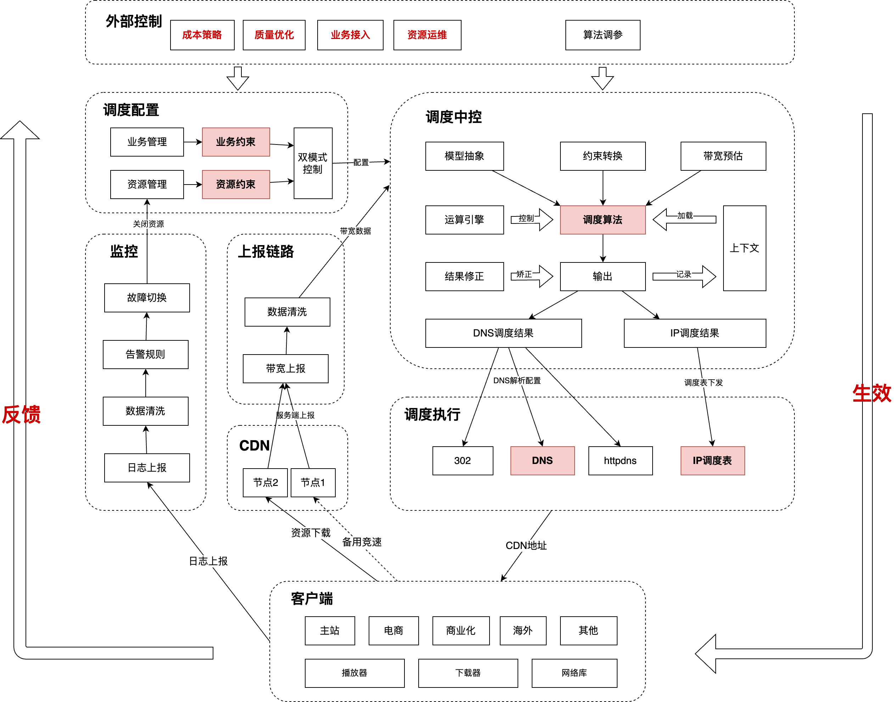

运算过程：

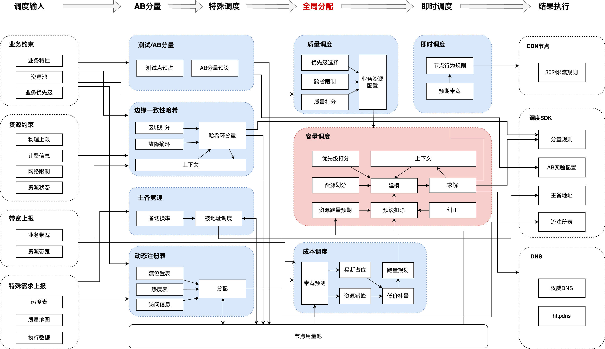

“统一算法模型” 作为我们调度中控的内核，负责整体管理调配自建资源。

- 控制输入：业务(直播、静态、点播)只需要提供相关维度下的带宽值作为输入
- 输出结果：机房、OC、调度单元的分量带宽和比例。最终转换成各自业务的最终结果。

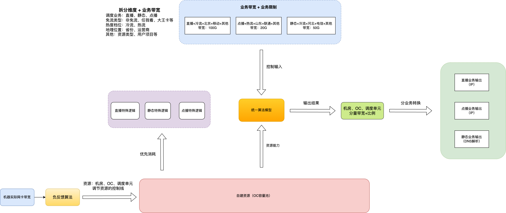

业务带宽可能来自于“调度打点数”和“平均文件大小”的乘积，可能不准确。于是：

- 我们使用实际的 “机器网卡带宽”、“机房交换机带宽”等，通过负反馈算法来调整资源真实的可用带宽。

在进行“统一算法模型”之前，我们需要优先处理一些特殊逻辑，以满足业务需求。比如：

- 直播的极冷流优先分配到三线机房，节约成本。

# **三、统一算法模型**

罗列一下对于自建机房，我们需要遵守的条件：

- 机房出口的带宽控制线
- OC的带宽控制线
- 调度单元出口的带宽控制线、调度单元的带宽控制线

对于阿里反向带宽机房，还需要参考：

- 上车点域名的带宽控制线（可作为OC的带宽控制线）

我们使用流模型算法作为我们计算的手段。

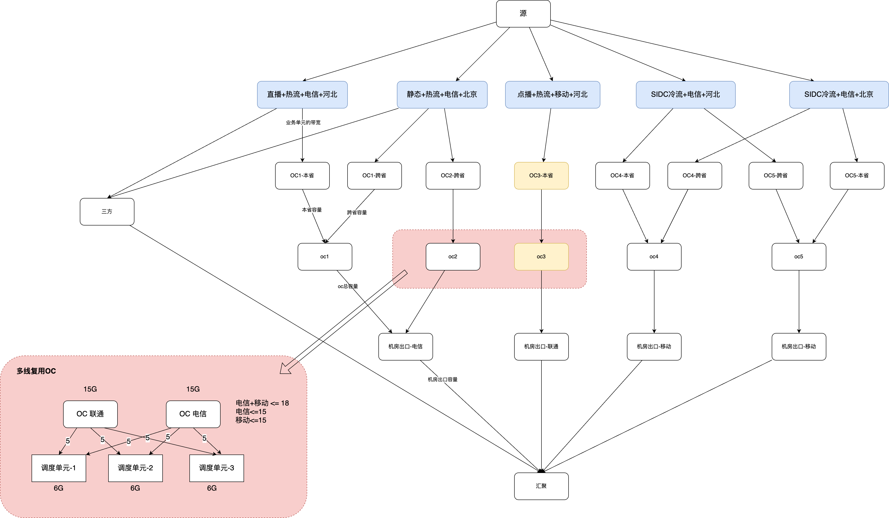

大多数场景下，OC 与 OC 之间不会混用调度单元。

## **1. 机器混用的OC**

主要是处理多线复用OC。这些OC下挂的调度单元可能是相同的。比如：三线机房、阿里反向的OC。

对于这种场景会产生如下这种问题，我们抽象化解释下：

对于阿里智能带宽机房的场景，调度单元在多个OC上存在。不同的上车点OC 下挂的 调度单元 是相同的。导致的问题是：

- 此时 调度单元 应该以什么比例去服务 OC1 和 OC2 呢？
- 原始的流模型只有承接完一个OC的量之后，才会承载第二个OC的量。将会导致OC资源上量出现问题？

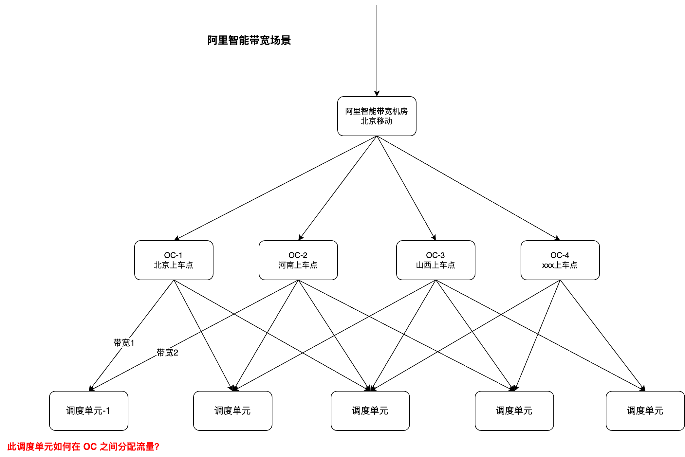

对于三线机房场景，也存在调度单元在多个OC中存在的场景。同时我们需要保证多个条件：

- 不仅要满足机房整体不能超过一定带宽上限。还要满足机房的某个出口不能超过一定带宽上限。
- 此时 调度单元 应该以什么比例去服务 OC-移动、OC-联通、OC-电信呢？

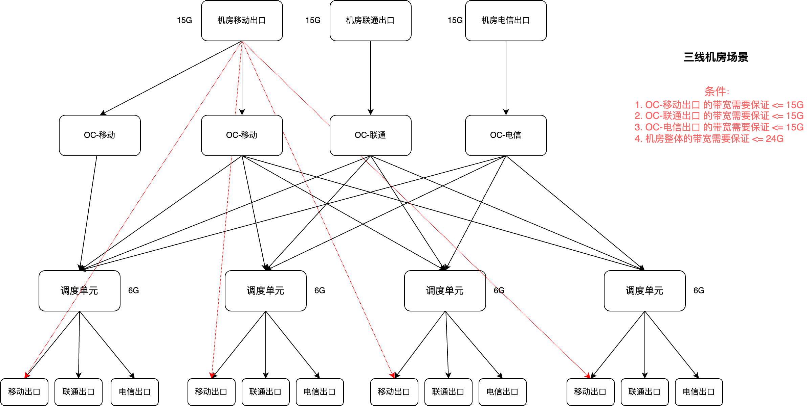

这里的核心问题是：**如果有多个限制条件，应该如何分配权重比例？以满足最优结果。**

这里的解法是：**在运行过程中，跑多次流模型算法，先使用其中一种条件，得到带宽和比例之后，再使用其他条件继续求解。最终得到满足所有条件的带宽&比例。**

## **2. 均衡算法**

在费用流模型中，流模型算法只保证从 源点 到 汇点 的容量能够以“最低的价格”分完。当出现多条可选“最低价格”路径时，流模型只能一条路径。

在实际实现中，如下图。当有两条边的价格一样时，就可能出现：

- 业务带宽 小于 自建容量时，只有一个 OC 承接了流量，另一个 OC 没有承接流量。
- 业务带宽 大于 自建容量时，一个 OC 满载，另一个 OC 低负荷运行。

因此，我们需要一种“均衡算法”，即能够以更合理的方式均衡分配流量。

- 当低峰时间段，业务带宽较低，自建资源充足的情况下。让OC间的流量更加均衡。
- 阿里智能带宽机房，多个上车点OC，挂的机器都是一样的。这种场景我们也需要根据上车点的能力，让OC间的流量更加均衡。

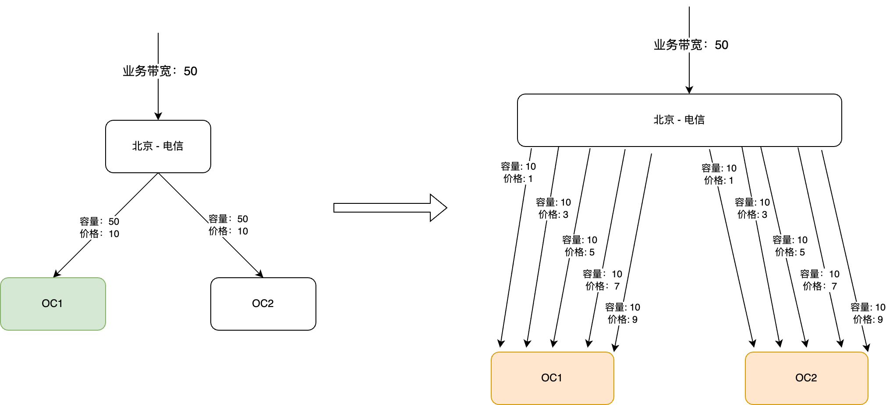

核心的思想是：在流模型中，将一条 OC容量边 拆分成多条OC容量边，并设置不同的价格。

这样 OC 间的流量将趋于均衡，理论上分的容量边越多，OC间的跑量越均衡。

## **3. 防抖动算法**

对每条热流相关的边增加防抖边。避免策略频繁变化。

防抖算法的核心实质上是：保存上一次调度求解结果，通过设置合理的 delta，调大上一次求解结果的权重。融合当前和上一次的求解结果。从而使最终的求解结果更加平滑。

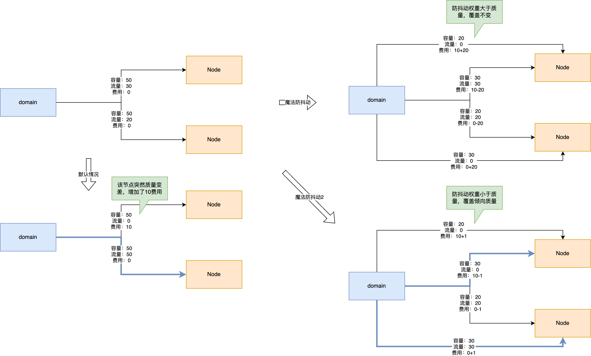

## **4. 调度单元的均衡跑量**

上述的特殊场景中，已经对 OC 下混用调度单元的场景进行了处理。

那么对于一般场景，OC下的调度单元不混用时，可能会出现：同一个OC下调度单元跑量不均。

在流模型中，我们使用**“OC可用带宽”作为容量，这个值应该和 "调度单元的能力" 取小。**

OC可用容量 = min(OC可用容量，调度单元可用容量加和)

调度单元的能力 = 经过负反馈调整后的上限

得到如上数据之后，我们在流模块之外，使用 **调度单元的能力 作为权重**，分配 OC的可用带宽 到不同的调度单元。

即可解决当出现调度单元跑量不均场景下，单个调度单元的压制问题。

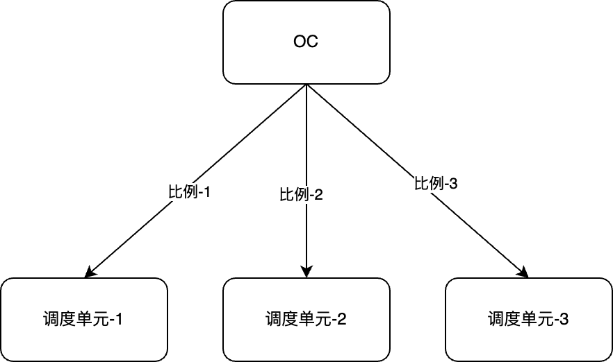

## **5. 算法产出**

我们的产出结果中，将有两层输出。

第一层是 OC 层，将产出某个线路下，某个OC可以使用的带宽和比例。

第二层是调度单元层，将产出某个 OC 下调度单元可用的带宽和比例。

然后不同的业务（直播、静态、点播），通过这些输出，产出对应的调度表。

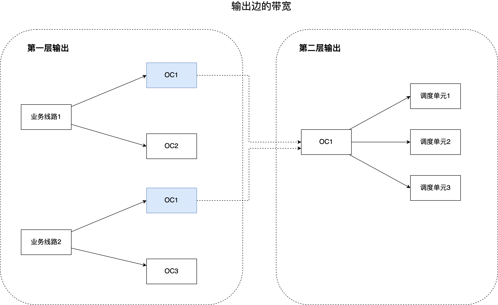

### **a. 点直播业务**

对于点播业务，调度表中的内容主要为：某个业务场景的流量往那些OC/调度单元 分量。

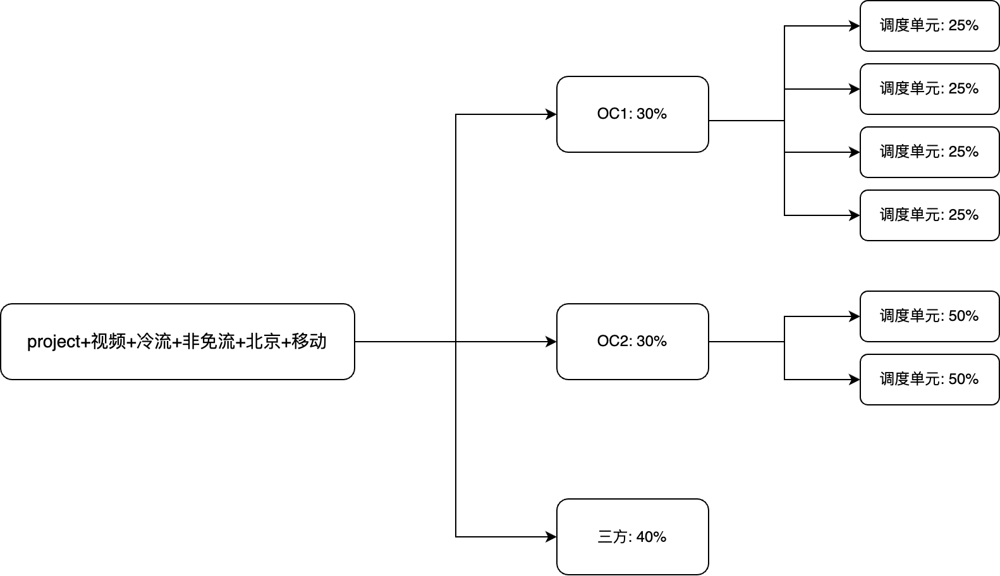

### **b. 静态业务**

对于静态业务，拿到OC、调度单元的带宽&比例之后。我们可以更新“域名配置”中业务域名的比例值，以打到调量的目的。

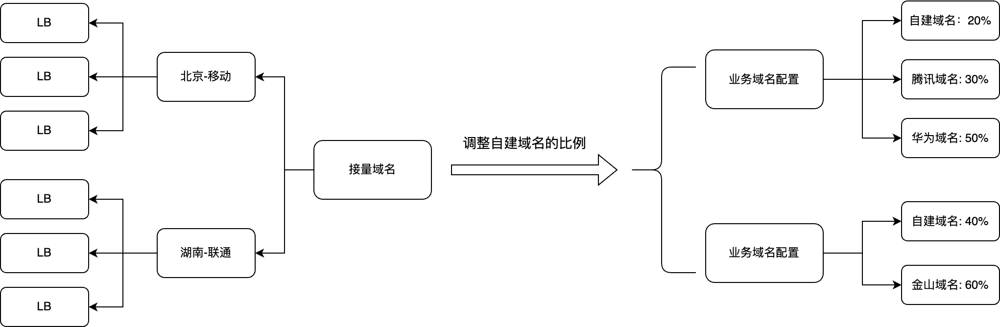

# **四、静态业务快速接入**

我们在当前静态DNS调度系统，在业务接入上分为三层：业务域名 -> 接入域名 -> 接量域名。

- 业务域名：目前存在于业务的三方调度配置中，用于和三方域名抢静态的量
- 接入域名：当初的设计方案为标准的DNS调度模式。是为了服务 ToB业务而做的划分。
  - 举例：ToB公司接入，比如 zhihu.com，我们无法更改 [zhihu.com](http://zhihu.com) 的 cname，多一层接入域名即可做 ToB 业务
- 接量域名：作为我们最终接量的结果，通过更新接量域名的 A 记录完成调度功能。

初版DNS调度方案：[DNS调度方案评审](https://docs.corp.kuaishou.com/k/home/VJKosBjlkmNA/fcABlxCn9ZKxWtvOtOCYM5pT7)

目前存在的问题：

- 运维成本非常高，静态接量放量操作比较复杂。
- 目前的接入域名会 cname 到三方域名，导致域名的带宽无法拆分，和三方调度策略打架。

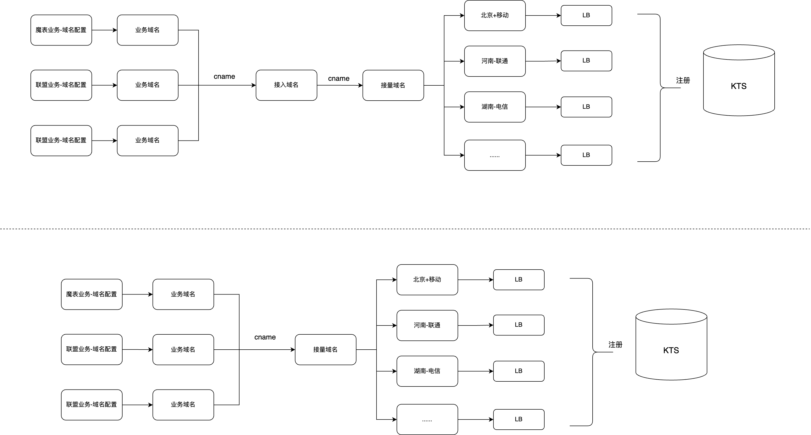

为了快速接入静态业务流量，且我们并没有比较强的 ToB 需求。因此我们去掉接入域名这一层。

- 带宽压制 通过 业务域名 在域名配置中的比例来调整
- 业务域名 直接 cname 到 接量域名，更新接量域名在省份运营商的 A 记录实现调度。

DNS调度系统的其他功能基本保持不变。

**静态业务的接入：**

第一步：准备给业务使用的自建业务域名，称为业务域名

第二步：将业务域名 cname 到 接量域名

第三步：console界面配置静态OC，是否需要单独一个界面？还是非直播整一个界面。

1. > 接量域名按照业务区分优先级

2. > 初始的时候，业务单元带宽为0，需要如何让自建接量

3. > 业务优先级：直播、静态、点播。

4. > DNS在某个地域有多个机房，如何给多个机房分量？上线根据实际情况针对处理

5. > 机器上的同层回源？

# **五、统一带宽预测**

影响

预测

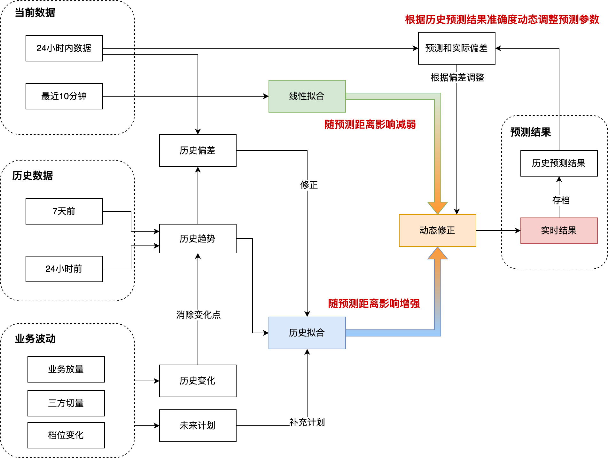

# **六、与其他系统交互**

### **a. 故障切换**

可以复用原始的逻辑，无需有大的改动

### **b. 策略相关**

策略调量：星移等

策略的自建UDR：工程提供有效的数据，可以区分流量调度的原因，即流量未分配到自建的原因

> 针对 solar 放到自建的域名，造成的影响？

> 对计费点差异率的影响，不会造成影响

# **七、灰度方案**

我们将在调度SDK中加入劫持逻辑，综合多种维度(业务、省份、运营商等)进行灰度放量。

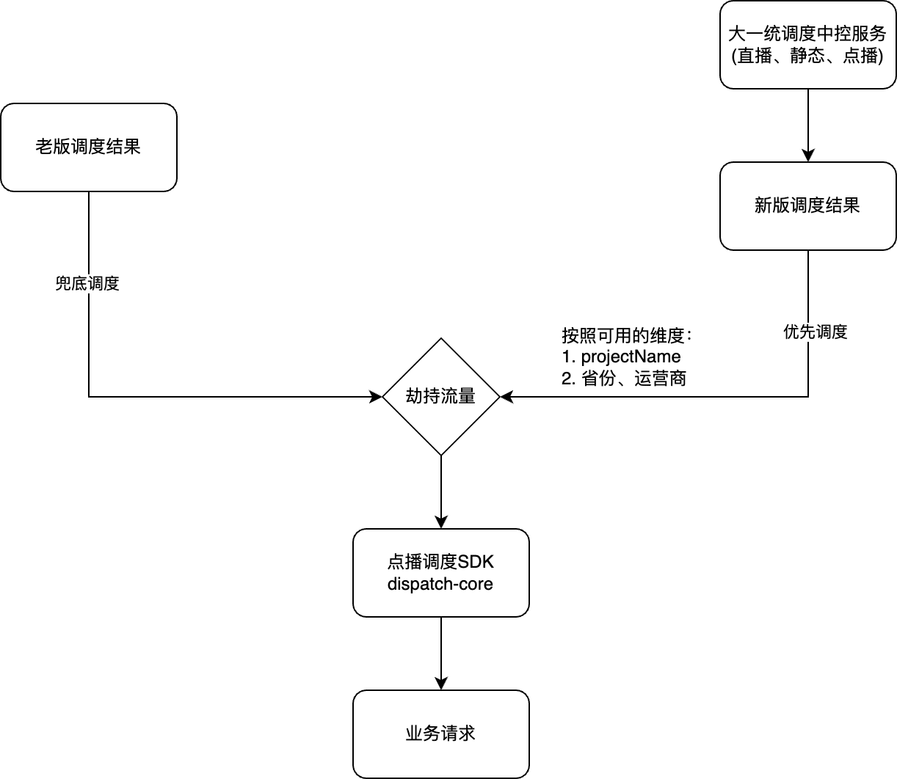

# **八、排期**

时间：拟定 3月底

工作内容：

- 完成自建调度统一流模型的开发测试工作。 
- 将点播、静态这两种业务的调度模型进行统一。