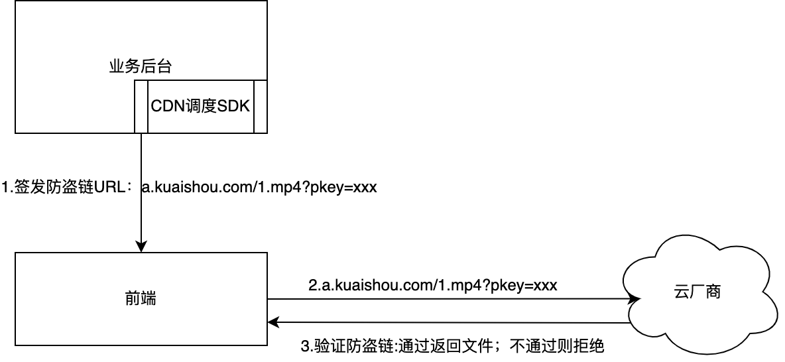
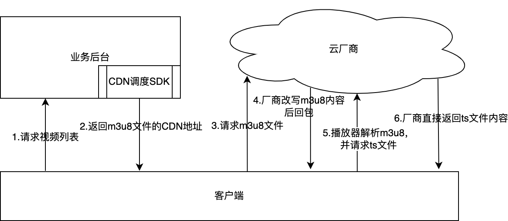

防盗链V2介绍

# **一、防盗链简介**

## **1、什么是防盗链？**

防盗链就是给一个cdn地址增加一个过期时间，从而防止该cdn地址能够长时间进行传播。

使用场景：用户上传一个视频后可以拿到一个视频播放的cdn地址；如果用户上传的视频是一个违规视频，并拿着上传后得到的cdn地址进行传播就会带来安全风险。为了避免这种情况，就需要给返回给用户的cdn地址做防盗链，加一个有效时间限制，这样用户拿着该cdn地址就无法进行长时间传播了。

## **2、防盗链工作流程**



流程说明：

- 业务后台通过CDN调度SDK给前端签发带防盗链的cdn地址（带pkey请求参数)
- 前端拿到cdn地址后直接向厂商请求，获取文件内容
- 厂商判断域名是防盗链域名，通过pkey进行防盗链验证；验证通过返回文件内容，验证失败返回无权限的错误码

# **二、防盗链V1介绍**

## **1、V1示例**

- 防盗链签名前的cdn地址为

https://v1-imv-safety.ssscdn.com/kos/nlav11994/test/123.m3u8

- 防盗链V1签名后的cdn地址为

https://v1-imv-safety.ssscdn.com/kos/nlav11994/test/123.m3u8?pkey=AAUahzX9vP-RjSK6-R4fdEDfVVRGzD2Qr2IRnitb8GVmlw4Jbf_6PBJ1pJFhue6A2ZrMQwXrYLdS2H87Qkqu6HlAT9A9hMgjBWXwfEnSmniLJBA8cNx0sbGvNzoOC6WP-Sw

V1防盗链的签名效果为：在原cdn地址上增加了请求参数pkey，pkey参数中包含有过期时间

## **2、V1版本存在的问题**

- CDN路径中如果包含敏感的信息，可能会导致信息泄漏
- 替换为一个非防盗域名后，会导致原来防盗链的效果被绕过

   示例：https://v1-imv-safety.ssscdn.com/kos/nlav11994/test/123.m3u8[?pkey=AAUahzX9vP-RjSK6-R4fdEDfVVRGzD2Qr2IRnitb8GVmlw4Jbf_6PBJ1pJFhue6A2ZrMQwXrYLdS2H87Qkqu6HlAT9A9hMgjBWXwfEnSmniLJBA8cNx0sbGvNzoOC6WP-Sw](https://v1-imv-safety.ssscdn.com/kos/nlav11994/test/123.m3u8?pkey=AAUahzX9vP-RjSK6-R4fdEDfVVRGzD2Qr2IRnitb8GVmlw4Jbf_6PBJ1pJFhue6A2ZrMQwXrYLdS2H87Qkqu6HlAT9A9hMgjBWXwfEnSmniLJBA8cNx0sbGvNzoOC6WP-Sw)

   把v1-imv-safety.ssscdn.com替换为[s2-11994.ssrcdn.com](http://s2-11994.ssrcdn.com),

   替换后地址为： https://s2-11994.ssrcdn.com/kos/nlav11994/test/123.m3u8（该地址不需要pkey就可以访问）

为了解决这两个问题，升级了防盗链V2版本

# **三、防盗链V2版本介绍**

## **1、V2介绍**

- 防盗链签名前的cdn地址为

https://v1-imv-safety.ssscdn.com/kos/nlav11994/test/123.m3u8

- 防盗链V2签名后的cdn地址为

https://v1-imv-safety.ssscdn.com/ksc2/6QUiDozoVyjrwiI9DoydcA-LvMsJcZG4Rdo5mtGBhCmHjIS0a1NxvYoQnUlZso4W.m3u8?pkey=AAUahzX9vP-RjSK6-R4fdEDfVVRGzD2Qr2IRnitb8GVmlw4Jbf_6PBJ1pJFhue6A2ZrMQwXrYLdS2H87Qkqu6HlAT9A9hMgjBWXwfEnSmniLJBA8cNx0sbGvNzoOC6WP-Sw

V2防盗链的签名效果为：

a.在原cdn地址上增加了请求参数pkey

b.对整个cdn地址进行加密，看不到任何明文的路径信息

c.把域名也一起签名，解决域名替换绕过防盗链的问题。

## **2、V2版本支持m3u8格式**

### **2.1 m3u8文件签发及播放全链路**



流程说明：

- 客户端向服务端请求视频列表（例如feeds流场景）
- 业务后台计算得到对应的视频列表，并调用CDN的调度SDK签发防盗链V2版本的CDN下载地址，假设其中有一个视频为m3u8文件，对应的cdn地址为https://v1-imv-safety.ssscdn.com/ksc2/6QUiDozoVyjrwiI9DoydcA-LvMsJcZG4Rdo5mtGBhCmHjIS0a1NxvYoQnUlZso4W.m3u8?pkey=AAUahzX9vP-RjSK6-R4fdEDfVVRGzD2Qr2IRnitb8GVmlw4Jbf_6PBJ1pJFhue6A2ZrMQwXrYLdS2H87Qkqu6HlAT9A9hMgjBWXwfEnSmniLJBA8cNx0sbGvNzoOC6WP-Sw
- 客户端请求厂商获取该m3u8的文件内容
- 厂商收到请求后，判断是防盗链V2的链接，并且是m3u8文件格式，会对m3u8内容进行改写，然后将改写后的内容返回给客户端
- 客户端将m3u8内容传递给播放器，播放器解析出ts\m4s等分片，构造出完成CDN地址再请求CDN厂商获取ts文件内容
- 厂商直接返回ts和m4s内容（注意：ts和m4s内容不改写）

### **2.2 m3u8文件改写前后内容对比**

改写前：


```
#EXTM3U
#EXT-X-VERSION:3
#EXT-X-TARGETDURATION:8
#EXT-X-MEDIA-SEQUENCE:0
#EXTINF:8.341667,
123.00000.ts
#EXTINF:3.870533,
123.00001.ts
#EXT-X-ENDLIST
```


改写后：


```
#EXTM3U
#EXT-X-VERSION:3
#EXT-X-TARGETDURATION:8
#EXT-X-MEDIA-SEQUENCE:0
#EXTINF:8.341667,
6QUiDozoVyjrwiI9DoydcA-LvMsJcZG4Rdo5mtGBhCmHjIS0a1NxvYoQnUlZso4W.00000.ts?pkey=AAUahzX9vP-RjSK6-R4fdEDfVVRGzD2Qr2IRnitb8GVmlw4Jbf_6PBJ1pJFhue6A2ZrMQwXrYLdS2H87Qkqu6HlAT9A9hMgjBWXwfEnSmniLJBA8cNx0sbGvNzoOC6WP-Sw

#EXTINF:3.870533,
6QUiDozoVyjrwiI9DoydcA-LvMsJcZG4Rdo5mtGBhCmHjIS0a1NxvYoQnUlZso4W.00001.ts?pkey=AAUahzX9vP-RjSK6-R4fdEDfVVRGzD2Qr2IRnitb8GVmlw4Jbf_6PBJ1pJFhue6A2ZrMQwXrYLdS2H87Qkqu6HlAT9A9hMgjBWXwfEnSmniLJBA8cNx0sbGvNzoOC6WP-Sw

#EXT-X-ENDLIST
```


主要改动点：

a."123"被替换为"6QUiDozoVyjrwiI9DoydcA-LvMsJcZG4Rdo5mtGBhCmHjIS0a1NxvYoQnUlZso4W"

b.URL参数加上了pkey

## **3、 防盗链V2算法对播放器的影响**

 在V1算法中，播放器拿到的路径为明文：

https://v1-imv-safety.ssscdn.com/kos/nlav11994/test/123.m3u8?pkey=AAUahzX9vP-RjSK6-R4fdEDfVVRGzD2Qr2IRnitb8GVmlw4Jbf_6PBJ1pJFhue6A2ZrMQwXrYLdS2H87Qkqu6HlAT9A9hMgjBWXwfEnSmniLJBA8cNx0sbGvNzoOC6WP-Sw

在V2算法中，播放器拿到的路径为密文：

https://v1-imv-safety.ssscdn.com/ksc2/6QUiDozoVyjrwiI9DoydcA-LvMsJcZG4Rdo5mtGBhCmHjIS0a1NxvYoQnUlZso4W.m3u8?pkey=AAUahzX9vP-RjSK6-R4fdEDfVVRGzD2Qr2IRnitb8GVmlw4Jbf_6PBJ1pJFhue6A2ZrMQwXrYLdS2H87Qkqu6HlAT9A9hMgjBWXwfEnSmniLJBA8cNx0sbGvNzoOC6WP-Sw

可能存在以下影响需要评估：

- 防盗链V2对所有的CDN地址都进行加密和禁止域名替换（不仅包括m3u8，mp4也一样），播放器内部是否有依赖明文路径的逻辑？？
- 缓存key的逻辑是否影响？
- fallback的逻辑是否影响？
- m3u8的文件被改写，ts文件路径被替换，是否有影响？
- 内部ts文件的请求参数是否完全继承m3u8的请求参数？
- 更多影响需要评估

会议明确的几个点：

- 播放器依赖于路径中的转码档位，需要改为从mf获取 
- fallbak是换域名还是换URL？应该是换URL
- cachekeymf统一签发
- 调度SDK判断有传cachekey才开ksc2
- 客户端存在本地的视频，升级后的影响，考虑灰度放量，防止影响带宽
- mp4文件也是要升级到防盗链V2，需要一起评估