**静态(CDN)流量域名的现状与治理方案**

## **一、静态流量域名&容灾能力现状**

### **1.1 静态流量调度解决的问题**

​	通过管理，为业务提供方便的CDN接入，同时对厂商进行 标准、规范 的接入管理

​	通过调度，为业务的服务提供容灾、成本优化、质量保障；

​	而到达这两个目标的抓手就是**管理、调度**

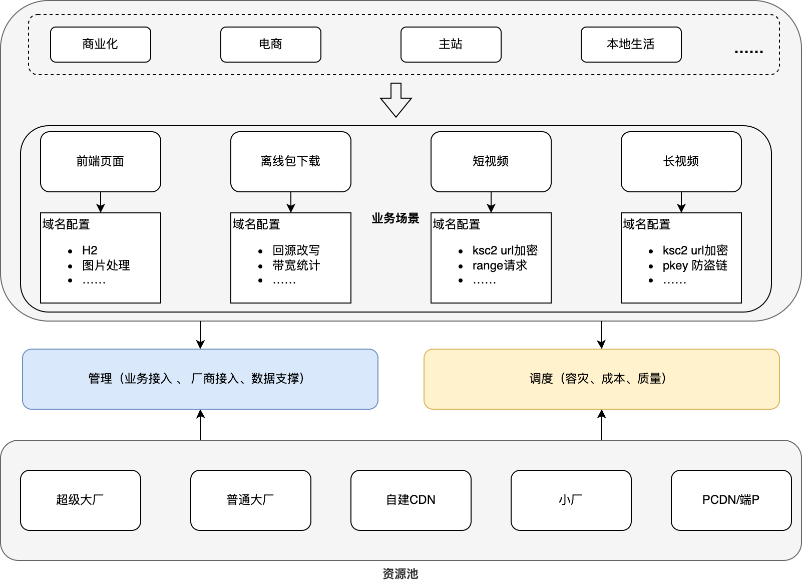

### **1.2 静态域名的现状**

**主站静态CDN域名现状：**[**主站静态域名使用现状**](https://docs.corp.kuaishou.com/d/home/fcABrllmCSkX1aBMAfw-XQKsr)

**电商静态CDN域名现状：**[**电商静态(CDN)域名使用现状**](https://docs.corp.kuaishou.com/d/home/fcABYqQzTaTfC8GKmHTI6t1g3)

**快手总接入域名的量级**

| **总量**     | **区域分类** | **资源类型分类**                       |          |          |          |          |          |          |
| ------------ | ------------ | -------------------------------------- | -------- | -------- | -------- | -------- | -------- | -------- |
| **域名类型** | **总数量**   | **国内**** ****（含国内+海外的域名）** | **海外** | **视频** | **静态** | **直播** | **下载** | **回源** |
| 普通域名     | 2996         | 2418                                   | 577      | 1246     | 1323     | 347      | 77       | 2        |
| 泛解析子域名 | 1714         | 1541                                   | 173      | 216      | 1496     | 0        | 2        | 0        |
| 泛域名       | 94           | 81                                     | 13       | 52       | 41       | 0        | 1        | 0        |
| 总计         | 4804         | 4040                                   | 763      | 1514     | 2860     | 347      | 80       | 2        |

**快手接入厂商的域名量级**

从下表可以看出，就可以看出大量业务静态和视频业务只使用腾讯、阿里两家或一家厂商。

| 厂商              | 静态 | 视频 | 直播 | 总计 |
| ----------------- | ---- | ---- | ---- | ---- |
| 阿里              | 1177 | 521  | 52   | 1750 |
| 腾讯              | 894  | 643  | 94   | 1631 |
| akamai            | 286  | 18   |      | 304  |
| 金山              | 132  | 98   | 34   | 264  |
| 华为              | 47   | 68   | 51   | 166  |
| 百度              | 84   | 39   | 33   | 156  |
| aws               | 117  | 26   |      | 143  |
| 网宿              | 27   | 19   | 73   | 119  |
| google            | 49   |      |      | 49   |
| 又拍              | 16   | 22   |      | 38   |
| 天翼              | 10   | 10   |      | 20   |
| 优刻得            | 3    | 9    |      | 12   |
| 白山云            |      | 2    | 6    | 8    |
| 自建              | 3    | 4    | 1    | 8    |
| edgio             | 7    |      |      | 7    |
| 免费小运营商-又拍 | 3    | 3    |      | 6    |
| 微软              |      | 6    |      | 6    |
| cloudflare        | 3    | 1    |      | 4    |
| 联通              | 1    | 3    |      | 4    |
| 免费小运营商-自建 |      | 2    | 1    | 3    |
| 牧云              |      | 3    |      | 3    |
| 视界              |      | 3    |      | 3    |
| PCDN              |      | 2    |      | 2    |
| 创世              |      | 2    |      | 2    |
| 单网自融-移动     |      | 2    |      | 2    |
| 星域              |      | 1    | 1    | 2    |
| 创辛              |      | 1    |      | 1    |
| 端P               |      | 1    |      | 1    |
| 移动              |      | 1    |      | 1    |
| 总计              | 2861 | 1514 | 347  | 4722 |

### **1.3 静态域名容灾能力的现状**

#### **1.3.1 故障发现与定位能力**

​	目前域名的故障发现和定位主要基于端侧的**日志+拨测**两种手段，基于日志日志的覆盖了所有的业务，基于拨测的主要覆盖了电商商业化的域名。

| CDN监控                             | 时效     | 召回率 | 支持的业务         |
| ----------------------------------- | -------- | ------ | ------------------ |
| 播放器日志                          | 8～9分钟 | 90%+   | 所有走播放器业务   |
| hodor日志（下载库）                 | 8～9分钟 | 90%+   | 所有走下载器业务   |
| 图片库                              | 8～9分钟 | 90%+   | 所有走图片库的业务 |
| 实时CDN质量监控（基于网络库&&拨测） | 2分钟    | 90%+   | 电商、商业化       |

#### **1.3.2  服务端的容灾止损能力现状**

服务端的容灾止损能力主要通过业务侧通过多种方式接入CDN调度SDK来实现，当某个域名在某区域出现故障的时候，配置管理服务，将故障切量信息更新到调度配置中，然后调度SDK读取到新的配置，就会对新的请求不会再给该区域的用户下发故障的域名。调度SDK能够支持省份+运营商粒度的故障切换能力。

​	目前CDN团队提供了调度的JAVA-SDK和 Node版本的SDK，JAVA-SDK主要用于后端业务，

后端业务可以直接集成调度SDK获取URL。 另外公司很多的基础服务也都已经接入了调度的SDK例如 主站的keep预热平台，音视频的manifest服务等，使用这些服务直接就已经具备了如武断容灾止损能力 。

Node版本的SDK主要面对前端页面的场景。目前公司的KFX平台已经集成了Node版本的调度SDK，业务将页面托管到KFX，在响应页面时，KFX会调用Node-SDK，获取到页面中使用的静态资源的调度域名，并对页面中可能的故障域名进行替换，来达到服务端容灾的目的。

参考 [CDN 容灾调度接入方式介绍](https://docs.corp.kuaishou.com/d/home/fcACqfqbVPDRw7Gt7La1Mjlqk)

​	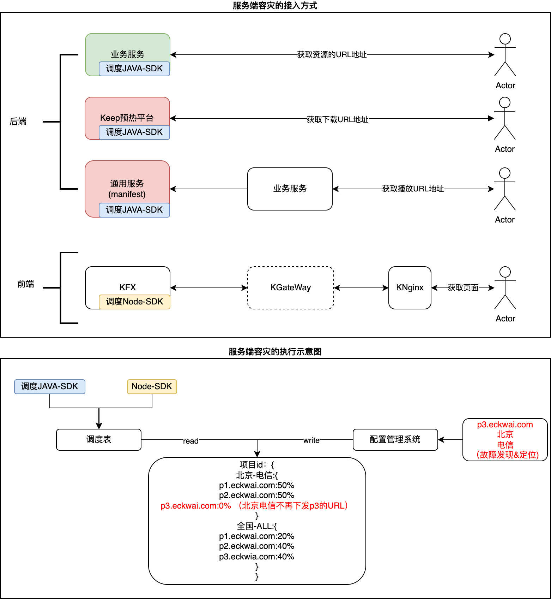

#### **1.3.3  客户端的容灾能力现状**

​	目前快手静态资源的客户端容灾能力依赖服务端在下发地址的时候给**多个地址**(一般是主备2个)到客户端，目前调度SDK返回的也是一个地址列表。如下图所示。

​	端侧容灾的好处是，**在故障发现之前可以通过重试替换URL，而不影响用户的访问，业务对故障无感**。

​	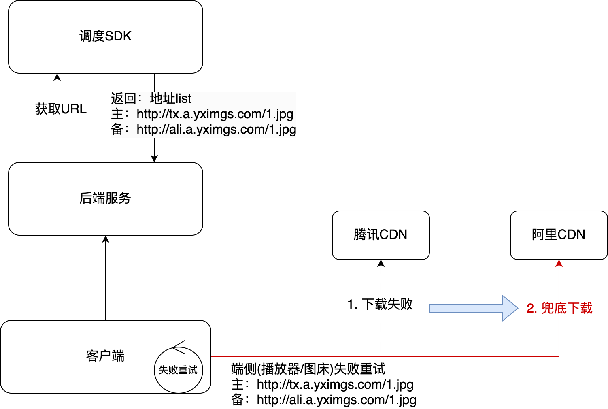

但是有些场景没有下发多个地址、或者没有办法下发多个地址，例如下表中的web端/或者端外的场景。

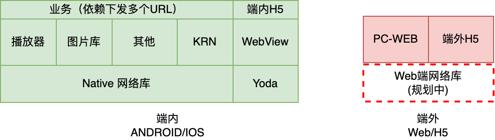

| **端**         | **端上接入方式**                 | **场景**                 | **主备URL比例**                    | **说明**                           |
| -------------- | -------------------------------- | ------------------------ | ---------------------------------- | ---------------------------------- |
| 纯Native       | 播放器                           | 主站视频、广告、商品视频 | 99%+                               |                                    |
| 图片库         | 背景图、头像、商品图、表情包     | 60%+                     | 业务来源比较散，部分业务只传入了主 |                                    |
| 下载类（其他） | 常规下载：安装包、活动页、预下载 | 支持，暂无统计           |                                    |                                    |
| KRN            | KRN的页面内容                    | 支持，暂无统计           |                                    |                                    |
| web端          | KFX/KGateway                     | 端内H5、PC-Web           | 0%                                 | 替换html中的占位符域名，不支持主备 |
| 端外           | 端外链接分发                     | 广告联盟、端外H5         | 0%                                 | 给到端外只有一个链接               |
| 其他           | 其他                             | 写死、端外未知业务       | 未知                               |                                    |

## **二、服务端域名容灾的一些痛点**

### **2.1 调度配置与业务项目强耦合、缺乏有效管理**

​	随着业务的不断增长，一起缺乏长期的规划，导致目前的调度问题

- **配置数量多**，厂商的故障切量要切换上百份配置，[后果：运维成本高、止损时间长，规模故障需要切换最高 近千份配置]
- **配置不规范**，大量缺乏备用厂商、备用域名的情况存在 【后果：无法止损，域名封禁场景无法止损】
- **接入厂商数量少**，很多只接入了阿里/腾讯 【后果：腾讯/阿里等大厂 价格变动时，只有一家厂商抗量，风险较大】
- **域名使用混乱**，一个域名被多个业务使用，封禁隔离，成本拆分都带来很大的困难 【后果：1 运维成本高，止损时间长，一个域名出现在上百份配置中，单个域名的切量需要改动；2 成本无法准确拆分】
- **域名配置不统一**，一个项目里的多个域名的CDN配置不一致。【后果：部分厂商配置不符合业务预期，测试阶段可能无法发现】 

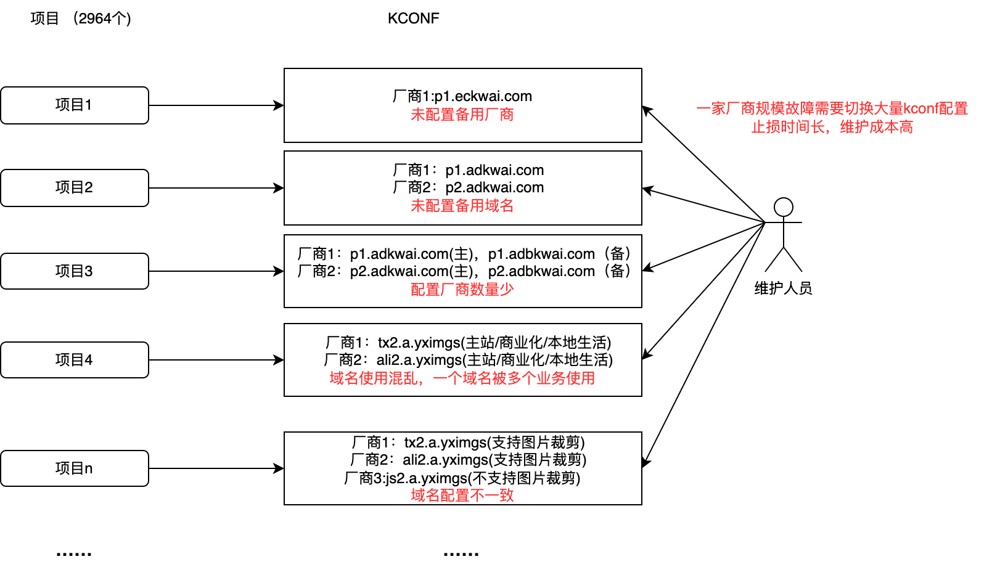

### **2.2 没有接入调度，写死域名 导致域名封禁或故障 无法切量** 

- 下面是常见的几种写死，出现故障无法切换

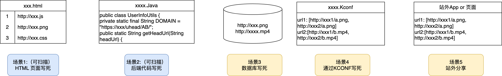

### **2.3 资源错用域名**

- CDN 的非直播域名 分为  **静态(图片，css，jss等小文件)**、**视频（mp4，ts等视频文件）**、**下载（apk包等大文件）**三种类型，不同的资源类型需要使用对应的域名类型访问，部分业务不区分资源类型和域名类型错用域名，存在成本和稳定性的潜在风险。
- 案例：[2024/02/02 商业化应用中心CDN下载链接失效问题复盘](https://docs.corp.kuaishou.com/d/home/fcABJ7c1avFjaQu1GrNSFc-Yg)

附：[静态CDN域名管理的外部调研](https://docs.corp.kuaishou.com/d/home/fcADbgDB9xvz8bfxttJRLWfhS)

## **三、服务端治理方案**

### **3.1 业务项目和调度配置解耦：域名组管理**

在项目和调度之间增加一个域名组，在业务视角可以看作是一个子业务场景，在调度视角他是一个调度组对应一份配置

1 域名组由业务负责人申请，KCDN成员维护；业务可以不关注使用哪家厂商，KCDN维护人员保证下面几点

​	1 使用的域名都是一个业务域名（一般是一个大的业务固有的二级域）

​	2 保证使用多家厂商

​	3 保证多家厂商使用统一的域名配置模版，配置对齐。

2 新创建项目可以根据自身业务归属，选择已有的域名组，而不需要每次选择使用什么域名。

3 域名组一般可以从业务、场景拆分等角度考虑，不建议分太多个。

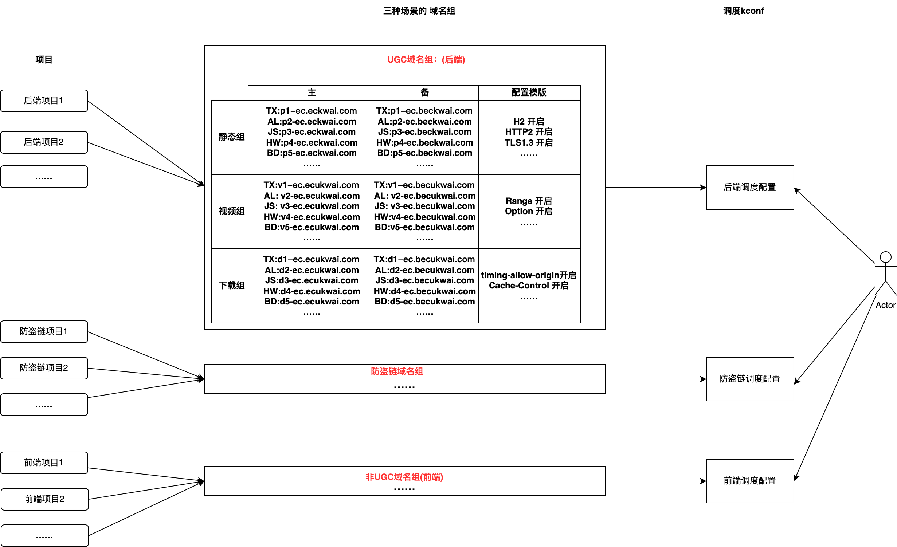

#### **3.1.1 域名组内域名的成本拆分**

**前缀拆分+参数拆分 + 离线日志拆分：**

整体逻辑是，通过URL的路径或者参数来区分本次请求的归属，然后通过拉取CDN计费点的日志进行离线分析，将带宽拆分到单个项目上。如下图所示。

1. 前端业务基本都是KCDN独立桶存储，本身KCDN存储是独立桶，通过路径就能够知道是那个项目ID，不需要额外加路径。

例如 https://p2-ad.adbkwai.com/kcdn/cdn-kcdn111837/387.2bb6fd8c.async.js； 其中 cdn-kcdn111837就是项目id。

1. 对于非KCDN存储的情况，都要经过调度SDK获取URL，在获取的时候在URL中增加参数 (暂定 kpid) ，然后就可以区分是那个项目，如下图所示

**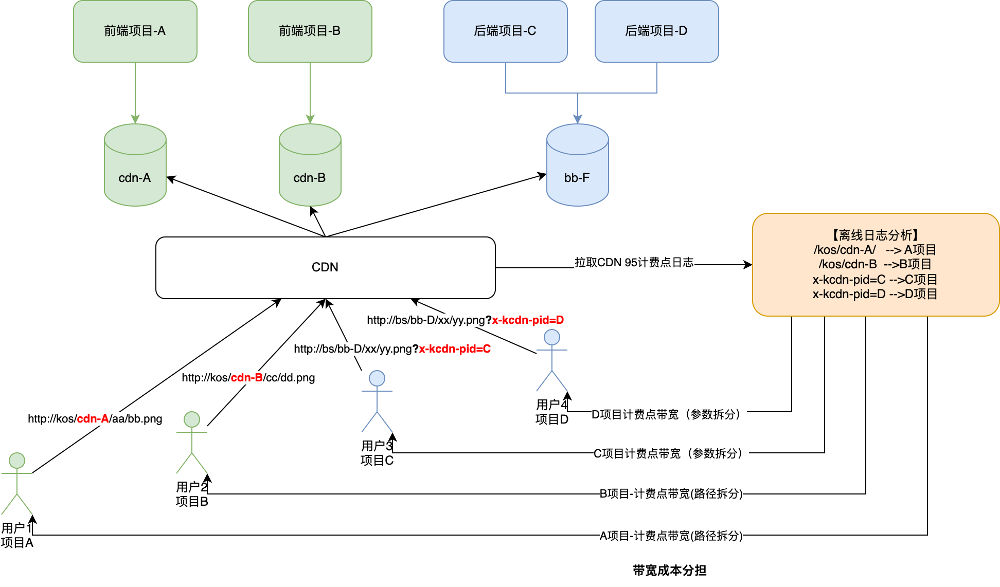**

**添加参数的注意事项：**

​	1 目前已经知道音视频侧的服务都没有对URL加参数有任何的影响，需要业务侧确认是否有对URL做添加参数的情况。

​	2 最好按照项目逐个开启，业务观察， 灰度放量时需要业务观察。

​	【案例】：之前碰到过，电商业务在追加参数时，没有考虑URL已经有了参数，而是直接在完整URL后面追加?xxx=yyy的情况，如下:

​	URL：https://p2-ad.adbkwai.com/kcdn/cdn-kcdn111837/387.2bb6fd8c.async.js

​	业务自己追加参数：https://p2-ad.adbkwai.com/kcdn/cdn-kcdn111837/387.2bb6fd8c.async.js?xxx=yyy

​	调度SDK追加参数后的URL：https://p2-ad.adbkwai.com/kcdn/cdn-kcdn111837/387.2bb6fd8c.async.js?kpid=cdn-kcdn111837

​	业务自己再追加参数:https://p2-ad.adbkwai.com/kcdn/cdn-kcdn111837/387.2bb6fd8c.async.js**?kpid**=cdn-kcdn111837?xxx=yyy

​	3 业务需要知晓，这里的带宽是根据95带宽统计出来，只是业务收到的**kas 上的账单一部分**，且计算方式会有些差异，因此仅做内部参考。

**改造内容：**

**1 前端项目理论上不用修改。**

**2 后端业务，若没有上面加参数的bug，理论上不需要业务修改，但增加参数期间最好灰度期间业务观察。可以考虑域名迁移一起灰度放量。**

​	**3 CDN调度SDK增加加参数的能力，和项目级别的放量开关**

​	**4 KCDN 增加拉取日志，根据 路径+参数 拆分项目95计费点的能力，并在项目管理中展示带宽，数据延迟预计 1天；**

#### **3.1.2 域名组管理的存量项目迁移改造**

​	1 CDN同学负责创建好业务的域名组，完成配置验证（电商/本地生活/商业化 已完成)

2 确认业务没有域名限制，比如域名白名单等场景。业务评估是否需要QA验证新域名（若需要CDN同学将配合在staging、prt等环境进行验证）

3 CDN同学对线上的业务配置进行灰度，业务同学观察指标，有异常立即回滚，并排查异常，反馈解决，再回到步骤2。

​	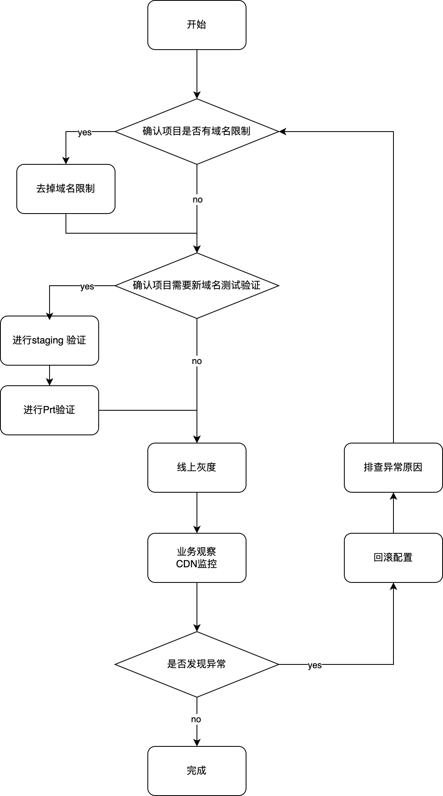

### **3.2 写死域名的治理**

#### **3.2.1 写死域名的如何发现**

- 业务梳理
- 代码扫描
- 切量验证（切走量通过回捞CDN日志拿到URL排查）

#### **3.2.2 接入调度**

首先，我们推荐业务接通过接入调度SDK的方式获取URL目前支持多种场景的接入。

参考：1.3.2 节的介绍

客户端容灾：后面3.4章节会详细介绍。但依赖 域名组的规范治理和使用 以及 业务接入网络库。

### **3.3 资源错误用域名治理**

#### **3.3.1 CDN厂商的域名资源类型区分介绍**

CDN厂商的非直播域名基本分了 **静态(图片，css，jss等小文件)**、**视频（mp4，ts等视频文件）**、**下载（apk包等大文件）**三种类型的资源，其后面承接不同资源类型的域名可能不同，不同的资源类型的CDN价格也有差异（目前快手大客户暂时没区分）

​	不同类型的域名支持的特性也会有一些差异。比如：

1. 视频域名：基本都支持range请求(分片回源、206)；不一定能支持图片处理 和 gzip等。
2. 静态域名：支持图片处理参数 + gzip；不一定能支持range请求
3. 下载域名：基础能力；

不同的厂商叫法可能有差异，但都是对应这上面三种类型。

**资源类型 和 域名类型** 错用可能会有问题，目前碰到过的两类问题：

通过视频域名下载图片可能无法支持裁剪（当然部分厂商对视频域名也能做裁剪支持，但不能保证所有厂商都支持）

通过图片域名下载超级大文件可能和图片处理的逻辑冲突导致问题，例如 [2024/02/02 商业化应用中心CDN下载链接失效问题复盘](https://docs.corp.kuaishou.com/d/home/fcABJ7c1avFjaQu1GrNSFc-Yg)

#### **3.3.2 调度SDK的改造**

​	调度SDK目前支持传入的**资源类型**缺少下载类型，需要补充下载类型；**预计在6月初支持该类型**

| **调度SDK支持传入的资源类型** | **映射CDN的域名类型** | **备注**                             |
| ----------------------------- | --------------------- | ------------------------------------ |
| 图片                          | 静态                  |                                      |
| 头像                          |                       |                                      |
| 静态                          |                       |                                      |
| 视频                          | 视频                  |                                      |
| 下载                          | 下载                  | 调度SDK接口，暂不支持，5月底完成支持 |

#### **3.3.3 业务改造**

​	需要业务排查调用调度SDK的指出，并根据实际实际的的资源类型准确的传入资源类型。

​	参考：https://kcdn.corp.kuaishou.com/doc/#si_huoquwenjianxiazailujing_diaodu

## **四、客户端的容灾能力建设**

​	如在1.3.3 节中的介绍，目前快手客户端的容灾能力依然依赖后端的下发两个URL，但是在Web/H5等场景无法下发两个URL。端侧的容灾调度，不仅可以作为域名故障容灾的补充手段，而且可以将CDN故障的影响降到最低，甚至业务无感知。

​	通过服务端的**域名组**管理方案，我们可以明确的知道某些域名是可以相互替换的。借鉴域名组的方案，我们将会做一个Web端网络库，来实现端侧的自动容灾。对于Native的网络库也将进行域名组兜底方案，但由于已有双URL重试的方案，因此为了避免冲突，需要整体协调，时间可能会比较久。

​	

### **4.1  Web端网络库方案（规划中）**

详细设计与接入方式参考：[静态websdk设计文档-v20240509	](https://docs.corp.kuaishou.com/d/home/fcABVkh9mlknJhepnhWucpKwM#section=vodka.ntgehjfx4lay)

**容灾执行整体流程如下：**

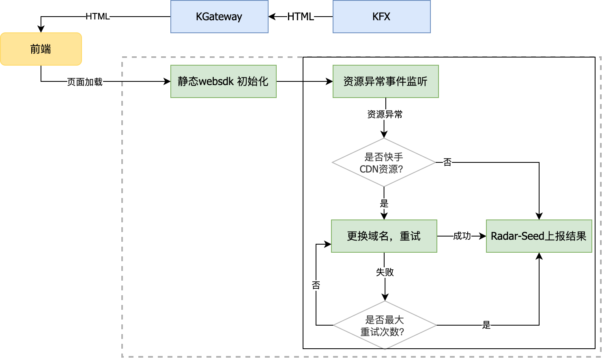

**结构：**

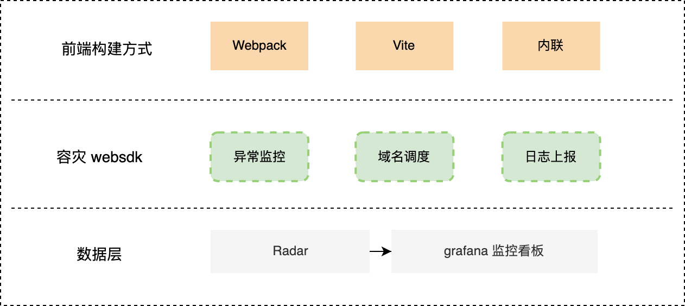

**接入方式**

 为了业务更少成本接入 SDK，对 CDN SDK 封装成插件，能够自动拉取 CDN  调度域名，并把 SDK Script 和 初始化自动注入到 HTML  中。

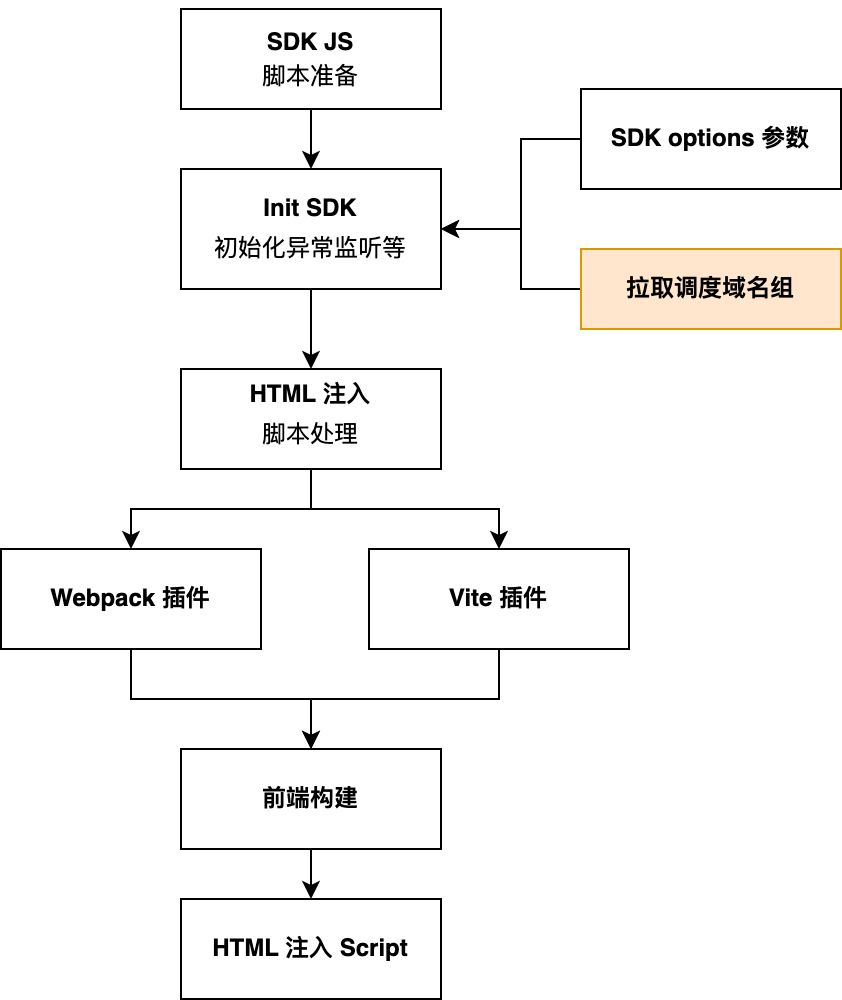

**该webSDK预计在6月初完成能力建设**

​	**自动failvoer能力**

### **4.2  Native端侧补充容灾方案（规划中）**

大致方案如下图所示，通过后端服务，将域名组信息下发给，端内的网络库，若没有备用URL，在网络库请求失败的时候自动切换域名组内其他域名，实现到域名故障的自动端上切换。当然其影响范围依赖端上业务使用网络库，另外对于**有防盗链的链接则不能切换域名必须使用双URL的方案**，目前现在如下。

​	**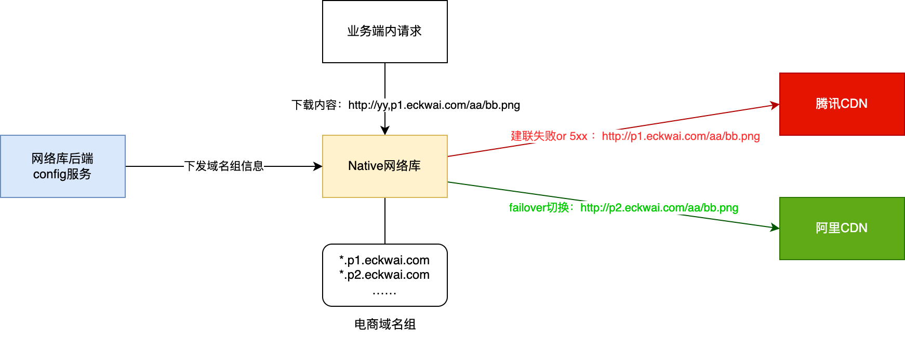**

​	**目前native端网络库需要和上层的播放器/图床等沟通现有双URL场景下的重试和底层替换域名重试的冲突问题，因此暂时还没有具体的方案，预计在Q3完成能力建设**

​	**自动failvoer能力**

**细粒度调度能力**

## **五 治理节奏**

1、4月份完成业务域名治理接入方案和目标对齐

2、5月底完成业务域名治理方案需求开发，业务侧完成对业务的梳理，对接入调度、域名限制（如域名白名单）等场景进行梳理。

3、6月开始灰度业务部分项目，预计到Q3~Q4完成整体域名冶理

补充文档：

电商对接补充说明：[关于CDN统一域名组方案的补充说明](https://docs.corp.kuaishou.com/k/home/VVX2aJl-dEyg/fcACewcqXlqi5WF5zC9O2VrBJ)

外部调研：[静态CDN域名管理的外部调研](https://docs.corp.kuaishou.com/k/home/VPcGbjta7d4g/fcADbgDB9xvz8bfxttJRLWfhS)

静态域名使用规范：[静态CDN域名使用规范V1（国内）](https://docs.corp.kuaishou.com/k/home/VZIKr2J8S1Hg/fcAD3JgGQii7RjvsI8dp9gnrw)

## **六 讨论记录**

### **电商的域名治理的一些前期沟通**

【20240401电商前端】：@邓策

需求点：

【P0】前端资源CDN占总量不高（印象中，能否在常态下收敛到一个，非常态下可以到两个。

​	1 页面收敛到1～2 个域名上，可以通过webview 进行预建链接，预估提升50ms

​	2 目前主要是纯走webview的场景，走KRN/Native的场景基本配置了httpdns预解析，KRN场景主要是图片类的资源。webview 主要是一些 js/css 等页面内容。

​	3 webview的场景，和 KRN的场景目前在前端能够区分，但是在KCDN的项目上目前是混着放的

​	4 电商的前端场景目前拆分成本的需求不大

​	5 出问题最多的，是TX 和其他厂商，阿里比较稳定，能否稳定一家。

​	6 webview建链接，申天义，yoda， https://yoda.corp.kuaishou.com/docs/

​	7 预简练目前实现是通过页面与域名的映射关系处理

​		host/pageA. 

\- host 

\- CDN

example ：

host [ app.kwaixiaodian.com.](about:blank)  app2 非常

8 KFX的接入是怎么做的？目前期望是常态100%分配到一个域名，故障切换到其他域名。

【P1】OCSP https://zhuanlan.zhihu.com/p/518379604 优化

总结：期望域名治理&域名收敛，能够同时给业务带来业务上的性能上的收益。

### **【20240402 yoda 使用CDN调研】：**

**讨论结论：**

1 yoda CDN预建联

一般只对主文档预建联，资源加载AB结果看收益不大，从调度获取资源的预建联域名 和 使用泛域名预建联 改造难度都比较大。可以考虑只做预先解析。

2 yoda CDN使用数据监控

有网络请求数据，存储用CK，2min延迟，作为CDN监控->报警的故障发现手段 理论上 方案可行；先提供radar的数据表了解字段详情，细节再进行对接。 

3 yoda CDN自动容灾

只能在H5页面内做，研发管理办公室已有方案，可供参考 https://npm.corp.kuaishou.com/-/web/detail/@ks-infra/vite-plugin-vue-cdn-fallback/v/0.0.23/

**讨论详情：**

**讨论人员：刘利川，申天义，王维、刑华康**

yoda 预建联

1 yoda 的预建联域名限制1～2个的原因？  同一时间理论最多6个。

​	一般只是，主文档；

​	资源上的收益不大。几毫秒，不是必须的。 AB 后的收益不大。 资源，统一用一个。制定建联哪一个。

​	预解析：有，没有太多的数量限制。

2 yoda 的预建联域名能否根据调度获取？

​	KFX 

​	主文档返回了才知道，预建联 是在主文档之前的。

​	发起主文档请求之前开始预建联的。

​	userid hash 选择域名的。 动态配置预建联域名，改造难度大，且还是收益不大。

3 yoda 的预建联能否使用泛域名？

​	比如配置 *.[p1.adkwai.com](http://p1.adkwai.com)， 则所有 A.[p1.adkwai.com](http://p1.adkwai.com); B.p1.adkwai.com 域名 都可以预先建联

​	实现难度比较大。需要chrome 层的修改支持。

**yoda 数据**

1 yoda 的原始监控数据 资源加载的监控有哪些字段字段，从哪里可以看到原始数据（非业务相关的通用网络监控数据）

1 例如：url，DNS时间， 建联时间，响应时间，响应状态码，请求成功率 都有

2 时效性：

​	现在的失效性 2min

3 ck 存储 

​	单独开权限，观察。 后续跟进。

2 yoda的数据能否提供通用的 域名维度的 数据，供CDN侧去做监控->报警->切量的

​	

3 yoda 能否实现 底层 域名失败的自动切换的能力

​	CDN自动切换域名容灾。一般都是在H5 页面内做

​	IDC 容灾 api 已经做了。

**H5页面内** 自己切量。 

​		已经有方案了。

### **【20240403 OCSP CDN调研】：**

[**需求：OCSP Stapling 优化支持情况确认**](https://team.corp.kuaishou.com/task/T5554930)

腾讯：1   阿里：2   金山：3   华为：4   百度：5 

五家厂商都已经支持

### **【20240429】 域名管理的外部调研**

[静态CDN域名管理的外部调研](https://docs.corp.kuaishou.com/d/home/fcADbgDB9xvz8bfxttJRLWfhS)

### **【20240507】 主站讨论问题**

1 新增拦截了吗？

2 新增项目的流程的说明？

3 时间上的确定？

4  前端的同学确认，替换域名有没有问题？

5 下周三给个时间节奏？

**【20240528】 关于同于域名组方案的补充说明**

[**关于CDN统一域名组方案的补充说明**](https://docs.corp.kuaishou.com/d/home/fcACewcqXlqi5WF5zC9O2VrBJ)