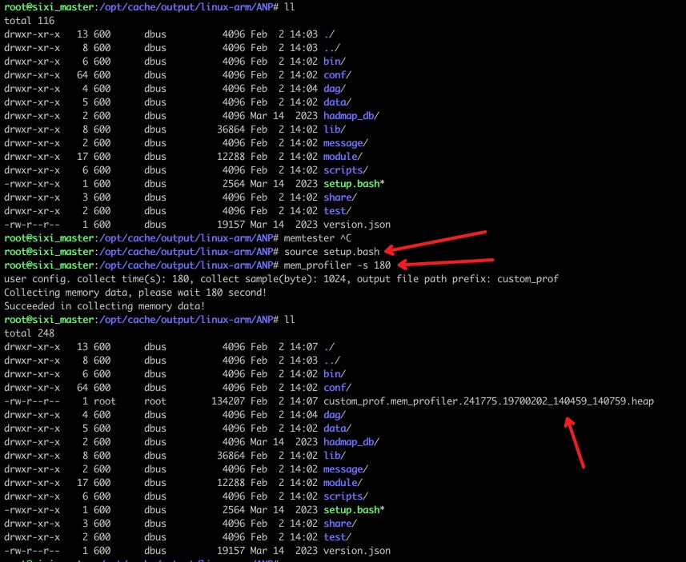
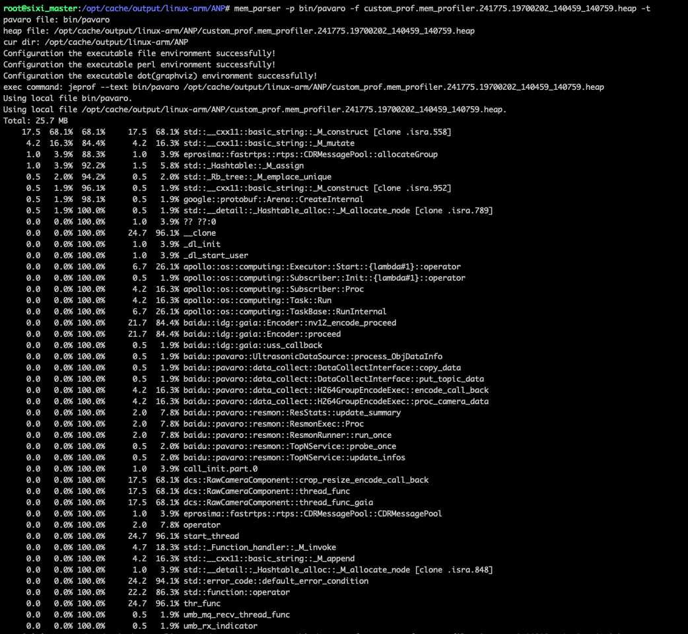
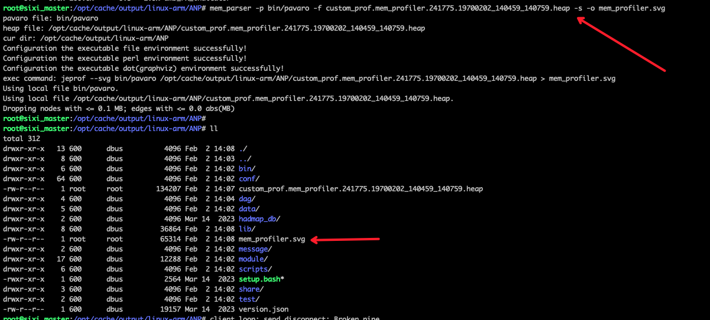
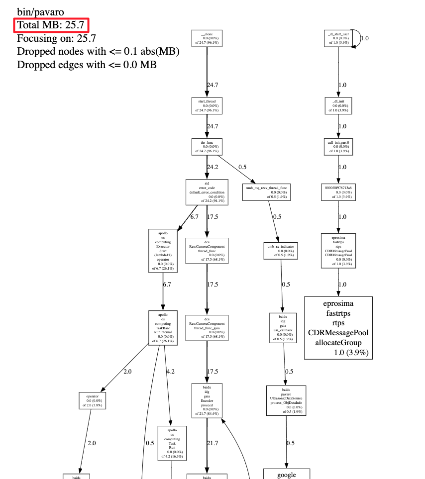

## mem-profiler 工具说明

### 一、概述

此工具可以分析内存是被那些函数使用了。原理是每分配一定内存就去采样内存分配调用处的堆栈。最后按照堆栈的函数调用关系汇总成我们想要的结果图。

实际依赖 jemalloc、libunwind 来获取函数调用的堆栈，通过共享内存作为媒介来实现不同进程之间的通信，也即使用 jemalloc 的进程为我们测试进程，mem-profiler 进程可以操作共享内存，修改数据，以达到与测试进程之间交互的目的；最终实现实时的控制启动、停止内存详细信息的收集处理任务。

### 二、使用

#### 1. 配置待测试进程

使用 jemalloc 作为我们的内存分配管理库，并且使用我们改写优化后的 jemalloc 。库地址：https://console.cloud.baidu-int.com/devops/icode/repos/baidu/adu-3rd/jemalloc/blob/mem_profiler_x86_64_ubuntu18_gcc750_v5.2.1/README.md

请查看分支名，获取不同 cpu 架构、不同 gcc 版本编译的 libjemalloc 库。其中带 mem_profiler 前缀的即为所需的库。

为了工具的可插拔性，我们一般推荐使用 LD_PRELOAD 的方式加载 libjemalloc.so。比如 AVP-ANP2 项目中的添加方式，查看 start_all_modules.bash 文件中的 use_jemalloc 函数的实现。链接：https://console.cloud.baidu-int.com/devops/icode/repos/baidu/asd/AVP-ANP2/blob/dev_pangu/onboard/bin/start_all_modules.bash

#### 2. 开始采集

将待测试进程启动后，就可以开始采集了。mem_profiler 可执行文件是我们的采集驱动程序。以 AVP-ANP2 项目为例，这个可执行程序在我们产出的 `output/linux-arm/ANP/bin` 下。如下介绍他的用法。

```
-s: 表示采集的时长，以秒为单位。比如：`mem_profiler -s 60` 表示采集 60s
-c: 表示采样率，即每分配一定内存就去采样。比如 `mem_profiler -s 60 -c 1024` 表示每分配 1024 字节就去采样
-o: 表示输出文件的路径+前缀。比如 `mem_profiler -s 60 -c 1024 -o /tmp/custom_profiler_` 表示生成的文件在 /tmp 目录下，并且文件名字的前缀为 `custom_profiler_`
```

最终生成的数据文件是以 `.heap` 为后缀的文件。

在这里，列出 mem_profiler 的简单使用：



如上图，以 AVP-ANP2 项目为例，

- 我们先执行 `source setup.bash`，将 `output/linux-arm/ANP/bin` 下的二进制添加到 PATH 环境变量中。
- 然后执行 `mem_profiler -s 180` ，采集 180 秒的内存信息。我们可以看到默认的采样率为 1024，默认的文件路径和前缀是当前目录和 custom_prof
- 等 180 秒后，采集结束，mem_profiler 会返回 `succeeded in collecting memory data!` 字样代表采集成功，查看相应的目录就可以看到生成的以 `.heap` 为后缀的数据文件。

此时这个以 `.heap` 为后缀的数据文件还不是人类可读的数据，需要进行解析才能以人类可读的方式展示出来。**注意：必须要在当前环境（当前测试板、当前产出）下执行解析，不可跨板、不可跨产出；否则可能会出错。**最好的实践方式即采集完就进行解析

#### 3. 开始解析

采集完数据，生成以 `.heap` 后缀的文件后，我们马上进行解析。mem_parser 可执行文件是我们的解析工具。以 AVP-ANP2 为例，这个可执行文件在产出的 `output/linux-arm/ANP/bin`，如下介绍他的用法。

```
-p: 待测试进程的二进制，比如 `mem_parser -p bin/pavaro` 表示我们的待测试进程是 pavaro 进程
-f: 以 .heap 为后缀的文件，就是第二步生成的文件。比如 `mem_parser -p bin/pavaro -f xxx.heap` 表示我们要解析 xxx.heap 这个文件
-s: 以函数调用图的方式展示数据，无参数
-t: 以文本格式的方式展示数据，无参数
-o: 解析后的数据输出的文件。比如 `mem_parser -p bin/pavaro -f xxx.heap -s -o /tmp/mem_profiler.svg` 表示解析出来的数据存放在 /tmp 目录下的 mem_profiler.svg 文件中
```

注意：`-p` 和 `-f` 必须要指定；`-s` 和 `-t` 必须选择一个指定，并且只能指定一个；`-o` 可不指定，会输出到终端标准输出中。

如下，以文本格式展示：



对于数据内容，做如下解释：

- 第一列是 flat，表示当前函数内存占用
- 第二列是 flat%，表示当前函数内存占用百分比
- 第三列是 sum%，函数占用内存累积占比，从小到大一直累积到 100%
- 第四列是 cum，表示当前函数加上调用当前函数的函数占有内存的大小
- 第五列是 cum%，表示当前函数加上调用当前函数的函数占用内存的总大小百分比

如下，以函数调用图展示，使用 -o 指定了生成的文件名为 mem_profiler.svg。这个文件我们就可以使用例如浏览器打开。





注意：前面已经介绍过，我们是以一定采用率来采集内存数据的，所以具体的内存数据值并不等于实际的用户内存使用量，只能作为一个参考量，来查看热点函数、热点调用。

- 左上角 `Total MB: 25.7` 表示当前程序通过 malloc 分配的内存总量
- 顺着箭头的数字可以看到内存分配来自于那些函数

至此，我介绍了内存分析工具的大部分可用功能。

### 三、以后

欢迎使用，欢迎提 Bad Case。