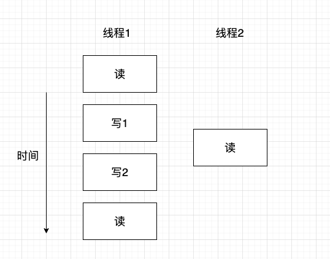

## 对于线程安全的理解

对于21世纪的人类，已经不满足于单核并行的模式；提高效率，增效降本才是我们向往的。程序设计中选择什么样的数据结构体是解决某个问题的关键。如果多线程使用到的数据结构体要满足并发，则涉及到数据的线程安全问题。

- 一种解决办法是选择单独的互斥元或外部锁来使数据结构体在某一时间段独占，且释放后没有残留。
- 另一种就是设计可以多线程同时访问的数据结构体。明显，后者在大部分场景是效率较高的。

先浅谈一下为什么需要线程同步？线程安全保障的是什么安全？

### 一、为什么需要线程同步

当多个线程共享相同的内存时，需要确保每个线程看到一致的数据视图。如果每个线程使用的变量都是其他线程不会读取和修改的，那么就不存在一致性问题。同样，如果变量是只读的，多个线程同时读取该变量也不会有一致性问题。但是，当一个线程可以修改的变量，其他线程也可以读取或者修改的时候，我们就需要对这些线程进行同步，确保他们在访问变量的存储内容是不会访问到无效的值。

当一个线程修改变量时，其他线程在读取这个变量时可能会看到一个不一致的值。在变量修改时间多于一个存储器访问周期的处理器架构中，当存储器读与存储器写着两个周期交叉时，这种不一致就会出现。

如下画一张图来举例说明：

如上图，假定线程 1 读取变量然后给这个变量赋予一个新的数值，但是写操作需要两个存储器周期。线程 2 在这两个存储器写周期读取这个变量时，他就会得到不一致的值。

我们在学习 C 语言基础的时候，就曾经说过，比如 `i++` 这个增量操作，不能一次性完成，而是分为三步。

1. 从内存单元中将 i 读入寄存器
2. 在寄存器中对变量做增量操作
3. 把新的值写回内存单元

如果变量 i 是一个共享的资源，这个时候多个线程看到的 i 变量视图就是不一致的，可能造成非预期的结果。

因此线程同步是必要的，我们简单总结下为什么需要线程同步？因此多个线程要读写同一资源，在绝大部分处理器架构中，读写操作可能需要消耗不止一个 CPU 时钟周期，导致每个线程可能看到不一致的数据视图。而这个资源通常是内存资源，并且我们现在的处理器通常是保护模式（区别于实模式），即有些内存用户不可访问，访问就会报错，出现 core。比如访问 NULL（0x00）。

所以为了保证线程访问数据的安全性，对于临界区的资源，保证多线程安全是很有必要的

### 二、使用锁保证线程安全的理解

为了使一个数据结构体是线程安全的，对于加锁的情况，那么就必须保证多个线程可以轮流存取互斥元保护的数据，也就是以线性的而非并发的存取数据，我们将其称为序列化。那么我们希望可以有更小的保护区域、更少的操作被序列化、以及更高的并发潜能。则应该保证安全的存取数据和允许真正的并发存取。关于安全的存取数据，我想到的细节：

1. 保证一个线程在操作数据结构时，这个过程中此数据结构体的变化过程别的线程应该看不到，别的线程只需要看到结果即可。
2. 当使用锁时，可以限制锁的范围、避免使用嵌套锁，降低产生死锁的机会。
3. 数据结构体的接口在外界看来是可竞争的，因此可提供具有完整操作的接口，不应是操作步骤
4. 数据结构体应该有一些限制条件，对于特殊的函数
   - 构造函数和析构函数需要以独占方式操作数据结构，需要保证在构造函数完成前或者析构函数开始后数据结构不被操作。
   - 其他的拷贝构造、swap函数等与别的操作同时被调用时是否安全
5. 代码在某处抛出异常或其他原因到线程直接退出，数据结构体如何保证不被破坏

关于实现并发，我这样想：

1. 锁的范围是否被限定？锁范围内的某些操作是否可以在锁外被执行？锁的范围是否足够小？
2. 数据结构体中能否使用不同的互斥元来保证数据或操作的安全？且多个锁如何避免死锁？
3. 操作时是否需要不同级别的保护？

因此可以总结为：我们需要能够以必然发生的序列化，来最大限度的实现并发。

### 三、无锁保证线程安全的理解

作为对比，具有锁的数据结构体，操作系统会完全阻塞一个线程（并且将这个线程的时间片分配给另一个线程）直到另一个线程执行了适当的动作将其解锁，可以是解锁互斥元、通知条件变量或其他操作。这个过程中必须有一个以上的线程处于阻塞状态，可以看到单纯以锁的角度来看，锁的目的就是通过互斥来阻止并发。而使用无锁数据结构体最主要的原因就是为了实现最大程度的并发。也即多线程操作无锁数据结构体，每个线程不敢做什么操作，都可以继续执行而不需要等待。

无锁的优点之二是健壮性，对于有锁数据结构体，一个线程持有一个锁时终止，那这个数据结构体就永远的被破坏了。而对于无锁数据结构体，一个线程的终止不会影响到其他线程的正常执行，最多这个线程的数据丢了。

无锁的方式是原子操作，还有一个重点是顺序问题，必须确保编译器优化时代码的执行顺序是预知的。

当然，无锁方式虽然不会死锁，但多个线程都试图修改数据结构体时，每个线程所做的修改都会要求其他线程的操作重新执行，这种情况就很难受，通常这是短暂的，但也依赖线程的精确调度；这种情况也会降低性能。因此我们希望这种情况能够在有限的操作步骤下结束。所以，尽管无锁有可能提高并发能力，减少线程等待时间，但也有可能降低整体的性能。

因此，针对具体的场景应该有不同的解决方案来支撑；我们需要确认收益大于代价。

### 四、简单总结

以上是我对线程安全的认识。我们先是说明了多线程访问同一资源，这个同一资源我们的专业术语将他称为“临界区”。我们希望临界区的数据，每个线程的都是一致的数据视图。如果不一致，就会出现某些线程获取到的数据是错误的，如果是内存指针，那将是很危险的事情。

接着我们阐述了两种方案。一种是加锁的方案。另一种是无锁的方案。在本节，我们只是针对这两种保证线程安全，做了说明，后面的小节，我将展开详细的说明。由于我们本次是“带你走进无锁化编程”，因此我们将详细讲述无锁化是如何保证线程安全的。有锁的方案大家自行了解。