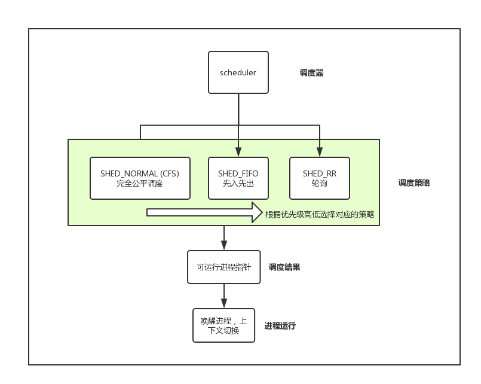

从 `Linux 2.5` 开始，内核使用 `O(1)` 调度算法。在数以十计的多处理器的环境下性能好，可扩展性强。但是对于交互进程，也就是哪些响应时间敏感的程序表现不佳。

于是，从 `linux 2.6` 开始，引入了新的进程调度算法，其中最为著名的是 “反转楼梯最后期限调度算法”（`Rotating Staircase Deadline scheduler, RSDL`），该算法吸取了队列理论，将公平调度的概念引入了 Linux 调度程序，最后称为“完全公平调度算法”，简称 CFS。

本文基于 `Linux 2.6.34` 研究一下 CFS。此内核中的调度器的设计是模块化的，这样做的好处是可以有针对性的选择不同的调度算法，其中最基本的调度算法为基于分时（`time sharing`）的技术。

### 一、架构

调度策略是模式化设计，调度器根据不同的进程依次遍历不同的调度策略，找到进程对应的调度策略，调度的结果即为选出一个可运行的进程指针，并将其加入到进程可运行队列中。

- CFS 完全公平调度：CFS 的出发点基于一个简单的理念，即所有进程实际占用 CPU 的时间应该是一致的，目的是确保每个进程公平的 CPU 使用比，即最大的利用了计算资源
- FIFO 先入先出队列：不基于时间片调度，处于可运行状态的 SCHED_FIFO 级别的进程比 SCHED_NORMAL 有更高优先级得到调度，一旦 SCHED_FIFO 级别的进程处于可执行的状态，他就会一直运行，直到进程阻塞或者主动释放
- RR（Round-Robin）：SCHED_RR 级别的进程在耗尽事先分配的时间片之后就不会继续执行。即可以理解为带时间片的 SCHED_FIFO

FIFO 和 RR 调度算法都为静态优先级。也就是说，内核不为实时进程计算动态优先级，这样保证了优先级高的实时进程总能抢到优先级比他低的进程。

### 二、进程调度的实现

主要分为 4 个部分：时间记账、进程选择、调度器、睡眠和唤醒

#### 1. 时间记账

所有的调度器都必须对进程的运行时间做记账。CFS 不再有时间片的概念，他维护了每个进程运行的时间记账，因为每个进程只在公平分配给他的处理器时间内运行。

vruntime：进程的虚拟运行时间。和进程的 nice 值有关系。越低的 nice 值，表示越高的优先级，那么可以获得更多的处理器使用权重。同时 vruntime 被定义在 `struct sched_entity` 结构体中。

#### 2. 进程选择

当 CFS 调度器选择下一个要进行调度的进程时，就会选择具有最小 vruntime 的进程。内核使用红黑树，以 vruntime 为排序条件，存储着任务的运行情况。

当选择最小 vruntime 的进程时，直到取红黑树最左的节点即可。

#### 3. 调度器

进程调度器的总体流程为：选择一个合适的调度策略，通过调度策略选出下一个需要被调度的进程，然后进行一次上下文切换，将进程置为运行态。此时选中的进程要么开始运行，要么在运行队列中等待执行。

#### 4. 睡眠和唤醒

休眠（被唤醒）状态的进程处于不可执行的状态。进程休眠的原因有多种多样，但通常来说都是等待某一事件的发生，例如等待 IO，等待设备输入等等。

内核对于休眠和唤醒的操作如下：

- 休眠：进程首先把自己标记为休眠状态（`TASK_INTERRUPTIBLE`），然后从可执行红黑树中移除该进程，并将进程放入等待队列
- 唤醒：进程被置为可执行状态（`TASK_RUNNING`），进程从等待队列移入可执行红黑树中

休眠或者阻塞状态有两种：可中断休眠（`TASK_INTERRUPTIBLE`）、不可中断休眠（`TASK_UNINTERRUPTIBLE`）。通常进程的休眠，为可中断休眠，即进程进入休眠，等待某一事件发生，一旦事件发生，或者满足条件，内核将会把进程状态置为运行，并将进程从等待队列中移除。

### 三、抢占和上下文切换

上下文切换，也就是 CPU 将一个可执行的进程切换到另一个可执行的进程，其中有两个比较关键的步骤

- switch_mem：把虚拟内存从上一个进程映射切换到新进程中
- switch_to：切换进程的处理器状态信息。包括保护、恢复栈信息和寄存器信息等

内核会在一定的情况下触发调度，比如：

- 用户态抢占（重新调度）
  - 从系统调用返回用户空间时，比如 read、write、syscall 等
  - 从中断处理程序返回用户空间时，比如 硬件中断，时钟中断 等
- 内核态抢占（重新调度）
  - 中断处理程序正在执行，且返回内核空间之前
  - 内核任务显式的调用 schedule 进行调度
  - 内核任务阻塞时

### 四、总结

简单来说，CFS 是动态计算程序优先级的一种调度算法，其内部算法核心是选取 vruntime 最小的进程进行调度运行，而维护最小 vruntime 的进程，使用了红黑树，而计算 vruntime 使用了 nice 值进行加权。

Linux 内核的调度程序 CFS，尽可能的满足了各个方面的需求，并找到了一种在调度周期和吞吐量之间的平衡。

