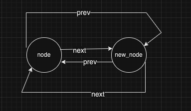
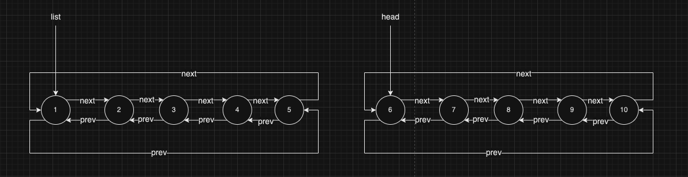
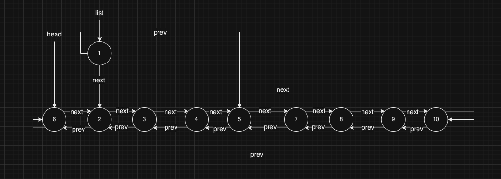

链表是一种存放和操作可变数量元素（常称为节点）的数据结构。他们在内存中无须占有连续内存块，内存块之间通过指针连接。本文探讨一下 Linux 中链表的实现。

### 一、链表的定义

Linux 内核中，**不是将数据结构塞入链表，而是将链表节点塞入数据结构**。

比如我们之前定义链表，一般是有了结构体，然后在此结构体中增加 “前向指针” 或者“ 后向指针”，以达到链表将节点串联起来的目的。而 Linux 内核中，是将链表节点塞入数据结构体中，以达到同样的效果。

链表代码在头文件：`<linux/include/linux/list.h>` 中声明，数据结构如下：

```c
struct list_head {
	struct list_head *next, *prev;
};
```

将此链表节点塞入数据结构中，即可得到一个链表。那如何去操作这个链表呢？内核提供了一些方法。这些方法有一个统一的特点：他们只接受 list_head 结构作为参数。使用宏 `container_of()` 可以很方便的从链表指针找到父结构中包含的任何变量。

因为在 C 语言中，一个给定结构中的变量偏移在编译时，地址就被 ABI 确定了。如下这样的宏定义

```c
#define container_of(ptr, type, member) ({                \
		const typeof( ((type*)0)->member ) * __mptr = (ptr);  \
		(type*)( (char*)__mptr - offsetof(type, member) );    \
})
```

下面我们实际定义一个结构体体验一下。也就是将链表塞入我们定义的数据结构中：

```c
struct dummyStruct {
		int dummy_node;         // 结构体节点
		struct list_head list;  // 链表节点
};
```

链表需要在使用的时候初始化，有两种方式，一种是运行时初始化，另外一种是编译器静态创建。如下：

```c
struct dummyStruct* node = kmalloc(sizeof(*node), GFP_KERNEL);
node->dummy_node = 10;
INIT_LIST_HEAD(&node->list);   // 初始化链表节点（运行时初始化）

struct dummyStruct static_node = {
		.dummy_node = 10,
		.list = LIST_HEAD_INIT(static_node.list),   // 静态初始化链表节点
}
```

那我们继续看看初始化 `LIST_HEAD_INIT ` 宏定义都干了什么事情？

```c
#define LIST_HEAD_INIT(name) { &(name), &(name) }
```

到这里，我们明白了，初始化链表节点的时候，会将链表节点中的前向指针、后向指针都指向自己。也就是说链表是一个循环链表。

### 二、操作链表

一般数据结构都是要有增删改查操作的，链表也不例外。下面我们来探讨这几种操作

#### 1. 向链表增加一个节点

```c
static inline void list_add(struct list_head *new, struct list_head *head)
{
	__list_add(new, head, head->next);
}

static inline void __list_add(struct list_head *new,
			      struct list_head *prev,
			      struct list_head *next)
{
	next->prev = new;
	new->next = next;
	new->prev = prev;
	prev->next = new;
}
```

给出一个需要插入的节点 new，以及要插入的位置 head。此实现是在 head 的后面插入节点 new。然后分别将对应的前向指针、后向指针进行补齐填充即可。

那我们注意了，我们考虑边界情况，假如 head 是链表的最后一个节点。这样插入岂不是对空指针解引用？这不是 bug 嘛？NO，刚才我们提到，使用宏定义 `LIST_HEAD_INIT` 初始化链表节点时，会让链表节点的前向指针、后向指针指向自己。我们说链表是一个循环链表。  那么是如何形成环形链表呢？我们来列举一下。

只有一个节点时，节点的前向指针、后向指针都指向自己。那么此时插入一个新节点时，通过以上的逻辑，可以得到如下的环形链表：



还有一个方法是添加一个新节点到链表末尾。

```c
static inline void list_add_tail(struct list_head *new, struct list_head *head)
{
	__list_add(new, head->prev, head);
}
```

如上的实现就是 new 节点插入到 head 节点的前面。如果我们认为 head 节点是链表的头节点的话，而且由于链表是环形链表。所以添加到 head 节点的前面，就相当于添加到链表的尾部。

因此，我们可以扩展一下，当我们总把最后的一个节点当作 head 的话，那么 `list_add` 此方法是不是就可以实现一个栈。

如果我们总把第一个节点当作 head 的话，那么每次都往第一个节点前面插入节点，那么 `list_add_tail` 方法就可以实现一个队列。

所以环形链表的适用处特别多。

#### 2. 从链表中删除一个节点

我们先来看源码实现：

```c
#define LIST_POISON1  ((void *) 0x00100100)
#define LIST_POISON2  ((void *) 0x00200200)

static inline void __list_del(struct list_head * prev, struct list_head * next)
{
	next->prev = prev;
	prev->next = next;
}

static inline void list_del(struct list_head *entry)
{
	__list_del(entry->prev, entry->next);
	entry->next = LIST_POISON1;
	entry->prev = LIST_POISON2;
}
```

从链表中删除一个节点，需要传入待删除的节点指针 entry。而 Linux 内核内部仅仅是将这个节点从链表中取出，并不会释放这个节点所占用的内存空间。所以在使用的时候，别忘了从链表中删除完节点后，还要释放 entry 节点所占有的空间。

还有一点，从链表中删除节点后，会将此节点的 next、prev 指针置为一个指定的非法值。

```
#define LIST_POISON1  ((void *) 0x00100100)
#define LIST_POISON2  ((void *) 0x00200200)
```

使用这些指定的非 NULL 指针，可以快速发现问题。比如如果有人使用这个已经被删除的节点，那么就出现 page fault，甚至 core。当然使用 NULL 指针也可以做到这一点，不过我觉得 NULL 指针用的太过广泛，不利于排查问题。

#### 3. 移动链表节点

此方法的功能是：从一个链表取出某个节点，然后放在另一个链表中。

```c
static inline void list_move(struct list_head *list, struct list_head *head)
{
        __list_del(list->prev, list->next);
        list_add(list, head);
}
```

其中第一个参数 list 就是待转移的节点，先从原链表中删除，然后将此节点加入到 head 所在的链表中，并且加入到 head 节点之后。

我们再来看另外一个方法。此方法的功能是：从一个链表取出某个节点，然后放入另一个链表中，只不过是放入另一个链表的末尾（这里假定的是 head 为链表的头节点）

```c
static inline void list_move_tail(struct list_head *list,
				  struct list_head *head)
{
        __list_del(list->prev, list->next);
        list_add_tail(list, head);
}
```

#### 4. 合并链表

将两个未连接的链表合并在一起。如下实现

```c
static inline void __list_splice(struct list_head *list, struct list_head *head)
{
	struct list_head *first = list->next;
	struct list_head *last = list->prev;
	struct list_head *at = head->next;

	first->prev = head;
	head->next = first;

	last->next = at;
	at->prev = last;
}

static inline void list_splice(struct list_head *list, struct list_head *head)
{
	if (!list_empty(list))
		__list_splice(list, head);
}
```

如上实现，是将 list 这个链表插入到 head 链表中。不过需要注意的是，不包括 list 本身的这个节点。意思就是说：假设 list 链表是 `1,2,3,4,5` 这 5 个元素，head 链表是 `6,7,8,9,10`。合并完之后，head 链表会变成 `6,2,3,4,5,7,8,9,10`。

我们画个图说明一下：



经过合并之后，会变成如下的样子：



所以一定要注意，使用此方式，合并的时候，被合并的链表并不包含当前节点。并且会插入 head 链表中 head 节点的后边。

这么说的话，合并完之后，list 节点还指向原来的链表。是一个较为尴尬的存在，因为 list 节点所指向的链表已经合并到 head 链表中，于是内核还提供了另外一个方法，用于合并完之后将 list 节点进行初始化。

```c
static inline void list_splice_init(struct list_head *list,
				    struct list_head *head)
{
	if (!list_empty(list)) {
		__list_splice(list, head);
		INIT_LIST_HEAD(list);
	}
}
```

如上的实现中，这样合并后，并且将 list 节点初始化后，就不存在通过 list 节点修改 head 链表的情况了。list 节点此时成为了一个单节点的循环链表。

不过，个人感觉这种实现不太好，既然是合并链表，那就应该将链表中所有元素都给合并了，留一个元素做什么？这里需要考究一下原因。如果有合并所有元素的场景，只能设置一个傀儡节点做链表的头节点了，合并完再释放掉傀儡节点即可。

#### 5. 遍历链表

遍历链表提供了访问数据的功能。时间复杂度为 `O(n)`，n 是链表元素数量。

最简单的方法是使用 `list_for_each()` 宏，需要两个参数，第一个参数用来指向当前项，第二个参数是待遍历的链表的头节点。每次遍历中，第一个参数在链表中不断移动指向下一个元素，直到链表中所有元素都被访问为止。

```c
#define list_for_each(pos, head) \
	for (pos = (head)->next; prefetch(pos->next), pos != (head); \
        	pos = pos->next)
```

我们也看到了，这个宏他不会遍历当前节点。他上来就让 pos 指针指向了 `head->next`，而且结束条件是 `pos != head`，也就是根本不会遍历当前节点。

清楚这一点之后，我们还需要注意，这个宏只是在遍历链表，但是我们需要的是链表所在的结构体，那个结构体中的内容才是我们想要的数据。我们如何通过链表节点获取到结构体中的数据呢？是使用 `list_entry` 宏。

```c
#define container_of(ptr, type, member) ({			\
        const typeof( ((type *)0)->member ) *__mptr = (ptr);	\
        (type *)( (char *)__mptr - offsetof(type,member) );})

#define list_entry(ptr, type, member) \
	container_of(ptr, type, member)
```

在 C 语言中，一个给定结构中的变量偏移在编译时，地址就被 ABI 确定了。也就是说，一个结构体中的各个字段在编译时，字段位置是固定的，只要给定这个结构体内存地址，以及结构体定义的结构，那么可以确定所有字段的在结构体的位置，即内存地址。通过 offsetof 可以确定出来结构体成员在结构体中的偏移。

因此，我们的遍历方法如下：

```c
struct dummyStruct {
		int dummy_node;         // 结构体节点
		struct list_head list;  // 链表节点
};

struct list_head* p;
struct dummyStruct* f;
list_for_each(p, &f_list) {  // f_list 为链表头节点
	f = list_entry(p, struct dummyStruct, list);
	// 这里可以操作 f 所指向的结构体
}
```

下面再来介绍一种更为方便的方法

```c
#define list_for_each_entry(pos, head, member)				\
	for (pos = list_entry((head)->next, typeof(*pos), member);	\
	     prefetch(pos->member.next), &pos->member != (head); 	\
	     pos = list_entry(pos->member.next, typeof(*pos), member))
```

使用 `list_for_each_entry` 宏更加方便一点，pos 参数是一个指向链表节点的指针，也是 `list_entry` 宏的返回值。head 是一个指向链表头节点的指针，即遍历开始位置。member 则是结构体中 list_head 为类型的变量名，用于找到链表下一个节点的位置。

其中 prefetch 暂时不用管，他用于从内存预取数据到寄存器，为了加快执行速度。和链表本身的实现没有什么关系。我们来看看他的用法

```c
struct dummyStruct* f;
list_for_each_entry(f, &f_list, list) {  // f_list 为链表头节点
	// 直接使用 f 所指向的结构体
}
```

**反向遍历链表**

宏 `list_for_each_entry_reverse` 可以用来反向遍历链表。

```
#define list_for_each_entry_reverse(pos, head, member)			\
	for (pos = list_entry((head)->prev, typeof(*pos), member);	\
	     prefetch(pos->member.prev), &pos->member != (head); 	\
	     pos = list_entry(pos->member.prev, typeof(*pos), member))
```

因为链表是环形双向链表，有前向指针、后向指针。所以反向遍历的时候，只需要使用 prev 指针即可。

反向遍历在很多场景中都有用途，主要有两大场景。第一如果我们知道要寻找的节点可能在我们搜索的起始点的前面，那么反向查找就很快速，这是性能的提升。第二如果我们使用链表实现堆栈，那么我们需要向前遍历才能达到先进先出（`LIFO`）。

**边遍历边删除**

以上的两种方法在遍历的时候不能删除，因为他还需要遍历到的当前节点找到后一个节点、或者前一个节点。于是 Linux 内核提供了一种安全的遍历方式，即通过在潜在的删除操作之前存储 next（或者 prev）指针到一个临时变量中，以便可以执行删除操作。

```c
#define list_for_each_entry_safe(pos, n, head, member)			\
	for (pos = list_entry((head)->next, typeof(*pos), member),	\
		n = list_entry(pos->member.next, typeof(*pos), member);	\
	     &pos->member != (head); 					\
	     pos = n, n = list_entry(n->member.next, typeof(*n), member))
```

如上实现，多了一个 n 参数，其实就是 next 指针，需要我们提供 next 指针，而 next 指针和 pos 指针是同样的类型。而 `list_for_each_entry_safe` 宏将 next 指针存储起来，这样我们就可以安全的删除当前项。

这里在强调一遍，这里的接口都不是线程安全的。遍历的同时删除节点，保证的是“避免使用前释放的错误”，而不能保证线程并发的安全。

### 三、举例

我们熟悉了接口的实现后，再来整体看看如何使用链表。下面的例子我们将创建一个链表，并且对此链表进行增删改查。

```c
#include <stddef.h>
#include <stdio.h>
#include <malloc.h>

#define __KERNEL__
#include "list.h"

struct BizStu {
    int id;
    struct list_head list;
};

// 遍历
void for_each_list(struct BizStu* obj) {
    struct list_head* pos = NULL;
    printf("%d ", list_entry(&obj->list, struct BizStu, list)->id);
    list_for_each(pos, &obj->list) {
        struct BizStu* node = list_entry(pos, struct BizStu, list);
        printf("%d ", node->id);
    }
    printf("\n");
}

int main() {
    // 创建结构体，并初始化链表
    struct BizStu* head1 = malloc(sizeof(struct BizStu));
    head1->id = 0;
    INIT_LIST_HEAD(&head1->list);

    // 添加结构体节点
    for (int i = 1; i < 10; i++) {
        struct BizStu* tmp_node = malloc(sizeof(struct BizStu));
        tmp_node->id = i;
        INIT_LIST_HEAD(&tmp_node->list);
        list_add(&tmp_node->list, &head1->list);
    }
    // 打印链表
    for_each_list(head1);  // 0 9 8 7 6 5 4 3 2 1

    // 从链表中删除节点
    list_del(head1->list.next); // 删除 9 这个节点
    // 打印链表
    for_each_list(head1);  // 0 8 7 6 5 4 3 2 1
    
    struct BizStu* head2 = malloc(sizeof(struct BizStu));
    head2->id = 100;
    INIT_LIST_HEAD(&head2->list);
    for (int i = 200; i < 500; i += 100) {
        struct BizStu* tmp_node = malloc(sizeof(struct BizStu));
        tmp_node->id = i;
        INIT_LIST_HEAD(&tmp_node->list);
        list_add(&tmp_node->list, &head2->list);
    }
    for_each_list(head2);  // 100 400 300 200
    // 移动链表节点
    list_move(head2->list.next, &head1->list);  // 将 400 从 head2 链表中移动到 head1 链表中
    for_each_list(head1);  // 0 400 8 7 6 5 4 3 2 1
    for_each_list(head2);  // 100 300 200

    // 合并链表
    list_splice_init(&head2->list, &head1->list); // 将 head2 链表合并到 head1 中来
    for_each_list(head1);  // 0 300 200 400 8 7 6 5 4 3 2 1
    for_each_list(head2);  // 100

    // 边遍历边删除
    int count = 0;
    struct BizStu *pos = NULL, *next = NULL;
    printf("%d ", head1->id);
    list_for_each_entry_safe(pos, next, &head1->list, list) {
        if (count > 2) {
            list_del(&pos->list);
        }
        printf("%d ", pos->id);
        count++;
    }
    printf("\n");  // 0 300 200 400 8 7 6 5 4 3 2 1
    
    // 上面已经删除完了，再来遍历一次看效果
    for_each_list(head1);  // 0 300 200 400
    return 0;
}
```

其中头文件 `list.h` 需要做一些修改，已经打包上传到 git 了。

git 地址：`https://github.com/noahyzhang/kernel_test`