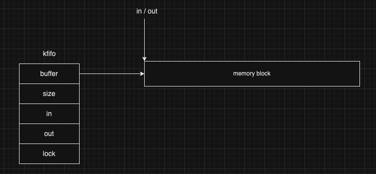
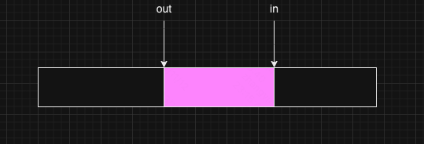
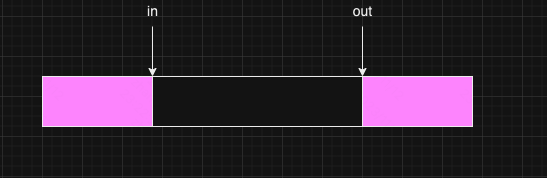

队列是一种定义了 FIFO 先进先出的结构。Linux 内核的队列实现在 `kfifo.c` 中。本文以 `Linux 2.6.12` 版本来进行讨论。

我们还是老样子，从底层实现看起，然后再来总结规律、适用场景。

### 一、创建队列

创建队列的实现如下：

```c
struct kfifo *kfifo_init(unsigned char *buffer, unsigned int size,
			 unsigned int __nocast gfp_mask, spinlock_t *lock)
{
	struct kfifo *fifo;

	/* size must be a power of 2 */
	BUG_ON(size & (size - 1));

	fifo = kmalloc(sizeof(struct kfifo), gfp_mask);
	if (!fifo)
		return ERR_PTR(-ENOMEM);

	fifo->buffer = buffer;
	fifo->size = size;
	fifo->in = fifo->out = 0;
	fifo->lock = lock;

	return fifo;
}

struct kfifo *kfifo_alloc(unsigned int size, unsigned int __nocast gfp_mask, spinlock_t *lock)
{
	unsigned char *buffer;
	struct kfifo *ret;

	/*
	 * round up to the next power of 2, since our 'let the indices
	 * wrap' tachnique works only in this case.
	 */
	if (size & (size - 1)) {
		BUG_ON(size > 0x80000000);
		size = roundup_pow_of_two(size);
	}

	buffer = kmalloc(size, gfp_mask);
	if (!buffer)
		return ERR_PTR(-ENOMEM);

	ret = kfifo_init(buffer, size, gfp_mask, lock);

	if (IS_ERR(ret))
		kfree(buffer);

	return ret;
}
```

创建一个新的队列，并且初始化大小为 size。内核会使用 gfp_mask 标识分配队列，这是一个内存分配的标识。参数中还有一个锁。

首先将用户传入的 size 参数四舍五入到下一个 2 的幂。然后使用 kmalloc 分配 size 大小的空间，gfp_mask 暂时不用管。最后拿到申请出来的空间构造出来队列，如果构造成功，返回队列指针，如果构造失败，返回一个错误的指针。

如何构造队列呢？首先要保证 size 为 2 的幂，然后再给 kfifo 结构体给定内存空间，并初始化，即可返回。kfifo 结构体的定义如下：

```c
struct kfifo {
	unsigned char *buffer;	/* the buffer holding the data */
	unsigned int size;	/* the size of the allocated buffer */
	unsigned int in;	/* data is added at offset (in % size) */
	unsigned int out;	/* data is extracted from off. (out % size) */
	spinlock_t *lock;	/* protects concurrent modifications */
};
```

- buffer 是数据的缓冲区
- size 是已经申请的 buffer 的大小
- in 是入口偏移。指的是下一次入队列时的位置
- out 是出口偏移。指的是下一次出队列时的位置
- lock 用于保护并发修改

注意：出口偏移总是小于等于入口偏移，否则无意义，因为那样说明要出队列的元素根本还没有入队列。

话说回来，队列的创建历经了两次空间的申请。一次是申请 kfifo 队列结构体本身，另一次是申请数据缓存区。然后维护入口偏移和出口偏移。创建好的队列如下图所示：



### 二、进队列

插入元素到队列使用 `kfifo_put` 方法来实现：

```c
static inline unsigned int kfifo_put(struct kfifo *fifo, unsigned char *buffer, unsigned int len)
{
	unsigned long flags;
	unsigned int ret;

	spin_lock_irqsave(fifo->lock, flags);

	ret = __kfifo_put(fifo, buffer, len);

	spin_unlock_irqrestore(fifo->lock, flags);

	return ret;
}
```

在插入元素到队列时，需要加锁。缓冲区是一个内存块，在同一个内存块上操作，我们必须要保证元素进队列、元素出队列时，内存块的一致性。在锁内的临界区才是我们真正的进队列的操作。

```c
unsigned int __kfifo_put(struct kfifo *fifo, unsigned char *buffer, unsigned int len)
{
	unsigned int l;

	len = min(len, fifo->size - fifo->in + fifo->out);

	/* first put the data starting from fifo->in to buffer end */
	l = min(len, fifo->size - (fifo->in & (fifo->size - 1)));
	memcpy(fifo->buffer + (fifo->in & (fifo->size - 1)), buffer, l);

	/* then put the rest (if any) at the beginning of the buffer */
	memcpy(fifo->buffer, buffer + l, len - l);

	fifo->in += len;

	return len;
}
```

如上所示，此操作是元素进队列的操作，该方法把 buffer 指针所指向的 len 字节数据拷贝到 fifo 所指的队列中。这里就牵涉到 fifo 队列的缓冲区是否放得下 buffer 的问题。



如图，粉色部分已经写入元素了，其他部分尚未写入，是空闲的。注意，图中的 in、out 可能是 `N * fifo->size + in` 和 `M * fifo->size + out`。但总归 in 是要大于 out 的。

- 首先，`fifo->size - fifo->in + fifo->out` 标识 fifo 缓冲区还剩下多少空间可以写，然后和 len 比较，取一个最小值，最为新的 len 长度。这个 len 就是最终要写入的数据大小。

- 我们可以看出来，fifo 缓冲区 `[out, in]` 这一段是有值的，不可写入。然后 `[0, out]、[in, fifo.size]` 这两个区间是可以写入的空间内存块。

- 于是乎，我们先写入 `[in, fifo.size]` 这个区间，如果这个区间可以写得下，那就直接写这个区间。所以有了这两句代码：

  ```
  	l = min(len, fifo->size - (fifo->in & (fifo->size - 1)));
  	memcpy(fifo->buffer + (fifo->in & (fifo->size - 1)), buffer, l);
  ```

  其中 `(fifo->in & (fifo->size - 1))` 这句的含义来解释下。我们知道 `fifo->size` 的值为 2 的幂，那么其实这句代码的结果就是 `fifo->in` 除以 `fifo->size` 后的余数，这是因为用 2 的幂做位运算相当于对 2 的幂取模。

  于是整体 `min(len, fifo->size - (fifo->in & (fifo->size - 1)))` 就计算出可以安全添加到 `[in, fifo.size]` 这个区间的元素数量。

  然后使用 memcpy 将元素拷贝到缓冲区，也即 `[in, fifo.size]` 这个区间。

- 如果 buffer 中元素没有拷贝完，则继续将 buffer 中剩余元素拷贝到 `[0, out]` 这个区间。

- 最后给 `fifo->in` 加上总共拷贝了多少元素。从这里我们可以看出 `fifo->in` 的值有可能是大于 `fifo->size`（缓冲区大小）的

最后返回的也是本次进队列的元素个数。

### 三、出队列

出队列则是利用了 out 出口偏移这个字段。也需要加锁来保证读写 fifo 缓冲区数据安全。

```c
static inline unsigned int kfifo_get(struct kfifo *fifo,
				     unsigned char *buffer, unsigned int len)
{
	unsigned long flags;
	unsigned int ret;

	spin_lock_irqsave(fifo->lock, flags);

	ret = __kfifo_get(fifo, buffer, len);

	/*
	 * optimization: if the FIFO is empty, set the indices to 0
	 * so we don't wrap the next time
	 */
	if (fifo->in == fifo->out)
		fifo->in = fifo->out = 0;

	spin_unlock_irqrestore(fifo->lock, flags);

	return ret;
}

```

同样的，在出队列时，需要加锁。这里有一点小优化，如果 fifo 为空，则说明 `fifo->in` 和 `fifo->out` 相等，此时我们让入口偏移和出口偏移都设置为 0。再来看真正的出队列的操作。

```c
unsigned int __kfifo_get(struct kfifo *fifo, unsigned char *buffer, unsigned int len)
{
	unsigned int l;

	len = min(len, fifo->in - fifo->out);

	/* first get the data from fifo->out until the end of the buffer */
	l = min(len, fifo->size - (fifo->out & (fifo->size - 1)));
	memcpy(buffer, fifo->buffer + (fifo->out & (fifo->size - 1)), l);

	/* then get the rest (if any) from the beginning of the buffer */
	memcpy(buffer + l, fifo->buffer, len - l);

	fifo->out += len;

	return len;
}
```

- 首先通过 `fifo->in - fifo->out` 来计算出缓冲区已经写入了多少元素，和用户传入的 len 取最小值。
- 因为缓冲区是一个循环写入的缓冲区，有可能出现的情况是如下：



- 可不要误解哈， out 的值是一定小于 in 的值的。需要注意：图中的 in、out 是 `N * fifo->size + in` 和 `M * fifo->size + out`。总归 in 是要大于 out 的。
- 但这种情况，我们只能先取 `[out, fifo->size]` 这个区间的元素，再来取 `[0, in]` 这个区间的元素。思路和进队列的思路完全一致。在此不多说明
- 最后给 `fifo->out` 加上取出的元素数量

返回真正取出的元素数量。

### 四、重置队列

重置队列的过程比较简单，就是将 `fifo->in` 和 `fifo->out` 置为 0。当然也是在加锁的前提下的。

```c
static inline void __kfifo_reset(struct kfifo *fifo)
{
	fifo->in = fifo->out = 0;
}


static inline void kfifo_reset(struct kfifo *fifo)
{
	unsigned long flags;

	spin_lock_irqsave(fifo->lock, flags);

	__kfifo_reset(fifo);

	spin_unlock_irqrestore(fifo->lock, flags);
}
```

### 五、队列长度

求取队列长度也比较简单，只需要 `fifo->in - fifo->out` 即可得到当前队列中元素的数量。当然也需要加锁，因为需要保证在求队列长度时，别的方法不能修改缓冲区大小。

```c
static inline unsigned int __kfifo_len(struct kfifo *fifo)
{
	return fifo->in - fifo->out;
}

static inline unsigned int kfifo_len(struct kfifo *fifo)
{
	unsigned long flags;
	unsigned int ret;

	spin_lock_irqsave(fifo->lock, flags);

	ret = __kfifo_len(fifo);

	spin_unlock_irqrestore(fifo->lock, flags);

	return ret;
}
```

### 六、说明

队列整体比较简单，这一版的队列实现中也没有支持扩容、缩容。只能在创建队列时，设定好缓冲区大小。其实，特别像我们所说的生产者消费者模型，缓冲区作为中介，生产者和消费者都来更新缓冲区的入口偏移、出口偏移等。