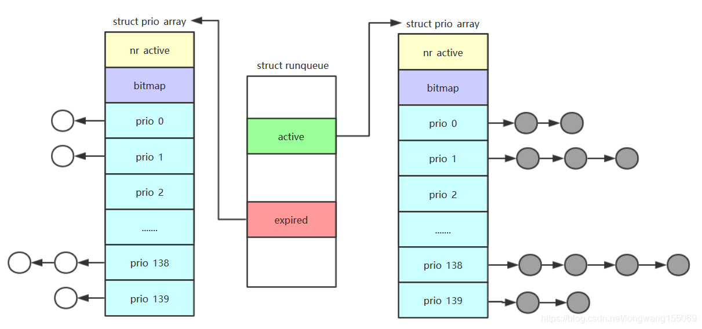

Linux 从 2.6 开始引入了 `O(1)` 调度器

### 一、工作原理



- 系统中的 runqueue 运行队列，每个 CPU 都有一个 runqueue。这样在 SMP 系统中可以有效的避免多个 CPU 去访问同一个 runqueue。
- 每一个 runqueue 运行队列维护了两个结构体。一个是 active 结构体，存储的是运行的进程；另一个是 expired 结构题，存储的是时间片用完的进程。
- active 和 expired 结构体中都有多个链表，分别存储着不同优先级的进程。相同优先级的进程挂在同一条链表上
- 同时在 active 和 expired 结构中，还有一个 bitmap 结构，用来指示哪些进程可以运行。
- 当 active 结构中无进程可运行时，说明系统中所有进程的时间片都已经耗光，这时候只需要变换 active 和 expire 的指针，即可运行原 expire 结构中的进程。

### 二、核心算法

如下几行代码比较核心。

```
array = rq->active;	
idx = sched_find_first_bit(array->bitmap);
queue = array->queue + idx;
next = list_entry(queue->next, task_t, run_list);
```

首先在 runqueue 的 active 队列中的 bitmap 中找到一个下标，这个下标就是对应的优先级，然后获取到对应优先级的链表，然后从中获取一个进程。接下来就是执行进程切换，进程调度。

#### 关于优先级

进程的优先级分为静态优先级和动态优先级。普通优先级时进程创建时默认设置的优先级，动态优先级会在进程运行时经过动态的调整。

在系统运行中，会根据进程的情况调节其优先级。比如当一个进程经常睡眠，则会增加他的优先级；当一个进程经常占用 CPU，则需要降低其优先级。

#### 关于时间片

当一个进程的时间片消耗完时，需要将进程从 active 队列中移除，同时设置需要重新调度的标志。还需要计算此进程的优先级、时间片等信息。还要判断是否为交互式进程，或者此进程是不是ji


