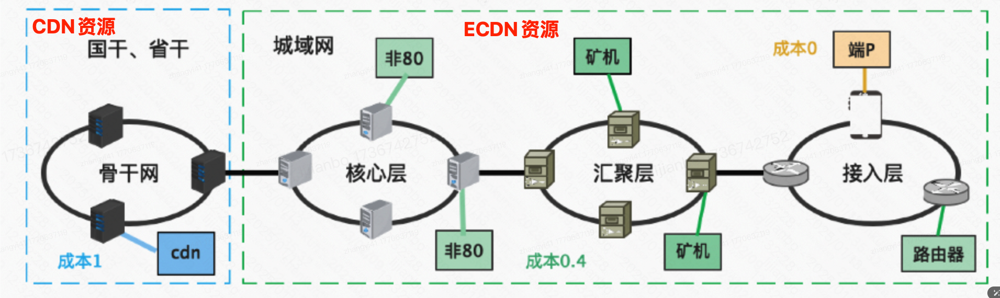
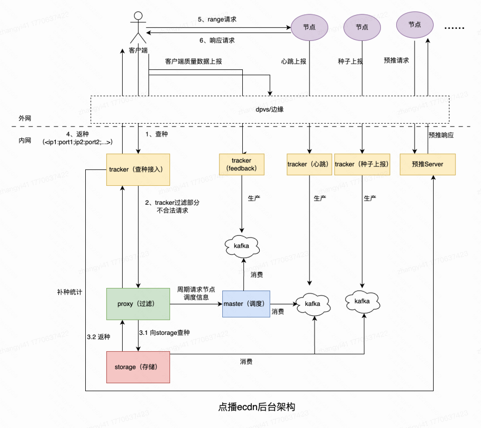
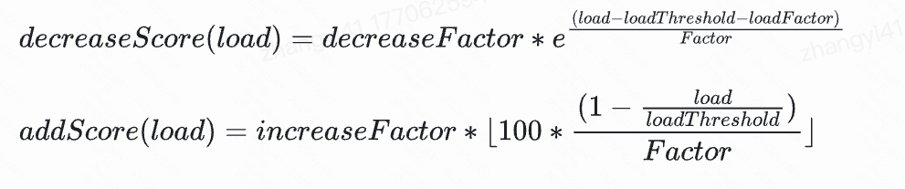
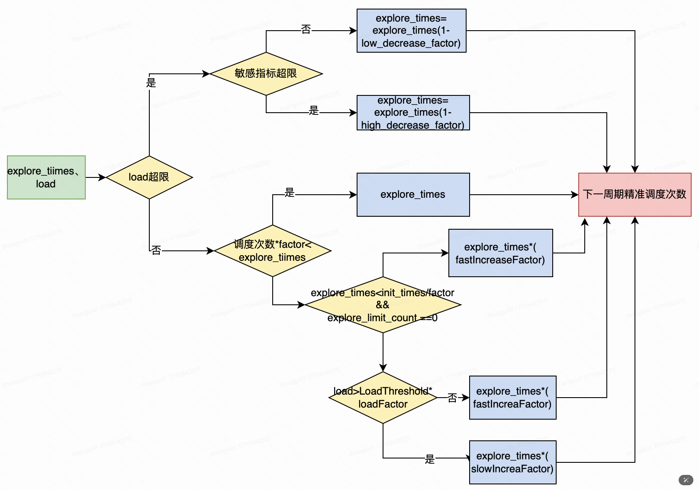
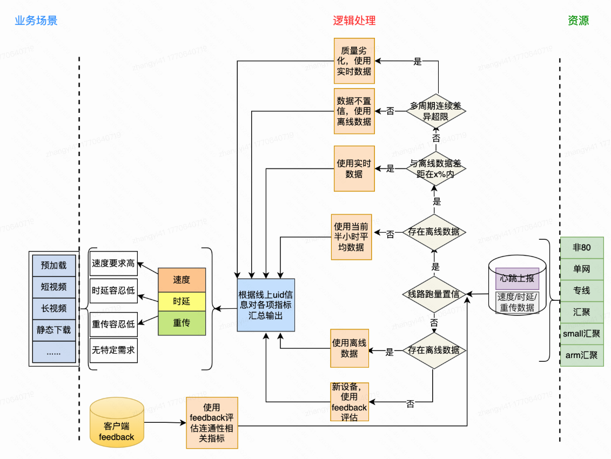

### 一、PCDN定义

PCDN是什么？

- 海量、异构、廉价、资源不稳定
- 根据不同类型资源的特点，结合实际情况，使用适当的策略把类型多样的低成本带宽资源充分利用起来
- 探索和CDN结合、互相补充的模式，优化用户体验。

PCDN资源类型

- 专线：x86架构设备，单线带宽>1Gbps，一般是机房设备
- 汇聚x86：x86架构设备，单机汇聚多线路，单线路带宽 > 100Mbps
- small_x86：x86 架构设备，单线路带宽 > 30Mbps
- arm：arm架构的设备，单线路带宽 > 20Mbps。如京东盒子，迅雷盒子、小度音响等
- 非80：质量达不到CDN标准的一些自建机房，端口为非80，使用点播server服务
- 单网：三方CDN，使用域名方式提供服务

### 二、PCDN架构

核心模块

- Tracker：承接接入流量（dpvs或边缘）、请求上报（服务查种、feedback、心跳、种子上报）。并向后转发至proxy、或对应kafka
- Master：调度策略中控，消费节点心跳，并对节点进行负载调度控制。
- Proxy：调度策略执行，从Master获取调度数据并执行，响应Tracker查种请求
- Storage：种子存储，消费节点上报心跳及种子数据，响应Proxy查种请求
- 预推Server：计算种子份额，在节点请求时推送文件

### 三、调度逻辑

#### 1. PCDN的挑战

- 节点异构：节点数量较多，目前机器有13万，线路数有17万+，上行能力分布在 20M-25G之间。100M以下的线路占比69%
- 设备不稳定：设备环境恶劣，网络硬件不稳定，混跑
- 资源分布与用户需求不匹配：免流跨省结算问题，资源分布参差不齐，部分省份资源冗余，而部分省份缺口较大。

#### 2. 调度体系

##### a. 归一化的负载评价

点播PCDN有20+指标用于调度控制。如何评估每一个指标并将所有指标有效组织在一起，保障节点按照预设水位跑量。是一个比较复杂的系统问题。PCDN采用 load 指标评价设备负载，把所有质量指标全部映射为 load，并且取 max 最终得到归一化的 load 指标。

这是一个“带拐点的指数惩罚映射”函数。

- 当 x = limit 时，`load = loadThreshold + wholeFactor`。刚好到达limit这个参考线/容量线时，基准的load
- 当 x > limit 时，指数项 e 的指数为正，load 会指数级增长。表示指标超限后，系统认为风险上升，需要强烈惩罚/降权。
- 当 x < limit 时，指数为负，指数项趋于0，load会逐渐贴近 loadThreshold。表示指标在安全区间内，load低且安全更平滑，不会因为小波动就大幅抖动。

##### b. 调度控制算法

灵敏的分数控制：使用概率调度进行周期内频控和区域控制。保证设备在质量相同情况下优先就近服务，同时避免设备跑超。采用线性增加，指数减少方式，做到对节点的灵活控制。

准确的次数控制：使用次数调度进行调度控制，保证设备的调度上限只与上行能力与服务质量有关。并且通过分数控制使请求在单位周期尽量分散。

##### c. 质量调度

PCDN当前存在非80，单网、专线、普通汇聚、x86小节点、arm小节点。而且资源分布与用户分布不匹配。而在调度返种过程中同时存在各种资源类型时，对于客户端的请求应该返回那种资源成为一个重要问题。

资源质量的实时评估体系：

- 节点server实时上报速度、时延、重传数据
- 清洗离线数据对实时数据进行置信保证
- 使用客户端实时反馈做辅助判断

建立不同业务场景资源供给匹配策略：根据不同需求场景，按比例分配不同质量等级的节点

##### d. 均衡调度

传统上是按质量调度方式：优质资源先跑，劣质资源后跑。这种方式会使资源利用率呈现分层问题，利用率分层导致低利用率的资源加速流失。我们希望通过技术改造将资源利用率尽量打平，适配新资源形态下的均衡跑量。

- 期望利用率：根据运营商、资源类型、厂商、服务区域等维度计算节点期望利用率，根据上一周期实际调度次数与实际利用率计算本次周期实际期望调度次数。
- 调度排序执行：proxy在进行调度执行时，根据剩余期望调度次数多的节点，从高到低 优先排序使用。这样可以保证剩余期望调度次数多的节点优先调度，拉平节点的利用率。

这样，可以降低设备0跑率（完全不跑量的设备比例）；降低资源跑量不足比例；全局规划资源利用率，支持精细的上下限控量，避免设备跑满后再溢出到其他节点，导致利用率分层。

---

目前没有实时回源。

通过客户端的请求访问日志，我们可以获取到文件的冷热程度。PCDN优先消费热文件。

最直接的是：实时的去看那些文件是热文件，或者流到自建CDN了。此时预推这些文件到PCDN节点，这样客户端查种的时候就可以返回PCDN节点了。

