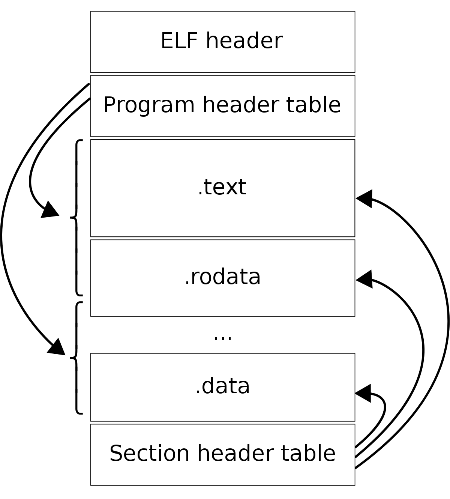

## 实现一个 hook 库

### 一、背景

在日常开发中，我们经常可能会对动态库中的函数调用做 hook（替换、拦截、监听等等），实现业务目的，比如对于 hook malloc、free 等，我们能够统计出分配了多少内存、那些内存一直被占用而没有被释放等等。

鉴于此，我们实现一个 hook 库，提供接口帮助业务进行 hook 相关函数调用。本文主要分享一个通过 got 方式进行 hook 的方式

### 二、基础知识

#### 1. LD_PRELOAD 预加载方式

一般情况下，在 linux 下，动态链接库的加载顺序如下：

- LD_PRELOAD
- LD_LIBRARY_PATH
- /etc/ld.so.cache
- /lib、/usr/lib 等

LD_PRELOAD 提供一种预加载机制，可以给一个 library 优先权，让其先加载，从而达到覆盖标准库中某些符号（函数）的目的。这种方式也可以达到 hook 的目的。但是需要设置环境变量，如：LD_PRELOAD=xxx.so 

LD_PRELOAD 方式会使应用程序先绑定预加载库的符号，然后再绑定其他链接的共享库。如果一个应用程序调用一个函数，则链接器首先查看他是否在应用程序本身中可用。如果没有找到符号，链接器会检查所有预加载的库，然后检查所有已链接到应用程序的库。共享库按照编译和链接期间给出的顺序进行搜索。

这种方式有一个缺点就是实现于链接阶段，因此不适用于静态链接。

#### 2. ELF 文件

PC 平台流行的可执行文件格式主要是 Windows 下的 PE（Portable Executable）和 Linux 下的 ELF（Executable Linkable Format），他们都是 COFF（Common file format）格式的变体。他们是标准的二进制数据封装格式。以 Linux 平台为例：可重定位文件（.o）、可执行文件、共享目标文件（.so）、核心转储文件（core dump）。

如下是 ELF 文件的大致结构



ELF 文件我们需要重点关注的有：ELF 文件头（file Header）、PHT（program header table）、段表（SHT：Section Header Table）等

##### (1). ELF file Header

ELF 文件头包含了描述整个文件的基本属性，比如 ELF 文件版本、目标机器型号、程序入口地址等。可以使用 `readelf -h xxx` 查看

```shell
# readelf -h test
ELF Header:
  Magic:   7f 45 4c 46 02 01 01 00 00 00 00 00 00 00 00 00
  Class:                             ELF64
  Data:                              2's complement, little endian
  Version:                           1 (current)
  OS/ABI:                            UNIX - System V
  ABI Version:                       0
  Type:                              DYN (Shared object file)
  Machine:                           Advanced Micro Devices X86-64
  Version:                           0x1
  Entry point address:               0xf40
  Start of program headers:          64 (bytes into file)
  Start of section headers:          17184 (bytes into file)
  Flags:                             0x0
  Size of this header:               64 (bytes)
  Size of program headers:           56 (bytes)
  Number of program headers:         9
  Size of section headers:           64 (bytes)
  Number of section headers:         29
  Section header string table index: 28
```

如上就是一个 ELF 文件的文件头，这个结构被定义在 "/usr/include/elf.h" 中，以 64 位为例：

```c
typedef struct
{
  unsigned char	e_ident[EI_NIDENT];	/* Magic number and other info */
  Elf64_Half	e_type;			/* Object file type */
  Elf64_Half	e_machine;		/* Architecture */
  Elf64_Word	e_version;		/* Object file version */
  Elf64_Addr	e_entry;		/* Entry point virtual address */
  Elf64_Off	e_phoff;		/* Program header table file offset */
  Elf64_Off	e_shoff;		/* Section header table file offset */
  Elf64_Word	e_flags;		/* Processor-specific flags */
  Elf64_Half	e_ehsize;		/* ELF header size in bytes */
  Elf64_Half	e_phentsize;		/* Program header table entry size */
  Elf64_Half	e_phnum;		/* Program header table entry count */
  Elf64_Half	e_shentsize;		/* Section header table entry size */
  Elf64_Half	e_shnum;		/* Section header table entry count */
  Elf64_Half	e_shstrndx;		/* Section header string table index */
} Elf64_Ehdr;
```

选几个重要的字段解释下

- e_shoff：段表在文件中的偏移，如上是 17184 (bytes into file)，也就是说段表从文件的第 17185 个字节开始
- e_ehsize：ELF 文件头本身的大小，如上是 64 (bytes)
- e_shentsize：段表描述符的大小，如上是 64 (bytes)
- e_shnum：段表描述符数量，这个值为 ELF 文件中拥有的段的数量，如上是 29
- e_shstrndx：段表字符串表所在的段在段表中的下标

##### (2). SHT（Section Header Table）

段表描述了ELF 文件包含的所有段的信息，比如每个段的段名、段的长度、在文件中的偏移、读写权限以及段的一些属性。可以使用 `readelf -S xxx` 查看具体信息

```shell
# readelf -S test
There are 29 section headers, starting at offset 0x4320:

Section Headers:
  [Nr] Name              Type             Address           Offset
       Size              EntSize          Flags  Link  Info  Align
  [ 0]                   NULL             0000000000000000  00000000
       0000000000000000  0000000000000000           0     0     0
  [ 1] .interp           PROGBITS         0000000000000238  00000238
       000000000000001c  0000000000000000   A       0     0     1
  [ 2] .note.ABI-tag     NOTE             0000000000000254  00000254
       0000000000000020  0000000000000000   A       0     0     4
  [ 3] .note.gnu.build-i NOTE             0000000000000274  00000274
       0000000000000024  0000000000000000   A       0     0     4
  [ 4] .gnu.hash         GNU_HASH         0000000000000298  00000298
       0000000000000028  0000000000000000   A       5     0     8
  [ 5] .dynsym           DYNSYM           00000000000002c0  000002c0
       0000000000000390  0000000000000018   A       6     1     8
  [ 6] .dynstr           STRTAB           0000000000000650  00000650
       000000000000024c  0000000000000000   A       0     0     1
  [ 7] .gnu.version      VERSYM           000000000000089c  0000089c
       000000000000004c  0000000000000002   A       5     0     2
  [ 8] .gnu.version_r    VERNEED          00000000000008e8  000008e8
       0000000000000070  0000000000000000   A       6     3     8
  [ 9] .rela.dyn         RELA             0000000000000958  00000958
       0000000000000150  0000000000000018   A       5     0     8
  [10] .rela.plt         RELA             0000000000000aa8  00000aa8
       00000000000002a0  0000000000000018  AI       5    22     8
  [11] .init             PROGBITS         0000000000000d48  00000d48
       0000000000000017  0000000000000000  AX       0     0     4
  [12] .plt              PROGBITS         0000000000000d60  00000d60
       00000000000001d0  0000000000000010  AX       0     0     16
  [13] .plt.got          PROGBITS         0000000000000f30  00000f30
       0000000000000008  0000000000000008  AX       0     0     8
  [14] .text             PROGBITS         0000000000000f40  00000f40
       0000000000000c32  0000000000000000  AX       0     0     16
  [15] .fini             PROGBITS         0000000000001b74  00001b74
       0000000000000009  0000000000000000  AX       0     0     4
  [16] .rodata           PROGBITS         0000000000001b80  00001b80
       0000000000000125  0000000000000000   A       0     0     8
  [17] .eh_frame_hdr     PROGBITS         0000000000001ca8  00001ca8
       00000000000000c4  0000000000000000   A       0     0     4
  [18] .eh_frame         PROGBITS         0000000000001d70  00001d70
       0000000000000340  0000000000000000   A       0     0     8
  [19] .init_array       INIT_ARRAY       0000000000202ca0  00002ca0
       0000000000000018  0000000000000008  WA       0     0     8
  [20] .fini_array       FINI_ARRAY       0000000000202cb8  00002cb8
       0000000000000008  0000000000000008  WA       0     0     8
  [21] .dynamic          DYNAMIC          0000000000202cc0  00002cc0
       0000000000000210  0000000000000010  WA       6     0     8
  [22] .got              PROGBITS         0000000000202ed0  00002ed0
       0000000000000130  0000000000000008  WA       0     0     8
  [23] .data             PROGBITS         0000000000203000  00003000
       0000000000000010  0000000000000000  WA       0     0     8
  [24] .bss              NOBITS           0000000000203020  00003010
       0000000000000248  0000000000000000  WA       0     0     32
  [25] .comment          PROGBITS         0000000000000000  00003010
       0000000000000029  0000000000000001  MS       0     0     1
  [26] .symtab           SYMTAB           0000000000000000  00003040
       0000000000000af8  0000000000000018          27    52     8
  [27] .strtab           STRTAB           0000000000000000  00003b38
       00000000000006e7  0000000000000000           0     0     1
  [28] .shstrtab         STRTAB           0000000000000000  0000421f
       00000000000000fe  0000000000000000           0     0     1
Key to Flags:
  W (write), A (alloc), X (execute), M (merge), S (strings), I (info),
  L (link order), O (extra OS processing required), G (group), T (TLS),
  C (compressed), x (unknown), o (OS specific), E (exclude),
  l (large), p (processor specific)
```

选几个较为重要的 section 说明下：

- `.dynstr`：保存了所有的字符串常量信息
- `.dynsym`：保存了符号（symbol）的信息（符号的类型、起始地址、大小、符号名称在 `.dynstr`中的索引编号等等）。函数也是一种符号
- `.text`：程序代码经过编译后生成的机器指令
- `.dynamic`：供动态链接器使用的各项信息，记录了当前 ELF 的外部依赖，以及其他各个重要 section 的起始位置等信息
- `.got`：Global Offset Table。用于记录外部调用的入口地址。动态链接器（linker）执行重定位操作时，这里会被填入真实的外部调用的绝对地址
- `.plt`：Procedure Linkage Table。外部调用的跳板，主要用于支持 lazy binding 方式的外部调用重定位。

##### (3). ELF 文件的基地址

在进程的内存空间中，各种 ELF 文件的加载地址是随机的，只有在运行时才能拿到加载地址，也就是基地址。我们需要知道 ELF 的基地址，才能将相对地址换算成绝对地址。

比较稳妥的办法可以解析 `/proc/self/maps`，比如：

```shell
# cat /proc/self/maps
55b735234000-55b73523c000 r-xp 00000000 08:01 5636121                    /bin/cat
55b73543b000-55b73543c000 r--p 00007000 08:01 5636121                    /bin/cat
55b73543c000-55b73543d000 rw-p 00008000 08:01 5636121                    /bin/cat
55b7370a7000-55b7370c8000 rw-p 00000000 00:00 0                          [heap]
7f3bcf47d000-7f3bcfe4c000 r--p 00000000 08:01 6298309                    /usr/lib/locale/locale-archive
7f3bcfe4c000-7f3bd0033000 r-xp 00000000 08:01 1048660                    /lib/x86_64-linux-gnu/libc-2.27.so
7f3bd0033000-7f3bd0233000 ---p 001e7000 08:01 1048660                    /lib/x86_64-linux-gnu/libc-2.27.so
7f3bd0233000-7f3bd0237000 r--p 001e7000 08:01 1048660                    /lib/x86_64-linux-gnu/libc-2.27.so
7f3bd0237000-7f3bd0239000 rw-p 001eb000 08:01 1048660                    /lib/x86_64-linux-gnu/libc-2.27.so
7f3bd0239000-7f3bd023d000 rw-p 00000000 00:00 0
7f3bd023d000-7f3bd0266000 r-xp 00000000 08:01 1048592                    /lib/x86_64-linux-gnu/ld-2.27.so
7f3bd042e000-7f3bd0452000 rw-p 00000000 00:00 0
7f3bd0466000-7f3bd0467000 r--p 00029000 08:01 1048592                    /lib/x86_64-linux-gnu/ld-2.27.so
7f3bd0467000-7f3bd0468000 rw-p 0002a000 08:01 1048592                    /lib/x86_64-linux-gnu/ld-2.27.so
7f3bd0468000-7f3bd0469000 rw-p 00000000 00:00 0
7fff4dce1000-7fff4dd02000 rw-p 00000000 00:00 0                          [stack]
7fff4ddd7000-7fff4ddda000 r--p 00000000 00:00 0                          [vvar]
7fff4ddda000-7fff4dddc000 r-xp 00000000 00:00 0                          [vdso]
ffffffffff600000-ffffffffff601000 r-xp 00000000 00:00 0                  [vsyscall]
```

maps 返回的是指定进程的内存空间中 mmap 的映射信息，包括各种动态库、可执行文件，栈空间，堆空间。一般来说，比如 `/lib/x86_64-linux-gnu/libc-2.27.so` 的 offset 为 0 的第一行的起始地址 `7f3bcfe4c000` 在绝大多数情况下就是我们寻找的基地址。

##### (4). 内存访问权限

`/proc/self/maps` 返回的信息已经包含了权限访问信息。如果要执行 hook，就需要写入的权限，使用 mprotect 来完成

```c
#include <sys/mman.h>

int mprotect(void *addr, size_t len, int prot);
```

修改内存访问权限，只能以“页”为单位。

### 三、实践

有了以上的基础，我们不难实现一个 hook 库。如下例子：

比如我有一个 libxxx.so，在这个 libxxx.so 里面调用了 libc.so 里面的 open 方法，那么在 libxxx.so 的 got 表中就存放了 open 的地址。所以我们先找到 libc.so 里面 open 方法在内存中的地址（使用 dlsym），然后在加载到内存中的 libxxx.so 的 got 表里面去找到存放 open 地址的地方，把它修改成新的函数的地址即可。也就是说替换了 libc.so 的 open 函数在 libxxx.so 里面引用的地址。

代码链接：https://github.com/noahyzhang/got_hook

#### 1. 第一步，我们先找到给定的 ELF 文件的 got 段表的段虚拟地址和段的长度

```c
// 获取 .got 段表的段虚拟地址和段的长度
int get_got_table_info(const char* lib, uint64_t* base, uint64_t* size) {
    int fd = open(lib, O_RDONLY);
    if (fd < 0) {
        std::cerr << "open file err: " << strerror(errno) << std::endl;
        return -1;
    }
    // 读取 ELF 文件的 Header
    Elf64_Ehdr elf_header;
    memset(&elf_header, 0, sizeof(elf_header));
    read(fd, &elf_header, sizeof(elf_header));

    // 读取 ELF 文件的段表
    Elf64_Shdr elf_section_header;
    memset(&elf_section_header, 0, sizeof(elf_section_header));
    // elf_header.e_shstrndx：段表字符串表所在的段在段表中的下标
    // elf_header.e_shentsize：段表描述符的大小
    // elf_header.e_shoff 指示了 ELF 文件中段表的位置
    // 读取段表字符串表。段表字符串表用来保存段表中用到的字符串，比如段名
    lseek(fd, elf_header.e_shstrndx * elf_header.e_shentsize + elf_header.e_shoff, SEEK_SET);
    read(fd, &elf_section_header, sizeof(elf_section_header));

    // elf_section_header.sh_size 段的长度
    char* lp_string_table = (char*)malloc(elf_section_header.sh_size);
    if (lp_string_table == NULL) {
        std::cerr << "malloc err: " << strerror(errno) << std::endl;
        close(fd);
        return -1;
    }
    // elf_section_header.sh_offset：段偏移，如果该段存在于文件中，则表示该段在文件中的偏移，否则无意义
    lseek(fd, elf_section_header.sh_offset, SEEK_SET);
    // 读取这个段（段表字符串表 Section Header String Table）
    read(fd, lp_string_table, elf_section_header.sh_size);

    // 将文件指针偏移到 ELF 文件中段表的位置
    lseek(fd, elf_header.e_shoff, SEEK_SET);
    int res = -1;
    // elf_header.e_shnum：段表描述符数量，也就是 ELF 文件中拥有的段的数量
    // 读取每个段表
    for (int i = 0;i < elf_header.e_shnum; i++) {
        memset(&elf_section_header, 0, sizeof(elf_section_header));
        read(fd, &elf_section_header, sizeof(elf_section_header));
        // 找到 ".got" 段表。 
        if (elf_section_header.sh_type == SHT_PROGBITS) {
            // sh_name：段名，是个字符串，位于 ".shstrtab" 的字符串表。sh_name 是段名字符串在 ".shstrtab" 中的偏移
            // 通过比较当前段表的段名，获取到 sh_addr、sh_size
            // sh_addr：段虚拟地址，如果该段可以被加载，则 sh_addr 为该段被加载后在进程地址空间中的虚拟地址；否则为0
            // sh_size：段的长度
            if (strcmp(lp_string_table+elf_section_header.sh_name, ".got") == 0) {
                *base = elf_section_header.sh_addr;
                *size = elf_section_header.sh_size;
                res = 0;
                break;
            }
        }
    }
    close(fd);
    return res;
}
```

#### 2. 通过 maps 拿到 ELF 文件的基地址

```c
// /proc/self/maps 显示了进程映射了的内存区域和访问权限
// 找到进程中关于 module_name 的内存区域。即拿到虚拟地址空间的起始地址
uint64_t get_module_base(pid_t pid, const char* module_name) {
    FILE* fp = NULL;
    uint64_t addr = 0;
    char* addr_range = NULL;
    char file_name[32] = {0};
    char line[1024] = {0};
    if (pid < 0) {
        snprintf(file_name, sizeof(file_name), "/proc/self/maps");
    } else {
        snprintf(file_name, sizeof(file_name), "/proc/%d/maps", pid);
    }
    fp = fopen(file_name, "r");
    if (fp != NULL) {
        while (fgets(line, sizeof(line), fp)) {
            // std::cout << "get module base line: " << line << std::endl;
            if (strstr(line, module_name)) {
                addr_range = strtok(line, "-");
                addr = strtoul(addr_range, NULL, 16);
                if (addr == 0x400000) {
                    addr = 0;
                }
                // std::cout << "addr: " << std::hex << addr << std::endl;
                break;
            }
        }
        fclose(fp);
    }
    return addr;
}
```

#### 3. 寻找符号并替换

```c
// 修改调用进程内存页的保护属性，修改为 rwx
// mprotect: 可以用来修改一段指定内存区域的保护属性。把自start开始的、长度为len的内存区的保护属性修改为prot指定的值
int change_addr_to_rwx(uint64_t addr) {
    uint64_t page_size = sysconf(_SC_PAGESIZE);
    uint64_t page_start = addr & (~(page_size - 1));
    // std::cout << "page_start: " << page_start << std::endl;
    int res = mprotect((void*)page_start, page_size, PROT_READ | PROT_WRITE | PROT_EXEC);
    if (res < 0) {
        std::cerr << "mprotect err: " << strerror(errno) << std::endl;
        return -1;
    }
    return 0;
}

// 替换 got 表中的关于某个符号的指向
int write_data_to_addr(uint64_t addr, uint64_t value) {
    int res = change_addr_to_rwx(addr);
    if (res < 0) {
        std::cerr << "write data to addr err: " << strerror(errno) << std::endl;
        return -1;
    }
    *(uint64_t*)addr = value;
    return 0;
}


/**
 * @brief hook 的入口函数
 * 
 * @param lib 可以是二进制文件，也可以是 so 文件
 * @param symbol 需要 hook 的符号（函数）地址
 * @param new_func 需要替换的函数地址
 * @param old_func 保存原始的函数地址
 * @return int 成功与否
 */
int hook_func(const char* lib, void* symbol, void* new_func, void** old_func) {
    uint64_t got_off, got_size;
    if (get_got_table_info(lib, &got_off, &got_size) < 0) {
        std::cerr << "get got table info err" << std::endl;
        return -1;
    }
    int res = -1;
    uint64_t base = get_module_base(-1, lib);
    if (base == 0) {
        std::cerr << "get module base failed, not find: " << lib << std::endl;
        return -2;
    }
    // 依次遍历寻找这个符号，找到之后进行替换
    for (uint64_t i = 0; i < got_size; i += sizeof(uint64_t)) {
        if ((uint64_t)symbol == (*((uint64_t*)(base + got_off + i)))) {
            *old_func = symbol;
            write_data_to_addr(base + got_off + i, (uint64_t)new_func);
            res = 0;
        }
    }
    if (res < 0) {
        std::cerr << "unable find symbol addr in got table" << std::endl;
    }
    return res;
}
```

#### 4. 例子

```c
pid_t (*old_getpid)() = NULL;

pid_t new_getpid() {
    return (*old_getpid)() + 1; 
}

int main() {
    // 获取 getpid 函数的地址
    void* addr = dlsym(NULL, "getpid");
    std::cout << "hook before, pid: " << getpid() << std::endl;
    hook_func("test", addr, (void*)new_getpid, (void**)&old_getpid);
    std::cout << "hook after, pid: " << std::dec << getpid() << std::endl;
    return 0;
}
```

运行得到：

```shell
# ./test
hook before, pid: 121561
hook after, pid: 121562
```

### 四、常见的 Hook 技术对比

| 技术类型     | 生效范围     | 生效时机       | 依赖注入 | 层级 | 安全性 | 稳定性 | 开发运维难度 |
| ------------ | ------------ | -------------- | -------- | ---- | ------ | ------ | ------------ |
| 内核模块     | 所有进程     | 加载内核模块后 | 否       | 低   | 最高   | 中     | 极高         |
| Inline Hook  | 当前进程     | hook后         | 是       | 中   | 中     | 中     | 高           |
| Got Hook     | 当前进程模块 | hook后         | 是       | 中   | 低     | 良     | 中           |
| Preload Hook | 所有进程     | hook后         | 否       | 中   | 低     | 优     | 低           |
| 系统文件修改 | 所有进程     | 文件修改后     | 否       | 中   | 高     | 中     | 高           |

- 依赖注入，代表在使用该技术hook第三方进程前，是否需要先进行注入
- 层级，代表hook点在整个系统调用的位置，越底层则层级越低
- 稳定性越低，代表要通过这种技术做到稳定所需要的技术和时间成本较高
- 安全性，代表该项技术被绕过的难易程度

注意：preload hook 的方式，可以使用环境变量配置，也可以写入文件 `/etc/ld.so.preload` 进行配置。若使用命令行指定LD_PRELOAD则只影响该新进程及子进程；若写入全局环境变量则LD_PRELOAD对所有新进程生效；父进程可以控制子进程的环境变量从而取消preload

### 五、扩展

除了基于 GOT/PLT 的实现机制，native hook 的实现方案还包括 “inline hook”、"trap hook" 的实现。其中 “trap hook” 使用系统的 SIGTRAP 信号中断的机制，性能不好，在生产环境中使用较少。“inline hook” 实现的是指令级别的替换机制，实现难度大。

