一致性哈希最早于1997年提出，用于在大规模分布式缓存、CDN和负载均衡系统中，将大量请求或数据均匀分配到一组后端节点，并在节点动态增删时最小化的重映射数据。

我们目前常见的一致性哈希算法，包括：ring hash、jump consistent hash、rendevous hash、maglev hash、Anchor hash等。

本文首先调研了业界主流的一致性哈希算法，并深入抽象CDN节点缓存场景的核心需求，自主研发了“离散型槽位哈希”算法。该算法高度契合CDN点播业务的特定需求，已成功应用于“快手点播CDN节点”的缓存调度场景，覆盖近2500台机器，直接承接并调度近20T带宽流量。

## 一、缘起

我们有 N 个缓存服务器节点，如何将数据（或请求）均衡的映射到这N个节点呢？最简单的方法就是对于请求数据（key）计算一个哈希值，然后将这个哈希值对节点数N取模。如果哈希函数分布均匀，计算出来的哈希值足够均匀，那数据也就可以均匀的映射到N个节点上了。

但是问题是，如果服务器节点有扩缩容（即N变化），可用节点的数量发生变化，那数据的映射关系就会发生变化。会造成大量缓存失效，对系统的稳定性和性能产生显著冲击。

因此，我们在寻找一种算法，不仅要求对相同的 key 的多次映射结果一致，还要尽可能减少 N 变化时带来的不一致映射的变化。构建这种映射的算法，一般称之为“一致性哈希”。

即，我们希望构造一个函数：`f(k, n) -> m` 

- 输入是请求k 和 节点的数量 n
- 输出是映射到节点的标号 m

理想的一致性哈希方案需要满足： 

- 平衡性（均衡均衡）：各节点负载近似相同，能按节点权重进行负载分配。
- 一致性：
  - 相同的 k，n 输入，一定会有相同的输出
  - 当槽的数目增减时，只能有 `K/n` 个请求k 进行重新映射
- 单调性：在新增节点时，原有请求只能映射到原节点或新节点，不会从一个老节点映射到另一个老节点；在移除节点时，仅影响被移除节点对应的请求。
- 稳定性（最小扰动）：节点扩容或缩容时，只有极少部分请求需要重新分配，且扰动量应可控。避免不必要的大规模数据迁移。

还有一些工程上的要求：

- 无状态性：算法映射结果不依赖于历史操作顺序（如先前的节点增删次序），以降低在分布式环境中对操作顺序同步的开销。
- 高吞吐查询：能够快速完成 key->node 的映射。衡量 Key→节点 映射的速率，是评估一致性哈希算法性能的核心指标。
- 更新低开销：支持高效的节点增删。指节点状态发生变化（节点故障／恢复、集群扩缩容）时，算法完成映射数据结构更新所需的时间与资源。
- 低内存占用：算法在内存中的数据结构占用。更小的占用能够降低成本，避免因内存过载导致的性能退化 

## 二、调研

我们先来探讨一下常见的一致性哈希的实现思路。

### 1. 经典一致性哈希

经典一致性哈希也被称为割环法、哈希环法。这个算法较早提出，应用比较广泛，也比较容易理解。

#### (1). 算法实现

- 将物理节点通过哈希的方式，映射到一个范围为 `[0, 2^32]` 的环上，同时根据物理节点的权重，为每个物理节点分配若干个虚拟节点，将这些虚拟节点也映射到环上。
- 将数据也通过哈希的方式映射到环上，然后按顺时针方向查找第一个“节点哈希值”大于等于“数据哈希值”的节点。该节点就是数据所分配到的节点。

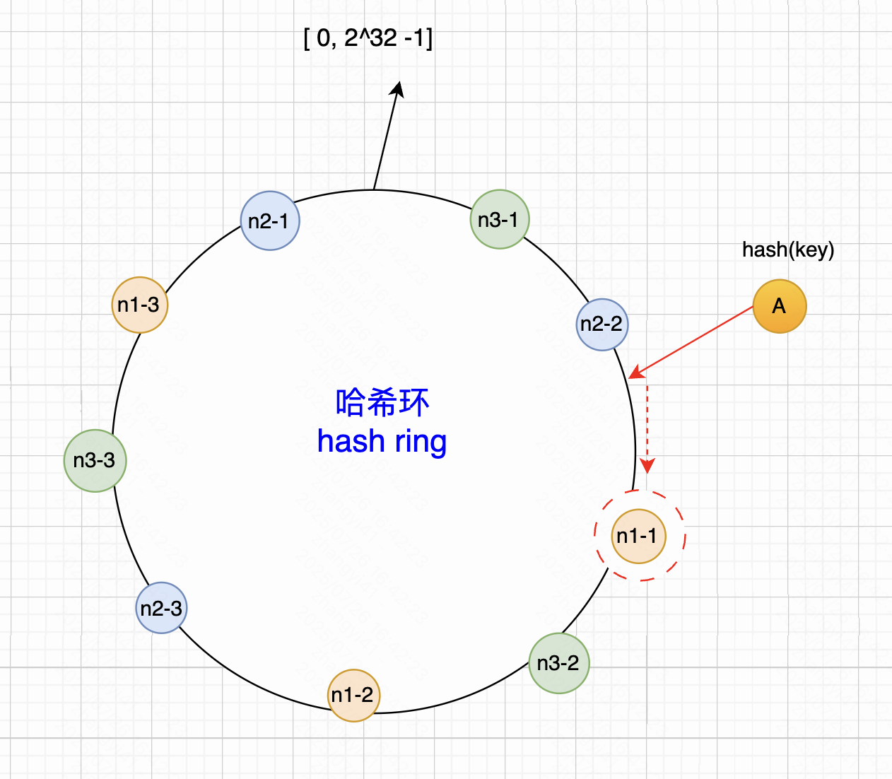

当某一个节点故障之后，相当于在环上去掉对应节点及其对应虚拟节点，只会导致变化的节点上的数据发生重新映射。同理新增一个节点也是类似的。因此可以较好的满足单调性。

当虚拟节点数较多并且搭配的哈希函数比较均衡，可以使割环法具备不错的平衡性和稳定性。

#### (2). 性能分析

哈希环的查找逻辑是：如何在环上找一个和目标值相近的槽位。因为这些槽位都是有序的，在有序表中可以进行二分查找。所以哈希环的查找时间复杂度是：`O(logN)`。空间复杂度为：`O(N)`。

假设有 N 个节点，新增一个节点，大约有 `1/(N+1)` 的key需要迁移到新节点。删除一个节点，大约有 `1/N` 的key需要迁移。总之，添加或者删除槽位，总会影响一个槽位的映射量。因此，哈希环做到了最小化重新映射。

#### (3). 优缺点

优点：

- 实现简单，被广泛使用
- 支持权重，通过虚拟节点的数量

缺点：

- 虚拟节点数较少的情况下，平衡性较差
- 占用内存较大，内存占用 `O(v*N)` ，其中 v 为节点的虚拟节点数

### 2. rendezvous hash

rendezvous hash 也称为最高随机权重哈希，简称为 HRW。

wiki：https://en.wikipedia.org/wiki/Rendezvous_hashing

#### (1). 算法实现

基本思路：

- 对每个key和每台服务器计算一个“随机权重”值，然后把key分配给权重最大的服务器。也可以理解为，每个key会为所有服务器生成一个随机排序列表，选择列表中的第一名作为归属服务器。这样每个key都能选出最佳服务器。
- 如果某台服务器挂掉了，则改用次高值对应的服务器
- 如果扩容了一个服务器，相当于增加了一次计算哈希的机会，如果计算出来的哈希值超过原来的最大值，则该部分key分配到新节点

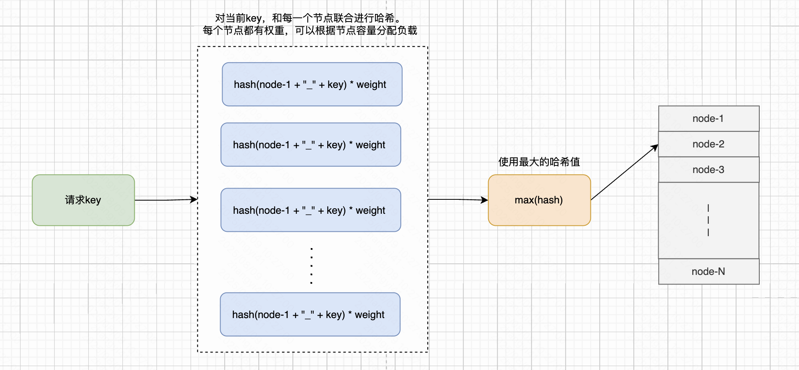

可见，当节点变化时，rendezvous hash 算法只会影响到最大权重值落到变化的节点的key，也就是说只有变化的节点上的数据需要重新映射，因此很符合单调性的要求。而算法的平衡性和稳定性则取决于哈希函数的随机特性。

时间复杂度：每次选择需要对所有节点计算一次哈希，然后比较，复杂度为 O(N)。当节点数量很大时，耗时就比较长了。针对这一缺点，也提出了一些解决方案。比如分层筛选、增量计算方案。

##### (a). 分层筛选

- 将节点划分为多个层级或分组，可以按照场景做具体划分
- 首先在最顶层分组中执行一次 HRW 选举，确定一个或少数候选分组
- 然后仅在候选分组内再次执行 HRW，完成最终节点选择

通过两级或多级筛选，可以大幅减少每次计算的节点数。计算量可以近似接近 `O(logN)`

和 wiki 上提出的改进算法一致，也是类似的构建了一棵树。

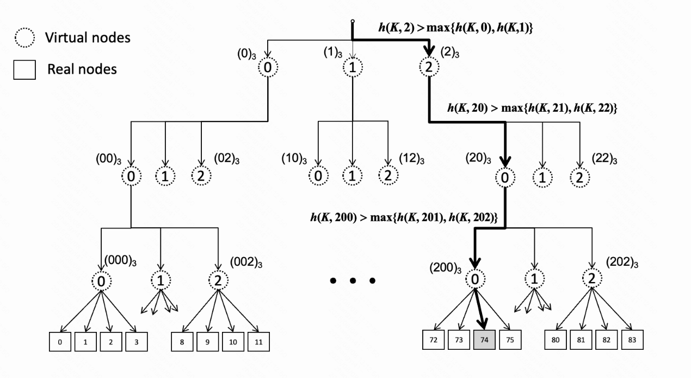

##### (b). 增量计算

- 维护一份按 key 分片的候选节点列表与对应的最高权重
- 当节点列表不发生变化时，可直接重用上次的选举结果，无需重新哈希
- 在节点增删或者列表更新时，仅对受影响的 key 分片重新计算权重和比较。

该方法适用于节点变更相对少、请求高频的场景，能将大部分选举操作降至常数时间。

#### (2). 优缺点

优点

- 负载均衡：对每个节点计算权重后选最大节点，天然均匀且也有最小扰动的特性。每台服务器承担的key数量相近，
- 避免级联故障：当某台服务器故障时，其上的key会均匀的转移到其他服务器上，由于每个key有不同的备选服务器，可以避免将所有失效key都压到同一台机器
- 支持权重：权重可以融入哈希计算，可以为不同服务器指定权重
- 实现简单：只需维护服务器列表，每次计算权重即可

缺点：

- 新增节点开销较大：添加新服务器时，需要重新计算许多key对各服务器的权重，才能确定新的分配，这会带来较高的计算开销
- 查找效率：redezvous 哈希选服务器时需要计算所有服务器的哈希值，查找耗时随服务器数量线性增加。时间复杂度`O(n)`

### 3. jump consistent hash

论文：https://arxiv.org/abs/1406.2294

我来根据论文中的思路，分步拆解一下算法的核心原理。

核心思想：随着槽位数量增多，只有一小部分键会“跳”到新槽位。

- 均衡性：当槽位由 n 增至 n+1 时，`1/n+1` 的键应“跳”到新槽位。其余 `n/n+1` 的键应该保持原槽位不变。
- 单调性：仅在槽位数增加时才会重新分配，且不会把键从新槽位“跳”回旧槽位。

我们定义一个目标函数 `ch(k, n)` ，表示当槽位数量为 n 时，给定键 k 映射到槽位的编号，范围是 `[0, n)`。我们分别建立不同的跳跃模型来推导算法的思想。

#### (1). 线性时间版本：逐槽位跳跃模型

最为简单粗暴的一种解法就是，针对某个key，我们依次对每个槽位都判断一下。如下代码实现

```c
int ch(int key, int num_buckets) {
  random.seed(key);
  int b = 0;  // 当前映射的槽位号
  for (int j = 1; j < num_buckets; j++) {
    // 以概率 1/(j+1) “跳”到 j 号槽位
    if (random.next() < 1.0 / (j + 1)) {
      b = j;
    }
  }
  return b;
}
```

这种方法对每一个槽位都做了一次随机判断，时间复杂度是 `O(n)`

#### (2). 对数时间版本

为了避免对所有槽位都遍历一次，我们利用“跳跃只发生在少数位置”这一事实，直接跳过不跳跃的区间。

##### (a). 定义随机跳跃变量

假设当前上一次跳跃到的位置为b，我们想直接计算下一个跳跃会落地第 j 号槽位，其中
$$
j = max\{i > b | ch(k,i) = ch(k, b+1)\}
$$
换言之，j 是“下一次映射改变”的槽位编号，i 为每次遍历的槽位号。

这个公式我们分两层来理解：

第一： `ch(k,i)` 在那些区间里保持不变？

- 我们已经知道，上一次真正“跳跃”发生在槽位号 b，也就是说：`ch(k,b) != ch(k, b+1)`
- 从槽位 b+1 开始，如果后面几个槽位里都没有再发生新的跳跃，那么这些槽位的映射值都会跟 “在 b+1 时的槽位号” 一样
- 具体来说，只要对于某个 `i>b`，则有 `ch(k,i) = ch(k,b+1)`。就说明从槽位 b+1 到槽位 i 的这段区间里，键 key 还粘在原来的槽位上，没有再跳到新的槽位。

第二：找出这段区间的最后一个槽位

- 我们知道，这个“不跳槽位”的状态能够持续到那个槽位号，之后才会真正有一次新的跳转。
- 那么 j 就定义为“所有大于b且映射仍等于 `ch(k,b+1)`的槽位号” 中的最大值

- 换句话说，从槽位 b+1 开始，直到槽位 j，`ch(k,i)`都还没有变；在下一号槽位 j+1 上，`ch(k,j+1)`就会跟 `ch(b+1)`不一样，也就是发生了新的跳跃。

举个例子，假设上一个跳到的槽位是 b=2，那么我们从槽位 3 开始观察：

- 若 `ch(k,3)=5, ch(k,4)=5, ch(k,5)=5`，但是 `ch(k,6)=7`
- 则这时“保持`ch(k,3)`”的最大槽位号就是 `j=5`
- 意味着真正的下一个跳跃点位于 `j+1=6`，在哪里映射才会变成别的槽位

##### (b). 概率约束

对任意 `i>b`，有：
$$
P(j \geq i) = P(映射在槽位 i 之前不变) = \frac{b+1}{i}
$$
我们对这个公式做下解释

- 记 `ch(k,i)`为键key在 i 个槽位时映射到的槽位号
- 假设我们已经在槽位 b 发生了上一次映射跳转，也就是说：`ch(k,b) != ch(k,b+1)`。而在所有 i 满足 `b+1 < i <= n`的情况下，如果映射不再改变，则：`ch(k,i) = ch(k,b+1)`
- 那么，对于任意 `i>b`，映射在 `[b+1, i]` 这段区间的槽位一直不改变的概率是：

$$
P(槽位不变) = \frac{b+1}{b+2} \times \frac{b+2}{b+3} \times ... \times \frac{i-1}{i} = \frac{b+1}{i}
$$

##### (c). 引入均匀随机数

- 令 `r ∈ (0,1] ` 为伪随机数（依赖key和迭代）

- 我们要让“下一个跳转点”落在“槽位大于等于 i ” 的事件，等价于 “直到槽位 i 之前都不跳”， 其概率为 `(b+1)/i`
- 按照逆变换抽样的方法

$$
P(j \geq i) = \frac{b+1}{i}  <==> P(r \leq \frac{b+1}{i}) = \frac{b+1}{i}
$$

也就是说，只要随机数 r 落在 `[0, (b+1)/i]` 中，就意味着“跳点不会早于 i”

我们对不等式进行一下转换
$$
r \leq \frac{b+1}{i}  ==> i \leq \frac{b+1}{r}
$$
由于 j 要是“不跳前 i” 中最大的那个 i，自然就取如上式中的最大整数解：
$$
j = [\frac{b+1}{r}]
$$
我们举一个例子感受一下。

- 假设当前 b=2，那么我们从槽位3开始观察
- 若 `r=0.2`，则 `(b+1)/r = 3/0.2 = 15`，向下取整得到 `j=15`。意味着下次跳转直接落在槽位15。
- 若 `r=0.9`，则 `(b+1)/r ≈ 3/0.9 ≈ 3.33`，向下取整得到 `j=3`。即下一跳落到槽位3。
- 这样 r 越小，`(b+1)/r` 越大，跳的就越远；r 越大，跳的就越近。且由于 r 均匀分布，这正好匹配了我们的需求：越靠前的槽位，越小概率跳过去；越靠后的槽位，概率越低但是区间更大。

这样，一次运算就能跳到下一个有可能改变映射的位置，而无需遍历中间所有的槽位。

##### (d). 最终实现

我们将上述的“跳跃逻辑”和“伪随机数生成器”结合，就得到了论文中给出的简洁实现。

跳跃一致性哈希的算法代码比较精简。如下：

```c
int32_t JumpConsistentHash(uint64_t key, int32_t num_buckets) {
  int64_t b = -1, j = 0;
  while (j < num_buckets) {
    b = j;
    key = key * 2862933555777941757ULL + 1;
    j = (b + 1) * (double(1LL << 31) / double((key >> 33) + 1));
  }
  return b;
}
```

函数 JumpConsistentHash 是一个一致性哈希函数，输入 key 和槽位数量，输出槽位编号。

- 线性同余生成器：常数 `2862933555777941757ULL` 用于在高维空间保持良好分布
- 位运算+浮点：通过 `key >> 33` 提取高位，再用浮点除数模拟 `1/r`，合并就是 `(b+1)/r`

#### (3). 性质

- 时间复杂度：因为 r 的分布是均匀的，在槽位数将变化为 i 的时候发生跳跃的概率为 `1/i`，那么期望的迭代次数就是 `1/2+...+1/i+...1/n`。复杂度是 `log(n)`

- 空间开销：没有额外内存占用
- 负载均匀：r 的分布是均匀的，分配的标准差极低，论文中描述 99%的置信区间几乎完美均衡
- 重分布平滑：从 n 扩容到 n+1 时，仅 `1/n+1` 的键会改变归属，且在各槽位间均匀分布
- 局限性：仅支持在末尾顺序添加或者删除节点，不支持任意节点的增删或者权重设置。

### 4. Maglev hash

论文：https://research.google/pubs/maglev-a-fast-and-reliable-software-network-load-balancer/

#### (1). 算法详解

maglev hash 算法的思路是查表，建立一个槽位的查找表，对输入key座哈希再取余，即可映射到表中一个槽位。

如下查找表的长度为 M，当输入一个key时，映射到目标槽位就是：`table[hash(key)%M]`

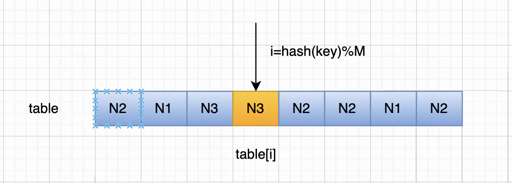

此算法的重点就是如何生成一张查找表。我们根据论文的思路，逐步拆解下算法。

##### (a). 为每个后端节点生成“随机排列”

在 maglev hash 中，我们要为每个后端节点找到一条能遍历整个查找表且不重复的“路径”（论文中将其称为 permulation），以便后面轮流分配槽位时，每个后端节点都有一个完整、随机且可重现的候选序列。要做到这一点，关键有两个要素：

- 随机起点（offset）
- 随机步长（skip）

我们用两个独立的哈希函数 h1 和 h2 来分别产出这两个要素。

> 为什么要使用两个哈希函数
>
> - 保证随机性和独立性。如果只用一个哈希值去同时决定起点和步长，很难既保证起点在 `[0,M)` 均匀，又保证步长在 `[1,M−1]` 上独立且与表长度无关。用两个哈希函数，各自负责一部分，就能保证这两个参数彼此独立，从而让整条路径更加“随机”、更难出现系统性冲突。
> - 不同含义，不同范围。
>   - offset 需要落在 `[0, M-1]`之间
>   - skip 需要落在 `[1, M-1]` 之间（不能为0，否则路径相当于没动，也不能为M，同样路径相当于回到起点）。两者的取值范围不同，分开用两个哈希函数来映射最为合适。

对于后端节点 i。计算出两个哈希值
$$
offset = h1(i) \quad mod \quad M 
$$

- 作用：决定这条路径从查找表索引那一个槽开始尝试分配
- 意义：不同后端通过 h1 映射到不同的起点，确保各自的路径分散在表中，不会集中在某一块区域

$$
skip = (h2(i) \quad mod \quad (M-1)) +1
$$

- 作用：决定每次“下一跳”跳过多少槽
- 为什么要加1？
  - 如果直接取 `mod M`，可能得到 0，那么每次都在同一个槽上“打转”
  - 如果直接取 `mod M`，可能得到 M，那么可能会出现 `mod M` 后等于 0
  - 所以我们用 `mod (M-1)` 确保结果在 `[0, M-2]` 范围，再+1让他变成 `[1, M-1]`
- 意义：
  - 步长不能与表长公约：当M为质数时，任意在 `[1, M-1]`的步长都与 M 互质，保证走 M 步后能遍历全表
  - 随机性：不同后端通过 h2 得到不同步长，路径不会同步，也就不会总是抢统一个空槽

将如上内容合起来就是一个“伪随机全表遍历”方法。某个后端节点每次生成的 permutation元素为：
$$
permutation[j] = (offset + j × skip) \quad mod \quad M \quad (j=0,1,..,M-1)
$$

- offset 决定第一步走到哪里
- skip 决定了下一步绕过多少个槽
- 反复累加，就能在 M 步内打卡表中所有槽，且顺序对不同后端节点都不同

##### (b). 轮流抢占空槽，填充查找表

这一阶段的目标：在大小为 M 的表中，公平的给每个后端节点分配 `M/N` 或 `N/M` 个槽，使得每个后端节点最终得到的槽位数只相差1。

- 初始化：
  - `next[i] = 0`，表示后端节点 i 下一次要尝试的 permutation 下标
  - `table[0..M-1] = -1`，表示表的槽都还空着
  - `n = 0`，记录已分配槽的总数

- 如下伪代码

  ```
  for i = 0 .. N−1:                  // 依次让所有后端节点轮流尝试
    c = permutation[i][ next[i] ]    // 取出后端 i 的下一个候选槽号
    while entry[c] != −1:             // 如果该槽已被占用，就跳到它的下一个候选
      next[i] += 1
      c = permutation[i][ next[i] ]
    entry[c] = i                     // 抢到空槽，就把槽分给后端 i
    next[i] += 1                     // 下次尝试从下一个候选开始
    n += 1                           // 分配计数加 1
    if n == M: 
    	break                					 // 填满就结束
  ```

我们举个例子，我们现在有三个后端节点：N1、N2、N3。查找表长度M为6。随机生成的每个后端节点的 permutation 如下：

```
N1 permutation: [0, 2, 4, 1, 3, 5]
N2 permutation: [1, 3, 5, 0, 2, 4]
N3 permutation: [2, 5, 1, 4, 0, 3]
```

按照如上的伪代码，便可以进行填充了，流程如下图

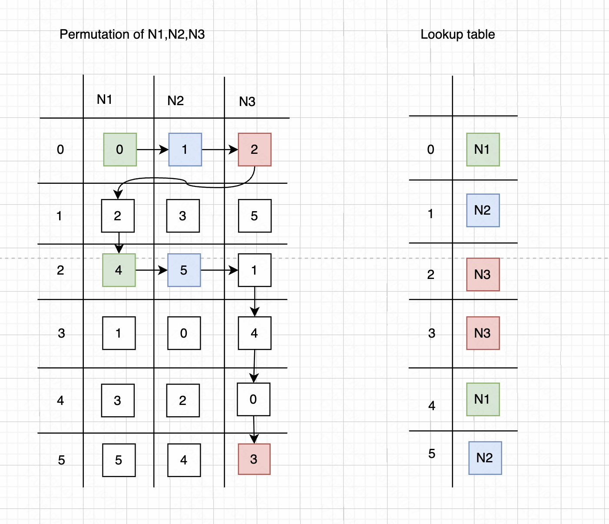

##### (c). 查表选后端节点

得到查找表之后，请求键key通过哈希和取模便可以从查找表中选择一个后端节点。

#### (2). 优缺点

- 极致均衡：每一轮都让所有后端节点公平的抢一个槽，保证后端节点占据的槽位数量差距不超过1
- 平滑重映射（相对）：增删后端节点时，只需要对哪些空出来或新增的槽做少量重分配，不影响已确定的其他槽，扰动相对可控
- 性能良好：`O(1)`查找时间复杂度。查表过程仅一次取模和一次数组访问，非常快速，

缺点：

- 无法严格最小扰动：节点变更时需要重建表
- 内存开销巨大：表大小 M 通常远大于节点数N（需为大质数）
- 不支持权重（原生）

### 5. anchor hash

论文：https://arxiv.org/pdf/1812.09674

传统算法往往难以同时兼顾全局一致性（最小扰动）、负载均衡、高吞吐率、低内存和快速更新等需求。Anchorhash算法应运而生。它是一种新的可扩展一致性哈希算法，通过借助额外的状态信息，保证在节点任意增删时仍实现最小扰动和均衡分布，同时提供极高的查询速度、低内存占用和快速的节点更新。

论文中指出 AnchorHash 是目前唯一兼顾以上所有目标的算法。接下来我们将深入探讨 AnchorHash 的核心原理和性能特性。

#### (1). 核心算法

假设我们有一个工作集列表W，里面保存的是可用的后端节点，假设现在有 8 个。那对于每个请求 key 计算出一个哈希值，然后取模8，就可以均衡的映射到每个后端节点。此时，如果某个节点故障了，剩余可用节点有7个，那对于每个请求key计算哈希值并且取模7，就会导致所有节点之前的映射全部作废，也即所有请求key全部重新映射。破坏了“最小映射”属性（如果有节点被删除，应该只会影响到该节点）。

为了解决该问题，AnchorHash提出来，虽然某个节点故障了（原来有8个节点，现在有7个节点），但是对于每个请求 key 计算出来的哈希值，仍然按照 8 进行取模。只有映射到故障节点的“请求key”才需要被重新映射。这样可以保证最小映射。

那现在的问题是，命中故障节点后如何被重新映射。故障节点被加回来之后，又该如何重新映射。

##### (a). 初始化数据

```
type AnchorHash struct {
    A []uint32  // “活跃度”标记：记录每个桶（slot）是否在用，以及移除时的 W 大小
    K []uint32  // “后继指针” ：帮助我们在递归重哈希时，快速跳到下一个有效桶
    W []uint32  // “工作集列表”：在移除/添加过程中，维护当前 W 中的桶序列
    L []uint32  // “位置映射”：记录某个桶在 W 列表里的下标，便于 O(1) 删除
    R []uint32  // “移除栈”  ：按照后进先出的顺序，记录被移除的桶 ID
    N uint32    // 当前工作集大小 |W|，即还在用的桶数量
}
```

其中，我们用 slot 表示故障的桶（或者称为槽位）

- `A[slot]` 表示每个桶的可用情况
  - `A[slot]=0` 表示桶 slot 在工作集W中，此桶是可用的
  - `A[slot]>0` 表示桶 slot 已被移除过，且会记录移除前 W 的大小。且 `A[slot]=当前的在线桶数`
- `K[slot]` 如果在哈希时，跳到了一个故障桶，此时会使用 `K[slot]` 这个后继找，直到落到一个真正有效的桶。
- W 数组就是当前还在线的桶ID列表，范围在：0到 N-1 之间。即只用前N项。
- `L[slot]` 桶 slot 在 W 中是第几个，方便在删除某个 slot 时能够快速找到他的位置
- R 是一个栈，记录移除过哪些桶，以便能够在添加桶的时候能捡回最新移除的那个
- N 则是 W 的长度，也就是当前在线桶数

如下就是类的初始化代码

```
func NewAnchorHash(buckets, used int) *AnchorHash {
	r := &AnchorHash{
		A: make([]uint32, buckets),
		K: make([]uint32, buckets),
		W: make([]uint32, buckets),
		L: make([]uint32, buckets),
		R: make([]uint32, buckets),
		N: uint32(used),
	}
	for i := uint32(0); i < uint32(used); i++ {
		r.K[i] = i
		r.W[i] = i
		r.L[i] = i
	}
	for i, j := uint32(buckets)-1, 0; i >= uint32(used); i, j = i-1, j+1 {
		r.A[i] = i
		r.R[j] = i
	}
	return r
}
```

简单来说，就是：

- 先准备好一个“最大桶池”，大小为 buckets
- 把 `[0, used-1]` 号桶作为在线，放入 W 中
- 把 `[used, bucket-1]` 号桶作为候补，按顺序压入“移除栈R”，标记 `A[slot]=slot`（用他记录当时 W 大小）
- N=used，表示我们现在有 used 个可用桶

##### (b). 请求key选择桶

我们会对请求 key 计算哈希值，在整个 Anchor 池中选择一个桶。如果这个桶可用，就直接返回了。如果这个桶不可用被移除了，那此时需要找新桶。伪代码流程如下：

```
b := HashA(key) mod |A|          // 首先从整个 Anchor 池选择桶
while A[b] > 0 {                // 如果点到的是“已删桶”，就要重哈希
    h := Hash_b(key) mod A[b]   // 在它被删时的 W 大小范围内，重新选择
    // 如果 h 也已删，就用 K[h] 一路追溯到它的“后继”
    while A[h] >= A[b] {
        h = K[h]
    }
    b = h                        // 定位到新的候选 b
}
return b                        // 找到一个 A[b]==0 的“在线”桶
```

这样做：

- 只有选择到已删除桶的请求key才多做一次或几次选择，而其他key一次就可以定位，保证查找高效
- 重哈希范围严格受限于：桶被删时 W 的大小限制，key的重映射数量就是受影响桶上的key，满足一致性哈希的“最小扰动”

##### (c). 动态扩缩容

 移除桶的操作，伪代码如下：

```
if A[b] != 0 { return }     // 只能删在线的
N--                         // 工作集少了一个
R.push(b)                   // 把它压到“移除栈”顶
A[b] = N                    // 记录删它时的 W 大小
// 从 W 列表里把 b “踢出去”，在 W/L 数组中，用尾部桶替换位置 L[b]
W[L[b]] = W[N]              // 用最后一个在线桶号填补 b 原来的位置 
K[b] = W[N]                 // 后继指向这个尾部桶
// 更新被搬来的桶在 W 中的新位置
L[ W[N] ] = L[b]           
```

新增桶的操作，伪代码如下：

```
// 1. 弹出最近删除的桶 b
idx := len(r.R) - 1
b := r.R[idx]
r.R = r.R[:idx]

// 2. 恢复在线状态 A[b]=0
r.A[b] = 0

// 3. 在 W/L 数组末尾还原 b
W, L, K := r.W, r.L, r.K
W[r.N], K[b] = b, b    // 在尾部写回桶 b，后继指向自己
L[b] = r.N             // 位置映射到 N

// 4. 在线桶数 N++
r.N++
```

那么，我们可以简单总结：

- 删除时，我们用尾部桶来填补被删桶在 W 中的位置，保持 W 数组紧凑；同时记录在删除时的在线桶数和后继指针，供查询时“回退”使用
- 添加时，直接从栈中把最近删除的桶恢复到尾部，后继指针置回自身；栈的先进后出性质保证“回退重哈希”能正确对应到上一次删除的集合
- 整个过程只修改少量数组元素和栈操作，都是 `O(1)` 时间，不会随着桶数量增长而变慢。
- 查询时结合这些状态，即可在需要的时候回退到正确的工作子集，保证最小扰动和均衡分布

AnchorHash可以支持任意添加和删除节点，其节点数据的备份迁移也比较简单，即重新对key执行哈希即可。

#### (2). 优缺点

优点：

- 严格最小扰动：理论上保证只有被移除节点上的 key 才需要重映射
- 查询高效：平均接近 `O(1)`
- 内存占用低：仅需 `O(N)` 空间占用。其中 N 为最大规划节点数。
- 支持任意增删

缺点：

- AnchorHash 需要对集群大小有所规划，这就限制了集群的上限，无法进行扩容。
- 此算法是有状态的，节点状态变更（增删）操作非幂等，需串行之行，无法对集群状态进行并行更新

### 6. DxHash

论文：https://arxiv.org/pdf/2107.07930

论文中提到，DxHash 旨在兼顾六项关键特征：一致性、最小扰动、负载均衡、高查询吞吐、低内存开销、快速更新。

#### (1). 核心算法

DxHash 通过一个定长数组 NSArray 来表示集群中节点的状态。数组长度为：大于当前“集群中活跃节点数”的 2 的最小幂。比如当前活跃节点数是4，则 NSArray 的长度为8。

> 为什么是 2的幂？
>
> - 能保证随机数分布更加均匀，尤其是伪随机数取模场景
> - 方便支持快速扩容，DxHash扩容时会直接把数组长度翻倍
> - 还有的话，就是便于位运算优化（如掩码 `r&(n-1)`替代 `r%n`），提升查找效率

我们直接使用论文中的图示来直观展示。如下图a中，NSArray数组中包含活跃节点0，1，2，3；其他位置为非活跃节点，包括：4，5，6，7。NSArray数组使用状态位来标识节点的活跃情况。

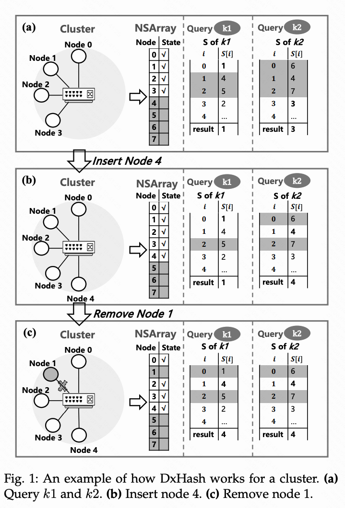

##### (a). 查找

DxHash 使用伪随机数生成器 PRNG 来将请求key映射到节点上。

> 伪随机数生成器（PRNG，Pseudo-Random Number Generator）是一类通过确定性算法，利用有限状态和初始种子（seed）生成“看似随机”数列的工具。虽然输出并非真正的随机（可预测、可重现），但在大多数工程应用中，PRNG 的统计特性足够“随机”，且具备高效、可控、可复现等优点。即当种子相同时可以再次生成相同的序列。

查找过程如下：

- 将请求key作为 PRNG 的种子。不断的调用 PRNG，然后取模 n（NSArray数组长度）。最终得到一个随机的节点Id序列S，序列中包含活跃节点和非活跃节点。
- 从序列S中依次选取节点，碰到第一个活跃节点即返回

```c++
uint32_t getNodeID(uint32_t key, uint32_t* numHash){
    uint32_t key2 = gen32bitRandNumber(key);     // 通过key生成一个随机种子key2
    uint32_t bs = crc32c_sse42_u64(key, key2);   // 通过key和种子生成第一个id
    uint32_t index = bs % size;                  // 通过对id取模获取节点的索引
    uint32_t i = 1;                              // 将初始的哈希次数设置为1
    while(!nodes[index]){                        // 查询index所在的节点是否是活动节点，如果是，则返回该节点索引，否则继续重复上述操作
        bs = crc32c_sse42_u64(bs, key2);         // 再次生成id并取模
        index = bs % size;
        i += 1;                                  // 每查找一次，增加哈希计数
        if (i >= 8 * size){                      // 查找次数达到上限，查找失败，返回错误
            return -1;
        }
    };
    *numHash = i;                                // 出参numHash表示总的哈希次数
    return index;                                // 返回节点索引
}
```

如图所示代码中，有一个查询上限 `i >= 8*size`。论文中提到，因为 PRNG 并不是真正随机，可能存在极少数请求键连续落入空闲槽。因此算法中设置一个查找上限 8n，超过则强制终止并抛弃或特殊处理，旨在平衡查询效率和匹配效率。理论上，未命中任何活跃位的概率为：
$$
P=(\frac{n-1}{n})^{8n} ≈ e^{-8} ≈ 0.0003
$$
即可能存在 0.03% 的请求键会受到影响。

 ##### (b). 节点的更新

NSArray的长度通常会大于集群节点数。

- 当新增一个节点时，会将NSArray数组对应节点位置的状态置为“活跃状态”。
- 当移除一个节点时，对应的，将NSArray数组中对应节点位置的状态置为“非活跃状态”

新增节点或者移除节点后，查找序列S中对应的某些节点的活跃状态会变化。这样，如图b和c所示。新增节点便可以抢到一些请求；移除节点便可以释放请求。

##### (c). 节点扩缩容

当 NSArray 中活跃节点数接近 n 时，会将数组长度翻倍为 2n，新增的数组索引全部初始化为空闲。此时需重新映射约50%的请求key。

当 NSArray 中活跃节点数空闲率过高时，会将数组长度缩小。由于缩容时，会带来更多的重映射。因此根据场景只有在空闲率非常低的时候才可以启动缩容。

#### (2). 优缺点

优点：

- 无状态查询
- 支持任意增删
- 内存占用相对固定

缺点：

- 存在查找边界：DxHash存在查找边界问题，即如果集群较小的情况下，可能会出现无法为key找到活动节点的问题。
- 扩缩容扰动较大：尽管DxHash支持扩缩容，但仍然建议初始化时使用足够大的NSArray，避免对象重映射带来的迁移问题。
- 建议初始化的较大的数组长度：减少扩容频率和影响。

### 7. 其他算法

还有很多一致性哈希算法，都有提出一些新的思路。

MementoHash： https://arxiv.org/html/2306.09783v3

BinomialHash：https://www.semanticscholar.org/reader/e3b51975a2ea5d4a50b3dc621c27a608db0c782c

## 三、需求

我们CDN缓存节点的场景基本如下：

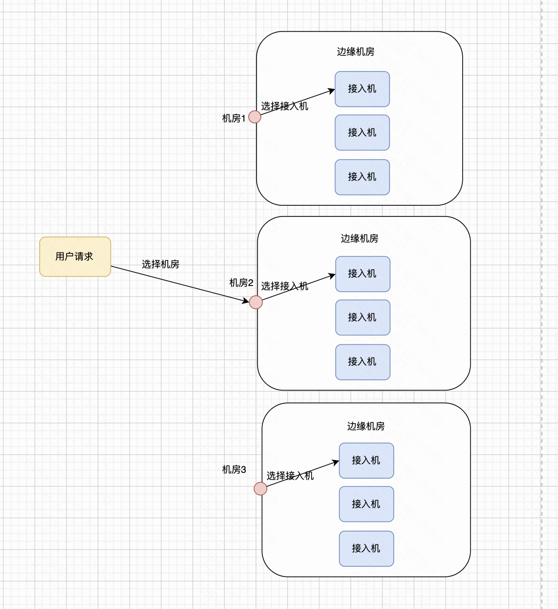

用户请求 key 来了先选择机房、然后再选择机房中某个机器。然后通过这个机器去下载请求key对应的文件。重点来论述一下“用户请求 key 来了之后选择机房”的场景。

前提条件：

- 请求key命中某个机房时
  - 每次请求都要下载文件，都会产生跑量带宽。
  - 如果命中机器缓存，则直接返回用户。
  - 如果未命中机器缓存，则机器需要进行回源下载文件并缓存，然后返回给用户。回源会产生回源网络带宽。
  - 可能会存在较多相同的请求key，如果都打到某台机器的话，会产生大量跑量带宽
- 机房的能力
  - 机器的内存缓存有限，内部回源网络带宽有限，机房的跑量带宽有限。
  - 不同场景下希望每个机房承接一部分无耦合的请求 key。比如A机房承接30%的文件比。
  - 机房的文件比大小，会影响：机房的缓存命中率、机房回源带宽、机房的跑量带宽
  - 请求key的数量多少，会影响：机房跑量带宽

需求：

- 我们希望机房跑量带宽最高，同时机房的缓存命中率最高，同时机房的回源带宽最小。在这三个指标中达到均衡。
- 由于请求key的数量在变动，且变动幅度较大。因此机房承接的文件比也有对应的变动。比如A机房低峰期承接30%的文件比，高峰期可能只能承接10%的文件比。
  - 重要的是文件比变动后，对应的槽位必须是灰度增加或减少。且灰度时间和灰度槽位数需要可控、配置化、可人工介入。
- 保证负载均衡，务必按照设置的文件比进行分配。需要精确度保证，30%的文件比一定只有30%的文件，不能有超过1%的误差。
- 文件比总和可以超过100%，请求key命中某槽位后，此槽位可以返回多个机房。（机房之间有优先级，存在备份机房）
- 某机房故障剔除后，不能直接将机房的文件/流量转移到其他机房，可能会打高其他机房的回源，极易造成雪崩。此时需要保证的不是最小扰动，而是无扰动。即使扰动是符合预期的，也需要有灰度、可控、配置化、人工介入的机制。
- 同理，新上线机房也不能对原有机房产生影响
- 需要有较高的查询吞吐，能够快速完成 key->node 的映射。
- 需要低资源占用，对CPU、内存等资源都有较小的占用，避免因内存过载导致的性能退化 。以及在状态变化（节点故障／恢复、集群扩缩容）时，算法必须在占用较小资源的情况下快速完成变更。
- 有一点是，如果变更引起了某槽位没有节点，则可以返回空，会兜底到三方厂商。

对于如上我们CDN的场景，要求非常严格，任何变动都需要灰度完成，并且提供人工介入的机制。并且对于查询性能、占用资源情况要求严苛，业界的一致性哈希算法无法直接落地。

因此我们针对我们的场景，自研了“离散型槽位哈希”，保证一致性哈希要求的同时，融入工程化求解思路，完美支持了我们CDN的场景。


## 四、自研离散型槽位哈希

针对我们的场景，我们自研了一款 “离散型槽位一致性哈希”，能够在固定数量的槽位空间内，将节点按照权重分配到每个槽位，并提供：

- **快速查询**：键通过一次哈希定位到槽位，再直接返回该槽位的节点列表，时间复杂度 `O(1)`。
- **动态增删**：节点增删和权重变更时仅局部调整槽位分配，操作复杂度接近 `O(log⁡S)`（S 为槽位数），远优于哈希环的虚拟节点重构。
- **负载均衡**：每个节点在全体槽位上有随机打分，根据节点权重计算“配额”，以加权方式分配槽位，保证节点最终获得的槽位数与权重成正比。
- **最小扰动**：只有增删节点或调整配额时，节点才在有限数量的槽位上做分配/释放，其他键映射保持不变。

下面，我们详细剖析下 SlotHash 的底层实现、负载均衡原理以及工程实践。帮读者理解清楚其设计思路和应用价值。

### 1. 数据结构

我们会使用数组作为基础数据结构，根据节点之间的权重，让不同节点填充对应数量的槽位。

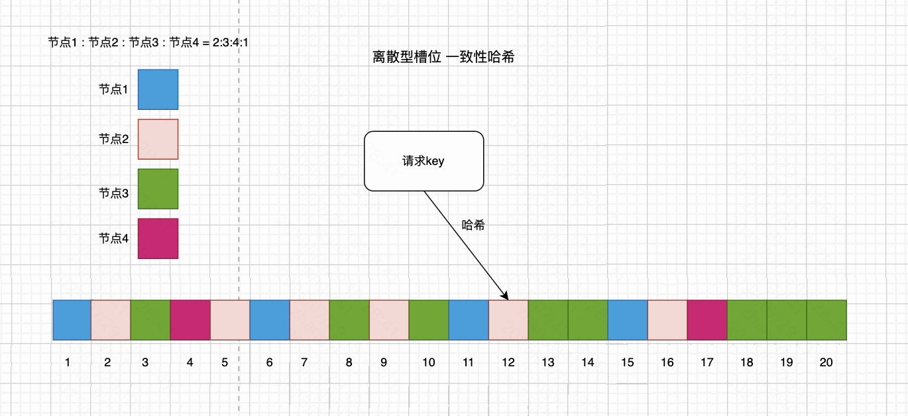

这里会出现两个问题。

- 每个槽位如何分配节点？以及节点的权重如何体现？
- 扩缩容场景下，如何保证最小扰动？

### 2. 节点和槽位的映射

我们需要对每个槽位选择一个后端节点，并且要尽可能公平，且槽位的数量要和后端节点的权重挂钩。我是这样做的。

使用槽位和节点这两个输入，求一个哈希值。计算每个节点在每个槽位的哈希值。然后进行离散化，取得每个节点在每个槽位的打分。计算方式如下：

```go
func getNodeSlotScore(hashFunc HashFuncType, nodeKey string) []float64 {
	slotScores := make([]float64, defaultSlotNum)
	for slot := 0; slot < defaultSlotNum; slot++ {
		score := getHashScore(hashFunc, nodeKey, slot)
		slotScores[slot] = score
	}
	return slotScores
}

func getHashScore(hashFunc HashFuncType, nodeKey string, slot int) float64 {
	nodeSlot := []byte(nodeKey + "_" + strconv.Itoa(slot))
	rawHash := hashFunc(nodeSlot)
	// h 的取值范围是 [0, 2^64-1]。加1后是 [1, 2^64]
	// 将哈希值规整到范围 (0, 1]
	normalizedHash := (float64(rawHash) + 1) / float64(math.MaxUint64)
	logScore := 1.0 / -math.Log(normalizedHash)
	return logScore
}
```

打分函数采用经典的做法，如下公式，近似指数分布。确保打分无偏且具备统计特性。
$$
\frac{1}{-log(r)}
$$
此时，我们拿到了每个节点对于每个槽位的打分了。

于是，我们可以知道每个槽位上，分配节点的优先级了，也就是说某槽位上打分越高的节点，越有机会占据此槽位。

但是，我们还要考虑节点之间的权重。我们举个例子来说明下这里的算法。

假设节点之间的权重为 `20%:30%:50%`（节点的权重加和可以不等于100%，大于或者小于100%都可以），然后一共有10个槽位。那为了保证节点权重符合预期。各节点所占的槽位也应该是 `2:3:5`。然后我们对各个节点的的槽位分数进行排序，得到降序排序的索引列表。

- 我们先算出来每个节点在每个槽位上的得分，然后按照节点的得分降序排序。
- 我们先填充 N1 的槽位，N1 应该填充 2 个槽位。按照得分的降序，此时依次填充 2、6 两个槽位。
- 再填充 N2 的槽位，N2 应该填充 3 个槽位。按照得分的降序，此时依次填充 1、7、8 三个槽位。
- 最后填充 N3 的槽位，N3 应该填充 5 个槽位。按照得分的降序，此时应该依次填充 3、4、5、9、10 四个槽位。如果某个槽位被占据了则继续向后找。

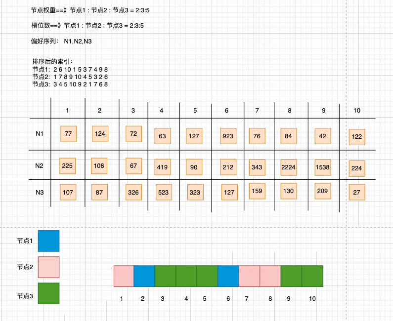

这样，只要每个节点在每个槽位的打分足够均匀，足够离散。那最终每个槽位的节点映射便会足够均匀随机。而且节点所占据的槽位数量严格和节点的权重对应。

### 3. 节点槽位的变化场景

节点所占据的槽位变化的场景，包括：扩容场景（新上线节点）、缩容场景（节点下线）、节点权重调整场景。

“新上线节点”和“节点权重增加”这两种场景是同质化的操作，新节点上线相当于节点的权重从0调整到某一定值，算法需要抢占槽位。

 “节点下线”和“节点权重减小”这两种场景是同质化操作，节点下线相当于节点的权重减小到0，算法需要释放槽位。

在节点槽位的变化场景中，我们需要保证的是最小扰动。即某个节点的上下线，不会影响到其他节点，且需要迁移的请求key要尽可能少。这是普通的一致性哈希所需要满足的性质。

#### (1). 节点抢占槽位

节点的权重调整过程，我们需要保证变动的槽位尽可能少，并且只应该影响调整的节点。

我们借着上面的例子继续阐述，假设节点1 的权重我希望从 2 变成 4。即节点1 所占用的槽位应该从 2 个变成 4个。此时我们要去抢占哪些槽位呢？让我阐述下这块的算法。

- 为了满足单调性，即没有变化的节点不应该有槽位的变动。
- 权重变化的节点，我们应该以较为平滑的算法去让他抢占槽位

抢占逻辑概括来说，就是让节点优先占据“剩余最空”、“对自己最有利”的槽位。玩法如下：

- 对于节点1 计算每个槽位的 slotDiff 列表。列表中的元素包含三个字段。分别是：
  - 槽位索引
  - 槽位当前的节点数
  - 打分差值，`scoreDiff = 节点当前的槽位打分-当前槽位所有节点的最高打分`。则 scoreDiff 值最大为0（此节点就是当前槽位的最高打分）
- 列表中会剔除部分槽位：这些槽位中已有节点1了
- 然后进行排序，排序规则是：如果“槽位当前的节点数”相同，则打分差值越大排在前面。如果“槽位当前节点数”不同，则“槽位当前节点数”越少会排在前面。
- 最后会去填充槽位。就可以实现先填充节点数量少的槽位，再填充分值较大的槽位

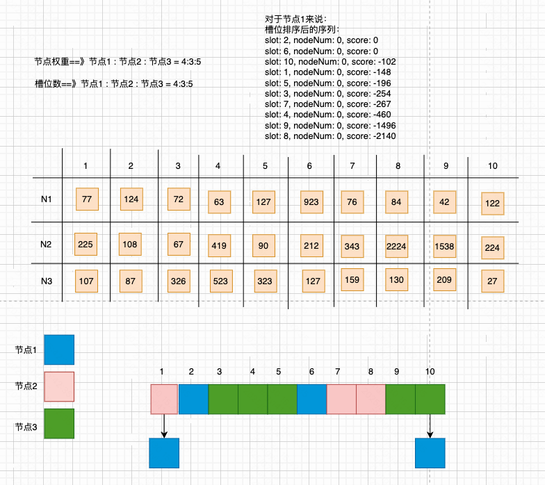

总而言之，第一步找节点数量较少的槽位去填充；第二步找得分最高的槽位去填充。保证槽位上的节点数量均衡、且分布离散。（槽位数越多分布越离散）

#### (2). 节点释放槽位

当节点的权重减小，对应的槽位数量要进行减少，需要释放一部分槽位。释放槽位的逻辑概括来说：让节点优先释放“最拥挤”或“对自己最不重要”的槽位。假设节点3的槽位要从 5 变成3。 玩法如下：

- 对于节点3来说，计算节点所在槽位的 slotScore 列表，列表中的元素有三个字段，分别是：
  - 槽位索引
  - 槽位当前的节点数
  - 当前节点槽位的打分
- 列表中只会保留有此节点的槽位。
- 然后进行排序，排序规则是：如果槽位上节点数量相同，则分数越低越优先释放；如果槽位上节点数量不同，则节点数量越多越优先释放。
- 最后按照排序后的序列，再去释放对应数量的槽位数量。

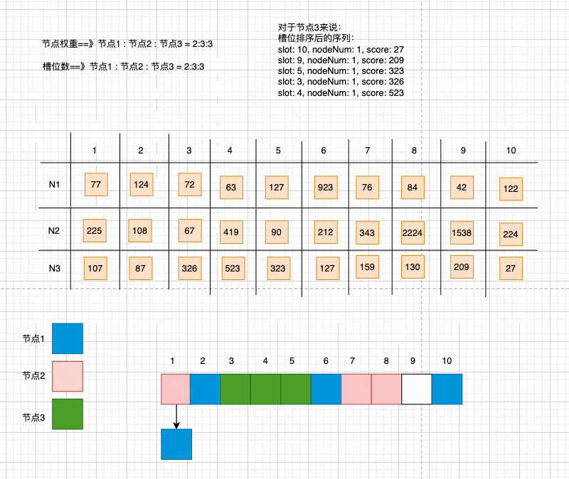

总之，第一步找节点数量较多的槽位去释放；第二步找得分最低的槽位去释放节点。保证槽位上节点数量严格按照权重来执行。

### 4. 槽位上节点数量

如上的操作我们可以看出，一个槽位上可以有多个节点，也可以没有节点。

- 多个节点的槽位，请求key命中此槽位时，算法会返回所有节点。需要工程上做进一步的分发流量。
- 没有节点的槽位，请求key命中此槽位时，算法会返回空。需要工程上做兜底修补。算法上不做修补，做到严格不扰动。

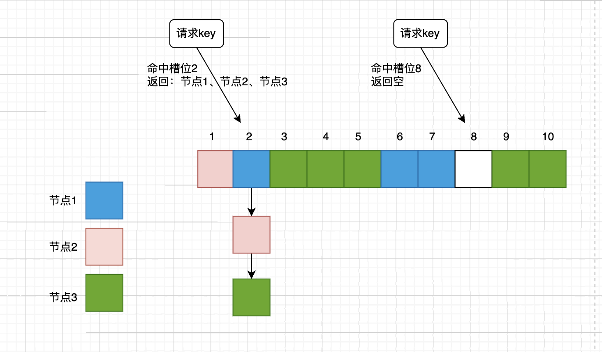

我们为了保证算法的完全单调和最小扰动。将节点权重变动后产生的问题，放在后置的工程侧去处理。这样就能适用于更加灵活可控的场景。

为什么要这么设计呢？

- **完全的单调性**：我们的后端节点一般都是缓存型的，槽位中节点的变化，一定会经历缓存的失效，而缓存失效就会产生回源。如果有太大的回源就会对整个系统产生影响，甚至产生雪崩。因此，我们需要的是A节点的变化，必须不能影响到其他节点的缓存变化。
  - 业界所有的一致性哈希算法，比如某节点的权重减小，一定会导致其他节点的权重增加、缓存变化。这些算法都在追求将多出来的流量分摊的更均衡。且需要较多的系统资源支持，比如较多的虚拟节点数。某些算法甚至不支持节点的权重。
  - 自研离散型槽位哈希算法，以工程的思路去求解。A节点的权重变化，只去操作A节点的槽位，不会操作其他节点的槽位，也就不会影响其他节点的缓存。

- **真正的最小扰动**：我们需要保证节点的权重和节点所占的槽位数量完全映射。比如节点的权重为30%，槽位总数为10个的情况下，此节点一定占据3个槽位，不会多也不会少。
  - 这里我们先做一个定义。当算法的上游输入去改变节点的权重时，一致性哈希需要保证的是“最小扰动”。也即变更此节点一定数量的槽位，并且此数量一定是可控的、符合预期的。
  - 其他的一致性哈希算法对于此场景，要么依赖于较多的虚拟节点数量（哈希环）；要么依赖于哈希算法的离散性（rendezvous-hash、maglev-hash、jump-consistent-hash）。做不到完全精准，只能说是控制了一定程度的误差。对精度要求较高的场景，我们认为节点权重的调整，带来的扰动不可控。
    比如虚拟节点数较少的情况下，将节点的权重从50调整到30。也许对应的哈希环上此此节点的虚拟节点会从50调整到28或者33。无法完全按照我们的实际预期调整。
  - 而自研离散型槽位哈希算法，严格按照上游输入去改变槽位，做到了零扰动。做到了完全可控。

这里就会产生一个问题，也就是槽位上节点的平衡分布问题，要让每个槽位上节点数量处于一个均衡的水平。最极端的场景下，一个槽位上填充了所有节点，但其他槽位上没有节点。我们需要保证的是槽位上节点数量的差值不超过1个。我们的做法是“槽位重平衡”。

### 5. 槽位重平衡

在槽位重平衡流程中，简单来说就是把节点数量较多的槽位上的节点移动到空槽位或者节点数量较少的槽位上。保证槽位上节点数量的最大值和最小值的差值不超过1个。玩法如下：

- 我们会遍历所有槽位的节点数量情况。记录大于1个节点的槽位和空槽位
- 对于“多节点槽位”按照节点数量进行排序，优先处理节点数量较多的槽位
- 对于某个槽位，我们要迁移那个节点呢？我们会按照此槽位中节点的打分进行排序，得分越低的节点将会被迁移。比如下图中：在槽位1中，节点1的得分是77，节点2的得分是225。那我们应该迁移节点1。
- 那么节点应该迁移到那个槽位呢？我们会按照槽位中节点数量排序，数量越少，优先级越高，空槽位的优先级最高。如下图，节点1被迁移到槽位9了。
- 整个迁移过程中，节点1的槽位数虽然没有变化，但是节点1所占据的槽位却发生了变化，这一定会影响到节点缓存。
- 因此我们的重平衡过程中，会有一些条件限制。比如：比如单次最多迁移2个槽位，1小时允许重平衡一次，只允许在规定时间段内进行重平衡。

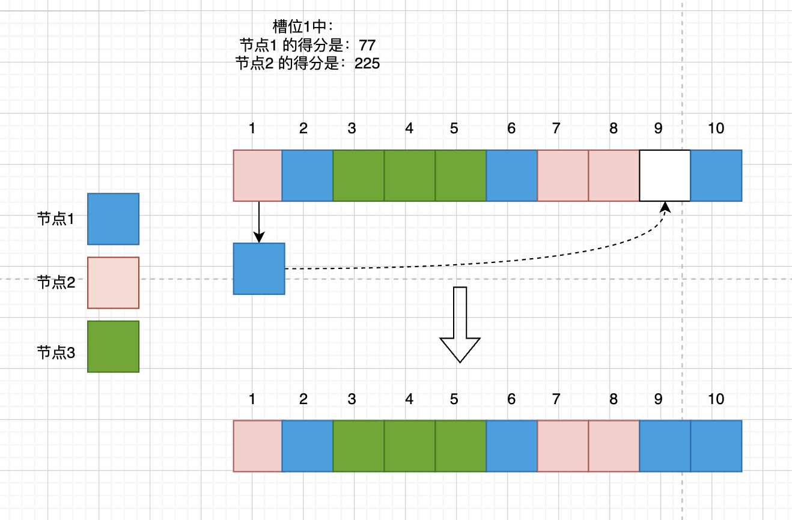

在重平衡前，

- 槽位1所对应的请求key被分给了两个节点，可能会导致节点承载的请求key总数变少。比如请求key总共有100个，每个槽位分配10个请求key。预期节点1槽位有4个，分配40个请求key；预期节点2分配30个请求key。但实际上节点1和节点2总共只分了60个请求key。相当于这两个节点分配的请求小于可承载的请求，会产生节点资源浪费。
- 而槽位9所对应的请求key返回了空，导致某一部分请求key没有分配到预期的后端节点。

重平衡后，

- 我们可以杜绝空槽位，保证请求key都可以分配到预期的后端节点（假设基数为100，只要后端节点的权重总和大于等于100即可）。
- 保证每个槽位分配的后端节点数的差值不超过1，这样可以让每个后端节点尽可能承接预期数量的请求key。

这样，我们通过灰度的方式，保证了请求key可以合理的哈希到后端节点，后端节点的权重和请求key之间满足线性的关系。


## 五、 工程化落地

算法解决的是“能否实现目标”？工程解决“到达目的地的最优路径”，即“如何高效、稳定、可控的实现目标”。

### 1. CDN点播架构

此算法主要落地于CDN点播这边的调度场景，我们先来看下CDN点播架构。

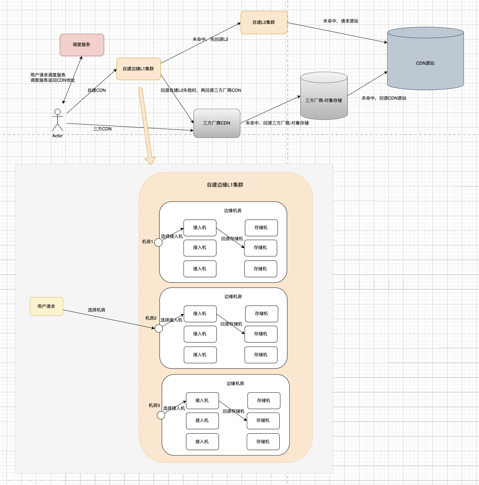

自建点播CDN共分为两层架构：边缘节点L1和缓存节点L2。其中，边缘节点是真正服务用户的节点。

其中边缘节点L1，机器分为接入机和存储机。

- 接入机，配置大内存，用来对外提供服务并缓存文件。
- 存储机，配置大容量磁盘，用于缓存尽可能多的冷门文件，降低边缘节点的整体回源率，从而减少延迟，节省回源带宽。

此算法主要落地于如图中的“调度服务”。主要是调度服务在处理自建边缘L1机房的场景。流程如下：

- 用户请求下载短视频文件，请求调度服务
- 调度服务根据文件信息，在结合自建/三方CDN的资源信息。返回给用户CDN地址。选择自建的流程
  - **对于用户请求，根据“自研离散型槽位哈希算法”从多个边缘机房中选择一个机房**
  - 机房选定之后，根据文件信息，再通过“经典一致性哈希算法”选择此机房中的某个接入机。
  - 如果此接入机存在此文件，则直接返回；如果不存在，则一致性哈希选择机房中存储机进行回源。
  - 后续流程如上图
- 用户通过CDN地址下载短视频文件。

我们希望的是尽可能将所有的请求都拦截在“接入机”，让其命中内存缓存。那具体如何应用算法选择机房呢？

### 2. 核心输入

在选择边缘机房时，我们先来确认一下算法都有哪些核心输入。

#### (1). OC的文件分配比例

因为我们接入机的内存缓存有限，因此只能承接部分“文件”(视频/图片)。这些文件都有一个ID标识。我们将这些ID归一化到 `[0, 10w]`这个区间。因此我们的输入输出就变成：

- 输入是自建OC跑量限制、机房点播最大可跑带宽(参考机房回源能力)、机房直播带宽、机房静态带宽、OC中nc5机器跑静态的带宽、地区可控带宽
- 输出是自建OC的文件比

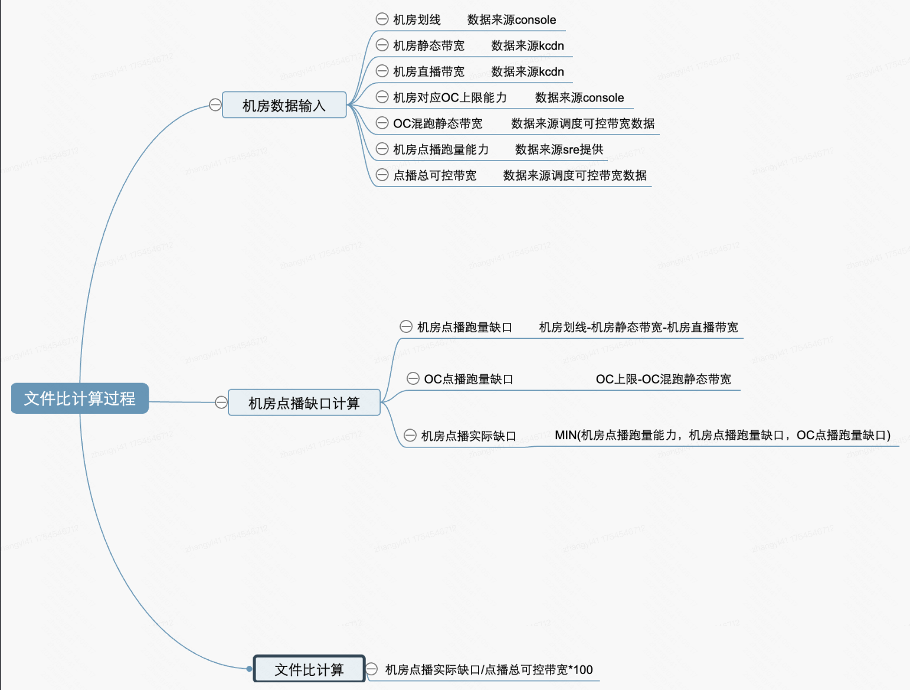

我们拿到自建OC的文件比之后，再通过“离散型槽位哈希”算法即可将OC文件比离散的映射到 `[0,10w]` 这个区间。

#### (2). OC的流量分配比例

简单来说，就是一个省份运营商下有 X 可控带宽，有三个自建机房，有五个三方厂商。我们要把这些可控带宽如何分配？

我们采用“最小费用最大流算法”（MCMF算法），指导算出自建机房或三方厂商流量的分配结果。

> 最小费用最大流算法：https://zh.wikipedia.org/wiki/%E6%9C%80%E5%B0%8F%E8%B4%B9%E7%94%A8%E6%9C%80%E5%A4%A7%E6%B5%81%E9%97%AE%E9%A2%98

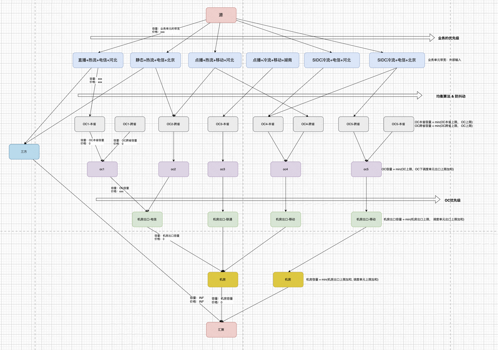

我们举个例子来阐述一下，假设广东移动有150G的可控带宽，有三个自建机房OC1、OC2、OC3，有一个三方厂商。经过MCMF算法进行计算之后。

- 自建机房OC1的上限为60G。分配带宽50G。则流量分配比例为：`50G/150G=0.33`
- 自建机房OC2的上限为30G。分配带宽30G。则流量分配比例为：`30G/150G=0.2`
- 自建机房OC3的上限为50G。分配带宽40G。则流量分配比例为：`40G/150G=0.27`
- 三方厂商的上限可以认为有500G。分配带宽30G。则流量分配比例为：`30G/150G=0.2`

分配比: 实际分配的带宽 / 地区的可控带宽。

这样，我们就可以得到某个地区的可控带宽，要分给自建机房或三方厂商的比例了。

#### (3). 机器的流量分配比例

针对自建机房，我们知道了给这个自建机房分配多少流量，但是自建机房中有多台机器，如何将这些流量合理的分配到这些机器上呢？我们按照机器的能力进行分配。假设机房OC1有三台机器，机房OC1分配了50G的带宽。

`机器的分配带宽 = 机器的上限 * 机房的分配带宽 / 机器的上限加和`

`机器的分配比例 = 机器的上限 / 机器的上限加和`

- 机器1的上限为20G。分配带宽：`20G*50G/(20G+30G+10G)=16.7G`。分配比例：`20G/(20G+30G+10G)=0.33`
- 机器2的上限为30G。分配带宽：`30G*50G/(20G+30G+10G)=25G`。分配比例：`30G/(20G+30G+10G)=0.5`
- 机器3的上限为10G。分配带宽：`10G*50G/(20G+30G+10G)=8.3G`。分配比例：`10G/(20G+30G+10G)=0.17`

这样可以算出来某个机房中，某台机器可以分配多少带宽，以及机器的流量分配比例了。

#### (4). 机器的负反馈比例

由于CDN的下发链路和实际的用户请求CDN地址链路，中间链路较长，且经历了非常多的核心数据的转化、计算。导致外部输入的数据存在一定的误差，且此误差来自于多个团队、不同方向同学的贡献。因此我们需要根据实际的机器跑量情况做进一步调度校准。

我们可以拿到机器的网卡带宽，也即机器的实际跑量。我们将此网卡带宽作为参考，采用PID算法，来修正误差，进一步指导调度。

> PID算法：https://zh.wikipedia.org/wiki/PID%E6%8E%A7%E5%88%B6%E5%99%A8

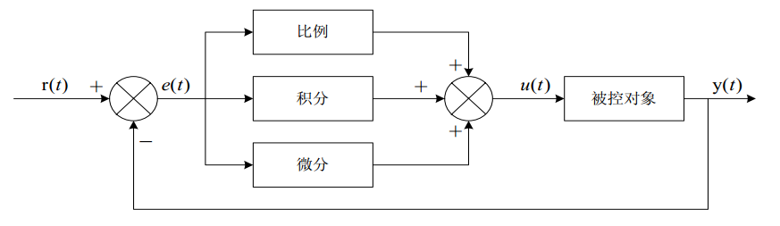

图中，`r(t)` 是给定值，`y(t)` 是系统的实际输出值，给定值与实际输出值构成控制偏差：
$$
e(t)=r(t)−y(t)
$$
`e(t)` 作为 PID 控制的输入， 作为 PID 控制器的输出和被控对象的输入。 所以模拟 PID 控制器的 控制规律为
$$
u(t)=kp[e(t) + \frac{1}{Ti} ∫e(t)dt + Td \frac{de(t)}{dt} ]
$$
其中，`Kp` 为控制器的比例系数，`Ti` 为控制器的积分时间，也称积分系数，`Td` 为控制器的微分时间，也称微分系数。

根据实际情况，使用线上大批量的数据样本进行训练，不同场景下采用不同的“控制比例系数、积分系数、微分系数”作为参数。可以有效的调节调度。

比如机器分配了20G的带宽，但通过负反馈进行调节之后，实际只能跑19G的带宽。此时我们便可以算出机器的负反馈比例了，即为：`19G/20G=0.95`。此时，我们即可通过负反馈比例进一步精准化的调度了。

### 3. 算法落地

我们当前的场景再来阐述一下。

- 某个地区有一定的可控带宽，有多个自建机房和三方厂商。需要将流量分配给这些自建机房或三方厂商。
- 假设我们把文件(视频或图片)ID我们归一化到 `[0,100]`这个区间。
- 由于自建机房的接入机内存有限，接入机和存储机之间网络带宽有一定成本。我们需要尽可能复用缓存。因此我们期望机房之间的文件尽可能不重合。比如A机房承接 `[0, 30)`区间的文件，B机房承接 `[30,100]`区间的文件。以此来保证缓存的高复用率。
- 我们希望自建机房所承接的流量和自建机房所承接的文件区间尽可能达到均衡。
  - 比如某地区的可控带宽有 150G，文件ID归一到 `[0,100]`区间后，每份文件区间的带宽大致有 1.5M。如果此地区某个机房可承接的带宽有50G。那理论上分配任意 33% 的文件区间即能产生50G的可控带宽。因此此机房的文件区间占比不要超过33%，保证机房跑量的同时，接入机和存储机之间回源带宽最小。
  - 理论上，机房的文件区间占比越大，接入机和存储机之间的回源越大。当然还要看其他条件，比如机型、地区可控带宽等
- 我们如果使用连续性区间比如 `[0, 30]`作为机房的文件区间。当出现机房扩缩容、机房的文件区间调整的场景时，处理逻辑将呈指数型爆炸，运维成本非常高。
  - 某地区有三个机房，文件区间分别为：`A:[0, 20), B:[2w, 60), C:[60,100] `。此时如果扩容一个机房，就需要从其他机房挤出一些文件区间，比如：`A:[0,15), B:[15, 50), C:[50, 90), D:[90, 100]`。可以看到扩容一个机房，其他机房的文件区间都需要调整，产生的回源成本将非常大，运维需要计算维护的成本非常高。
  - 机房的扩容、缩容、文件区间的调整，一定会影响到其他机房。变更影响不够单调。
  - 某个三方厂商的文件区间为：`A:[0, 50]`，此厂商故障时，我们希望能够分给两个或多个厂商，保证故障转移的压力不会很大。则文件区间变成：`B:[0, 25), C:[25,50]`。如果在A厂商恢复之前，B厂商又故障了，则文件区间变成:`D:[0, 12), E:[13, 25), C:[25,50]`。以此类推，连续的文件区间将在多次故障之后变得非常离散，人工介入操作难，配置数量将非常多，运维成本非常高。
- 我们使用文件比（一个百分比）来代替文件区间。对外呈现的操作更加简单，运维成本降低。由算法保证变更的单调性和稳定性。

场景我们梳理清楚后，我们来看下“离散型槽位哈希算法”是如何工程实践落地的。

假设机房的文件比分别为：`node1:30%, node2: 20%, node3: 40%`。假设槽位总数由10个。也即机房分配的槽位数：`node1:3个, node2:2个, node3:4个`。如下图，是经过多次机房权重调整后，还未进行重平衡的结果。

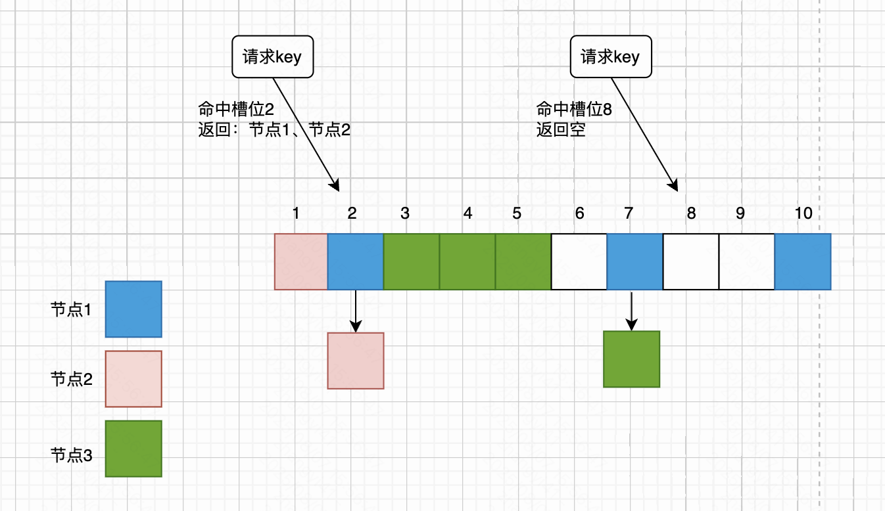

我们可以看到：

- 机房的文件比之和，不一定为100%。

  - 可以小于100%，此时，一定存在空槽位。空槽位的流量会流到三方
  - 可以等于100%，此时，重平衡之后的最终态，每个槽位都有自建机房，非常理想
  - 可以大于100%，此时，重平衡之后的最终态，某些槽位可能存在多个自建机房。命中这些槽位的请求，算法会返回多个自建节点。

- 槽位就代表着一份最小的可控文件区间。

- 某个槽位上的后端节点可以返回空。当用户请求命中“槽位8”时，选不到自建节点，此时返回三方CDN。

- 某个槽位上的后端节点可以返回多个。 当用户请求命中“槽位2”时，可以有多个自建节点争抢流量，节点之间的流量按照“机房的流量分配比例”去分发。

- 我们会定时对槽位进行重平衡，尽量填充空槽位，并且槽位上的节点数量的差值不超过一个，保证尽量均衡。

  - 每天只有 `[09:00, 17:00]` 这个时间段才会进行重平衡
  - 每隔一个小时会触发重平衡
  - 每次重平衡时，每个机房槽位变化数量不超过2个（基数为100）

  - 通过这种灰度的方式，来保证稳定性。

### 4. 场景分析

在机房的变更场景中，我们来分别分析下。

- 当机房的文件比增大时，对应的，通过算法进行抢占对应数量的槽位。
- 当机房的文件比减少时，对应的，通过算法进行释放对应数量的槽位。
- 当某地区有新机房上线时，对应的，给这个新机房抢占对应数量的槽位
- 当某地区有机房下线时，对应的，将这个机房的槽位释放掉

如上不同场景的策略做工后，可能会产生如下的结果

- 抢占槽位后，槽位上可能会有多个自建节点。这些自建节点的分量逻辑是：按照“机房流量分配比例”作为权重，将命中此槽位的请求分发给不同自建节点。
- 释放槽位后，槽位上可能会没有自建节点。此时命中此槽位的请求将返回三方厂商。
- 调整之后，可能会出现槽位上自建节点分布不均衡的情况，通过“重平衡”的方式灰度的完成槽位上自建节点的均衡分布。

最终，用户的请求流程如下：

1. 使用“离散型槽位哈希算法”，为多个自建节点构建槽位。用户请求进来之后先选择槽位。
2. 槽位中的多个自建节点，使用“节点的流量分配比例”作为权重，选择出一个节点
3. 节点下的机器，我们采用“机器的流量分配比例”作为权重，使用经典一致性哈希算法构建机器间的哈希环。选择一个机器。
4. 最后再根据机器的负反馈比例，来决定是否使用当前机器。

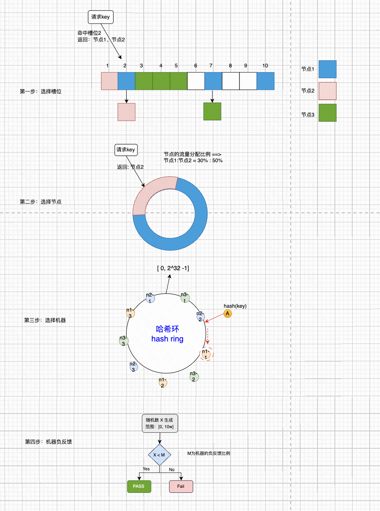

这样，便完成了CDN调度的整个流程。


## 六、测试

代码库：https://github.com/noahyz/consistent-hash/tree/master

此代码库我实现了如上所有的一致性哈希算法，并且从“分布均匀性”、“节点变动重映射比例”、“查询性能”方面做了测试。

测试环境：OS：MacOS；CPU：Apple M2 Pro；MEM：32G；Go版本：1.23.8 

### 1. 分布均匀性

分布均匀性测试衡量的是当大量键被分配到固定数量的节点时，每个节点被分配到的键数量是否接近平均值。我们使用标准差来衡量分布均匀性：

- **标准差越小**：表示各节点被分配到的键数量越接近平均值，分布越均匀
- **标准差越大**：表示某些节点被分配到的键数量远高于或低于平均值，分布不均匀

测试方法：使用 1000 个节点和 100,000 个键进行测试。每个节点平均分配键数为 100。

具体测试结果：

| 算法                    | 标准差 | 分布均匀性   |
| ----------------------- | ------ | ------------ |
| RendezvousHash          | 9.81   | 优秀         |
| JumpHash                | 9.87   | 优秀         |
| SlotHash                | 10.09  | 优秀         |
| MaglevHash(65537表长)   | 10.40  | 优秀         |
| RingHash(160个虚拟节点) | 13.04  | 良好         |
| MaglevHash(2039表长)    | 14.00  | 良好         |
| RingHash(40个虚拟节点)  | 19.66  | 一般         |
| DxHash                  | 30.86  | 一般         |
| AnchorHash(2000数组长)  | 787.60 | 差，极不均匀 |

可以看出：

- RendezvousHash、JumHash、SlotHash 的分布均匀性非常优秀
- MaglevHash、RingHash 只有在表长或虚拟节点数较大的情况下，才能有良好的均匀分布。
- 而 AnchorHash算法的分布极不均匀（存在大量的空槽位）

### 2. 重映射比例

重映射测试衡量的是当系统中增加新节点时，有多少比例的键需要重新分配到不同的节点：

- **重映射比例越低**：表示系统扩展时对现有服务的影响越小
- **重映射比例越高**：表示系统扩展时对现有服务的影响越大

测试方法：添加 10 个节点到 1000 个初始节点，测试key为 100000个

具体测试结果：

| 算法                    | 重映射键数 | 重映射比例 | 添加节点耗时 | 重映射性能 |
| ----------------------- | ---------- | ---------- | ------------ | ---------- |
| SlotHash                | 0          | 0.00%      | 88.74ms      | 无需重映射 |
| AnchorHash              | 735        | 0.73%      | 2.167µs      | 最小化 |
| RingHash(160个虚拟节点) | 973        | 0.97%      | 170.29ms     | 最小化 |
| RendezvousHash          | 1023       | 1.02%      | 2.583µs      | 中等 |
| RingHash(40个虚拟节点)  | 1031       | 1.03%      | 38.17m s     | 中等 |
| JumpHash                | 1034       | 1.03%      | 2.291µs      | 中等 |
|   DxHash                      |    1297        |      1.30%      |         5.625µs     | 中等 |
| MaglevHash(65537表长)   | 3418       | 3.42%      | 26.62ms      | 较大 |
| MaglevHash(2039表长)    | 3504       | 3.50%      | 3.21ms       | 较大 |

可以看出：

- SlotHash 算法可以做到无需重映射，非常适合对重映射非常敏感的场景
- AnchorHash、RingHash、RendezvousHash、JumpHash、DxHash 算法的重映射相对良好
- MaglevHash 算法的重映射比例较高，并且和表长无关。重映射敏感场景慎用。

### 3. 查询性能

查询性能测试衡量的是算法处理单个键查询的速度：

- **时间越短**：表示算法查询速度越快，性能越好
- **时间越长**：表示算法查询速度越慢，性能越差

测试方式：1000个节点，执行 100000 次查询操作

具体测试结果：

| 算法                    | 耗时         | 查询性能 |
| ----------------------- | ------------ | -------- |
| JumpHash                | 10.979583ms  | 快速     |
| MaglevHash（2039表长）  | 12.585542ms  | 快速     |
| MaglevHash(65537表长)   | 13.040875ms  | 快速     |
| SlotHash                | 15.797959ms  | 快速     |
| RingHash(40个虚拟节点)  | 17.461917ms  | 快速     |
| RingHash(160个虚拟节点) | 20.823416ms  | 快速     |
| DxHash                  | 42.3815ms    | 中等     |
| AnchorHash              | 52.484208ms  | 中等     |
| RendezvousHash          | 4.199090375s | 缓慢     |

可以看出：

- RendezvousHash 的查询性能非常差，因为要进行大量计算。导致耗时差了一个数量级。
- 其他算法的查询性性能适合

### 4. 对比

我们与常见哈希算法作特性对比，包括负载均衡，单调性、稳定性(扰动量)、是否有状态、查找复杂度、空间开销等。如表所示：

| 算法              | 负载均衡             | 单调性                       | 稳定性(扰动量)             | 是否支持权重 | 是否有状态       | 查找复杂度 | 空间开销                           | 备注                         |
| ----------------- | -------------------- | ---------------------------- | -------------------------- | ------------ | ---------------- | ---------- | ---------------------------------- | ---------------------------- |
| Ring hash         | 一般(依赖虚拟节点数) | 良好                         | 中（约1/N）                | 支持         | 无状态           | O(logV)    | O(V)（虚拟节点数）                 | 通过虚拟节点比例实现权重     |
| Rendezvous (HRW)  | 优秀                 | 良好                         | 极低（仅影响权重变化节点） | 支持         | 无状态           | O(N)       | O(1)                               | 天然支持权重计算             |
| Jump Consistent   | 接近优秀             | 限制（仅支持末尾加删）       | 极低，约 1/(N+1)           | 不支持       | 无状态           | O(log N)   | O(1)                               | 不支持权重                   |
| MaglevHash        | 良好(均匀)           | 较差（节点变动需重构）       | 中（依赖表大小）           | 不支持(原生) | 无状态           | O(1)       | O(M) 其中 M远大于N，高（大查找表） | 原生不支持权重               |
| AnchorHash        | 良好                 | 完全（记录状态，可任意增删） | 极少（理论最小扰动）       | 支持         | 有状态（需串行） | 平均O(1)   | O(B) 其中B为最大规划数             | 有最大节点数限制，扩展性较差 |
| DxHash            | 良好                 | 完全（伪随机序列映射）       | 高，扩容时约50%            | 支持         | 无状态           | 近似O(1)   | O(S) 其中 `S = 2^k >= N`           | 扩容扰动极大                 |
| SlotHash (本算法) | 完美(精确按权重分配) | 完全（仅影响自身槽位）       | 可控零扰动                 | 支持         | 有状态（重平衡） | O(1)       | O(S+N)（固定槽位表）               | 工程级灰度控制               |

关键特性详解

1. 负载均衡：
   - SlotHash：唯一实现精确权重映射
   - Rendezvous：原生的均衡，对权重敏感
   - JumpHash：无权重，但分布均匀
2. 单调性：
   - SlotHash / Anchor / DxHash：支持任意节点增删
   - JumpHash：仅支持末尾顺序变更（重大限制）
   - Maglev：最差（全局重构破坏单调性）
3. 稳定性（扰动量）
   - SlotHash：唯一实现工程级可控扰动
   - AnchorHash：理论最小扰动（但需预设规模上限）
   - DxHash：扩容时有 50% 的重映射（不适合敏感场景）

可以看出，自研的 SlotHash 算法，结合工程求解思路，在保留状态的前提下，其他的特性几乎都优胜于常见哈希算法。

### 5. 场景

我们根据算法的特性，总结一下不同算法适用的场景。

| 算法             | 优点                                                         | 缺点                                                         | 适用场景                                                     |
| ---------------- | ------------------------------------------------------------ | ------------------------------------------------------------ | ------------------------------------------------------------ |
| RingHash         | 1. 实现简单<br />2. 通过虚拟节点可以调节分布均匀性           | 1. 查询性能 O(logN)<br />2. 分布均匀性依赖虚拟节点数         | 对性能要求不高、实现简单优先的场景                           |
| JumpHash         | 1. 内存占用小，无额外数据结构<br />2. 查询性能、分布均匀性、重映射比例都不错 | 1. 只能在尾部增删节点，无法随意增删节点<br />2. 不支持节点权重 | 节点变化极少，且主要在尾部操作的场景                         |
| MaglevHash       | 1. 查询性能、分布均匀性都不错                                | 1. 内存占用大，需要预先计算查找表<br />2. 节点变动时，重映射比较较高<br />3. 重建表比较耗时<br />4. 原生不支持权重 | 查询频率高，对查询性能要求极高的场景                         |
| RendezvousHash   | 1. 分布均匀性、节点重映射都不错<br />2. 可以在任意位置增删节点 | 1. 查询性能较差                                              | 节点数量不错，对分布均匀性要求高，查询频率不高的场景         |
| AnchorHash       | 1. 节点重映射比例较小，删除节点时只影响直接映射到该节点的key | 1. 分布均匀性非常差<br />2. 查询性能一般<br />3. 有状态      | 对重映射要求高、可以接受分布不均匀的场景                     |
| DxHash           | 都一般                                                       | 1. 分布均匀性、查询性能、重映射比例都一般<br />2. 扩容扰动非常大 | 节点数量确定，不会发生扩容的场景                             |
| SlotHash(本算法) | 1. 查询性能、分布均匀性都不错<br />2. 精确权重映射<br />3. 节点变动时，无需重映射，做到零扰动<br />4. 可以在任意位置增删节点<br />5. 支持工程介入配置，人工可控，可以灵活调优 | 1. 有状态<br />2. 需要重平衡                                 | 节点配额精确匹配，节点扩缩容导致的重映射场景要求无扰动、人工可控，可以容忍带状态的场景 |


## 七、结尾

### 1. 优势与调优

SlotHash在CDN点播场景下的优势体现在：

- 完全单调性：任何节点变化只影响自身的槽位分配，不会牵连其他节点的缓存或状态。彻底避免级联缓存失效，是CDN场景防雪崩的关键。
- 精确可控最小扰动：节点权重与槽位数量严格线性对应，变更时仅调整必要槽位，扰动范围与预期完全一致，实现零预期扰动；
- 高效负载均衡：通过随机评分、配额机制和重平衡机制，实现请求流量与节点能力的精确匹配，大幅降低资源浪费。

此外，SlotHash 支持灵活调优：

- 每日变更上限：可配置每天每台机房最多变更的槽位数，避免频繁大规模迁移。
- 重平衡策略：限制时间窗口(如“每天`[09:00–17:00]`)，频率(每小时一次)，单次迁移量，让灰度过程完全可控。
- 槽位数量设置：一般槽位总数根据场景设置为较大基数（如1000）以获得更精细的分割粒度，从而提高缓存命中率。

通过上述策略，SlotHash既实现了哈希映射的稳定性和可控性，又兼顾了高性能的实际需求，为CDN点播调度提供了工程化的解决方案。

### 2. 小结

本文详细介绍了为满足 CDN 点播调度严苛需求而自主研发的 “离散型槽位一致性哈希 (SlotHash)” 算法。SlotHash 通过 **固定槽位 + 随机评分 + 精确配额** 的核心设计，实现了：

1. 权重到槽位数的精确映射，实现了“严格线性负载分配” 和 “完全单调性” 与 “精确可控的最小扰动”。
2. 动态扩缩容过程中，节点变更时“只调整自身相关槽位”，彻底避免影响其他节点缓存。
3. 在查询效率 `O(1)`、稳定性、空间开销 `O(S+N)` 方面具有综合优势。

结合 “每日变更上限、受控重平衡、多节点/空槽位工程策略” 等调优手段，SlotHash 在快手点播 CDN 的落地实践中，成功解决了动态文件比、精确负载、无冲击扩缩容等核心挑战，显著提升了缓存利用率和系统稳定性，成为兼顾强一致性、可控性与高性能的优秀工程解决方案。

