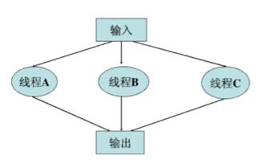

### 一、线程的定义

线程的定义：操作系统中能够被调度的最小单元，线程有自己的 context、stack 以及 thread local storage；但与同一进程中的其他线程共享进程资源。

如果从另外一个角度来思考：比如把 C 语言的指针作为机器地址的抽象的话，那么线程可以认为是 “机器流水线” 或者 “虚拟处理器” 的抽象。只是流水线之间的耦合并没有线程来的那么紧密，原因在于线程之间还是共享了很多资源，编码的时候需要注意线程安全。

### 二、线程安全

首先注意，在很多场合，“线程安全” 和 “可重入” 总是混在一起，但这两个并不是同一概念。可重入（别名：异步信号安全）是一个更严格的要求，首先他要求线程安全，其次当发生信号中断并且执行完中断处理例程后，回头继续执行线程代码需要仍然保证正确才可以。

使用 mutex 的代码可能是线程安全的，但不是可重入的。可重入函数只是线程安全函数的一部分。


注意：无论是线程安全还是可重入。二者都具备传递性。也就是说，如果当前函数调用了非线程安全的函数，则当前函数一定不是线程安全的。

### 三、线程同步与线程安全的实现机制

首先，最好是不共享任何的资源，从而避免竞争。同时，需要确认具体的场景，是否是伪共享，比如 errno。站在业务的逻辑角度，如果允许每个线程都存在一份拷贝，而且无须同步的话，可以通过使用 TLS（线程局部缓存）来实现。

如果非要共享资源的话，有如下的一些方式。

#### 1. 互斥锁

操作系统提供的互斥锁是最常见的同步方式，同时，我们可以认为信号量也是一种将资源数目从 1 泛化到 N 的互斥锁。

当线程进入临界区前获得锁，只有获得了锁的线程才能继续执行，当退出临界区后归还锁。如果锁被占用，则线程进入阻塞状态。但是要预防错误的加锁顺序或者持有锁但不释放的场景，否则会造成程序死锁等等问题。通过合理的 RAII 机制（类的构造函数中请求资源，在类的析构函数中释放资源的技术称为资源获取即初始化）来保证锁的获取与释放是多线程编程的一种最佳实践，以至于这也进入了 C++11 的标准，比如 `std::unique_lock`。

当然，即使已经注意到了加锁顺序、申请的锁一定释放 等规则，但仍然有可能存在问题：

- 优先级反转。现代的操作系统通过 “优先级继承” 较好的解决了这个问题。但程序员需要注意自己的代码所运行的平台是否有这个机制，然后需要正确的设置线程属性。
- 此外，如果所有优先级都调整到一个数量级，那么还需要注意 `lock convoy` 问题。`lock convoy` 的场景是：比如 2 人迎面过独木桥，2 人相遇后均主动放弃退回，然后再次上桥又相遇了。注意，这不是死锁，但这种不好的设计后很耗费 CPU。类似的问题比如 accept 的惊群问题，以及当在条件变量中唤醒所有等待线程时也会瞬时触发类似场景。

#### 2. 条件变量

条件变量也是同步的一种手段，由一把锁（mutex）和一个 condition 组成。他可以使线程阻塞在某一条件上。当条件满足时，线程会被唤醒，需要注意的是 “虚假唤醒”，即当 wait 返回后，需要再次判断条件是否满足。

 #### 3. 读写锁

读写锁，读共享，写互斥。但是这是一个充满诱惑的坑：由于语义的复杂性，其内部实现效率要比普通 mutex 慢很多。

因此，当且仅当在多读一写的情况下，并且读锁临界区非常大时，比如要做 IO，才适合用读写锁。

百度的 bvar 库，实现了一种用于统计的读写锁，即读时合并所有写，降低了 `cache line bouncing` （CPU 的缓存行跳跃）

#### 4. 自旋锁

spinlock 线程在等待锁期间不会被切换，而是一直空转，因此比较耗费 CPU 资源。因此使用 spinlock 的场景，仅仅适合那种实时、短小且不会主动切换的场景。

实际上 mutex 的实现中自带了部分 spinlock，所以用户态下尽量使用互斥锁。

#### 5. 原子操作

c++ 提供了 `std::atomic` 来实现原子操作。有一些注意事项。

编译器和 CPU 在生成或执行指令时可能会打乱某些看似无关的代码（指令），但这些代码（指令）在多线程环境下可能存在依赖关系。比如：

```c++
std::atomic<int> a;
std::atomic<int> b;
int thread_1() {
		int t = 1;
		a = t;
		b = 2;
}

int thread_2() {
		while (b != 2) {
				std::cout << a << std::endl;
		}
}
```

假设线程 1 和线程 2 是运行在同一进程下的不同线程，则可能会打印 a 的值为 0。

因此，C++11 中 atomic 都需要指定当前场景所需的 `memory order`（内存模型）来提高性能。

除此之外，还有一种场景的错误。比如 a、b 两个变量都是 atomic 属性的，但是 `if (a > b)` 这种写法可不是线程安全的，毕竟 `a>b` 其实是多个指令并不是原子的。还有大部分 `lock-free`（无锁保证线程安全）实现也是基于 atomic 的，但同时也有很多问题需要注意，比如 ABA 问题。

因此，在使用 atomic 的时候，尽量选择使用在简单变量的读写共享上，即始终明确临界区的概念中所谓的锁，并不是锁定一个资源，而是锁定对该资源的访问操作。

#### 6. 性能相关

当通过互斥锁或者条件变量来实现线程同步，不可避免的会发生主动的线程切换。而不恰当的切换则会影响到系统的吞吐和效率。

多线程加锁的消耗取决于竞争的激烈程序以及上下文切换的开销。因此缩小临界区，将不用加锁的部分代码移出临界区是提高性能的关键。并且 `pthread_mutex_t` 的实现基于 Linux 的 futex，当临界区足够小时，一次 `pthread_mutex_lock` 消耗非常小。

此外，通过对不同的业务逻辑采用恰当的线程模型，也能避免竞争的激烈程度。

### 四、线程模型

对于不同的业务逻辑，多线程的设计存在不同的模型，大致可以分为计算密集型、IO 密集型。

对于多线程，通常采用 “线程池技术” 来降低线程创建和退出的消耗，一般来说，策略分为：work-group 模型、pipe-line 模型。

#### 1. work-group 模型

在这种工作组模型中，请求或者数据是被一组线程处理的。比如：



根据操作的不同，可以分为 MIMD 和 SIMD 两种。

- MIMD（多指令多数据），每个工作线程从共享队列中获取请求或数据，并处理。由于队列中的操作和数据可能不同，因此称为 MIMD，意为多指令多数据。
- SIMD（单指令多数据），工作组中的线程，每个负责处理请求或数据的一部分，所有工作线程在不同的数据上执行相同的操作，因此称为 SIMD，意为单指令多数据。

在实际编程中，有一种 `leader-follower patter` 模式比较著名。工作流程为，线程池初始化后，存在唯一的 leader 线程，等待请求的到来，请求到达后 leader 线程读取请求并开始处理，并将自己的身份变为 follower，同时从线程池中选出下一个线程作为新的 leader 线程，当本次请求完成后该线程会把自己送回到线程池中。

#### 2. pipe-line 模型

在流水线方式中，数据流串行的被一组线程顺序处理。每个线程依次在数据上执行自身特定的操作，并将执行结果传递给流水线中的下一个线程。编程中常见的即：生产者和消费者。

这里需要注意，每个线程的工作量不应差别太大，否则很容易出现 “串行化” 方面的问题（`Amdahl's Law`）。即：即使某个部分效率大幅提升，但总的吞吐量仍然只是小幅度提高。