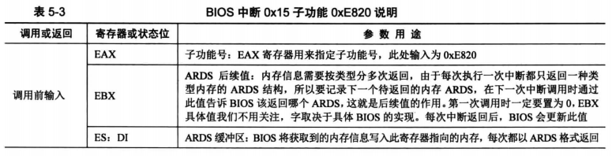
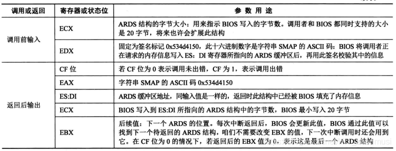
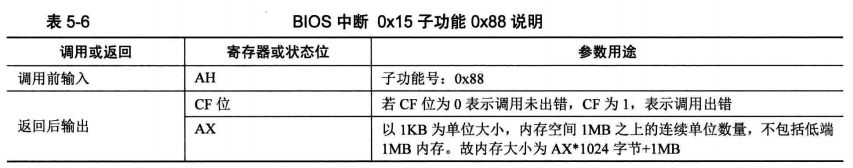

## 获取物理内存容量

linux 中获取物理内存容量是通过 BIOS 中断 0x15 实现，分别是 BIOS 中断 0x15 的 3 个子功能，子功能号要存放到寄存器 EAX 或 AX 中。如下：

- `EAX=0xE820` ：遍历主机上全部内存
- `AX=0xE801`：分别检测低 15MB 和 16MB - 4GB 的内存，最大支持 4GB
- `AH=0x88`：最多检测出 64MB 内存，实际内存超过此容量也按照 64MB 返回

### 一、利用 `0xE820` 获取内存

BIOS 中断 0x15 的子功能 0xE820 能够获取系统的内存布局。返回的内存信息比较丰富，包括多个属性字段，使用“地址范围描述符（Address Range Descriptor Structure，ARDS）”这种结构来存储。如下：

| 字节偏移量 | 属性名称     | 描述                             |
| ---------- | ------------ | -------------------------------- |
| 0          | BaseAddrLow  | 基地址的低 32 位                 |
| 4          | BaseAddrHigh | 基地址的高 32 位                 |
| 8          | LengthLow    | 内存长度的低 32 位，以字节为单位 |
| 12         | LengthHigh   | 内存长度的高 32 位，以字节为单位 |
| 16         | Type         | 本段内存的类型                   |

可以看出，使用 8 字节来描述这段内存基地址，这段内存的长度也是 8 字节。而 type 是 4 字节，用来说明这段内存的用途，即其是可以被操作系统使用，还是保留起来不能用。type 有如下的意义：

- Type 值为 1，称为：AddressRangeMemory。说明这段内存可以被操作系统使用
- Type 值为 2，称为：AddressRangeReserved，说明内存使用中，或者被系统保留，操作系统不可以用此内存
- Type 值为其他，未定义，保留，需要操作系统一样将其视为 ARR（AddressRangeMemory）

为什么 BIOS 会按类型来返回内存信息呢？原因是这段内存可能是：

- 系统的 ROM
- ROM 用到了这部分内存
- 设备内存映射到了这部分内存
- 由于某些原因，这段内存不适合标准设备使用

BIOS 中断只是一段函数例程，调用 BIOS 中断 0x15 的 0xE820 子功能需要为其提供参数。

此中断的调用步骤如下：

- 填写好“调用前输入”中列出的寄存器
- 执行中断调用 `int 0x15`
- 在 CF 位为 0 的情况下，“返回后输出” 中对应的寄存器便会有对应的结果

### 二、利用 `0xE801` 获取内存

最大只能识别 4GB 内存，此方法检测到的内存分别存放到两组寄存器中。

- 低于 15MB 的内存以 1KB 为单位大小来记录，单位数量在寄存器 AX 和 CX 中记录，其中 AX 和 CX 的值是一样的，所以在 15MB 空间以下的实际内存容量 = `AX * 1024`。AX、CX 最大值为 `0x3c00`，即 `0x3c00 * 1024 = 15MB`
- `16MB - 4GB` 是以 64 KB 为单位大小来记录，单位数量在寄存器 BX 和 DX 中记录，其中 BX 和 DX 的值是一样的，所以 16MB 以上空间的内存实际大小 = `BX * 64 * 1024`，不用在意 BX X 和 DX 最大值是多少，反正只支持 4GB 空间

注意，中断返回后，AX 和 CX 中，其值的单位是 1KB，而 BX 和 DX 的单位是 64KB。

还有一点，由于兼容问题（80286 拥有 24 位地址线，其寻址空间是 16MB，当时有一些 ISA 设备要用到地址 15MB 以上的内存作为缓冲区，也就是此缓冲区为 1MB 大小。后续就沿用了这种做法）， 这种方法检测出来的物理内存会小 1MB，因此我们在最终的结果中应该加上 1MB。

此中断的调用步骤如下：

- 将 AX 寄存器写入 0xE801
- 执行中断调用 `int 0x15`
- 在 CF 为 0 的情况下，“返回后输出” 中对应的寄存器便会有对应的结果

### 三、利用 `0x88` 获取内存

只能识别最大 64MB 的内存。即使内容容量大于 64MB，也只会显示 63MB，因为此中断只会显示 1MB 之上的内存，不包括这 1MB。我们在使用的时候记得加上 1MB。

中断返回后，AX 寄存器中的值，其单位是 1KB。此中断的调用步骤如下：

- 将 AX 寄存器写入 0x88
- 执行中断调用 `int 0x15`
- 在 CF 位为 0 的情况下，“返回后输出” 中对应的寄存器便会有对应的结果

