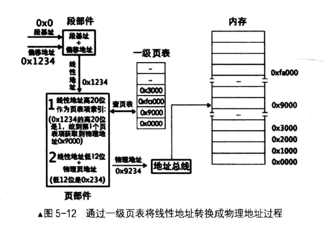
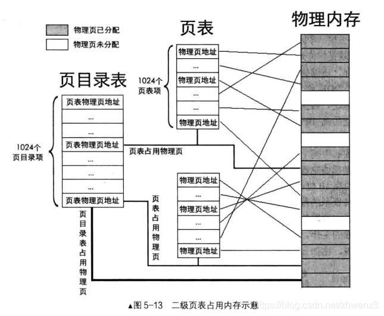
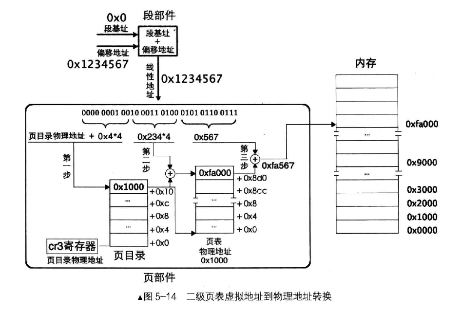
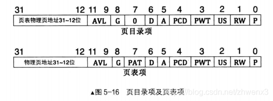
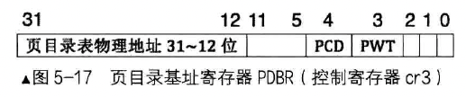

## 内存分页机制

### 一、段的换入换出

在保护模式下，CPU 引用一个段时，都要先查看段描述符。很多时候，段描述符存在于描述符表（GDT 或 LDT），但与此对应的段并不在内存中，也就是说，CPU 允许在描述符中已注册的段不在内存中存在。这就是它提供给软件使用的策略，我们利用它实现段式内存管理。

- 如果该描述符中的 P 位为 1，表示该段在内存中存在。访问过该段后，CPU 将段描述符中的 type 中的 A 位置 1。表示近来刚访问过该段。
- 相反，如果 P 位为 0，说明内存中并不存在该段，这时候 CPU 抛出个 NP（段不存在）异常，转而去执行中断描述符表中 NP 异常对应的中断处理程序，此中断处理程序是操作系统负责提供的，该程序的工作是将相应的段从外存（比如硬盘）中载入到内存，并将段描述符的 P 位置 1，中断处理函数结束后返回，CPU 重复执行这个检查，继续查看该段描述符的 P 位，此时已经为 1 了，再检查通过后，将段描述符的 A 位置 1

段描述符的 A 位由 CPU 置 1，但清 0 工作是由操作系统来完成。操作系统每发现该位为 1 后就将该位清 0，这样，在一个周期内统计该位为 1 的次数就知道该段的使用频率了，从而可以找出使用频率最低的段。当物理内存不足的时候，可以将使用频率最低的段换出到硬盘，以腾出内存空间给新的进程。当段被换出到硬盘后，操作系统将该段描述符的 P 位置 0.当下次这个进程上 CPU 运行后，如果访问了这个段，这样程序流就回到了刚开始 CPU 检查出 P 位为 0、紧接着抛出异常、执行操作系统中断处理程序、换入内存段的循环。

**段的换入换出有什么问题呢**？比如物理内存小，无法容纳任何一个进程的段，这就没法运行进程了，更没法做段的换入换出。还有段如果比较大，换出时要将整个段全部搬到外存上，这种 IO 操作太多导致机器响应慢。

**问题的本质**在于目前只分段的情况下，CPU 认为线性地址等于物理地址。而线性地址是由编译器编译出来的，它本身是连续的，所以物理地址也必须要连续才行，但我们可用的物理地址不连续。也就是所，如果线性地址连续，而物理地址不连续，问题就解决了。

### 二、一级页表

分页机制的思想：通过映射，可以使连续的线性地址与任意物理内存地址相关联，逻辑上连续的线性地址其对应的物理地址可以不连续。

分页机制的作用：1. 将线性地址转换成物理地址。2. 用大小相等的页代替大小不等的段

页表（Page Table）就是 N 行 1 列的表格，页表中每一行称为页表项（Page Table Entry）。其大小为 4 字节，页表项的作用是存储内存物理地址。

CPU 中采用的页大小为 4KB，4GB 地址空间被划分成 `4GB / 4KB = 1MB` 个页，也就是 4GB 空间中可以容纳 1048576 个页。页表中自然也要有 1048576 个页表项。这就是一级页表。

因为 4GB 可以被划分为 1M 个页，也就是 `pow(2, 20)`，因此 20 位二进制就可以表示全部物理页了。页大小为 4KB，也就是 `pow(2, 12)` ，因此 12 位二进制便可以表达 4KB 之内的任意地址。

分页机制打开前要将页表地址加载到控制寄存器 cr3 中。

因此，虚拟地址的高 20 位可用来定位一个物理页，低 12 位可用来在该物理页内寻址。地址转换的原理如下：

一个页表项对应一个页，所以，用线性地址的高 20 位作为页表项的索引，每个页表要占用 4 字节大小，所以这高 20 位的索引乘以 4 后才是该页表项相对于页表物理地址的字节偏移量。用 cr3 寄存器中的页表物理地址加上此偏移量便是该页表的物理地址，从该页表项中得到映射的物理页地址，然后用线性地址的低 12 位与该物理页地址相加，所得的地址之和便是最终要访问的物理地址。

这个转换过程由被称为 “页部件” 的硬件完成。

总结一下 “页部件” 的工作：用线性地址的高 20 位在页表中索引页表项，用线性地址的低 12 位与页表项中物理地址相加，所求的和便是最终线性地址对应的物理地址。

如下是一个例子，`mov ax, [0x1234]` 它的地址转换过程如下：

### 三、二级页表

为什么要有二级页表？

- 一级页表中最多可容纳 1M 个页表项，每个页表项是 4 字节，如果页表项全满的话，便是 4MB 大小
- 一级页表中所有页表项必须要提前建好，原因是操作系统要占用 4GB 虚拟地址空间的高 1GB，用户进程要占用低 3GB
- 每个进程都有自己的页表，进程比较多的情况下，页表占用的空间很大

归根结底，我们要解决的是：不要一次性的将全部页表项建好，而是需要时动态创建页表项。

一级页表是将这 1M 个标准页放置在一张页表中，二级页表是将这 1M 个标准页平均放置在 1K 个页表中。每个页表中包含有 1K 个页表项，页表项是 4 字节大小。页表包含 1K 个页表项，故页表大小为 4KB。刚好是一个标准页大小。专门有个页目录表来存储这些页表，每个页表的物理地址在页目录表中都以页目录项（Page Directory Entry，PDE）的形式存储，页目录项大小同页表项一样，都用来描述一个物理页的物理地址，其大小都是 4字节，而且最多有 1024 个页表，所以页目录表也是 4KB 大小，同样也是标准页大小。

页目录表中有 1024 个页表，也就是有 1024 个页目录项。一个页目录项中记录了一个页表物理页地址，物理页地址是指页的物理地址，在页目录项及页表项记录的都是页的物理地址。

转换过程如下：

- 用虚拟地址的高 10 位乘以 4，作为页目录表内的偏移地址，加上页目录表的物理地址，所得的和，便是页目录项的物理地址。读取该页目录项，从中获取到页表的物理地址。
- 用虚拟地址的中间 10 位乘以 4，作为页表内的偏移地址，加上在第 1 步中得到的页表物理地址，所得的和，便是页表项的物理地址。读取该页表项，从中获取到分配的物理页地址。
- 虚拟地址的高 10 位和中间 10 位分别是 PDE（页目录项） 和 PTE（页表项） 的索引值，所以他们需要乘以 4。但低 12 位表示的范围是 `0 - 0xFFF`，作为页内偏移最合适，所以虚拟地址的低 12 位加上第 2 步得到的物理页地址，所得的和便是最终转换的物理地址。

为什么乘以 4？页表和页目录项都是 4KB，范围是 `[0, 2^12]`，也就是说单个索引是 12 位。拿到的 10 位大小需要乘以 4 转换为 12 位。也就是说这个索引值是 10 位对齐的，因为页目录项和页表项都是 1024 个（`2^10`）。

如下例子：`mov ax, [0x1234567]` 

- 第一步，为了得到页表物理地址，页部件用虚拟地址高 10 位乘以 4 的积与页目录表物理地址相加，所得的和便是页目录项地址，读取该页目录项，获取页表物理地址。
- 第二步，为了得到具体的物理页，需要找到页表中对应的页表项。页部件用虚拟地址中间 10 位的值乘以 4 的积与第一步中得到的页表地址相加，所得的和便是页表项物理地址。
- 第三步，为了得到最终的物理地址，用虚拟地址低 12 位作为页内偏移地址与第二步中得到的物理页地址相加，所得的和便是最终的物理地址。

我们会发现，页目录项或者页表项，如果只存储物理页地址的话，因为是对齐到 4KB 上的，因此 20 位足矣。为什么需要 32 位（4 字节）呢？如下是它的结构

的确存储物理页地址只用了 20 位。剩余的 12 位如下解释：

- P，Present，存在位，若为 1 表示该页存在于物理内存中，若为 0 表示该表不在物理内u才能中。操作系统的页式虚拟内存管理便是通过 P 位和相应的 pageFault 异常来实现的
- RW，Read/Write，读写位，若为 1 表示可读可写，若为 0 表示可读不可写
- US，User/Supervisor，普通用户 / 超级用户位，若为 1，表示处于 User 级，任意级别（0、1、2、3）特权的程序都可以访问该页。若为 0，表示处于 Supervisor 级，特权级别为 3 的程序不允许访问该页，该页只允许特权级别为 0、1、2 的程序访问。
- PWT，Page-Level Write-Through，页级通写位，若为 1 表示此项采用通写方式，表示该页不仅是普通内存，还是高速缓存。我们暂时置 0。此标志位用来控制特定的页的写策略是写回（Write-Back）还是写通（Write-Through），如果 PWT 位为 1，那么该页的写策略为写通，也就是每次写操作都会直接写入到物理内存中。如果 PWT 位为 0，那么该页的写策略为写回，写策略首先会写入到缓存中，然后在某个时间点再一次性写入到物理内存中。写通策略可以保证数据的一致性，但是每次写操作都要访问物理内存，所以速度较慢。写回策略可以提高速度，但是如果系统突然断电，缓存中的数据可能会被丢失。
- PCD，Page-Level Cache Disable，页级高速缓存禁止位，若为 1 表示该页启用高速缓存，为 0 表示禁止将该页缓存。这里我们置 0。也就是说此标志位用来控制某个特定的页是否可以被 CPU 缓存，如果 PCD 为1，那么该页将不会被 CPU 缓存。如果 PCD 为0，那么该页可以被缓存。这个标志位主要用在 IO 设备映射的内存页上，因为这些页的数据可能被频繁的改变，缓存这些页可能会导致 CPU 中的数据和物理内存中的数据不一致。
- A，Accessed，访问位，若为 1 表示该页被 CPU 访问过了，所以该位是由 CPU 设置的。这里页目录项和页表项中的 A 位也可以用来记录某一内存页的使用频率，从而当内存不足时，可以将频率较低的页面换出到外存（硬盘）中。同时将页目录项或页表项的 P 位置 0，下次访问该页引起 pageFault 异常时，中断处理程序将硬盘上的页再次换入，同时将 P 位置 1。（和段描述符中的 A 位和 P 位的效果一致）。
- D，Dirty，脏页位，当 CPU 对一个页面执行写操作时，就会设置对应页表项的 D 位为 1，此项仅针对页表项有效，并不会修改页目录项中的 D 位。
- PAT，Page Attribute Table，页属性表位，能够在页面一级的粒度上设置内存属性，比较复杂，将此位置为 0 即可
- G，Global，全局位，为了提高获取物理地址的速度，将虚拟地址与物理地址转换结果存储在 TLB（Translation Lookaside Buffer）中，类似于一个高速缓存。G 位为 1，表示全局页，该页将在高速缓存 TLB 中一直保存，给出虚拟地址直接返回物理地址，无需那三个步骤转换。
- AVL，Available，可用，CPU 不管这一位，给操作系统用的

### 四、启动分页

需要按顺序做好三件事：

1. 准备好页目录表及页表
2. 将页表地址写入控制寄存器 cr3
3. 寄存器 cr0 的 PG 位置 1

控制寄存器 cr3 用于存储页表物理地址，所以 cr3 寄存器又称为页目录基址寄存器（Page Directory Base Register，PDBR）。

由于页目录表所在的地址要求在一个自然页内，即页目录起始地址是 4KB 的整数倍，低 12 位地址全是 0。所以，只要在 cr3 寄存器的第 `31 - 12` 位中写入物理地址的高 20 位即可。除了第三位的 PWT 和第四位的 PCD 外，其余位都没用。PWT 和 PCD 用于设置高速缓存相关的特性，在此将其置为 0 即可。因此低 12 位全部为 0，只需要把页目录表物理地址的高 20 位写入 cr3 寄存器即可。

cr0 寄存器在将 PG 位置 1 之前，系统都是在内存分段机制下工作，段部件输出的线性地址便直接是物理地址。cr0 寄存器的 PG 位置 1 后便进入了内存分页运行机制，段部件输出的线性地址称为虚拟地址。

