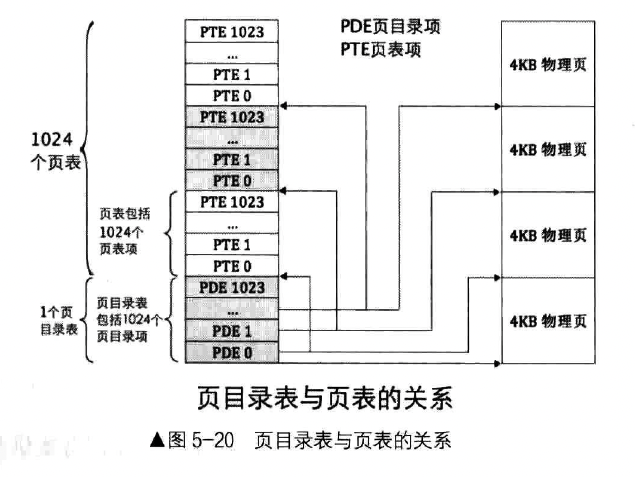

为了计算机安全，用户进程必须运行在低特权级，当用户进程需要访问硬件相关的资源时，需要向操作系统申请，由操作系统去做，之后将结果返回给用户进程。进程可以有无限多个，而操作系统只有一个，所以操作系统必须共享给所有用户进程。

也就是，用户的代码加上所需要的操作系统中的部分代码才算完整的程序。

用户进程要共享操作系统，如何共享呢？只要操作系统属于用户进程的虚拟地址空间即可。

我们学习 Linux 操作系统，在用户进程 4GB 虚拟地址空间中。`3GB-4GB` 划分给操作系统；`0-3GB` 是用户进程自己的虚拟空间。因此，为了实现操作系统，让所有用户进程的 `3GB-4GB` 的虚拟地址空间都指向同一个操作系统，指向同一片物理页地址，这片物理页地址是操作系统的实体代码。

### 一、分页机制

分页机制有页目录表，页目录表中是页目录项，其中记录的是页表的物理地址以及相关属性。

我们页目录表的位置，放在物理地址 `0x100000` 处，刚好在物理地址 1MB 处。



因为我们的 mbr、loader、操作系统内核是加载到物理地址 1MB 以下空间。后面我们会把虚拟地址的 `3GB-4GB` （从虚拟地址 0xc000_0000 之上的 1MB 地址）映射到物理内存 1MB 之内。

#### 1. 准备好页目录和页表

```
setup_page:

;先把页目录占用的空间逐字节清 0
mov ecx, 4096
mov esi, 0

.clear_page_dir:
    mov byte [PAGE_DIR_TABLE_POS + esi], 0
    inc esi
    loop .clear_page_dir

; 开始创建页目录项(PDE)
.create_pde:				     ; 创建 Page Directory Entry
    mov eax, PAGE_DIR_TABLE_POS
    add eax, 0x1000 			     ; 此时 eax 为第一个页表的位置及属性
    mov ebx, eax				     ; 此处为 ebx 赋值，是为 .create_pte 做准备，ebx 为基址。

; 下面将页目录项 0 和 0xc00 都存为第一个页表的地址，
; 一个页表可表示 4MB 内存,这样 0xc03fffff 以下的地址和 0x003fffff 以下的地址都指向相同的页表，
; 这是为将地址映射为内核地址做准备
    or eax, PG_US_U | PG_RW_W | PG_P	   ; 页目录项的属性 RW 和 P 位为1, US 为 1, 表示用户属性,所有特权级别都可以访问.
    mov [PAGE_DIR_TABLE_POS + 0x0], eax    ; 第1个目录项,在页目录表中的第1个目录项写入第一个页表的位置(0x101000)及属性(3)
    mov [PAGE_DIR_TABLE_POS + 0xc00], eax  ; 一个页表项占用4字节,0xc00表示第768个页表占用的目录项,0xc00以上的目录项用于内核空间,
                                           ; 也就是页表的0xc0000000~0xffffffff共计1G属于内核,0x0~0xbfffffff共计3G属于用户进程.
    sub eax, 0x1000
    mov [PAGE_DIR_TABLE_POS + 4092], eax   ; 使最后一个目录项指向页目录表自己的地址

;下面创建页表项(PTE)
    mov ecx, 256				         ; 1M 低端内存 / 每页大小4k = 256
    mov esi, 0
    mov edx, PG_US_U | PG_RW_W | PG_P	 ; 属性为7,US=1,RW=1,P=1

.create_pte:				     ; 创建Page Table Entry
    mov [ebx+esi*4],edx			     ; 此时的ebx已经在上面通过eax赋值为0x101000,也就是第一个页表的地址 
    add edx,4096
    inc esi
    loop .create_pte

; 创建内核其它页表的PDE
mov eax, PAGE_DIR_TABLE_POS
add eax, 0x2000 		          ; 此时eax为第二个页表的位置
or eax, PG_US_U | PG_RW_W | PG_P  ; 页目录项的属性RW和P位为1,US为0
mov ebx, PAGE_DIR_TABLE_POS
mov ecx, 254			          ; 范围为第769~1022的所有目录项数量
mov esi, 769

.create_kernel_pde:
    mov [ebx+esi*4], eax
    inc esi
    add eax, 0x1000
    loop .create_kernel_pde
    ret
```

我们会在页目录项的第 0 项和第 768 项都指向页表地址 `0x101000`。为什么呢？

- 为什么放在第 0 项，原因是我们在加载内核之前，程序中运行的一直是 loader，它本身的代码都是在 1MB 之内，必须保证之前段机制下的线性地址和分页后的虚拟地址对应的物理地址一致。第 0 个页目录项代表的页表，其表示的空间是 `0 - 0x3fffff`，（4GB被页目录表分成了 1024 份，一份 4M 大小）包括了 1MB（`0-0xfffff`）。所以用了第 0 项来保证 loader 在分页机制下依然运行正确。
- 为什么放在第 768 项，我们会把操作系统内核放在低端 1M 物理内存空间，但操作系统的虚拟地址是 `0xc000_0000`以上，该虚拟地址对应的页目录项是第 768 个。因为 `0xc000_0000` 的高 10 位是 `0x300`，即十进制的 768。这样虚拟地址 `0xc000_0000 - 0xc03f_ffff` 之间的内存都指向的是低端 4MB 之内的物理地址，这自然包括操作系统所占的低端 1MB 物理内存。从而实现了操作系统高 3GB 以上的虚拟地址对应了低端 1MB。

接下来，我们在页目录的最后一个页目录项中写入页目录表自己的物理地址（`0x100007` 前 20 位是物理地址，后 12 位是属性）。注意此页目录表的权限是 `PG_US_U、PG_RW_W` 可读可写、User 级别（任意级别特权的程序都可以访问）。也就是说我们用户代码暂时是可以更改页目录表的。

接下来，填充第一个页表，因为我们目前只用到了第一个 1MB 空间（操作系统内核所处位置），所以我们只为这 1MB 空间对应的页表项赋值。一个页表 1024 项，一项可以对应一个物理页 4K，因此一个页表对应 4M 的物理空间。因此填充第一个页表，相当于映射了 4M 的物理空间。

接下来，我们需要填充内核空间（虚拟地址 3G-4G，页目录项：`[768, 1022]`，页目录 1023 项已经分配了）。本来我们内核只在 1M 空间内，一个页表可以映射的空间就够了？但是还是将所有的 256 个页表都进行填充，为什么呢？

假设某个进程陷入内核时，内核为了某些需求为内核空间新增页表（通过是神奇大量内存），因此还需要把心内核页表同步到其他进程的页表中，否则内核无法被完全共享。所以实现内核完全共享最简单的办法是提前把内核的所有页目录项定下来，也就是提前把内核的页表固定下来。


因此，我们总结下我们创建的页表。

- 页目录表在 1M 位置，占用 4KB
- 页表从 `0x101000` 位置开始，一共有 1024 个页表，每个页表 4KB。所有页表占 4MB
- 第 0 个页目录表项和第 768 个页目录表项指向第 0 个页表
- 页目录表项 `[769, 1022]` 指向 `[1, 254]` 页表（页目录表和页表从 0 开始）
- 第 1023 个页目录表项指向地址 1M 处，也就是页目录表自身。
- 第 0 个页表中的 1024 个页表项，指向物理地址：`[0, 4M]` 处。也就是内核加载的位置。但是目前只填充了 256 个页表项，也就是映射了 `[0, 1M]` 物理地址，其他页表项还没有映射

### 二、进入分页模式

```
; 创建页目录及页表并初始化页内存位图
call setup_page

; 要将描述符表地址及偏移量写入内存 gdt_ptr, 一会用新地址重新加载
sgdt [gdt_ptr]	      ; 存储到原来gdt所有的位置

; 将gdt描述符中视频段描述符中的段基址 + 0xc0000000
mov ebx, [gdt_ptr + 2]  
; 视频段是第3个段描述符,每个描述符是8字节,故0x18
; 段描述符的高4字节的最高位是段基址的31~24位
or dword [ebx + 0x18 + 4], 0xc0000000 
					      

; 将gdt的基址加上0xc0000000使其成为内核所在的高地址
add dword [gdt_ptr + 2], 0xc0000000

; 将栈指针同样映射到内核地址
add esp, 0xc0000000 

; 把页目录地址赋给cr3
mov eax, PAGE_DIR_TABLE_POS
mov cr3, eax

; 打开cr0的pg位(第31位)
mov eax, cr0
or eax, 0x80000000
mov cr0, eax

; 在开启分页后,用gdt新的地址重新加载
lgdt [gdt_ptr]       ; 重新加载
```

我们在页表中会将内核放置到 3GB 以上的地址，我们也把 GDT 放在内核的地址空间。

我们先使用 sgdt 指令将 GDT 表加载到原来的内存位置。然后修改视频段（显存段）的段描述符的段基址，因为将来内核运行在 3GB 以上，打印功能将来也是在内核中实现，不能让用户进程直接控制显存。因此显存段的段基址要改为 3GB 以上。

然后我们将 GDT 的基址移到内核空间，同时栈指针也映射到内核地址。最后打开分页，重新加载 GDT。

