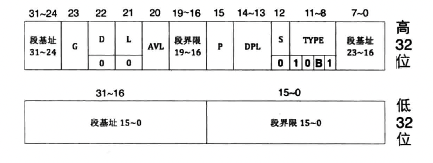
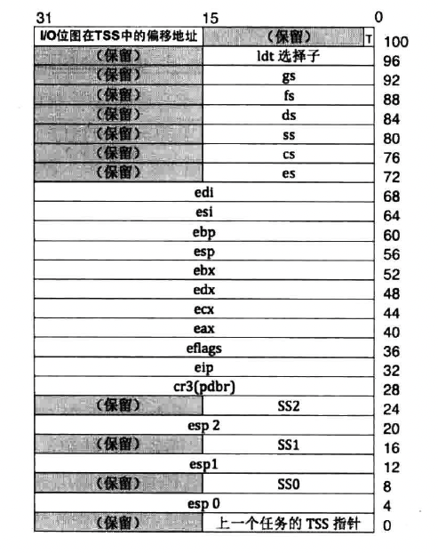
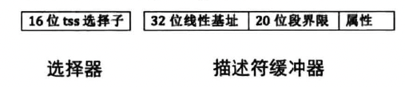

## 一、概念

### 1. 任务状态段 TSS

任何寄存器中的内容才是任务的最新状态。采取轮流使用 CPU 的方式运行多任务，当前任务在被换下 CPU 时，任务的最新状态，也就是寄存器中的内容应该找个地方保存起来，以便下次重新将此任务调度到 CPU 上时可以恢复此任务的最新状态，这样任务才能继续执行。

Intel 的建议是给每个任务 “关联” 一个任务状态段，就是 TSS（Task State Segment），用它来表示任务。TSS 是由程序员提供，也就是说是程序员为任务单独定义的一个结构体遍历。TSS 由 CPU 来维护，也就是说 CPU 自动用此结构体变量保存任务的状态（任务的上下文环境、寄存器组的值）和自动从此结构体变量中载入任务的状态。当加载新任务时，CPU 自动把当前任务（旧任务）的状态存入当前任务的 TSS，然后将新任务 TSS 中的数据载入到对应的寄存器中，这就实现了任务切换。TSS 就是任务的代表，CPU 用不同的 TSS 区分不同的任务，因此任务切换的本质就是 TSS 的换来换去。

在 CPU 中有一个专门存储 TSS 信息的寄存器，称为 TR 寄存器，他始终指向当前正在运行的任务。因此在 CPU 眼里，任务切换的实质就是 TR 寄存器指向不同的 TSS。

#### <1>. TSS 描述符结构

TSS 本质上是一片存储数据的内存区域，使用 TSS 描述符结构来描述，TSS 描述符也要在 GDT 中注册，这样才可以找到。

TSS 描述符属于系统段描述符，因此 S 为 0，在 S 为 0 的情况下，TYPE 的值为 `10B1`。B 位表示 busy 位，B 位为 0 时，表示任务不繁忙，B 位为 1 时，表示任务繁忙。其他字段的意义与普通数据段类似。

任务繁忙有两层含义：

- 此任务是否为当前正在 CPU 上运行的任务
- 此任务嵌套调用了新的任务，CPU 正在执行新任务，此任务暂时挂起，等待新任务执行完成后 CPU 会回到此任务继续执行，所以此任务马上就会被调度执行了。

B 位是由 CPU 来维护的。当任务刚被创建时，此时尚未上 CPU 执行，B 位为 0。当任务开始上 CPU 执行时，CPU 自动把 B 位置为 1。

B 位存在的意义不仅表示任务忙不忙，而且还是为了给当前任务打个标记，目的是避免当前任务调用自己，也就是说任务是不可重入的。也就是说当前任务不能自己调用自己。原因是如果任务可以自我调用的话，旧任务和新任务是同一个，首先 CPU 进行任务状态保护时，在同一个 TSS 中保存后再载入，这将导致严重错误。其次，旧任务在调用新任务时，新任务执行完成后，为了能够回到旧任务，在调用新任务之初，CPU 会自动把老任务的 TSS 选择子写入到新任务 TSS 中的 “上一个任务的 TSS 指针” 字段中，此指针形成了一个任务嵌套调用链，CPU 是靠此指针形成的链表来维护任务调用链的。如果任务重入的话，此链则被破坏。

因此 B 位主要是用来给 CPU 做重入判断用的。

#### <2>. TSS 结构

TSS 同其他普通段一样，是位于内存中的区域，TSS 中的数据是按照固定格式来存储的，所以 TSS 是个数据结构，如下是 32 位 TSS 结构。

- TSS 中有三组栈，SS0 和 esp0，SS1 和 esp1，SS2 和 esp2。除了从中断和调用门返回外，CPU 不允许从高特权级转向低特权级，因为低特权级能做的高特权级也能做，高特权级不需要找低特权级帮忙。这三组栈是用来由低特权级往高特权级跳转用的，最低的特权级是 3，没有更低的特权级会跳入 3 特权级，因此 TSS 中没有 SS3 和 esp3。
- Linux 只用到了 0 特权级和 3 特权级，用户进程处于 3 特权级，内核位于 0 特权级。当任务被换下 CPU 时，CPU 会自动将当前寄存器中的值存储到 TSS 中的对应位置，当有新任务上 CPU 运行时，CPU 会自动从新任务的 TSS 中找到相应的寄存器值加载到对应的寄存器中

寄存器 TR（`Task Register`）用来存储 TSS 的起始地址及偏移大小。

TSS 是通过选择子来访问的，将 TSS 加载到寄存器 TR 的指令是 ltr。其指令格式：` ltr 16位通用寄存器/16位内存单元 `。不管操作数是寄存器还是内存，其值必须是描述符在 GDT 中的选择子。

#### <3>. 总结

任务在被换下 CPU 时，由 CPU 自动的把当前任务的资源状态（所有寄存器、必要的内存结构，如栈等）保存到该任务对应的 TSS 中（由寄存器 TR 指定）。CPU 通过新任务的 TSS 选择子加载新任务时，会把该 TSS 中的数据载入到 CPU 的寄存器中，同时用此 TSS 描述符更新寄存器 TR。以上动作是 CPU 自动完成的，不需要人工干预。

### 2. Linux 的任务切换方式

Linux 为每个 CPU 创建一个 TSS，在各个 CPU 上的所有任务共享同一个 TSS，各 CPU 的 TR 寄存器保存各 CPU 上的 TSS，在用 ltr 指令加载 TSS 后，该 TR 寄存器永远指向同一个 TSS，之后再也不会重新加载 TSS。在进程切换时，只需要把 TSS 中的 SS0 和 esp 更新为新任务的内核栈的段地址及栈指针即可。

因此，实际上 Linux 对 TSS 的操作是一次性加载 TSS 到 TR，之后不断修改同一个 TSS 的内容，不再进行重复加载操作。Linux 在 TSS 中只初始化了 SS0、esp0 和 I/O 位图字段，除此之外，TSS 便没用了。

那任务的状态信息保存在哪里呢？当 CPU 由低特权级进入高特权级时，CPU 会自动从 TSS 中获取对应高特权级的栈指针。Linux 只用到了 0 特权级和 3 特权级，因此 CPU 从 3 特权级的用户态进入 0 特权级的内核态时（比如从用户进程进入了中断），CPU 自动从当前任务的 TSS 中获取 SS0 和 esp0 字段的值作为 0 特权级的栈，然后 Linux 手动执行一系列的 push 指令将任务的状态保存在 0 特权级栈中，也就是 TSS 中 SS0 和 esp0 指向的栈。

## 二、实现

进程和内核线程最大的区别是进程有单独的 4GB 虚拟地址空间，每个进程拥有独立的地址空间，不同的地址空间就是不同的页表，因此我们在创建进程的过程中需要为每个进程单独创建一个页表。页表就是 “页目录表+页表”，页目录表用来存放页目录项 PDE，每个 PDE 又指向不同的页表。

页表虽然用于管理内存，但他本身也要用内存来存储，所以要为每个进程单独申请存储页目录项及页表项的虚拟内存页。

我们创建的是内核线程，运行在 0 特权级。用户进程在 0 和 3 特权级下工作，因此我们还要为用户进程创建在 3 特权级的栈，也就是说我们得为进程分配虚拟内存作为 3 级栈空间。

有了这些，其他的就和线程比较类似了。
