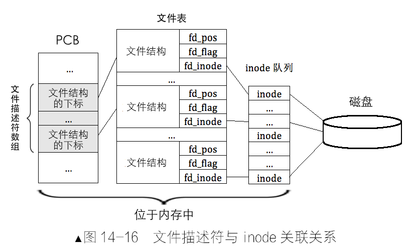

#### 1. 文件表（文件结构）

为什么要有文件表（文件结构）？

- 操作系统应该允许一个进程同时、多次、打开同一个文件（并不关闭）
- 同样的，该文件应该被允许被多个不同的进程同时打开
- 那么，我们需要实现文件任意位置的读写，执行读写操作时，需要指定偏移量作为该文件内的起始地址。也就是说，该文件每被打开一次，文件读写的偏移量都可以任意指定。
- 注意，文件内的偏移量是互不影响的；但文件内容是共享的，对文件内容的修改是互相影响的。
- 通常情况下，对文件的操作涉及到多次读写，下一次读写的位置必须以上一次的读写位置为起始，因此文件系统需要把任意时刻的偏移量记录下来
- 那么，偏移量不应该记录在 inode 中，inode 不应该记录这些与文件操作相关的数据。

因此，Linux 提供了称为"文件结构"的数据结构，专门用于记录与文件操作相关的信息。每打开文件（可以是相同文件）就产生一个文件结构。从而实现了“即使同一个文件被同时多次打开，各自操作的偏移量也互不影响”。

Linux 把所有的“文件结构”组织到一起形成数组统一管理，该数组称为“文件表”。

我们的文件结构如下：

```
struct file {
    // 记录当前文件操作的偏移地址, 以 0 为起始, 最大为文件大小减1
    uint32_t fd_pos;
    // 文件打开的标识位，如 O_CREAT
    uint32_t fd_flag;
    // inode 指针
    struct inode* fd_inode;
};
```

因此，总结一下。inode 用于描述文件存储相关信息，文件结构用于描述 “文件打开” 后，文件读写偏移量等信息。文件和 inode 之间一一对应，一个文件可以被多次打开，因此多个文件结构可以对应同一个 inode。

#### 2. 文件描述符

进程的 PCB 中有一个字段

```
int32_t fd_table[MAX_FILES_OPEN_PER_PROC];
```

文件描述符数组，这个数组的下标即是文件描述符，数组的内容即是 文件表中 “文件结构的下标”。通过文件描述符数组，即可找到对应的文件结构。通过文件结构即可找到对应 inode，通过 inode 即可找到对应的文件。

文件结构需要占用内存，因此一般进程可打开的文件数有限制。

为什么文件描述符是数字，而不像其他描述符那样，是个具有多个成员属性的复合数据结构？

- 为了一视同仁，使各进程可打开的文件数是一样的，各进程必须有独立的、大小完全一样的一套文件描述符数组，而不能所有进程都共享同一套文件描述符数组
- 文件结构中包含进程执行文件操作的偏移量，它属于与各个任务单独绑定的资源，因此最好放在 PCB 中管理。但当进程打开的文件数增多的时候，文件表占用的空间较大，而 PCB 占用的内存通常就是几个页。

文件描述符和 inode 之间的关联关系



因此，Linux 中通过文件描述符查找文件数据块的过程，涉及如下三个数据结构：

- PCB 中的文件描述符数组
- 存储所有文件结构的文件表
- inode 队列，也就是 inode 缓存

因此，过程一般如下：

- 一个进程将文件描述符作为参数提交给文件系统时，文件系统用此文件描述符在该进程的 PCB 中的文件描述符数组索引对应的元素
- 从该元素中获取对应的文件结构的下标，用该下标在文件表中索引相应的文件结构。
- 从该文件结构中获取文件的 inode，最终找到文件的数据块
- 如果该 inode 在 inode 队列中不存在，此时：文件系统会从硬盘上将该 inode 加载到 inode 队列中，并使文件结构中的 fd_inode 指向它

那么 open 操作的本质是创建相应文件描述符的过程：

- 在全局的 inode 队列中新建一个 inode，返回该 inode 地址
- 在全局的文件表中找一空位，在该位置填充文件结构，使其 `fd_inode` 指向上一步中返回的 inode 地址，然后返回本文件结构在文件表中的下标值
- 在 PCB 中的文件描述符数组中找一空位，使该位置的值指向上一步中返回的文件结构下标，并返回本文件描述符在文件描述符数组中的下标值