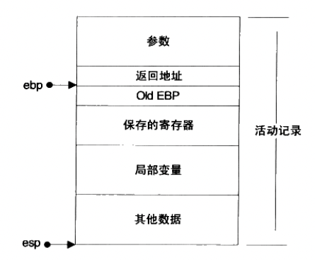

## 一、栈介绍

栈保存了一个函数调用所需要的维护信息，常被称为：堆栈帧（`Stack Frame`）或活动记录。堆栈帧一般包括如下内容：

- 函数的返回地址和参数
- 临时变量：包括函数的非静态局部变量以及编译器自动生成的其他临时变量
- 保存的上下文：包括在函数调用前后需要保持不变的寄存器

esp 寄存器始终指向栈的顶部，随着函数的执行而不断变化。

ebp 寄存器指向了函数栈帧的一个固定位置。不随这个函数的执行而变化。固定不变的 ebp 可以用来定位函数活动记录中的各个数据。在 ebp 之前首先是这个函数的返回地址，他的地址是 `ebp-4`；再往前是压入栈中的参数，他们的地址视参数数量和大小而定。ebp 所直接指向的数据是调用该函数前 ebp 的值，这样在函数返回的时候，ebp 可以通过读取这个值恢复到调用前的值。



一个 `i386` 下的函数总是这样调用的：

- 把所有或一部分参数压入栈中，如果有其他参数没有入栈，那么使用某些特定的寄存器传递
- 把当前指令的下一条指令的地址压入栈中
- 跳转到函数体执行

## 二、函数体结构

`i386` 函数体的标准开头如下：

- `push ebp`：把 ebp 压入栈中（old ebp），为了在函数返回的时候便于恢复以前的 ebp 值
- `mov ebp, esp`：此时 ebp 指向栈顶，而此时栈顶就是 `old ebp`
- 【可选】`sub esp, xxx`：在栈上分配 xxx 字节的临时空间
- 【可选】`push xxx`：如有必要，保存名为 xxx 寄存器（可重复多个）。之所以可能要保存一些寄存器，在于编译器可能要求某些寄存器在调用前后保持不变，那么函数就可以在调用开始时将这些寄存器的值压入栈中，在结束后再取出。

`i386` 函数体的结尾如下：

- 【可选】`pop xxx`：如有必要，恢复保存过的寄存器（可重复多个）
- `mov esp, ebp`：恢复 esp 同时回收局部变量空间
- `pop ebp`：从栈中恢复保存的 ebp 的值
- `ret`：从栈中取得返回地址，并跳转到该位置

反汇编一个函数实际看下：

```
int foo() {
    return 123;
}

int main() {
    int n = foo();
    return 0;
}
```

进行编译并且反汇编

```
gcc main.c  -m32 -O0 -o main
objdump -D -M intel  main > main_out.s
```

我们来看对应的反汇编

```
0000118d <foo>:
    118d:	55                   	push   ebp
    118e:	89 e5                	mov    ebp,esp
    1190:	e8 2b 00 00 00       	call   11c0 <__x86.get_pc_thunk.ax>
    1195:	05 47 2e 00 00       	add    eax,0x2e47
    119a:	b8 7b 00 00 00       	mov    eax,0x7b
    119f:	5d                   	pop    ebp
    11a0:	c3                   	ret    

000011a1 <main>:
    11a1:	55                   	push   ebp
    11a2:	89 e5                	mov    ebp,esp
    11a4:	83 ec 10             	sub    esp,0x10
    11a7:	e8 14 00 00 00       	call   11c0 <__x86.get_pc_thunk.ax>
    11ac:	05 30 2e 00 00       	add    eax,0x2e30
    11b1:	e8 d7 ff ff ff       	call   118d <foo>
    11b6:	89 45 fc             	mov    DWORD PTR [ebp-0x4],eax
    11b9:	b8 00 00 00 00       	mov    eax,0x0
    11be:	c9                   	leave  
    11bf:	c3                   	ret    

000011c0 <__x86.get_pc_thunk.ax>:
    11c0:	8b 04 24             	mov    eax,DWORD PTR [esp]
    11c3:	c3                   	ret    
```

在 foo 的反汇编中，我们看到

- `push ebp; mov ebp, esp;` 这两行语句保存了旧的 ebp，并且让 ebp 指向当前的栈顶。
- `call 11c0 <__x86.get_pc_thunk.ax>; add eax,0x2e47` 这两行，call 之前会把下一条指令压栈，所以 eax 其实是拿到了 1195 这个值。所以 `<__x86.get_pc_thunk.ax>` 他的作用其实是获取到当前的指令位置，存储在 eax 寄存器中。
- 最后，`pop ebp; ret;` 这两句指令，从栈上恢复 ebp 寄存器，然后使用 ret 指令返回。

## 三、调用惯例

函数的调用方和被调用方对于函数如何调用需要一个明确的约定，只有双方都遵守同样的约定，函数才能被正确的调用，这样的约定就称为 “调用惯例”。包括：

- 函数参数的传递顺序和方式。调用惯例规定函数调用方将参数压栈的顺序，是从左至右，还是从右至左。有些调用惯例还允许使用寄存器传递参数，以提高性能。
- 栈的维护方式。在函数将参数压栈之后，函数体会被调用，此后需要被压入栈中的参数全部弹出，以使得栈在函数调用前后保持一致。这个弹出的工作可以由函数的调用方来完成，也可以由函数本身来完成。
- 名字修饰的策略。为了链接的时候对调用惯例进行区分，调用惯例要对函数本身的名字进行修饰。不同的调用惯例有不同的名字修饰策略。

`cdecl` 这个调用惯例是 C 语言默认的调用惯例。他的规则如下：

- 参数传递：从右至左的顺序压参数入栈
- 出栈方：函数调用方
- 名字修饰：直接在函数名称前加一个下划线

## 四、函数返回值传递

函数和调用方的交互可以使用参数传递，也可以使用返回值。如上例子中他就是使用 eax 寄存器来传递返回值。

- 对于 4 字节的返回值，使用 eax 寄存器
- 对于 `5-8` 字节的返回值，一般采用 eax 和 edx 联合返回的方式，其中 eax 存储返回值的低 4 字节，而 edx 存储返回值的高 4 字节

```
long long int foo() {
    return 0x1000000020000000;
}
反汇编后：
0000118d <foo>:
    118d:	55                   	push   ebp
    118e:	89 e5                	mov    ebp,esp
    1190:	e8 45 00 00 00       	call   11da <__x86.get_pc_thunk.ax>
    1195:	05 47 2e 00 00       	add    eax,0x2e47
    119a:	b8 00 00 00 20       	mov    eax,0x20000000
    119f:	ba 00 00 00 10       	mov    edx,0x10000000
    11a4:	5d                   	pop    ebp
    11a5:	c3                   	ret   
```

- 对于大于 8 字节的返回值，

```
struct big_thing {
    char buf[128];
};

struct big_thing foo() {
    struct big_thing b;
    b.buf[0] = 1;
    return b;
}

int main() {
    struct big_thing n = foo();
    return 0;
}
```

首先 main 函数在栈上额外开辟了一片空间，并将这块空间的一部分作为传递返回值的临时对象，这里称为 temp。

然后将 temp 对象的地址作为隐藏参数传递给 foo 函数。

foo 函数将数据拷贝给 temp 对象，并将 temp 对象的地址用 eax 传出

foo 返回之后，main 函数将 eax 指向的 temp 对象的内容拷贝给 n

因此，我们发现，如果返回值类型的尺寸太大，C 语言在函数返回时会使用一个临时的栈上内存区域作为中转，结果返回值对象会被拷贝两次。因而不到万不得已，不要轻易返回大尺寸的对象。


