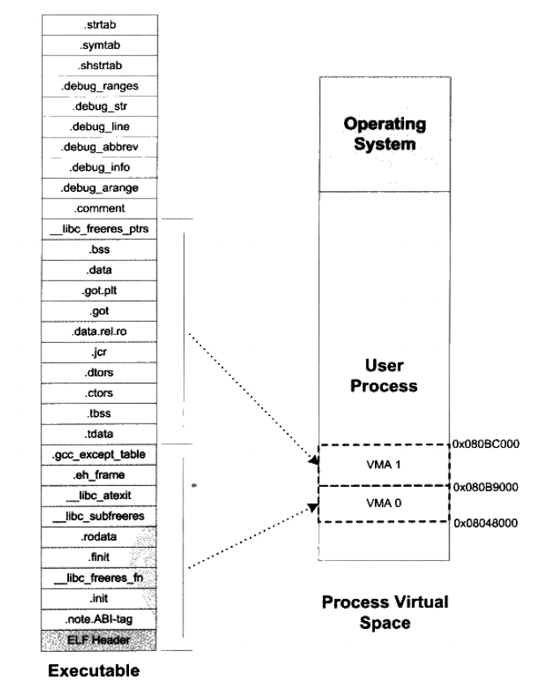

## 二进制的运行过程

在上一篇文章中，我们知道了 Linux 下如何生成二进制文件的过程。我们知道首先需要用高级语言写代码，然后预处理器、编译器、汇编器、链接器这些处理完之后，才得到了一个可执行文件。

这个可执行文件运行后，输出 “hello world”。那么这个过程中又发生了什么呢？下面我们一起来学习

### 一、装载可执行文件

当我们运行一个可执行文件时，操作系统会根据可执行文件（ELF 格式）中的 ELF 头信息确定可执行文件的入口点，然后在内存中为该可执行文件分配一块虚拟地址空间，并将可执行文件装载到该空间中。在装载过程中，操作系统会完成一系列的操作，包括对可执行文件中各个段的访问权限和映射关系进行调整，将代码段、数据段和 BSS 段等映射到适当的虚拟地址空间中，等等。

好，如上很快速的叙述完了，现在来细化看看。首先来看进程虚拟地址空间。

**进程虚拟地址空间**

一个程序运行起来之后，我们将其称为进程，进程将会拥有他自己独立的一块虚拟地址空间。这个虚拟地址空间的大小由 CPU 的位数决定，32 位的 CPU 硬件平台决定了虚拟地址空间大小为 0 到 `2^32 -1` ，也就是 4GB 虚拟地址空间大小。而 64 位的硬件平台具有 64 位寻址能力，理论上可以达到 `2^64` 字节。如下是进程虚拟地址空间的划分图。


在装载的过程中，会把 ELF 文件中的内容，有选择性的填充到进程的内存中，有 覆盖装入、页映射的装载方式。他们所采用的思想都差不多，原则上是利用程序的局部性原理。就是程序用到那个模块，就将那个模块装入内存，如果不用就暂时不装入，存放在磁盘上。

- 覆盖装入。在没有发现虚拟内存之前使用比较广泛。程序员在编写程序时必须手工将程序分割成若干块，然后编写一个“覆盖管理器” 来管理这些模块何时驻留内存而何时应该被替换掉。
- 页映射。是虚拟内存机制的一部分，他将内存和所有磁盘中的数据和指令按照 “页” 为单位划分成若干个页，以后所有的装载和操作的单位就是页。

>32 位的 CPU，程序使用的空间能不能超过 4GB 呢？
>
>如果是虚拟地址空间，那么不能。因为 32 位 CPU 只能使用 32 位的指令，最大寻址范围是 4GB。如果是计算机的内存空间，Intel 自从 1995 年的 Pentium Pro CPU 开始采用了 36 位的物理地址，也就是可以访问高达 64GB 的物理地址。Intel 修改了页映射的方式，使得新的映射方式可以访问到更多的物理内存。Intel 把这个地址扩展方式称为 PAE（Physical Address Extension）
>
>操作系统提供一个窗口映射的方式，把这些额外的内存映射到进程地址空间中来，应用程序可以根据需要来选择申请和映射，比如一个应用程序中 `0x1000_0000 - 0x2000_0000` 这一段 256MB 的虚拟地址空间用来做窗口，程序可以从高于 4GB 的物理空间中申请多个大小为 256MB 的物理空间，编号成 A、B、C 等，然后根据需要将这个窗口映射到不同的物理空间块。比如用到 A 时将 `0x1000_0000 - 0x2000_0000` 映射到 A。在 Linux 中一般采用 mmap 系统调用来实现。
>
>当然这是补救 32 位地址空间不够大的非常规措施。DOS 时代 16 位地址不够用时，也采用了类似 16 位 CPU 字长，20 位地址线长度的方式。

### 二、进程虚拟空间分布

ELF 文件被映射时，是以页为单位进行映射的。那么 ELF 的每个段在映射时的长度应该都是系统页长度的整数倍；如果不是，那么多余部分也将占用一个页。一个 ELF 文件往往有十几个段，内存空间的浪费是比较大的。

#### 1. ELF 文件的链接视图和执行视图

当我们站在操作系统装载可执行文件的角度看时，可以发现我们并不关心可执行文件各个段所包含的实际内容，操作系统只关心一些跟装载有关的问题，最主要的是段的权限（可读、可写、可执行）。ELF 文件中，基本有三种：

- 以代码段为代表的权限为可读、可执行的段
- 以数据段和 BSS 段为代表的权限为可读、可写的段
- 以只读数据段为代表的权限为只读的段

因此，我们对于相同权限的段，把他们合并到一起当作一个段进行映射。比如 “.text” 可执行代码段 和 “.init” 初始化代码段，他们权限相同，都是可读、可执行的，可以将他们合并在一起再做映射。

ELF 可执行文件引入一个概念叫做 “Segment”，一个 “Segment” 包含一个或者多个属性类似的 “Section”。其中 ".text" 和 “.init” 就是 Section，合并之后就是 Segment。也就是说，Segment 实际上是从装载的角度重新划分了 ELF 的各个段。再将目标文件链接成可执行文件时，链接器会尽量把相同权限属性的段分配在同一空间。系统正是按照 Segment 而不是 Section 来映射可执行文件的。

我们可以通过 readelf 来查看 ELF 文件。

- 使用：`readelf -S xxx.elf` 可以查看到 ELF 文件的段（Section）
- 使用 `readelf -l xxx.elf` 可以查看到 Segment，描述 Segment 的结构叫做程序头，他描述了 ELF 文件该如何被操作系统映射到进程的虚拟空间。



总的来说，从 Section 的角度来看 ELF 文件就是**链接视图**，从 Segment 的角度来看就是**执行视图**。ELF 可执行文件中有一个专门的数据结构叫做 **程序头表** 用来保存 Segment 的信息。因为 ELF 目标文件不需要被装载，所以他没有程序头表，而 ELF 的可执行文件和共享库文件都有。

#### 2. 堆和栈

在 Linux 中，我们可以通过查看 proc 下的 maps 来获取进程的虚拟空间分布：

```
# cat /proc/self/maps
5629a94eb000-5629a94ed000 r--p 00000000 fd:00 2359445                    /usr/bin/cat
...
5629aa806000-5629aa827000 rw-p 00000000 00:00 0                          [heap]
...
7ffe9adbc000-7ffe9addd000 rw-p 00000000 00:00 0                          [stack]
```

- 第一列是 VMA 的地址范围
- 第二列是 VMA 的权限，"r" 表示可读，"w" 表示可写，"x" 表示可执行，"p" 表示私有（COW，Copy on Write），"s" 表示共享
- 第三列是偏移，表示 VMA 对应的 Segment 在映射文件中的偏移
- 第四列表示映像文件所在设备的主设备号和次设备号
- 第五列表示映像文件的节点号
- 第六列是映像文件的路径

我们可以看到 `[heap]` 和 `[stack]` 这两个段的文件所在设备主设备号和次设备号及文件节点号都是 0，表示他们没有映射到文件中，这种称为 “匿名虚拟内存区域”。

### 三、进程的创建

在上一个装载的步骤中，我们二进制本身 ELF 文件进行了装载。但是还没有进行处理动态库。

当可执行文件被装载到内存中后，操作系统会检查可执行文件中的动态链接信息，并在系统的共享库路径中查找所有必要的动态库。如果找到了所需的动态库，则将它们装载到内存中，并解析动态库中的符号表信息。如果某个动态库还依赖于其他动态库，则递归地解析依赖关系，直到所有依赖的动态库都被装载到内存中并解析完毕。

**进程的创建**

我们站在操作系统的角度来看，一个进程的启动会进行如下的步骤：

- 创建一个独立的虚拟地址空间。一个虚拟空间由一组页映射函数将虚拟空间的各个页映射至相应的物理空间，那么创建一个虚拟空间实际上并不是创建空间，而是创建映射函数所需要的相应的数据结构。
- 读取可执行文件（ELF 文件）头，并且建立虚拟地址空间与可执行文件的映射关系。当程序发生页错误时，操作系统将从物理内存中分配一个物理页，然后将该“缺页” 从磁盘中读取到内存中，在设置缺页的虚拟页和物理页的映射关系，这样程序才得以正常运行。
- 将 CPU 的指令寄存器设置为可执行文件的入口地址，启动进程的运行。操作系统通过设置 CPU 的指令寄存器将控制权转交给进程，由此进程开始执行。

>**页错误**：上面三步执行完后其实可执行文件的真正指令和数据都没有被装入内存中。操作系统只是通过可执行文件头部的信息建立起可执行文件和进程虚拟内存之间的映射关系而已。假设程序的入口地址为 `0x0804_8000`，即刚好是 .text 段的起始地址。当 CPU 开始执行这个地址的指令时，发现页面 `0x0804_8000 - 0x0804_9000` 是个空页面，于是触发“页错误”中断，CPU 将控制权交给操作系统，操作系统有专门的页错误处理例程来处理这种情况。因为我们在第二步中建立好了虚拟地址空间与可执行文件的映射关系，操作系统将查询这个数据结构，然后找到空页面所在的虚拟内存区域，计算出相应的页面在可执行文件中的偏移，然后在物理内存中分配一个物理页面，将进程中该虚拟页与分配的物理页之间建立映射关系，然后把控制权再还给进程，进程从刚才页错误的位置重新开始执行。
>
>随着进程的执行，页错误也会不断产生，操作系统也会为进程分配相应的物理页面来满足进程执行的需求。当然有可能进程所需要的内存会超过可用的内存数量，特别是在有多个进程同时执行的时候，这时候操作系统就需要精心组织和分配物理内存，甚至有时候应将分配给进程的物理内存暂时收回，这就涉及了操作系统的虚拟内存管理，不展开了。

**解释器的作用**：当我们决定运行二进制文件时，操作系统首先要为运行的程序创建一个进程，其中包括虚拟地址空间。随后，操作系统将“解释器”映射到进程的虚拟内存中。这是一个用户层程序，他知道如何加载二进制文件并执行必要的重定位。在 Linux 操作系统中，解释器通常是一个名为 `/lib64/ld-linux-x86-64.so.2` 的共享库。加载解释器后，内核将控制权转移给他，然后解释器开始他在用户空间的工作。

多说一点，Linux ELF 二进制文件带有一个名为 `.interp` 的特殊的节，该节指定用于加载二进制文件的解释器路径。

```
# readelf -p .interp main

String dump of section '.interp':
  [     0]  /lib64/ld-linux-x86-64.so.2
```

解释器将二进制文件加载到其虚拟地址空间中。然后，解析并找出二进制文件所使用的动态库。解释器将他们映射到虚拟地址空间（使用 mmap 等函数），最后在二进制代码节中执行所有必要的重定位，以填充正确的地址引用动态库。

重定位完成后，解释器将会查找二进制文件的入口点并将控制权转移给入口点，从而开始正常执行二进制文件。

注意：这里的解释器也被称为“动态链接器”，因为他会完成所有的动态链接工作。

### 四、执行可执行文件

在所有依赖关系解析完毕后，操作系统会将 CPU 的执行流转移到可执行文件的入口点处，并开始执行可执行文件中的代码。可执行文件中的代码会根据需要调用系统函数或共享库函数，并在运行过程中处理输入、输出、异常等事件。在某些情况下，可执行文件可能需要进行内存分配、文件读写、网络通信等操作，这些操作都需要通过系统调用完成。

如下详细总结说明下：

站在用户层面，我们在 Linux 的 bash 下执行某个 ELF 程序时，bash 进程会调用 fork 系统调用创建一个新的进程，然后新的进程调用 `execve()` 系统调用执行指定的 ELF 文件，原先的 bash 进程继续返回等待刚才启动的新进程结束，然后继续等待用户输入命令。

在进入 `execve()` 系统调用之后，Linux 内核就开始进行真正的装载工作。

- `execve()` 先调用文件的前 128 字节，为了判断文件的类型，因为 Linux 支持的可执行文件不止 ELF 文件。还有 Java 程序或以 “#!” 开始的脚本程序。比如 ELF 可执行文件的头 4 个字节为：`0x7f、'e'、'l'、'f'`；而 Java 的可执行文件格式的头 4 个字节为 `'c'、'a'、'f'、'e'` ，解释型语言的脚本文件一般第一行是：`#!/bin/bash` 等等。
- 检查 ELF 可执行文件格式的有效性，比如魔数、程序头表中的段的数量
- 寻找 ELF 文件的 ".interp" 段，此段指定了加载二进制文件的解释器路径
- 根据 ELF 可执行文件的程序头表的描述，对 ELF 文件进行映射，比如代码、数据、只读数据
- 初始化 ELF 进程环境
- 将系统调用的返回地址修改成 ELF 可执行文件的入口点，这个入口点取决于程序的链接方式，对于静态链接的 ELF 可执行文件，这个程序入口就是 ELF 文件的文件头中 e_entry 所指的地址；对于动态链接的 ELF 可执行文件，程序入口点是解释器。
- 上一步中已经将系统调用的返回地址修改成 ELF 程序的入口地址了，所以 `execev()` 系统调用从内核态返回到用户态时，EIP 寄存器直接跳转到了 ELF 程序的入口地址，于是新的程序开始执行，ELF 可执行文件装载完成。

### 四、小结

在 Linux 上运行一个可执行文件，是一个非常庞大的话题，系统会涉及到多个复杂的步骤。本篇文章只是简单的列举出一些概念指导。为了我们对于 ELF 文件格式的认识铺一个路径。

因此，希望感兴趣的同学自行查阅资源进行深度探索。