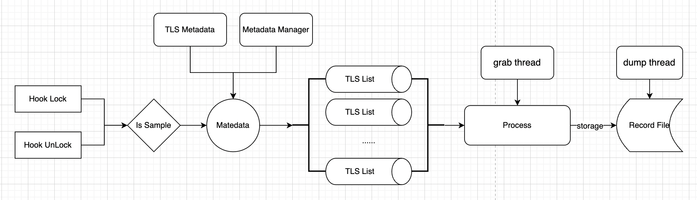
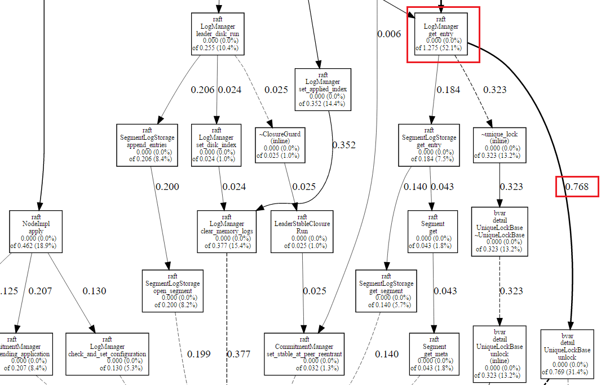

### 一、概述

当很多线程争抢同一把锁时，一些线程无法立刻获得锁，而必须睡眠直到某个线程退出临界区。这个争抢过程我们称之为**contention**。在多核机器上，当多个线程需要操作同一个资源却被一把锁挡住时，便无法充分发挥多个核心的并发能力。现代OS通过提供比锁更底层的同步原语，使得无竞争锁完全不需要系统调用，只是一两条 wait-free，耗时 `10-20ns` 的原子操作，非常快。而锁一旦发生竞争，一些线程就要陷入睡眠，再次醒来触发了OS的调度代码，代价至少为 `3-5us` 。所以让锁尽量无竞争，让所有线程“一起起飞”是高性能服务器的永恒话题。

我们当前的 profiler 工具，可以分析在等待锁上花费的时间。等待过程中线程是休眠状态，不会占用 CPU，所以 contention profiler 中的时间并不是 cpu 时间，也不会出现在 cpu profiler 中。cpu profiler 可以抓到特别频繁的锁，因为他花费了很多 CPU，但耗时真正巨大的临界区往往不是那么频繁，而无法被 cpu profiler 发现。

因此，cpu profiler 和 contention profiler 是一种互补关系，前者分析忙碌时间，后者分析被动的等待时间。还有一类是由用户基于 condition（条件）或 sleep 发起的主动等待时间，无需分析。

注意，无竞争的锁不会被采集，我们采集的是在锁上花费的所有等待时间。

目前我们支持 pthread_mutex_t 锁，开启后每秒默认最多采集 1000 个竞争锁。如果一秒内竞争锁的次数超过了 1000，那么每把锁会有 `1000/N` 的概率被采集。在各类测试场景中，暂没有发现被采集程序的性能有明显变化。

### 二、框架解析



我们 hook 了 pthread_mutex_lock 和 pthread_mutex_unlock 加锁和解锁的调用。

- 在加锁的时候，决定本次是否采样，如果需要采样的话，我们将本次这把锁的相关元数据（加锁竞争耗时、锁标识、采样率）进行填充。
- 在解锁的时候，找到这个元数据后，更新此元数据的解锁耗时，然后将此元数据进行提交到后面队列中
- 元数据的获取有两种方式，
  - 第一种方式采用 TLS 线程局部缓存，让每个线程提前创建 3 个元数据。这样做有两点意义，第一提高效率，第二我们认为一个线程最多会持有三把锁。
  - 第二种方式采用元数据池的方式。避免运行时创建数据块、开辟内存空间的开销。当解锁时，元数据释放回数据池

- 在每个线程的 TLS 中有一个链表来存储每个线程产生的元数据。这样做尽最大可能不阻塞加锁和解锁本身的操作。

- 有一个 grab 线程会定期或者被动触发，去处理那些元数据，主要是对相同的锁的一些信息，比如：耗时、次数 进行合并。处理完成后，唤醒 dump 线程

- dump 线程负责将合并后的数据输出到文件中，数据包括：锁的一些信息：堆栈、耗时、次数等。之后将此元数据释放回对象池。

文件的格式

```
duration_ns count @ stack_1 stack_2 ... stack_n
duration_ns count @ stack_1 stack_2 ... stack_n
...
duration_ns count @ stack_1 stack_2 ... stack_n
self_maps 的信息
```

- 前面的每一行都代表一把锁的使用情况，以及锁的信息：堆栈、耗时、次数
- 最后存储当前进程的 maps 信息

这个文件内容符合 pprof 的格式。我们最后使用 pprof 进行解析即可。

```
pprof --pdf ./sample result.prof > sample_01.pdf
```

### 三、结果图



