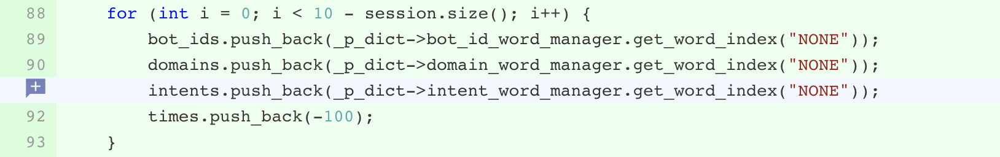

## 介绍

------

​      core dump又叫核心转储。在程序运行过程中发生异常时，将其内存数据保存到文件中，这个过程叫做core dump。core是指记忆体也就是现场的内存。

​      在开发过程中，难免会遇到程序运行过程中异常退出的情况，这时候想要定位哪里出了问题，仅仅依靠程序自身的信息打印（日志记录）往往是不够的，这个时候就需要 Core Dump 文件来帮忙定位。一个完整的 Core Dump 文件实际上相当于恢复了异常现场，利用 Core Dump 文件，可以查看到程序异常时的所有信息，变量值、栈信息、内存数据，程序异常时的运行位置（甚至记录代码行号）等等，定位所需要的一切信息都可以从 Core Dump文件获取到，能够非常有效的提高定位效率。

## Linux下配置core文件生成

------

```cpp
# 查看core文件限制大小，0：程序出错时不会产生core文件
ulimit -l

# 设置core文件限制为1024k，不过通过对于idg业务等高内存业务来看，基本都是不够的
ulimit -c 1024

# 移除core文件的限制
ulimit -c unlimited

# 关闭core文件生成
ulimit -c 0
# 查看core文件生成路径
cat /proc/sys/kernel/core_pattern

sysctl -w kernel.core_pattern=${YOUR_PATH}/core-%e-%p-%t
# or
echo "/corefile/core-%e-%p-%t" > /proc/sys/kernel/core_pattern

set(CMAKE_CXX_FLAGS "${CMAKE_CXX_FLAGS} -g")
Naming of core dump files
       By default, a core dump file is named core, but the
       /proc/sys/kernel/core_pattern file (since Linux 2.6 and 2.4.21)
       can be set to define a template that is used to name core dump
       files.  The template can contain % specifiers which are
       substituted by the following values when a core file is created:

           %%  A single % character.
           %c  Core file size soft resource limit of crashing process
               (since Linux 2.6.24).
           %d  Dump mode—same as value returned by prctl(2)
               PR_GET_DUMPABLE (since Linux 3.7).
           %e  The process or thread's comm value, which typically is
               the same as the executable filename (without path prefix,
               and truncated to a maximum of 15 characters), but may
               have been modified to be something different; see the
               discussion of /proc/[pid]/comm and
               /proc/[pid]/task/[tid]/comm in proc(5).
           %E  Pathname of executable, with slashes ('/') replaced by
               exclamation marks ('!') (since Linux 3.0).
           %g  Numeric real GID of dumped process.
           %h  Hostname (same as nodename returned by uname(2)).
           %i  TID of thread that triggered core dump, as seen in the
               PID namespace in which the thread resides (since Linux
               3.18).
           %I  TID of thread that triggered core dump, as seen in the
               initial PID namespace (since Linux 3.18).
           %p  PID of dumped process, as seen in the PID namespace in
               which the process resides.
           %P  PID of dumped process, as seen in the initial PID
               namespace (since Linux 3.12).
           %s  Number of signal causing dump.
           %t  Time of dump, expressed as seconds since the Epoch,
               1970-01-01 00:00:00 +0000 (UTC).
           %u  Numeric real UID of dumped process.
```

## 使用Core文件进行问题定位

------

```cpp
gdb -c ${core_filename} ${my_programe_name}

set solib-search-path <library_path>
```

​     **查看栈信息：** 当程序被停住了，你需要做的第一件事就是查看程序是在哪里停住的。当你的程序调用了一个函数，函数的地址，函数参数，函数内的局部变量都会被压入“栈”（Stack）中。你可以用GDB命令来查看当前的栈中的信息。可以先通过gdb filename core进入gdb命令行再输入 bt 打印当前的函数调用栈的所有信息：从n->0为调用顺序。

​     **显示源代码：** GDB 可以打印出所调试程序的源代码，当然，在程序编译时一定要加上-g的参数，把源程序信息编译到执行文件中。当程序停下来以后，GDB会报告程序停在了那个文件的第几行上。可以用list命令来打印程序的源代码。

​    **源代码的内存：**使用info line命令来查看源代码在内存中的地址。info line后面可以跟“行号”，“函数名”，“文件名:行号”，“文件名:函数名”，打印出指定的源码运行时的内存地址，如：(gdb) info line tst.c:func。

  常用命令：

- bt: 打印程序崩溃时的堆栈信息，包括导致crash的对应的frame number，文件名和行数
- where 查看程序出问题的地方
- frame [frame number]: 打印出该行代码
- info locals: 打印局部变量信息
- print [local variable]: 打印某个局部变量
- list: 打印相关代码
- quit: 退出gdb命令行

## 常见导致coredumpe的信号

------

| 名字    | 说明                        |
| ------- | --------------------------- |
| SIGABRT | 异常终止(abort)             |
| SIGBUS  | 硬件故障                    |
| SIGEMT  | 硬件故障                    |
| SIGFPE  | 算术异常                    |
| SIGILL  | 非法硬件指令                |
| SIGIOT  | 硬件故障                    |
| SIGQUIT | 终端退出符                  |
| SIGSEGV | 无效存储访问                |
| SIGSYS  | 无效系统调用                |
| SIGTRAP | 硬件故障                    |
| SIGXCPU | 超过CPU限制(setrlimit)      |
| SIGXFSZ | 超过文件长度限制(setrlimit) |

## 一些内部搜集到的GDB的技巧和经验

------

先看一下 coredump 的类型，是 abort 导致的，还是 segmentfault 导致的。如果是 abort 类型的错误，往往是程序某个位置抛了异常，这种 core 通常比较好查，栈顶的函数通常都是 abort 相关的函数，如果顺着栈帧就能找到 core 出的具体位置。如果是基础库或者第三方库导致的抛异常，建议先查一下抛异常的原因。修复后在调用处 catch 异常，视情况打出相应级别的日志并监控。

另一类是 segmentfault 错误，这一类错误通常都比较难定位。因为 segmentfault 的原因非常多，直接原因都是访问了非法内存导致的。程序为什么会访问非法内存呢？通常有以下几种间接原因：

- 未初始化导致访问了非法内存。
- 直接越界访问。
- 由于某种原因越界写，破坏了其它变量的数据。再次读取被破坏的数据时，可能会访问非法内存。
- 由于线程竞争的问题，你写的内存，可能已经不是你看到的那个内存了。当另一个线程在读取此内存数据时，可能会访问非法内存。

以下都是常见的段错误，当你遇到了 coredump 时，先自查一下，是不是有以下的情况发生：

- a. 某个声明了返回值的函数，漏写了 return 语句（这种开了优化就会 coredump）。
- b. 头文件和编译的库文件不匹配，也就是二进制兼容性导致的问题。又或是同一个工具库同时存在几个不同版本。
- c. 程序中使用了消亡值。比如返回局部变量的地址，又或是引用了某个子作用域变量的地址（这类错误通常都比较隐蔽，不易发现，但是 AddressSantizer 都能帮你找到）。
- d. 无符号数的减法问题。比如 size_t index = a; index -= 10; if (index >=0) read a[index]; 再比如以下一个真实案例，导致线上死循环。

- 



- e. vector 的 erase 和 insert 问题。如果你引用了 vector 的某个成员后，就对其进行 insert 或 erase，那么之前引用的元素，又或是取到的迭代器，都可能会失效。
- f. 多线程程序里，使用了共享的变量。这类错误往往不易发现，因为有时候，你甚至都不知道你的实例是否是在多线程环境中执行，甚至都没有意识到。所以可以先思考以下几个问题：

- 当前对象的 method 是否是在多线程环境中执行的？
- 如果是，当前对象是否有自己的成员？
- 如果有成员，这些成员是否在 method 的中有做修改？

如果上面的问题都回答是，说明你这个 class 设计上存在问题。在任何时候，method 都需要优先被修饰为 const，除非你觉得你这个方法确实需要修改成员，比如 set 类的方法。

- 当前的函数是否在多线程中执行？
- 当前函数的参数是否是可修改的引用或是指针？
- 传递的参数是否是共享的变量？

这种通常比较隐蔽，难以发现。

使用了线程不安全的系统函数，比如 gethostbyname, getenv 等。

- g. 信号处理函数。信号处理函数往往也会存在竞争的问题，但是危害没有多线程程序那么严重，导致 coredump 的机率比较低。但是它可能会导致程序死锁发生，比如在信号处理函数中使用了加锁的函数，如果不是递归锁，则会导致程序死锁，比如 malloc 函数。
- h. 栈溢出。典型的现象是，你只能看到栈顶少数几个函数，再往深了看，都是问号。比如越界写就会导致此种问题发生，这种通常比较容易复现，前提是你要能找到导致问题的 case。
- i. 爆栈。Linux 64bit 系统线程栈默认大小是 8MB，如果你有某个类型的变量，占用的内存非常大，就有可能导致栈内存不够用而 coredump。比如在栈上使用二维数组，又或是声明了一个超长的数组。

还有一类错误，连堆栈都看不到，比如栈溢出导致的问题。著名的 stackoverflow 网站，它的中文名就是栈溢出。栈溢出会导致诡异的问题，甚至让你的程序陷入奇妙的死循环而不会 coredump。也可能会导致最终爆栈。

如果你的遇到了栈溢出的问题，你就需要有一定的二进制分析能力，人肉去分析栈栈帧，来挖掘调用链。关于栈帧分析，需要再做单独的文章去讲解。即使你学会分析了栈帧，但是有些问题，你可能仍然无法定位。

coredump 最困难的地方是，通常越界读写，不会导致直接的 coredump。比如你在时间 t0 修改变量 A，但是由于越界写，导致与 A 紧临的内存上的某个变量 Z 被修改，写入了垃圾数据。当未来在 t1 时刻使用变量 Z 时，程序才会 coredump。此时你能看到的是，变量 Z 数据被写坏了，然而，你却无法知道是在 t0 时刻早已被写坏。

此种越界行为，靠人肉去分析 coredump 几乎不可能找出问题，除非出问题的地方与 coredump 的地方非常接近。如果确实你的修改导致 coredump，你可通过代码 diff 一行一行去分析。这种情况，建议直接上 AddressSanitizer 来辅助定位。

线程竞争导致的 coredump 也令人头疼，甚至你无法确定他就是线程竞争导致的问题。假如你的代码有多线程相关的逻辑，那么一定要检查是否使用了线程共享的对象。如果无法发现问题，使用 ThreadSanitizer 工具来辅助定位。

[GDB调试原理与技巧](https://ku.baidu-int.com/knowledge/HFVrC7hq1Q/pKzJfZczuc/-x7_7zL7yX/a_MxB4Ke0i31Do)