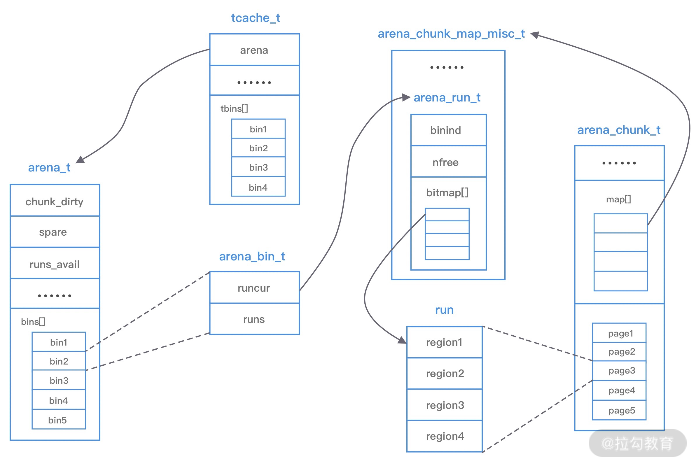

### 一、核心概念

#### 1. arena

arena 是 jemalloc 最重要的部分，内存由一定数量的 arenas 负责管理。每个用户线程都会被绑定到一个 arena 上，线程采用 round-robin  轮询的方式选择可用的 arena 进行内存分配，为了减少线程之间的锁竞争，默认每个 CPU 会分配 4 个 arena。

#### 2. bin

bin 用于管理不同档位的内存单元，每个 bin 管理的内存大小是按分类依次递增。因为 jemalloc 中小内存的分配是基于 Slab 算法完成的，所以会产生不同类别的内存块。

#### 3. chunk

chunk 是负责管理用户内存块的数据结构，chunk 以 Page 为单位管理内存，默认大小是 4M，即 1024 个连续的页。每个 chunk 可被用于多次小内存的申请，但是在大内存分配的场景下只能分配一次。

#### 4. run

run 实际上是 chunk 中的一块内存区域，每个 bin 管理相同类型的 run，最终通过操作 run 完成内存分配。run 结构具体的大小由不同的 bin 决定，例如 8 字节的 bin 对应的 run 只有一个页，可以从中选取 8 字节的块进行分配。

#### 5. region

region 是每个 run 中对应的若干个小内存块，每个 run 会划分为若干个等长的 region，每次内存分配也是按照 region 进行分发。

#### 6. tcache 

tcache 是每个线程的私有缓存，用于 small 和 large 场景下内存分配，每个 tcache 会对应一个 arena，tcache 本身也会有一个 bin 数组，称为 tbins。与 arena 中 bin 不同的是，他不会有 run 的概念。tcache 每次从 arena 申请一批内存，在分配内存时首先在 tcache 查找，从而避免锁竞争，如果分配失败才会通过 run 执行内存分配。

#### 7. extent

Jemalloc 的内存管理结合了 buddy 算法和 slab 算法。Jemalloc 引入 extent 的概念，extent 是 arena 管理的内存对象，在 large size 的 allocation 中充当 buddy 算法中的 chunk，small size allocation 中，充当 slab。

每个 extent 的大小是 Pagesize 的整数倍，不同 size 的 extent 会用 buddy 算法来进行拆分和合并，大内存的分配会直接使用一整个的 extent 来存储。小内存的分配使用的是 slab 算法，slab size 的计算规则为 size 和 pagesize 的最小公倍数，因此每个 extent 总是可以存储整数倍个对应 size。

extent 本身设置 bitmap，来记录内存占用情况，以及自身的各种属性，同类型的 extents 用 paring heap 存储。此外，arena 将 extent 分为多种类型，有当前正在使用未被填满的 extent，有一段时间未使用的 dirty extent，还有长时间未使用的 muzzy extent，以及开启 retained 功能后的 retained extent，extent 分类的作用相当于多级缓存，当线程内存分配压力较小时，空余的 extent 会被缓存，以备压力增大时使用，可以避免与操作系统的交互。

#### 总结

- 内存是由一定数量的 arena 负责管理，线程均匀的分布在 arena 中
- 每个 arena 都包含一个 bin 数组，每个 bin 管理不同档位的内存块
- 每个 arena 被划分为若干个 chunk，每个 chunk 又包含若干个 run，每个 run 由连续的 Page 组成，run 才是实际分配内存的操作对象
- 每个 run 会被划分为一定数量的 region，在小内存的分配场景中，region 相当于用户内存
- 每个 tcache 对应一个 arena，tcache 中包含多种类型的 bin

### 二、分配和释放流程

分析下整体的内存分配和释放流程，主要分为 Small、Large 和 Huge 三种场景

#### 1. small 场景

Small 场景，如果请求分配内存的大小小于 arena 中最小的 bin，那么优先从线程对应的 tcache 中进行分配。首先确定查找对应的 tbin 中是否存在缓存的内存块，如果存在则分配成功，否则找到 tbin 对应的 arena，从 arena 对应的 bin 中分配 region，保存在 tbin 的 avail 数组中，最终从 avail 数组中选取一个地址进行内存分配。当内存释放时也会将回收的内存块进行缓存。

#### 2. Large 场景

Large 场景，如果请求分配内存的大小大于 arena 中的最小的 bin，但是不大于 tcache 中能够缓存的最大块，依然会通过 tcache 进行分配，但是不同的是此时会分配 chunk 以及所对应的 run，从 chunk 中找到相应的内存空间进行分配。

内存释放会把释放的内存块缓存在 tcache 的 tbin 中。此外，还有一种情况，当请求分配内存的大小大于 tcache 中能够缓存的最大块，但是不大于 chunk 的大小，那么将不会采用 tcache 机制，直接在 chunk 中进行内存分配。

#### 3. Huge 场景

如果请求分配内存的大小大于 chunk 的大小，那么直接通过 mmap 进行分配，调用 munmap 进行回收

### 三、特点与比较

- jemalloc 最大的优势就是强大的多核/多线程分配能力。CPU 的核心越多，程序线程就越多，jemalloc 分配的速度就越快
- 隔离了大内存块和小内存块的内存分配（区分默认阈值为 3.5 个 pagesize），可以有效的减少内存碎片。尤其是在分配大内存块时，内存碎片要比 tcmalloc 少
- 在内存重用时默认使用低地址，并将内存控制在尽量少的内存页上
- 制定 size class 和 slab class，以便减少内存碎片
- Jemalloc 对内存分配粒度进行了更精细的分类，可以减少锁竞争。同时，用一定数量的 arena 来管理内存单元，每个 arena 管理一定数量的线程，arena 之间内存独立，多线程的锁竞争可以减少。并且可以使用 mallocx 来隔离线程，让内存分配任务比较重的线程独占 arena
- 不过，虽然 jemalloc 严格限制了自身的元数据大小。但当分配大量小内存时，jemalloc 记录元数据的空间会比 tcmalloc 略多。

