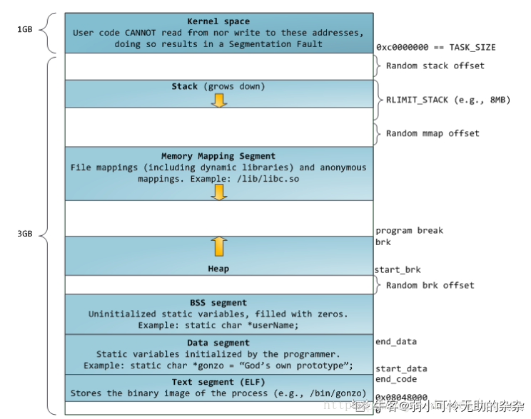
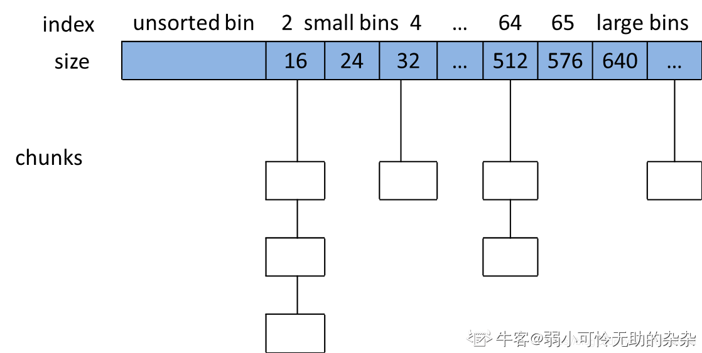

## malloc 底层实现

### 一、背景

目前大部分服务端程序使用 `glibc` 提供的 `malloc/free` 系列函数，而 `glibc` 使用的 `ptmalloc2`  在性能上远远落后于 google 的 `tcmalloc` 和 fackbook 的 `jemalloc` 

以 x86 的 32 位系统为例，进程的虚拟内存布局，栈至顶向下扩展，堆至低向上扩展，mmap 映射区至顶向下扩展。



#### 1. 系统调用

```
int brk(const void* addr);
void* sbrk(intptr_t incr);
```

两个函数的作用是扩展堆区的上界（brk位置）

- `brk()` 函数的参数设置为新的 brk 上界地址，成功返回 1，失败返回 0
- `sbrk()` 函数的参数为申请内存的大小，返回堆区新的上界 brk 的地址

```
void *mmap(void *addr, size_t length, int prot, int flags, int fd, off_t offset);
int munmap(void *addr, size_t length);
```

mmap 的第一种用法是映射磁盘文件到内存中；第二种用法是匿名映射，向映射区申请一块内存，malloc 使用 mmap 就是向映射区申请一块内存

munmap 用于释放映射区的内存

#### 2. 主分配区和非主分配区

Allocate的内存分配器中，为了**解决多线程锁争夺问题**，分为主分配区main_area和非主分配区no_main_area。

　1. 主分配区和非主分配区形成一个环形链表进行管理。
　2. 每一个分配区利用互斥锁使线程对于该分配区的访问互斥。
　3. 每个进程只有一个主分配区，也可以允许有多个非主分配区。
　4. ptmalloc根据系统对分配区的争用动态增加分配区的大小，分配区的数量一旦增加，则不会减少。
　5. 主分配区可以使用brk和mmap来分配，而非主分配区只能使用mmap来映射内存块
　6. 申请小内存时会产生很多内存碎片，ptmalloc在整理时也需要对分配区做加锁操作

当一个线程需要使用malloc分配内存的时候，会先查看该线程的私有变量中是否已经存在一个分配区。若是存在。会尝试对其进行加锁操作。若是加锁成功，就在使用该分配区分配内存，若是失败，就会遍历循环链表中获取一个未加锁的分配区。若是整个链表中都没有未加锁的分配区，则malloc会开辟一个新的分配区，将其加入全局的循环链表并加锁，然后使用该分配区进行内存分配。当释放这块内存时，同样会先获取待释放内存块所在的分配区的锁。若是有其他线程正在使用该分配区，则必须等待其他线程释放该分配区互斥锁之后才能进行释放内存的操作

### 二、malloc 实现原理

glibc 的 malloc 使用 ptmalloc 的实现，ptmalloc 内部使用内存池的管理方式，**采用边界标记法**将内存划分成很多块，从而对内存的分配与回收进行管理。为了内存分配函数 malloc 的高效性，**ptmalloc 会预先向操作系统申请一块内存供用户使用**，当我们申请和释放内存的时候，ptmalloc会将这些内存管理起来，并通过一些策略来判断是否将其回收给操作系统。这样做的最大好处就是，**使用户申请和释放内存的时候更加高效，避免产生过多的内存碎片**

#### 1. chunk 内存块的基本组织单元

用户请求分配的空间在 ptmalloc 中使用一个 `malloc_chunk` 来表示

```cpp
struct malloc_chunk {  
  INTERNAL_SIZE_T      prev_size;    /* Size of previous chunk (if free).  */  
  INTERNAL_SIZE_T      size;         /* Size in bytes, including overhead. */  

  struct malloc_chunk* fd;           /* double links -- used only if free. */  
  struct malloc_chunk* bk;  

  /* Only used for large blocks: pointer to next larger size.  */  
  struct malloc_chunk* fd_nextsize;      /* double links -- used only if free. */  
  struct malloc_chunk* bk_nextsize; 
};  
```

- prev_size：如果前一个 chunk 是空闲的，该字段表示前一个 chunk 的大小，如果前一个 chunk 不空闲，该字段无意义
- size：当前 chunk 的大小，并且记录了当前 chunk 和前一个 chunk 的一些属性，包括前一个 chunk 是否在使用中，当前 chunk 是否是通过 mmap 获得的内存，当前 chunk 是否属于非主分配区
-  fd 和 bk ： 指针 fd 和 bk 只有当该 chunk 块空闲时才存在，其作用是用于将对应的空闲 chunk 块加入到空闲chunk 块链表中统一管理，如果该 chunk 块被分配给应用程序使用，那么这两个指针也就没有用（该 chunk 块已经从空闲链中拆出）了，所以也当作应用程序的使用空间，而不至于浪费
- fd_nextsize 和 bk_nextsize：当当前的 chunk 存在于 large bins 中时， large bins 中的空闲 chunk 是按照大小排序的，但同一个大小的 chunk 可能有多个，增加了这两个字段可以加快遍历空闲 chunk ，并查找满足需要的空闲 chunk ， fd_nextsize 指向下一个比当前 chunk 大小大的第一个空闲 chunk ， bk_nextszie 指向前一个比当前 chunk 大小小的第一个空闲 chunk 。 如果该 chunk 块被分配给应用程序使用，那么这两个指针也就没有用（该chunk 块已经从 size 链中拆出）了，所以也当作应用程序的使用空间，而不至于浪费

#### 2. 空闲链表 bins

当用户使用free函数释放掉的内存，ptmalloc并不会马上交还给操作系统，而是被ptmalloc本身的空闲链表bins管理起来了，当用户进行下一次分配请求时，ptmalloc就会**从空闲的bins上寻找一块合适大小的内存块分配给用户使用**。这样的好处**可以避免频繁的系统调用，降低内存分配的开销**。

malloc 将相似大小的 chunk 用双向链表链接起来，这样一个链表被称为一个 bins。ptmalloc 一共维护了 128 个 bins。每个 bins 都维护了大小相近的双向链表的 chunk。基于 chunk 的大小，有下列几种可用 bins：

- Fast bins 
- Unsorted bins
- Small bins
- Large bins 

底层会使用数组保存这些 bins，其中 fast bin 单独用一个数组保存，其他三个 unsorted bin、Small bin、Large bin 用一个数组保存。也就是说是数组中每个位置会存储一个双向链表。



- 数组中第一个位置是 unsorted bin
- 从第二个位置开始，依次有 64 个 small bins，同一个 small bin 中的 chunk 具有相同的大小，两个相邻的 small bin 中的 chunk 大小相差 8 bytes。small bin 中的 chunk 按照最近使用顺序进行排列（FIFO），最后释放的 chunk 被链接到链表的头部，而申请 chunk 是从链表尾部开始，这样每一个 chunk 都有相同的机会被 ptmalloc 选中
- 从第 65 到 128 位置是 large bin。同样的，每个 bin 分别包含一个给定范围内的 chunk，其中的 chunk 按大小排列。相同大小的 chunk 同样按照最近使用顺序进行排列（FIFO）
- 当空闲的 chunk 被链接到 bin 中的时候，ptmalloc 会把该 chunk 的状态设为 可分配，同时 ptmalloc 还会检查它前后的 chunk 是否空闲，如果是的话，ptmalloc 会首先把他们合并成一个大的 chunk，然后将合并后的 chunk 放到 unsorted bin 中。
- 并不是所有的 chunk 被释放后就立即被放到 bins 数组中。ptmalloc 为了提高分配的速度，会把一些小的 chunk 放到 fast bin 中

那么调用 malloc 的时候，就能很快找到需要分配的内存大小是否在维护的 bin 上，如果在某一个 bin 上，就可以通过双向链表去查看合适的 chunk 内存块给用户使用。

为什么有 fast bins ?

场景：程序经常需要申请和释放较小的内存空间。如果当分配器合并了相邻的几个小的 chunk 之后，程序马上又要分配小内存，这样分配器又需要从大的空闲内存中切分出一块，这样特别低效。因此，malloc 在分配过程中引入 fast bins。对于小于等于 max_fast（ 64B ） 的 chunk 被释放后，首先会被放到 fast bins 中。

#### 3. 其他情况

并不是所有 chunk 都按照空闲链表 bins 的方式组织，有三种例外情况：top chunk、mmaped chunk、last remainder chunk

- top chunk：相当于分配区的顶部空闲内存，当 bins 上都不能满足内存分配要求的时候，就会来 top chunk 上分配。当 top chunk 大小小于用户所请求的大小时，top chunk 就通过 sbrk 或 mmap 系统调用来扩容
- mmaped chunk：当分配的内存非常大（大于分配阈值，默认 128K）的时候，需要被 mmap 映射，则会放到 mmaped chunk 上。当释放 mmaped chunk 上的内存的时候会直接交还给操作系统
- last remainder chunk：当需要分配一个 small chunk，但在 small bins 中找不到合适的 chunk，如果 last remainder chunk 的大小大于所需要的 small chunk 大小，last remainder chunk 被分裂成两个 chunk，其中一个 chunk 返回给用户，另一个 chunk 变成新的 last remainder chunk。

### 三、sbrk 和 mmap

在堆区中，start_brk 指向 heap 的起始位置，而 brk 指向 heap 的顶部。可以使用系统调用 `brk()` 和 `sbrk()` 来增加标识 heap 顶部的 brk 值，从而线性的增加分配给用户的 heap 空间。再使用 malloc 之前，brk 的值等于 start_brk，也就是说 heap 大小为 0

ptmalloc 在开始时，若请求的空间小于 mmap 分配阈值（默认 128KB）时，主分配区会调用 `sbrk()` 增加一块大小为 `128k+chunk_size` 的空间作为 heap。非主分配区会调用 mmap 映射一块大小为 HEAP_MAX_SIZE（32 位系统为 1M，64位系统为 64M）的空间作为 sub-heap。也就是前面所说的 ptmalloc 所维护的分配空间。当用户请求内存分配时，首先会在这个区域内找一块合适的 chunk 给用户，当用户释放了 heap 中的 chunk 时，ptmalloc 又会使用 fast-bins 和 bins 来组织空闲 chunk。以备用户的下一次分配。

若需要分配的 chunk 大小小于 mmap分配阈值，而 heap 空间又不够，则此时主分配区会通过 sbrk()调用来增加 heap 大小，非主分配区会调用 mmap 映射一块新的 sub-heap，也就是增加 top chunk 的大小，每次 heap 增加的值都会对齐到 4KB。

当用户的请求超过 mmap 分配阈值，并且主分配区使用 sbrk()分配失败的时候，或是非主分配区在 top chunk 中不能分配到需要的内存时，ptmalloc 会尝试使用 mmap()直接映射一块内存到进程内存空间。**使用 mmap()直接映射的 chunk 在释放时直接解除映射，而不再属于进程的内存空间。任何对该内存的访问都会产生段错误。**而在 heap 中或是 sub-heap 中分配的空间则可能会留在进程内存空间内，还可以再次引用（当然是很危险的）

### 四、内存分配 malloc 流程

1. 获取分配区的锁，防止多线程冲突。
2. 计算出实际需要分配的内存的chunk实际大小。
3. 判断chunk的大小，如果小于max_fast（64Ｂ），则尝试去fast bins上取适合的chunk，如果有则分配结束。否则，下一步；
4. 判断chunk大小是否小于512B，如果是，则从small bins上去查找chunk，如果有合适的，则分配结束。否则下一步；
5. ptmalloc首先会遍历fast bins中的chunk，将相邻的chunk进行合并，并链接到unsorted bin中然后遍历 unsorted bins。如果unsorted bins上只有一个chunk并且大于待分配的chunk，则进行切割，并且剩余的chunk继续扔回unsorted bins；如果unsorted bins上有大小和待分配chunk相等的，则返回，并从unsorted bins删除；如果unsorted bins中的某一chunk大小 属于small bins的范围，则放入small bins的头部；如果unsorted bins中的某一chunk大小 属于large bins的范围，则找到合适的位置放入。若未分配成功，转入下一步；
6. 从large bins中查找找到合适的chunk之后，然后进行切割，一部分分配给用户，剩下的放入unsorted bin中。
7. 如果搜索fast bins和bins都没有找到合适的chunk，那么就需要操作top chunk来进行分配了
    当top chunk大小比用户所请求大小还大的时候，top chunk会分为两个部分：User chunk（用户请求大小）和Remainder chunk（剩余大小）。其中Remainder chunk成为新的top chunk。
    　　当top chunk大小小于用户所请求的大小时，top chunk就通过sbrk（main arena）或mmap（thread arena）系统调用来扩容。
8. 到了这一步，说明 top chunk 也不能满足分配要求，所以，于是就有了两个选择: 如 果是主分配区，调用 sbrk()，增加 top chunk 大小；如果是非主分配区，调用 mmap 来分配一个新的 sub-heap，增加 top chunk 大小；或者使用 mmap()来直接分配。在 这里，需要依靠 chunk 的大小来决定到底使用哪种方法。判断所需分配的 chunk 大小是否大于等于 mmap 分配阈值，如果是的话，则转下一步，调用 mmap 分配， 否则跳到第 10 步，增加 top chunk 的大小。
9. 使用 mmap 系统调用为程序的内存空间映射一块 chunk_size align 4kB 大小的空间。 然后将内存指针返回给用户。
10. 判断是否为第一次调用 malloc，若是主分配区，则需要进行一次初始化工作，分配 一块大小为(chunk_size + 128KB) align 4KB 大小的空间作为初始的 heap。若已经初 始化过了，主分配区则调用 sbrk()增加 heap 空间，分主分配区则在 top chunk 中切 割出一个 chunk，使之满足分配需求，并将内存指针返回给用户。

简而言之： 获取分配区(arena)并加锁–> fast bin –> unsorted bin –> small bin –> large bin –> top chunk –> 扩展堆

### 五、内存回收流程

free() 函数接受一个指向分配区域的指针作为参数，释放该指针所指向的 chunk。而具体的释放方法则根据该 chunk 所处的位置和该 chunk 的大小而定。

1. 获取分配区的锁，保证线程安全。
2. 如果free的是空指针，则返回，什么都不做。
3. 判断当前chunk是否是mmap映射区域映射的内存，如果是，则直接munmap()释放这块内存。前面的已使用chunk的数据结构中，我们可以看到有M来标识是否是mmap映射的内存。
4. 判断chunk是否与top chunk相邻，如果相邻，则直接和top chunk合并（和top chunk相邻相当于和分配区中的空闲内存块相邻）。转到步骤8
5. 如果chunk的大小大于max_fast（64b），则放入unsorted bin，并且检查是否有合并，有合并情况并且和top chunk相邻，则转到步骤8；没有合并情况则free。
6. 如果chunk的大小小于 max_fast（64b），则直接放入fast bin，fast bin并没有改变chunk的状态。没有合并情况，则free；有合并情况，转到步骤7
7. 在fast bin，如果当前chunk的下一个chunk也是空闲的，则将这两个chunk合并，放入unsorted bin上面。合并后的大小如果大于64B，会触发进行fast bins的合并操作，fast bins中的chunk将被遍历，并与相邻的空闲chunk进行合并，合并后的chunk会被放到unsorted bin中，fast bin会变为空。合并后的chunk和topchunk相邻，则会合并到topchunk中。转到步骤8
8. 判断top chunk的大小是否大于mmap收缩阈值（默认为128KB），如果是的话，对于主分配区，则会试图归还top chunk中的一部分给操作系统。free结束。

### 六、注意

为了避免Glibc内存暴增，需要注意：
　　1. **后分配的内存先释放**，因为ptmalloc收缩内存是从top chunk开始，如果与top chunk相邻的chunk不能释放，top chunk以下的chunk都无法释放。
　　2. **Ptmalloc不适合用于管理长生命周期的内存**，特别是持续不定期分配和释放长生命周期的内存，这将导致ptmalloc内存暴增。
　　3. **不要关闭 ptmalloc 的 mmap 分配阈值动态调整机制**，因为这种机制保证了短生命周期的 内存分配尽量从 ptmalloc 缓存的内存 chunk 中分配，更高效，浪费更少的内存。
　　4. **多线程分阶段执行的程序不适合用ptmalloc，这种程序的内存更适合用内存池管理**
　　5. **尽量减少程序的线程数量和避免频繁分配/释放内存。**频繁分配，会导致锁的竞争，最终导致非主分配区增加，内存碎片增高，并且性能降低。
　　6. **防止内存泄露**，ptmalloc对内存泄露是相当敏感的，根据它的内存收缩机制，如果与top chunk相邻的那个chunk没有回收，将导致top chunk一下很多的空闲内存都无法返回给操作系统。
　　7. **防止程序分配过多的内存，或是由于glibc内存暴增，导致系统内存耗尽，程序因为OOM被系统杀掉**。预估程序可以使用的最大物理内存的大小，配置系统的/proc/sys/vm/overcommit_memory ,/proc/sys/vm/overcommit_ratio,以及使用ulimit -v限制程序能使用的虚拟内存的大小，防止程序因OOM被杀死掉
