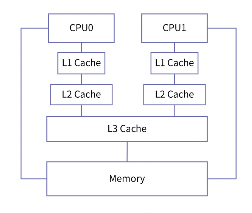
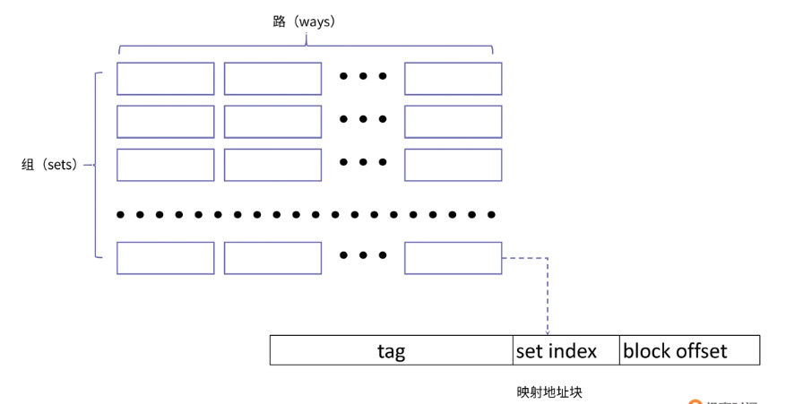
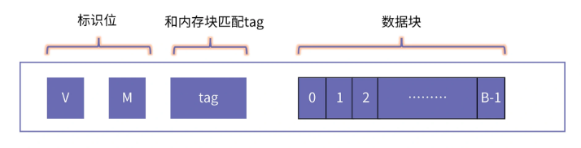
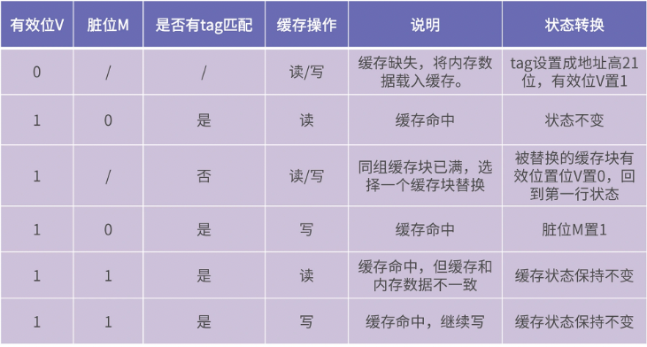
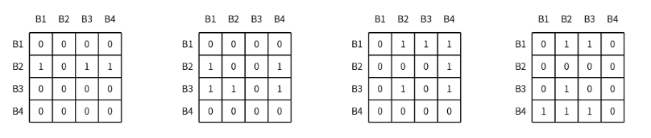

我们把用于存储数据的电路叫做存储器，按照到 CPU 距离的远近，存储器主要分为寄存器、缓存和内存、磁盘。

- **CPU 中的寄存器使用触发器存储一个比特**，读写速度最快，但所占电路面积最大。
- 存储器大体上可以分为只读存储器 ROM 和随机存储器 RAM 两大类。ROM 断电后信息不会丢失，RAM 断电后存储的信息后丢失。
- 早期的只读存储器往往只能写一次，不能更改。随着技术的进步，逐渐出现了紫光线可擦除 ROM 和电可擦除 ROM。从而使得 ROM 可以多次写入。现代的闪存就是 EEPROM，他是一种电可擦除的可编程 ROM。
- RAM 可以进一步分为静态存储器 SRAM 和动态存储器 DRAM。SRAM 的存储单元多采用 6 管实现，DRAM 则采用一个开关加一个电容的方式实现。DRAM 的存储单元占用面积小，更容易集成，所以容量也更大，但是 DRAM 的电容会缓慢漏电，因此需要定期刷新。SRAM 相比 DRAM 有更好的读写速度，多用来制作 CPU 的高速缓存。
- **一般缓存是由静态存储器 SRAM 组成的**，他的本质是一种时序逻辑电路，具体的每个单元（比特）由一个个锁存器构成，锁存器的功能就是让电路具有记忆功能。
- **一般内存是由动态存储器 DRAM 组成的**，DRAM 仅需要一个晶体管和一个电容。 
- SRAM 的单位造价要远高于动态存储器 DRAM。因为 SRAM 由锁存器构成，一个锁存器需要 6 个晶体管，而实现一个 DRAM 仅需要一个晶体管和一个电容。但是 DRAM 因为结构简单，单位面积可以存放更多数据，所以更适合做内存。
- 在制造方面，DRAM 因为有电容的存在，不再是单纯的逻辑电路，所以不能用 CMOS 工艺制作，而 SRAM 可以。这也是为什么缓存可以集成到芯片内部，而内存是和芯片分开制造的。

在过去的几十年，处理器速度的增长远远超过了内存速度的增长。尤其是在 2001～2005 年间，处理器的时钟频率在以 55% 的速度增长，而同期内存速度的增长仅为 7%。为了缩小处理器和内存之间的速度差距，缓存被设计出来。

距离处理器越近，访问速度就越快，造价也就越高，同时容量也会更小。缓存是处理器和内存之间的一个桥梁，通常分为多层，包括 L1 层、L2 层、L3 层等等。缓存的速度介于处理器和内存之间。

- 访问处理器内部寄存器的速度在 1ns 以内（一个时钟周期）
- 访问内存的速度通常在 50～100ns（上百个时钟周期）之间
- 那么对于缓存来讲，靠近处理器最近的 L1 层缓存的访问速度在 1ns～2ns（3 个时钟周期）左右，外层 L2 和 L3 层的访问速度在 10ns～20ns（几十个时钟周期）之间

### 一、缓存的原理

缓存集成到芯片的方式有多种。在过去的单核时代，处理器和各级缓存都只有一个，因此缓存的集成方式相对单一，就是把处理器和缓存直接相连。

#### 1. 缓存的物理结构

2004 年，Intel 取消了 4GHZ 奔腾处理器的研发计划，这意味着处理器以提升主频榨取性能的时代结束，多核处理器开始成为主流。在多核芯片中，缓存集成的方式主要有三种：

- 集中式缓存：一个缓存和所有处理器直接相连，多个核共享这一个缓存
- 分布式缓存：一个处理器仅和一个缓存相连，一个处理器对应一个缓存
- 混合式缓存：在 L3 采用集中式缓存，在 L1 和 L2 采用分布式缓存



现代的多核处理器大都采用混合式的方式将缓存集成到芯片上，一般情况下，L3 是所有处理器核共享的，L1 和 L2 是每个处理器核特有的。

#### 2. 缓存的工作原理

`cache line`：是缓存进行管理的最小存储单元，也叫缓存块。

从内存向缓存加载数据也是按缓存块进行加载的，一个缓存块和一个内存中相同容量的内存块对应。如下是缓存块的组织形式。



对于一个特定地址数据的访问，他如果要载入缓存，那么他放入上图的组是确定的，但是具体放到那一路是不固定的。根据缓存中组数和路数的不同，我们将缓存的映射方式分为三类：

- 直接相连映射：缓存只有一个路，一个内存块只能放置在特定的组上
- 全相连映射：缓存只有一个组，所有的内存块都放在这一组的不同路上
- 组组相连映射：缓存同时由多个组和多个路

这三种方式：

- 对于直接相连映射，当多个内存块映射到同一个组时，会产生冲突，因为只有一列，这个时候就需要将旧的缓存块换出，同时将新的缓存块放入。所以直接相连映射会导致缓存块被频繁替换。
- 全相连映射可以在很大程序上避免冲突，不过，当要查询某个缓存块时，需要逐个遍历每个路，而且电路实现也比较困难。
- 因此，采用组组相连映射。这种方式与直接相连映射相比，产生冲突的可能性更小，与全相连映射相比，查询效率更高，实现也更简单。

缓存块的内部结构如下：



- `V（valid）`：表示这个缓存块是否有效，或者说是否正在被使用
- `M(Modified)`：表示这个缓存块是否被写，也就是 “脏” 位
- 数据块中的 `B`：表示缓存块的 bit 个数

假设要寻址一个 32 位的地址，缓存块的大小是 64 字节，缓存组织方式是 4 路组相连，缓存大小是 8K。经过计算我们得到的缓存一共有 32 个组（`8*1024/64/4=32`）。那么对于任意一个 32 位的地址 Addr，他映射到缓存的组号（`set index`）为 Addr 对组数 32 进行取模，组号同时也等于 Addr 的第 `6-10` 位（`(Addr >> 6) & 0x1F`），Addr 的低 6 位是缓存块的内部偏移（`2^6 为 64 字节`），那么高 21 位的用途如下介绍：

确定需要被映射到哪个组之后，我们需要在该组的路中进行查询。查询方式也很简单，直接将每个缓存块 tag 的 bit 位和地址 Addr 的高 21 位逐一进行匹配。如果相等，就说明该内存块已经载入到缓存中；如果没有匹配的 tag，就说明缓存缺失，需要将内存块放到该组的一个空闲缓存块上；如果所有路的缓存块都正在被使用，那么需要选择一个缓存块，将其移出缓存，把新的内存块载入。

上面这个过程涉及到缓存块状态转换，而状态转换又涉及到有效位 V、脏位 M、标签 tag。总体来讲，缓存的状态转换有以下几种情况：



当同组的缓存块都被用完时，需要选择一个缓存块换出，那么选择谁被换出？和缓存块替换策略有关。

#### 3. 缓存块替换策略

缓存替换策略一般都采用 “最近最少使用算法”（`Least Recently Used, LRU`）。在缓存中，最简单也最容易实现的是利用位矩阵来实现。

首先定义一个行、列都与缓存路数相同的矩阵。当访问某个路对应的缓存块时，先将该路对应的所有行置为 1，然后再将该路对应的所有列置为 0。最终结果体现为，缓存块访问时间的先后顺序，由矩阵行中 1 的个数决定，最近最常访问缓存块对应行 1 的个数最多。

假设现在一个四路相连的缓存组包含数据块 B1、B2、B3、B4, 数据块的访问顺序为 B2、B3、B1、B4，那么 LRU 矩阵在每次访问后的变化如下图所示：



最终我们发现 B2 对应行的 1 的个数最少，所以 B2 将会被优先替换。

#### 4. 缓存对程序性能的影响

CPU 将未来最有可能被用到的内存数据加载进缓存。如果下次访问内存时，数据已经在缓存中了，这就是缓存命中，它获取目标数据的速度非常快。如果数据没在缓存中，这就是缓存缺失，此时要启动内存数据传输，而内存的访问速度相比缓存差很多。

所以，我们要避免这种情况，我们先来看那些情况容易造成缓存缺失，以及具体对程序性能带来怎样的影响。

#### 5. 缓存缺失

引起缓存缺失的类型主要有三种：

- 强制缺失：第一次将数据块读入到缓存所产生的缺失，也被称为冷缺失（cold miss），因为当发生缓存缺失时，缓存是空的（冷的）
- 冲突缺失：由于缓存的相连度有限导致的缺失
- 容量缺失：由于缓存大小有限导致的缺失。

其中强制缺失，因为第一次将数据读入缓存时，缓存中不会有数据，这种缺失无法避免。

冲突缺失是因为相连度有限导致的，我们可以通过 getconf 查看缓存的信息：

```
# getconf -a | grep CACHE
LEVEL1_ICACHE_SIZE                 32768
LEVEL1_ICACHE_ASSOC                8
LEVEL1_ICACHE_LINESIZE             64
LEVEL1_DCACHE_SIZE                 49152
LEVEL1_DCACHE_ASSOC                12
LEVEL1_DCACHE_LINESIZE             64
LEVEL2_CACHE_SIZE                  524288
LEVEL2_CACHE_ASSOC                 8
LEVEL2_CACHE_LINESIZE              64
LEVEL3_CACHE_SIZE                  16777216
LEVEL3_CACHE_ASSOC                 16
LEVEL3_CACHE_LINESIZE              64
LEVEL4_CACHE_SIZE                  0
LEVEL4_CACHE_ASSOC                 0
LEVEL4_CACHE_LINESIZE              0
```

在这个缓存的信息中，L1Cache（LEVEL1_ICACHE 和 LEVEL1_DCACHE 分别表示指令缓存和数据缓存，这里我们只关注数据缓存）的 cache line 大小为 64 字节，路数为 8 路，大小为 32K，可以计算出缓存的组数为 64 组（32K÷8÷64=64）。

使用一个 demo 来测试缓存的影响：

```c++
// cache.c
#include <stdio.h>
#include <stdlib.h>
 
#define M  64
#define N  10000000
int main( )
{
   printf("%ld",sizeof(long long));
   long long (*a)[N] = (long long(*)[N])calloc(M * N, sizeof(long long));
 
   for(int i = 0; i < 100000000; i++) {
       for(int j = 0; j < 4096; j+=512) {
           a[5][j]++;
       }
   }
   return 0;
}
```

上面代码中定义了一个二维数组，数组中元素的类型为 long long ，元素大小为 8 字节。所以一个 cache line 可以存放 64÷8=8 个元素。一组是 8 路，所以一组可以存放 8×8=64 个元素。一路包含 64 个 cache line，因为前面计算出缓存的组数为 64，所以一路可以存放 8×64=512 个元素。

代码中的第一层循环是执行次数，第二层循环是以 512 为间隔访问元素，即每次访问都会落在同一个组内的不同 cache line ，因为一组有 8 路，所以我们迭代到 512×8=4096 的位置。这样可以使同一组刚好可以容纳二层循环需要的地址空间。运行结果如下：

```
# gcc cache.c
# time ./a.out
8
real 0m2.670s
user 0m2.671s
sys 0m0.001s
```

第三步，当我们将第二层循环的迭代次数扩大一倍，也就是 8192 时，运行结果如下：

```
# gcc cache.c
# time ./a.out
8
real 0m16.693s
user 0m16.700s
sys 0m0.001s
```

虽然运算量增加了一倍，但运行时间却增加了 6 倍，相当于性能劣化三倍。劣化的根本原因就是当 i > 4096 时，也就是访问 4096 之后的元素，同一组的 cache line 已经全部使用，必须进行替换，并且之后的每次访问都会发生冲突，导致缓存块频繁替换，性能劣化严重。

第三类缓存容量缺失，可以认为是除了强制缺失和冲突缺失之外的缺失，也很好理解，当程序运行的某段时间内，访问地址范围超过缓存大小很多，这样缓存的容量就会成为缓存性能的瓶颈，这里要注意和冲突缺失加以区别，冲突缺失指的是在同一组内的缺失，而容量缺失描述范围是整个缓存。

#### 6. 程序的局部性

程序局部性分为时间局部性和空间局部性。如果程序有非常好的局部性，那么在程序运行期间，缓存缺失就很少发生。

我们写一个 demo 来验证程序局部缓存命中率的影响，观察他对性能产生的影响：

```
#include <stdio.h>
#include <stdlib.h>
 
#define M  10000
#define N  10000
int main( )
{
   printf("%ld",sizeof(long long));
   long long (*a)[N] = (long long(*)[N])calloc(M * N, sizeof(long long));
   
   for(int i = 0; i < M; i++) {
       for(int j = 0; j < N; j++) {
           a[i][j]++;
       }
   }
   return 0;
}
```

这里主要进行了两处修改：一是修改了迭代次数，方便测试；二是将之前间隔访问数组中的部分元素修改为顺序访问整个数组，访问方式按二维数组的行逐次访问。测试结果如下：

```
# gcc -O0 cache.c
# time ./a.out
8
real 0m1.245s
user 0m0.797s
sys 0m0.449s
```

但当我们按列访问时，也就是将内层循环条件提到外面：

```
for(int j = 0; j < N; j++) {
    for(int i = 0; i < M; i++) {
        a[i][j]++;
    }
}
```

运行结果如下：

```
# gcc -O0 cache.c
# time ./a.out
8
real 0m2.527s
user 0m1.980s
sys 0m0.548s
```

可以看到，性能也出现了 2 倍的劣化，这次劣化的主要原因是当按行访问时地址是连续的，下次访问的元素和当前大概率在同一个 cache line（一个元素 8 字节，而一个 cache line 可以容纳 8 个元素），但是当按列访问时，由于地址跨度大，下次访问的元素基本不可能还在同一个 cache line，因此就会增加 cache line 被替换的次数，所以性能劣化。

需要注意的是，这次编译选项都添加了 -O0 选项，告诉编译器不要进行优化，因为现在的编译器很聪明，能够识别出这种循环外提的优化，所以我们要先关掉优化。

我们来看一类非常典型的因为缓存使用不当而引起的性能下降的问题，这类问题统称为伪共享。

#### 7. 伪共享

伪共享（false-sharing）的意思是说，当两个线程同时各自修改两个相邻的变量，由于缓存是按缓存块来组织的，当一个线程对一个缓存块执行写操作时，必须使其他线程含有对应数据的缓存块无效。这样两个线程都会同时使对方的缓存块无效，导致性能下降。

我们来看一个 demo：

```
#include <stdio.h>
#include <pthread.h>
 
struct S{
   long long a;
   long long b;
} s;
 
void *thread1(void *args)
{
    for(int i = 0;i < 100000000; i++){
        s.a++;
    }
    return NULL;
}
 
void *thread2(void *args)
{
    for(int i = 0;i < 100000000; i++){
        s.b++;
    }
    return NULL;
}
 
int main(int argc, char *argv[]) {
    pthread_t t1, t2;
    s.a = 0;
    s.b = 0;
    pthread_create(&t1, NULL, thread1, NULL);
    pthread_create(&t2, NULL, thread2, NULL);
    pthread_join(t1, NULL);
    pthread_join(t2, NULL);
    printf("a = %lld, b = %lld\n", s.a, s.b);
    return 0;
}
```

在这个例子中，main 函数中创建了两个线程，分别修改结构体 S 中的 a 、b 变量。a 、b 均为 long long 类型，都占 8 字节，所以 a 、b 在同一个 cache line 中，因此会发生为伪共享的情况。程序的运行结果为：

```
# gcc -Wall false_sharing.c -lpthread
# time ./a.out
a = 100000000, b = 100000000
 
real 0m0.790s
user 0m1.481s
sys 0m0.008s
```

解决伪共享的办法是，将 a 、b 不要放在同一个 cache line，这样两个线程分别操作不同的 cache line 不会相互影响。具体来讲，我们需要对结构体 S 做出如下修改：

```
struct S{
   long long a;
   long long nop_0;
   long long nop_1;
   long long nop_2;
   long long nop_3;
   long long nop_4;
   long long nop_5;
   long long nop_6;
   long long nop_7;
   long long b;
} s;
```

因为在 a、b 中间插入了 8 个 long long 类型的变量，中间隔了 64 字节，所以 a、b 会被映射到不同的缓存块，程序执行结果如下：

```
# gcc -Wall false_sharing.c -lpthread
# time ./a.out
a = 100000000, b = 100000000
 
real 0m0.347s
user 0m0.693s
sys 0m0.001s
```

在这个结果中，你可以看到，性能有一倍的提升。

其实，伪共享是一种典型的缓存缺失问题，在并发场景中很常见。在 Java 的并发库里经常会看到为了解决伪共享而进行的数据填充。这是大家在写并发程序时也要加以注意的。

### 二、小结

缓存是整个存储体系结构的灵魂，他让内存访问的速度接近于寄存器的访问速度。缓存对程序员是透明的，程序员不必使用特定的 API 接口来操作缓存工作，它是自动工作的。但如果我们的代码写得不好的话，我们就会感受到缓存不能起作用时的性能下降了。

缓存的映射方式包括了直接相连、全相连、组组相连三种。直接相连映射会导致缓存块被频繁替换；而全相连映射可以很大程度上避免冲突，但查询效率低；组组相连映射，与直接相连映射相比，产生冲突的可能性更小，与全相连映射相比，查询效率更高，实现也更简单。

如果要访问的数据不在缓存中，这就是缓存缺失。当发生缓存缺失时，就需要往缓存中加载目标地址的数据。如果缓存空间不足了，就需要对缓存块进行替换，替换的策略多采用 LRU 策略。

缓存缺失对性能影响非常大。缓存缺失主要包括强制缺失，冲突缺失和容量缺失。为了避免缓存缺失我们一定要注意程序的局部性，虽然编译器会帮我们做很多事情，但编译器还是有很多情况是无法优化的。

伪共享是一类非常典型的缓存缺失问题。它是由于多个线程都反复使对方的缓存块无效，带来的性能下降。为了解决这一类问题，我们可以考虑让多个线程所共同访问的对象，在物理上隔离开，保证它们不会落在同一个缓存块里。