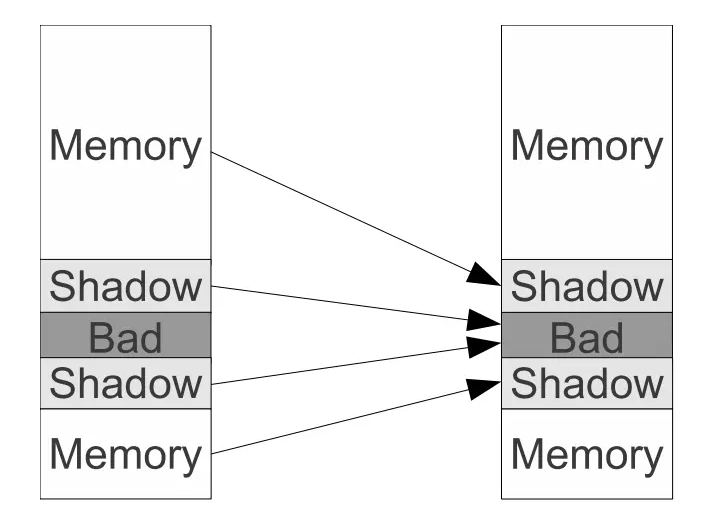

## 一、概述

如何判断进程是否可以访问一片内存区域？一个直观的想法是：给每个字节做个记号（`poison state`），将进程不能够访问的字节标记为 poisoned（中毒），然后在每次访问内存之前先检查他的 `poison state`，如果是 `poisoned`，那么就可以判断发生了非法访问。

ASAN 的核心算法就是这个原理。ASAN 会使用一片专门的内存来保存 `application memory`(应用内存) 每个字节的 `poison state`。这片内存的专业名称为 `shadow memory`，在访问地址之前，首先在 `shadow memory ` 中检查地址是否中毒（`poison state`），如果是中毒的（`poisoned`），那么就可以判定发生了非法访问，ASAN 会及时报错错误。

ASAN 的实现会分为两个大部分：

**一个是检查模块**，在编译时发挥作用。在编译时，将程序中每个内存访问都按照上面描述的方式进行转换；并且在 `stack object` 和 `global object` 周围创建中毒区域 `poisoned redzones` 以检测是否发生溢出行为。

**另一个是运行时库**，在运行时发挥作用。在开启 ASAN 后，编译器会让程序动态链接 ASAN 运行时库。ASAN 的运行时库有如下作用：

- 实现了专用的内存管理器。将 malloc、free 等动态内存管理相关的函数替换为 ASAN 的特殊实现。
- 在 `heap object` 周围创建中毒区域 `poisoned redzones` 以检测是否发生溢出
- 延迟释放堆内存，检测 `use-after-free` 类错误

## 二、影子内存（shadow memory）

ASAN 把进程的内存分为：用户内存（`Application Memory`）、影子内存（`Shadow Memory`）。用户内存和影子内存之间存在一一对应的关系，将用户内存中的一个字节标记为中毒（`poisoned`）是通过将这个字节对应的影子内存中某个字节设置为特殊值来实现的。

### 1. 映射原理

由于 malloc 返回的内存地址至少 8 字节对齐，那么应用程序的堆内存的任何 8 字节对齐的 8 字节序列是处于如下 9 种不同状态之一：前 K（`0 <= k <= 8`）字节是可以访问的（可寻址），其余 `8-K` 字节不可访问。

那么这 9 种状态可以编码到影子内存的单个字节中（一个字节 8 bit，可以编码 9 种状态）。因此，ASAN 将应用程序堆内存的 8 个字节映射到影子内存的 1 个字节中。那么理论上，影子内存将耗费 `1/8` 的内存。

对于给定的用户内存的地址 Addr，其对应的影子内存的地址为：`(Addr >> Scale) + Offset` 。

- Scale 表示缩放比例，一般取值为 3。因为用户内存的连续 8 个字节（`2^3 = 8`）被映射到影子内存的单个字节中了。
- Offset 表示偏移，32 位的 Linux ，`Offset = 0x2000_0000`；64 位的 Linux 下，`Offset = 0x0000_1000_0000_0000`

如下图，上述的映射公式保证了影子内存一定映射到 Bad 区域；用户内存映射到影子内存区域。Bad 区域会通过 `Page Protection` 机制将其标记为不可访问从而保证能够及时发现错误。



#### 2. 影子内存的编码

ASAN 按照如下规则来编码影子内存中每个字节的值：

- 0 表示对应的应用程序内存区域中的所有 8 字节都是可寻址的
- `K (1 <= K <= 7)` 表示前 K 个字节是可寻址的
- 任何负值表示整个 8 字节都不可寻址。ASAN 采用不同的负值来区分不同类型的不可寻址内存，包括：`heap redzones、stack redzones、global redzones、freed memory`

## 三、编译时转换

使用 ASAN，编译器会将程序中的内存访问按照如下方式进行转换：

转换前：

```
*address = ...;  // 内存写操作
variable = *address;  // 内存读操作
```

转换后：

```
byte *shadow_address = MemToShadow(address);
byte shadow_value = *shadow_address;
if (shadow_value) {
  if (SlowPathCheck(shadow_value, address, kAccessSize)) {
    ReportError(address, kAccessSize, kIsWrite);
  }
}

*address = ...;  //  write、store
variable = *address; // read、load

// Check the cases where we access first k bytes of the qword
// and these k bytes are unpoisoned.
bool SlowPathCheck(shadow_value, address, kAccessSize) {
  last_accessed_byte = (address & 7) + kAccessSize - 1;
  return (last_accessed_byte >= shadow_value);
}
```

上述伪代码描述了 ASAN 的检查逻辑，其中 kAccessSize 表示内存访问的大小。

- 当 kAccessSize 的值为 8 时，必须 8 字节全部可寻址才能访问，那么只需要检查影子内存的值是否为 0 即可。
- 当 kAccessSize 的值为 1、2、4 时，表示 `1-byte memory access、2-byte memory access、4-byte memory access`，如果 8 字节全部可寻址是最好的，即使不是全部可寻址也不可以直接报错，还需要将地址的最后 3 位与影子内存进行比较。

在这两种情况下，ASAN 为原始代码中的每个内存访问插入了一个内存读取（读取 `Shadow Memory`）。

## 四、poisoned redzone

### 1. poisoned redzone

中毒区域，本质上是一块内存区域，其中所有字节都被标记为中毒（poisoned）。也就是说，一旦访问中毒区域，就会触发 ASAN 报错。

在 ASAN 中，他用于检测 `out of bound`（越界访问）的内存错误。ASAN 会在对象的周围创建中毒区域（`poisoned redzone`），一旦发生越界，如果触发报错。那么理论上，这个中毒区域越大，通过他检测到的越界内存错误的概率就越大。但是实际上，受内存大小限制，ASAN 会选择一个合适大小的中断区域（`poisoned redzone`）。

### 2. stack 和 global

为了检测 “全局对象” 和 “栈上对象” 的越界访问，ASAN 必须在这些对象周围创建中毒区域（`poisoned redzone`）。

**对于全局对象**，redzone 是在编译时创建，redzone 的地址在应用程序启动时传递给运行时库，运行时库的函数将该 redzone 标记为中毒，并记录地址以供进一步错误报告。

**对于栈对象**，redzone 是在运行时创建并标记为中毒的，目前，使用 32 字节的 redzone。如下转换过程：

转换前：

```
void foo() {
	char a[8];
	...
	return;
}
```

转换后：

```
void foo() {
	char redzone1[32];
	char a[8];
	char redzone2[32];
	char redzone3[32];
	int* shadow_base = MemToShadow(redzone1);
	shadow_base[0] = 0xffff_ffff;
	shadow_base[1] = 0xffff_ff00;
	shadow_base[2] = 0xffff_ffff;
	...
	shadow_base[0] = shadow_base[1] = shadow_base[2] = 0;
	return;
}
```

## 五、运行时库

ASAN 的运行时库就是为了替换 malloc、free 等实现，以发现堆内存的错误。

malloc 函数会在返回的堆内存区域周围分配 `poisoned redzone` 以发现越界访问；

free 函数会将释放的内存区域全部标记为中毒 `poisoned`，并将其置于隔离区（`quarantine`），该区域就不会被再次分配，因此在一段时间内如果再次访问这片已经释放的内存区域，就会触发 ASAN 报错，也就发现了 use-after-free 类型的错误了。

## 六、ASAN 的准确性

理论上 ASAN **不会产生误报，但是会存在漏报**。

### 1. 内存越界 - 未对齐

```
int *a = new int[2]; // 8-aligned
int *u = (int *)((char *)a + 6);
*u = 1; // Access to range [6-9]，
```

目前 ASAN 忽略了这种类型的错误，因为所有提出的解决方案都会减慢通用程序执行路径。

### 2. 内存越界 - 超过范围

越界访问时访问了很远的地方，超过了前后的 redzone 的范围。可以通过扩大 redzone 的方法来解决，但是开销也更大。

```
char *a = new char[100];
char *b = new char[1000];
a[500] = 0; // may end up somewhere in b
```

### 3. use-after-free 错误

频繁分配、释放大量堆内存，导致内存过快的离开了隔离区，因而检测不出 use-after-free 错误

```
char *a = new char[1 << 20]; // 1MB
delete[] a;                  // <<< "free"
char *b = new char[1 << 28]; // 256MB
delete[] b;                  // drains the quarantine queue.
char *c = new char[1 << 20]; // 1MB
a[0] = 0;                    // "use". May land in ’c’.
```