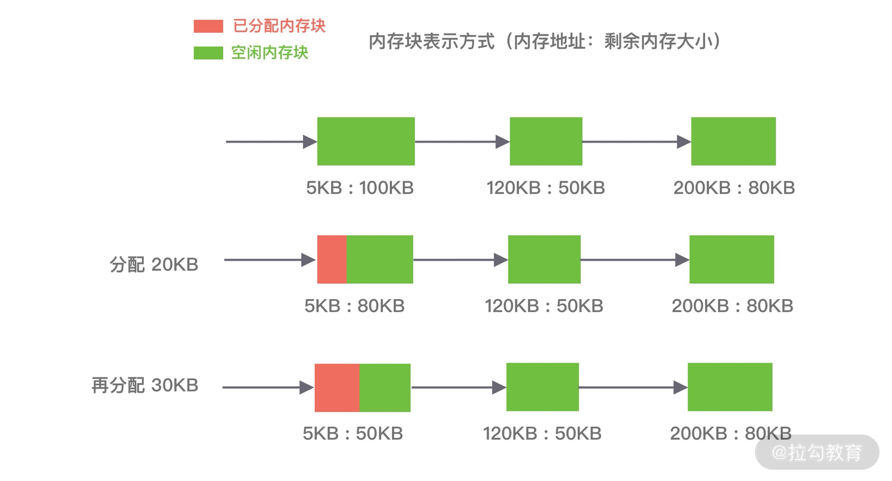
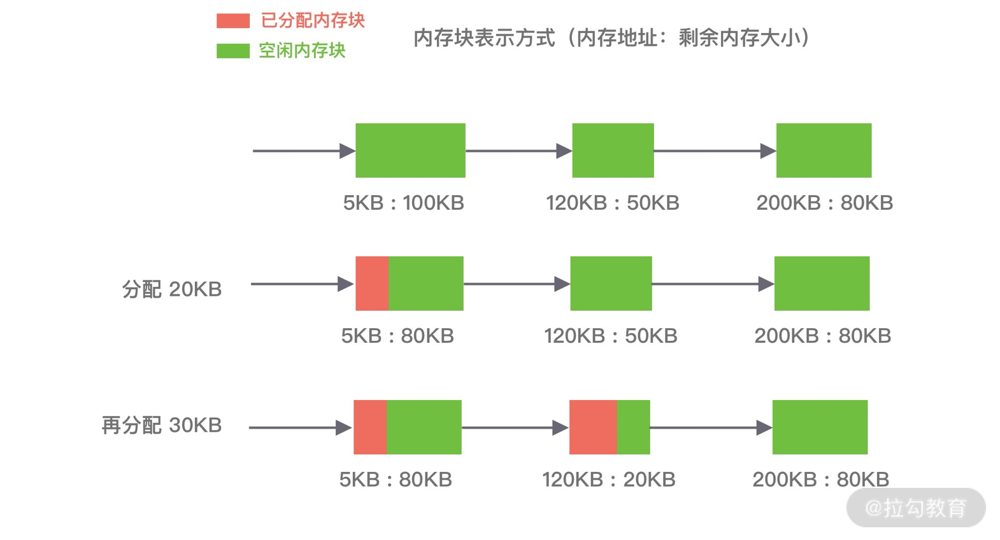
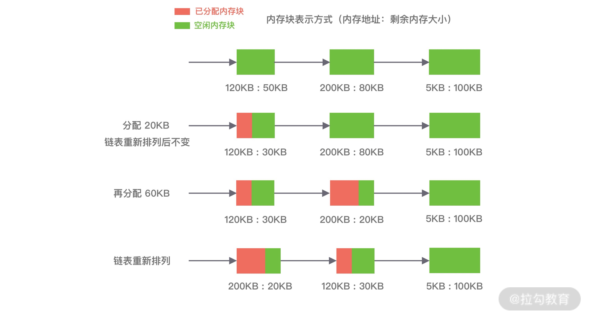
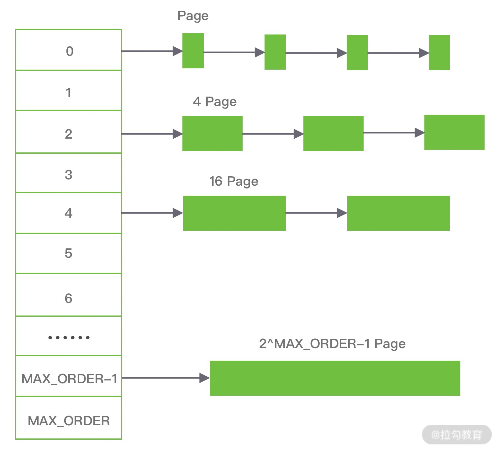
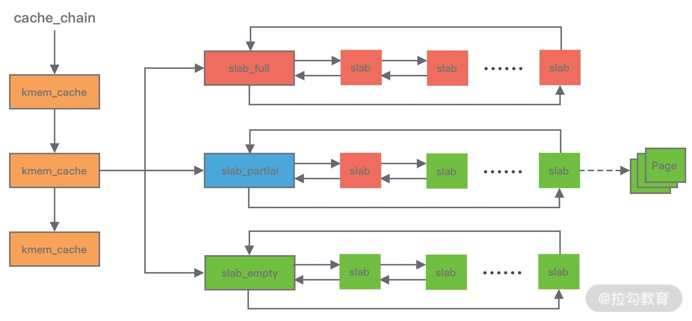

### 内存管理器的核心目标是：

- 高效的内存分配和回收，提升单线程和多线程场景下的性能
- 减少内存碎片，包括内部碎片和外部碎片，提高内存的有效利用率

Linux 中物理内存会被划分成若干个 4K 大小的内存页，物理内存的分配和回收都是基于页完成的，页内产生的内存碎片称为内部碎片，页之间产生的内存碎片称为外部碎片。

- 内部碎片：因为内存是按 页 进行分配的，即使我们只需要很小的内存，操作系统至少也会分配 4K 大小的页，单个页内只有一部分字节被使用，剩余的字节形成了内部碎片。
- 外部碎片：在分配较大内存块时，操作系统通过分配连续的 页 才能满足要求。在程序不断运行的过程中，这些 页 被频繁的回收并分配分配，页 之间就会出现小的空闲内存块，这样就形成了外部碎片。

常见的内存分配器算法：动态内存分配、伙伴算法和 Slab 算法

### 一、动态内存分配

动态内存分配（Dynamic memory allocation）又称为堆内存分配，后面简称 DMA，操作系统根据程序运行过程中的需求即时分配内存，且分配的内存大小就是程序需求的大小。在大部分场景下，只有在程序运行的时候才知道所需要分配的内存大小，如果提前分配可能会分配的大小无法把控，分配太大会浪费空间，分配太小会无法使用。

DMA 是从一整块内存中按需分配，对于分配出的内存会记录元数据，同时还会使用空闲分区链维护空闲内存，便于在内存分配时查找可用的空闲分区，常用的有三种查找策略：

#### 1. 首次适应算法（first fit）

空闲分区链以地址递增的顺序将空闲分区以双向链表的形式连接在一起，从空闲分区链中找到第一个满足分配条件的空闲分区，然后从空闲分区中划分出一块可用内存给请求进程，剩余的空闲分区仍然保留在空闲分区链中。如下图所示，P1 和 P2 的请求可以在内存块 A 中完成分配。该算法每次都从低地址开始查找，造成低地址部分会不断被分配，同时也会产生很多小的空闲分区。

#### 2. 循环首次适应算法（next fit）

该算法是由首次适应算法的变种，循环首次适应算法不再是每次从链表的开始进行查找，而是从上次找到的空闲分区的下⼀个空闲分区开始查找。如下图所示，P1 请求在内存块 A 完成分配，然后再为 P2 分配内存时，是直接继续向下寻找可用分区，最终在 B 内存块中完成分配。该算法相比⾸次适应算法空闲分区的分布更加均匀，而且查找的效率有所提升，但是正因为如此会造成空闲分区链中大的空闲分区会越来越少。

#### 3. 最佳适应算法

空闲分区链以空闲分区大小递增的顺序将空闲分区以双向链表的形式连接在一起，每次从空闲分区链的开头进行查找，这样第一个满足分配条件的空间分区就是最优解。如下图所示，在 A 内存块分配完 P1 请求后，空闲分区链重新按分区大小进行排序，再为 P2 请求查找满足条件的空闲分区。该算法的空间利用率更高，但同样也会留下很多较难利用的小空闲分区，由于每次分配完需要重新排序，所以会有造成性能损耗。

### 二、伙伴算法

伙伴算法是一种非常经典的内存分配算法，它采用了分离适配的设计思想，将物理内存按照 2 的次幂进行划分，内存分配时也是按照 2 的次幂大小进行按需分配，例如 4KB、 8KB、16KB 等。假设我们请求分配的内存大小为 10KB，那么会按照 16KB 分配。

伙伴算法把内存划分为 11 组不同的 2 次幂大小的内存块集合，每组内存块集合都用双向链表连接。链表中每个节点的内存块大小分别为 1、2、4、8、16、32、64、128、256、512 和 1024 个连续的 Page，例如第一组链表的节点为 2^0 个连续 Page，第二组链表的节点为 2^1 个连续 Page，以此类推。

假设我们需要分配 10K 大小的内存块，看下伙伴算法的具体分配过程：

1. 首先需要找到存储 2^4 连续 Page 所对应的链表，即数组下标为 4；
2. 查找 2^4 链表中是否有空闲的内存块，如果有则分配成功；
3. 如果 2^4 链表不存在空闲的内存块，则继续沿数组向上查找，即定位到数组下标为 5 的链表，链表中每个节点存储 2^5 的连续 Page；
4. 如果 2^5 链表中存在空闲的内存块，则取出该内存块并将它分割为 2 个 2^4 大小的内存块，其中一块分配给进程使用，剩余的一块链接到 2^4 链表中。

以上是伙伴算法的分配过程，那么释放内存时候伙伴算法又会发生什么行为呢？当进程使用完内存归还时，需要检查其伙伴块的内存是否释放，所谓伙伴块是不仅大小相同，而且两个块的地址是连续的，其中低地址的内存块起始地址必须为 2 的整数次幂。如果伙伴块是空闲的，那么就会将两个内存块合并成更大的块，然后重复执行上述伙伴块的检查机制。直至伙伴块是非空闲状态，那么就会将该内存块按照实际大小归还到对应的链表中。频繁的合并会造成 CPU 浪费，所以并不是每次释放都会触发合并操作，当链表中的内存块个数小于某个阈值时，并不会触发合并操作。

由此可见，伙伴算法有效地减少了外部碎片，但是有可能会造成非常严重的内部碎片，最严重的情况会带来 50% 的内存碎片。

### 三、Slab 算法

因为伙伴算法都是以 Page 为最小管理单位，在小内存的分配场景，伙伴算法并不适用，如果每次都分配一个 Page 岂不是非常浪费内存，因此 Slab 算法应运而生了。Slab 算法在伙伴算法的基础上，对小内存的场景专门做了优化，采用了内存池的方案，解决内部碎片问题。

Linux 内核使用的就是 Slab 算法，因为内核需要频繁地分配小内存，所以 Slab 算法提供了一种高速缓存机制，使用缓存存储内核对象，当内核需要分配内存时，基本上可以通过缓存中获取。此外 Slab 算法还可以支持通用对象的初始化操作，避免对象重复初始化的开销。

在 Slab 算法中维护着大小不同的 Slab 集合，在最顶层是 cache_chain，cache_chain 中维护着一组 kmem_cache 引用，kmem_cache 负责管理一块固定大小的对象池。通常会提前分配一块内存，然后将这块内存划分为大小相同的 slot，不会对内存块再进行合并，同时使用位图 bitmap 记录每个 slot 的使用情况。

kmem_cache 中包含三个 Slab 链表：**完全分配使用 slab_full**、**部分分配使用 slab_partial** 和 **完全空闲 slabs_empty**，这三个链表负责内存的分配和释放。每个链表中维护的 Slab 都是一个或多个连续 Page，每个 Slab 被分配多个对象进行存储。Slab 算法是基于对象进行内存管理的，它把相同类型的对象分为一类。当分配内存时，从 Slab 链表中划分相应的内存单元；当释放内存时，Slab 算法并不会丢弃已经分配的对象，而是将它保存在缓存中，当下次再为对象分配内存时，直接会使用最近释放的内存块。

单个 Slab 可以在不同的链表之间移动，例如当一个 Slab 被分配完，就会从 slab_partial 移动到 slabs_full，当一个 Slab 中有对象被释放后，就会从 slab_full 再次回到 slab_partial，所有对象都被释放完的话，就会从 slab_partial 移动到 slab_empty。

