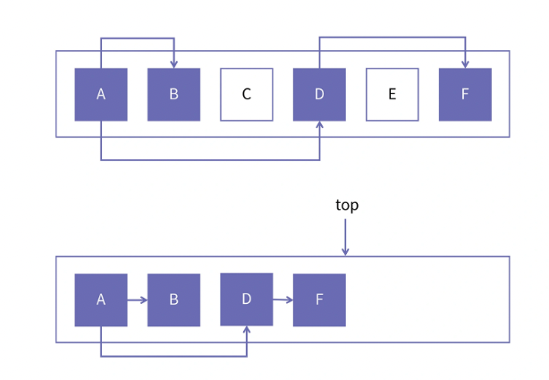
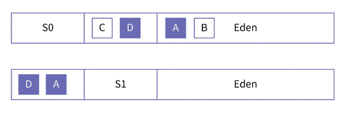

### 一、概念和定义

GC 算法中最重要的两个角色就是 Mutator 和 Collector。

- Mutator：本意是改变者。这个词所表达的是通过程序来改变对象之间的引用关系。因为我们所写的所有 Java 程序，都有可能改变对象的存活和死亡状态，以及他们之间的引用关系，那么这些 Java 程序就是 Mutator。因为 Java 程序运行所在的这些线程，我们也称为业务线程，所以在某些情况下，Mutator 和业务线程这两个术语是可以混用的。
- Collector：用于回收空间中的垃圾，所以叫做收集者。根据不同的 GC 算法，Collector 不仅仅是收集，例如在 Mark-Sweep 中，他还负责标记存活对象、识别垃圾对象。执行 Collector 的线程，一般称为 Collector 线程或者 GC 线程。在某些 GC 算法中，业务线程也有可能帮助做垃圾回收的工作。所以，Mutator 和 Collector 只是一种相对的说法，而不是精确的概念。

“Java堆” 和 “进程堆” 的区别：进程堆是指进程中可以使用 malloc 和 free 进行分配和释放的一块用户态内存区域。而 Java 堆则专指创建普通 Java 对象的地方，这一段内存是由 Java 虚拟机所管理的。因此，进程的堆的概念比 Java 堆的概念要大。进程堆还包括了 Metaspace、JIT 代码段等部分。

### 二、GC 算法的评价标准

不同的 GC 算法，特点不同，适用场景不同。因此我们先来看看 GC 算法的标准：

- 分配的效率：主要考察在创建对象时，申请空闲内存的效率
- 回收的效率：它是指回收垃圾时的效率
- 是否产生内存碎片：在讲解 malloc 的时候，我们讲过内存碎片。碎片是指活跃对象之间存在空闲内存，但这一部分内存又不能被有效利用。比如内存里有两块不连续的 16 字节空闲空间，此时分配器要申请一块 32 字节的空间，虽然总的空闲空间也是 32 字节，但由于它们不连续，不能满足分配器的这次申请。这就是碎片空间
- 空间利用率：这里主要是衡量堆空间是否能被有效利用。比如基于复制的算法无论何时都会保持一部分内存是空闲的，那么它的空间利用率就无法达到 100%，这是由算法本身决定的
- 是否停顿：Collector 在整理内存的时候会存在搬移对象的情况，因为修改指针是一种非常敏感的操作，有时候它会要求 Mutator 停止工作。是否需要 Mutator 停顿，以及停顿时长是多少，是否会影响业务的正常响应等。停顿时长在某些情况下是一个关键性指标
- 实现的复杂度：有些算法虽然看上去很美妙，但因为其实现起来太复杂，代码难以维护，所以无法真正地商用落地。这也会影响到 GC 算法的选择

GC 算法大致上可以分为 “引用计数” 和 “基于可达性分析” 的算法两大类。

### 三、引用计数算法

引用计数法不仅用在垃圾回收场景，还用在 COM 组件编程、Linux 内存管理物理页面、C++智能指针等场景。

一般我们对于垃圾的定义，就是不再被其他对象所引用的对象，因此，我们可以统计一个对象是否被引用。如果他被引用的次数大于 0，那它就是一个活跃对象；如果它被引用的次数为 0，那它就是一个垃圾对象。

优缺点：

- 优点：可以立即回收垃圾。因为每个对象在被引用次数为 0 的时候，是立即就可以知道的，所以一旦一个对象称为垃圾，他将立即被释放
- 优点：没有暂停时间。对象的回收根本不需要另外的 GC 线程专门去做，业务线程自己就可以搞定，所以引用计数算法不需要停顿时间
- 缺点：在每次赋值操作的时候都要做额外的计算。在多线程的情况下，为了正确维护引用计数，需要同步和互斥操作，这往往需要通过锁来实现，这会对多线程程序性能带来比较大的损失
- 缺点：会有链式回收的情况。比如多个对象以链表形式串在一起，他们的引用计数都为 1，当链表头被回收时，整个链表都会回收，这可能会导致一次回收所使用的时间过长。
- 缺点：循环引用。如果 objA 引用了 objB，objB 也引用了 objA，但是除此之外，再没有其他的地方引用这两个对象了，这两个对象的引用计数就都是 1。这种情况下，这两个对象是不能被回收的。这点是比较致命的危险。

python 的垃圾回收机制，使用的引用计数法，并另外引入了三色标记算法，保证了在出现循环引用的情况下，垃圾对象也能被正常回收。

小结：引用计数实现方便，又可以做到对无用的资源进行立即回收，但他无法应用高并发、高吞吐的场景。

### 四、基于 copy 的 GC 算法

在基于 “可达性分析” 的 GC 算法中，最基础的一类算法是基于 copy 的 GC 算法。这个算法的基本思想是把某个空间里的活跃对象复制到其他空间，把原来的空间全部清空，这就相当于是把活跃的对象从一个空间搬到新的空间。因为这种复制具有方向性，所以我们把原空间称为 From 空间，把新的目标空间称为 To 空间。

分配新的对象都是在 From 空间中，所以 From 空间也被称为分配空间（Allocation Space），而 To 空间则相应地被称为幸存者空间（Survivor Sapce）。在 JVM 代码中，这两套命名方式都会出现。

最基础的 copy 算法，就是把程序运行的堆分成大小相同的两半，一半称为 From 空间，一半称为 To 空间。当创建新的对象时，都是在 From 空间里进行内存的分配。等 From 空间满了以后，垃圾回收器就会把活跃对象复制到 To 空间，把原来的 From 空间全部清空。然后再把这两个空间交换，也就是说 To 空间变成下一轮的 From 空间，现在的 From 空间变成 To 空间。

#### 1. 对象分配

在 From 空间中，所有的对象都是从头向后紧密排列的，也就是说对象和对象之间是没有空隙的。而所有的可用内存全部在 From 空间的尾部，也就是上图中 top 指针所指向的位置之后。因此，当我们需要在堆中创建一个新的对象时，只需要将 top 指针向后移动即可。top 指针始终指向最后分配的对象的末尾。每当分配一个新对象时，只需要移动一次指针即可，这种分配效率非常高。

如果按这种方式进行新对象的创建，那么对象与对象之间可以保证没有任何空隙，因为后一个对象是顶着前一个对象分配的，所以，这种方式也叫做碰撞指针。

#### 2. Java 对象的内存局部

基于可达性分析，也称为追踪（`Tracing`） 的方法。要想识别一个对象是不是垃圾，Tracing 首先需要找到“根”引用集合。所谓根引用指的是不在堆中，但指向堆中的引用。根引用包括了栈上的引用、全局变量、JVM 中的 Handler、synchronized 对象等。它的基本思想是把对象之间的引用关系构成一张图，这样我们就可以从根出发，开始对图进行遍历。能够遍历到的对象，是存在被引用的情况的对象，就是活跃对象；不能被访问到的，就是垃圾对象。

现在就需要把对象之间的引用关系抽象成图，这就涉及到了 Java 对象的内存布局，我们来看下 Java 对象在内存中的样子。

在 JVM 中，一个对象由对象头和对象体构成。其中，对象头（Mark Word）在不同运行条件下会有不同的含义，例如对象锁标识、对象年龄、偏向锁指向的线程、对象是否可以被回收等等。而对象体则包含了这个对象的字段（field），包括值字段和引用字段。

每一个 Java 对象都有一个字段记录该对象的类型。我们把描述 Java 类型的结构称为 Klass。Klass 中记录了该类型的每一个字段是值类型，还是对象类型。因此，我们可以根据对象所关联的 Klass 来快速知道，对象体的哪个位置存放的是值字段还是引用字段。

如果是引用字段，并且该引用不是 NULL，那么就说明当前对象引用了其他对象。这样从根引用出发，就可以构建出一张图了。进一步地，我们通过图的遍历算法，就可以找到所有被引用的活对象。很显然，没有遍历到的对象就是垃圾。

通常来说，对图进行遍历有两种算法，分别是深度优先遍历（Depth First Search， DFS）和广度优先遍历（Breadth First Search，BFS）。

深度优先搜索的非递归写法需要占用额外的空间，但有利于提高业务线程运行期的缓存命中率。而广度优先搜索则与其相反，他不利于运行期的缓存命中，但算法的执行效率更高。所以 JDK6 以前的 JVM 使用了广度优先的非递归遍历，而在 JDK8 以后，已经把广度优先算法改为深度优先了，尽管这样做需要额外引用一个独立的栈。

对于基于 copy 的算法要将堆空间分为 From 空间和 To 空间。不管什么时刻，总有一半空间是空闲的。所以他总体的空间利用率并不高。为了提升空间的利用率，Hotspot 对 copy 算法进行了改造，并称为 Scavenge 算法。

#### 3. Scavenge 算法

我们发现，每次回收中能存活下来的对象占总体的比例都比较小。那么我们可以把 To 空间设置得小一点，来提升空间的利用率。

Hotspot 在实现 copy 算法时做了一些改进。它将 From 空间称为 Eden 空间，To 空间在算法实现中则被分成 S0 和 S1 两部分，这样 To 空间的浪费就可以减少了。Java 堆的空间关系如下图所示：

Hotspot 的内存管理器在 Eden 空间中分配新的对象，每次 GC 时，如果将 S0 做为 To 空间，则 S1 与 Eden 合起来成为 From 空间。也就是说 To 空间这个空闲区域就大大减小了，这样可以提升空间的总体利用率。

#### 4. 基于 Copy 的 GC 算法特点

- 对象之间紧密排列，中间没有空隙，也就是没有内存碎片；
- 分配内存的效率非常高。因为每次分配对象都是把指针简单后移即可，操作非常少，所以效率高；
- 回收的效率取决于存活对象的多少，如果存活对象比较多，那么回收的效率就差，如果存活的对象少，则回收效率高。如果对象的生命周期比较短，也就是说存活的时候比较短，那么在进行 GC 的时候，存活的对象就会比较少，这种情况下采用基于 copy 的 GC 算法是比较高效的；
- 内存利用率并不高。因为在任一时刻总有一部分空间是无非被使用的，Scavenge 算法也只能缓解这个问题，而不能彻底解决，这是由算法的设计所决定的；
- copy 算法需要搬移对象，所以需要业务线程暂停。

### 五、Mark-Sweep 算法

基于 copy 的垃圾回收算法，比较适合管理短生命周期对象。Mark-Sweep 算法适合管理长生命周期对象。

为了发挥两种算法的优点，GC 的开发者就基于对象的生命周期引入了分代垃圾回收算法，它将堆空间划分为年轻代和老年代。其中年轻代使用 Copy GC 来管理，老年代则使用 Mark-Sweep 来管理。

Mark-Sweep 算法和 malloc 相似的地方是，都是用一个链表将所有的空闲空间维护起来，这个链表就是空闲链表（freelist）。当内存管理器需要申请内存空间时，便向这个链表查询，如果找到了合适大小的空闲块，就把空闲块分配出去，同时将它从空闲链表中移除。如果空闲块比较大，就把空闲块进行分割，一部分用于分配，剩余的部分重新加到空闲链表中。

Hotspot 虚拟机的 Mark-Sweep 算法与 malloc 实现的不同之处在于：在 Hotspot 里，当一个空闲块分配给一个新对象后，如果剩余空间大于 24 字节，便将剩余的空间加入到空闲链表，当剩余空间不足 24 字节的话，就做为碎片空间填充一些无效值。而 malloc 则会分成多个空闲链表进行管理。

Mark-Sweep 算法由 Mark 和 Sweep 两个阶段组成。在 Mark 阶段，垃圾回收器遍历活跃对象，将它们标记为存活。在 Sweep 阶段，回收器遍历整个堆，然后将未被标记的区域回收。

Mark 阶段的核心任务就是从根引用触发，根据引用关系进行遍历，所有可以遍历到的对象就是活跃对象。我们需要一边遍历，一边将活跃的对象记录下来。当遍历完成以后，我们就找到了所有的活跃对象。遍历的方法可以采用深度优先和广度优先两种策略。

对活跃对象的标记一般有两种办法：一种是在每个对象前面增加一个机器字，采用其中的某一位作为“标记位”。如果设置了此位，就表示这个对象是活跃对象，如果未设置此位，则表示这个对象是要回收的对象。另一种方法是采用标记位图，将每一个机器字映射成位图中的一个比特。在真正的实现中，往往采用两个位图，其中一个位图标记活跃对象的起始位置，另一个标记活跃对象的结束位置。

Sweep 阶段要做的事情就是把非活跃对象，也就是垃圾对象的空间回收起来，重新将它们放回空闲链表中。具体做法就是按照空间顺序，从头至尾扫描整个空间里的所有对象，如果一个对象没有被标记，这个对象所占用内存就会被添加回空闲链表。这个阶段的操作是比较简单的，只涉及了链表的添加操作，而且它和 malloc 的回收过程是一致的。

**小结：**Mark-Sweep 算法回收的是垃圾对象，如果垃圾对象比较少，回收阶段所做的事情就比较少。所以它适合于存活对象多，垃圾对象少的情况。而基于 copy 的垃圾回收算法 Scavenge，搬移的是活跃对象，所以它更适合存活对象少，垃圾对象多的情况。

因此我们可以把这两种算法的优点进行结合，用不同的算法管理不同类型的对象。

### 六、分代垃圾回收算法

对于存活时间比较短的对象，我们可以用 Scavenge 算法回收；对于存活时间比较长的对象，就可以使用 Mark-Sweep 算法。如何区分哪些存活时间长的对象呢？我们可以在对象的头部记录一个名为 age 的变量。对象头部就是 Mark word。age 变量不需要占据整个 Mark word 空间，只需要其中的几个比特就可以了。Scavenge GC 每做一次，就是把存活的对象往 Survivor 空间中复制一次，我们就相应把这个对象的 age 加一，以此来代表它的生命周期比较长。

当对象的 age 值到达一个上限以后，就可以将它搬移到由 Mark-Sweep 算法所管理的空间了。与“年轻代”相对应，我们称这个空间为“老年代”。而对象从年轻代到老年代的搬移过程，就称为晋升 (Promotion)。

我们再来研究下 Hotspot 中分代式垃圾回收的典型算法：并发标记清除算法（`Concurrent Mark Sweep, CMS`）

### 七、并发标记算法

在并发标记算法中，当垃圾回收器在标记活跃对象的时候，我们肯定不希望业务线程同时还会修改对象之间的引用关系。所以，早期的 Mark-Sweep 算法会让业务线程都停下来，以便于垃圾回收器可以对活跃对象进行标记，这就是 GC 停顿产生的原因。由于业务线程停顿的时候，整个 Java 进程都不能再响应请求，人们把这种情况形象地称为“世界停止”（Stop The World，STW）。

为了减少 GC 停顿，我们可以在做 GC Mark 的时候，让业务线程不要停下来。这意味着 GC Mark 和业务线程在同时工作，这就是并发（Concurrent）的 GC 算法。我们知道，图的遍历过程，就是不断地对结点进行搜索和扩展的过程。以标记算法来说，如果采用广度优先遍历，那么搜索就是对结点进行标记，扩展就是将结点所引用的其他对象都添加到辅助队列中。根据这个定义，我们可以将结点分为三类：

- 白色：还未搜索的对象
- 灰色：已经搜索，但尚未扩展的对象
- 黑色：已经搜索，也完成扩展的对象

在 Hotspot 中，CMS 是由多个阶段组成的，主要包括初始标记、并发标记、重标记、并发清除，以及最终清理。其中：

- 初始标记阶段，标记老年代中的根对象，因为根对象中包含从栈上出发的引用等比较敏感的数据，并发控制难以实现，所以这一阶段一般都采用 Stop The World 的做法。这里一般不遍历年轻代对象，也就是不关注从年轻代指向老年代的引用。
- 并发标记阶段，这一阶段就是在上面内容中讲到的三色标记算法中做了一些改动，我们会在后面的内容中详细分析这一阶段的实现。
- 重标记阶段，这一阶段会把年轻代对象也进行一次遍历，找出年轻代对老年代的引用，并且为并发标记阶段扫尾。
- 并发清除阶段，这一阶段会把垃圾对象归还给 freelist，只要注意好 freelist 的并发访问，实现垃圾回收线程和业务线程并发执行是简单的。
- 最终清理阶段，清理垃圾回收所使用的资源。为下一次 GC 执行做准备。

>Reference：https://time.geekbang.org/column/article/468157?screen=full

