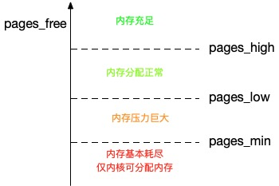
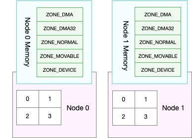

## 一、系统内存资源回收方式

### 1. 系统的内存资源紧张时，系统可能会进行 内存回收、OOM杀死进程

- OOM（Out Of Memory）系统杀死占用大量内存的进程，释放这些内存，再分配给其他更需要的进程
- 内存回收：系统释放掉可以回收的内存。
    - 比如缓存和缓冲区属于可回收内存。他们在内存管理中，通常被叫做文件页。大部分文件页，都可以直接回收，以后有需要时，再从磁盘重新读取就可以了。而那些被应用程序修改过，并且暂时还没写入磁盘的数据（也就是脏页），就得先写入磁盘，然后才能进行内存释放。
    - 比如内存映射的文件映射页，也是一种常见的文件页。它也可以被释放掉，下次再访问的时候，从文件重新读取
    - 应用程序动态分配的堆内存，也称为 匿名页，这类内存不能直接释放回收。但是如果这些内存在分配后很少被访问，系统可能会把他们暂时存在磁盘中，释放内存给其他更需要的进程。这也是 Linux 的 Swap 机制。Swap 会把这些不常访问的内存先写到磁盘中，然后释放这些内存，给其他更需要的进程使用。再次访问这些内存时，重新从磁盘读入内存就可以了。

### 2. 脏页可以通过两种方式写入磁盘：

- 可以在应用程序中，通过系统调用 fsync，把脏页同步到磁盘中
- 可以交给系统，由内核线程 pdflush 负责这些脏页的刷新

### 3. Linux 在什么时候需要回收内存呢？

- 有新的大块内存分配请求，但剩余内存不足。这个时候系统就需要回收一部分内存。进而尽可能满足新内存请求。这个过程通常称为**直接内存回收**
- 专门的内核线程 **kswapd0** 定期回收内存

### 4. Linux 如何衡量内存是不是紧张呢？

- 为了衡量内存的使用情况。**kswapd0** 定义了三个内存阈值（watermark，也称为水位），分别是 页最小阈值（pages_min）、页低阈值（pages_low）和页高阈值（pages_high）。其余内存使用 pages_free 表示

    

- **kswapd0** 定期扫描内存的使用情况，并根据剩余内存落在这个三个阈值的空间位置，进行内存的回收操作

    - 剩余内存小于页最小阈值，说明进程可用内存都耗尽了，只有内核才可以分配内存
    - 剩余内存落在页最小阈值和页低阈值中间，说明内存压力比较大，剩余内存不多了。这时 kswapd0 会执行内存回收，直到剩余内存大于高阈值为止
    - 剩余内存落在页低阈值和页高阈值中间，说明内存有一定压力，但还可以满足新内存请求
    - 剩余内存大于页高阈值，说明剩余内存比较多，没有内存压力

- 一旦剩余内存小于页低阈值，就会触发内存的回收。这个页低阈值，其实可以通过内核选项 `/proc/sys/vm/min_free_kbytes` 来间接设置。min_free_kbytes 设置了页最小阈值，而其他两个阈值，都是根据页最小阈值计算生成的

    ```
    pages_low = pages_min*5/4
    pages_high = pages_min*3/2
    ```

## 二、Swap 原理

把一块磁盘空间或者一个本地文件当做内存来使用，包括换出、换入两个过程

- 换出：把进程暂时不用的内存数据存储到磁盘中，并释放这些数据占用的内存
- 换入：在进程再次访问这些内存的时候，把他们从磁盘读到内存中来

场景：

- 即使内存不足时，有些应用程序也并不想被 OOM 杀死，而是希望能缓一段时间，等待人工介入。或者系统自动释放其他进程的内存，再分配给他
- 笔记本电脑的休眠和快速开机功能，也是基于 Swap 机制，休眠时，把系统的内存存入磁盘，这样等到再次开机时，只要从磁盘中加载内存即可。这样就省去了很多应用程序的初始化功能，加快开机速度

### 1. NUMA 与 Swap

有时会发现，系统内存还多的情况下，Swap 升高。和处理器的 NUMA（Non-Uniform Memory Access）架构导致的。

在 NUMA 架构下，多个处理器被划分到不同 Node 上，且每个 Node 都拥有自己的本地内存空间。而同一个 Node 内部的内存空间，实际上又可以进一步划分为不同的内存域（Zone），比如直接内存访问区（DMA）、普通内存区（NORMAL）、伪内存区（MOVABLE）等



使用 `numactl` 命令来查看处理器在 Node 的分布情况，以及每个 Node 的内存使用情况。

```shell
➜  [/tmp] numactl --hardware
available: 1 nodes (0)
node 0 cpus: 0 1 2 3 4 5 6 7
node 0 size: 16383 MB
node 0 free: 7255 MB
...
```

如上，显示我的系统只有一个 Node，也就是 Node 0。编号 0 - 7 的 CPU 都位于 Node 0 上。另外，Node 0 的内存大小为 16383 MB，剩余内存为 7255 MB。

三个内存阈值（页最小阈值、页低阈值和页高阈值），都可以通过内存域在 proc 文件系统中的接口 `/proc/zoneinfo` 来查看。

```shell
$ cat /proc/zoneinfo
...
Node 0, zone   Normal
 pages free     227894
       min      14896
       low      18620
       high     22344
...
     nr_free_pages 227894
     nr_zone_inactive_anon 11082
     nr_zone_active_anon 14024
     nr_zone_inactive_file 539024
     nr_zone_active_file 923986
...
```

- pages 处的 min、low、high，就是三个内存阈值，而 free 是剩余内存页数，它跟后面的 nr_free_pages 相同
- nr_zone_active_anon 和 nr_zone_inactive_anon，分别是活跃和非活跃的匿名页数
- nr_zone_active_file 和 nr_zone_inactive_file，分别是活跃和非活跃的文件页数

当然，某个 Node 内存不足时，系统可以从其他 Node 寻找空闲内存，也可以从本地内存中回收内存。具体选哪种模式，你可以通过 /proc/sys/vm/zone_reclaim_mode 来调整。它支持以下几个选项

- 默认的 0 ，也就是刚刚提到的模式，表示既可以从其他 Node 寻找空闲内存，也可以从本地回收内存
- 1、2、4 都表示只回收本地内存，2 表示可以回写脏数据回收内存，4 表示可以用 Swap 方式回收内存

### 2. swappiness

内存回收机制，这些回收的内存既包括 文件页，又包括 匿名页

- 对文件页的回收，当然就是直接回收缓存，或者把脏页写回磁盘后再回收
- 而对匿名页的回收，其实就是通过 Swap 机制，把它们写入磁盘后再释放内存

既然有两种不同的内存回收机制，那么在实际回收内存时，Linux 会提供一个 `/proc/sys/vm/swappiness` 选项，用来调整使用 swap 的积极程度。

- swappiness 的范围是 0 -100，数值越大，越积极使用 swap，也就是更倾向于回收匿名页；数值越小，越消极使用 Swap，也就是更倾向于回收文件页
- swappiness 的值是调整 Swap 积极程度的权重，即使设置为 0，当 剩余内存+文件页小于页高阈值 时，还是会发生 Swap

### 3. 一些组件要求关闭 Swap

比如 k8s、hadoop集群、ES 之类组件都要关闭 Swap ，因为：

- 性能问题，开启 Swap 会严重影响性能（包括内存和 IO）
- 管理问题，开启 Swap 后通过 cgroup 设置的内存上限就会失效

如何通过降低 Swap 的使用，提高系统的整体性能，以下为几点常见的降低方法：

- 禁止 Swap，现在服务器的内存足够大，所以除非有必要，禁用 Swap 就可以了。随着云计算的普及，大部分云平台中的虚拟机都默认禁止 Swap
- 如果实在需要用到 Swap，可以尝试降低 swappiness 的值，减少内存回收时 Swap 的使用倾向
- 响应延迟敏感的应用，如果它们可能在开启 Swap 的服务器中运行，你还可以用库函数 mlock() 或者 mlockall() 锁定内存，阻止它们的内存换出

## 三、案例场景

### 1. 开启 Swap 

Linux 本身支持两种类型的 Swap，即 Swap 分区和 Swap 文件。以 Swap 文件为例，如下配置 Swap 文件的大小为 8GB

```shell
# 创建 Swap 文件
➜  [/tmp] fallocate -l 8G /mnt/swapfile 
# 修改权限只有根用户可以访问
➜  [/tmp] chmod 600 /mnt/swapfile 
➜  [/tmp] ll /mnt/swapfile 
-rw------- 1 root user_00 8589934592 Jan 13 15:56 /mnt/swapfile
# 配置 Swap 文件
➜  [/tmp] mkswap /mnt/swapfile 
mkswap: /mnt/swapfile: warning: wiping old swap signature.
Setting up swapspace version 1, size = 8388604 KiB
no label, UUID=c0d61a19-fe26-46b2-b167-3d4a98802a35
# 开启 Swap 文件
➜  [/tmp] swapon /mnt/swapfile 
# 确认 Swap 配置成功
➜  [/tmp] free
              total        used        free      shared  buff/cache   available
Mem:       16092188     4520284     7061160     2443016     4510744     9068784
Swap:       8388604           0     8388604
```

关闭 Swap： `swapoff -a`

实际上，关闭 Swap 后再重新打开，也是一种常用的 Swap 空间清理方法：`swapoff -a && swapon -a` 这条命令有风险，使用了 Swap 说明内存有压力，那么强制换入有可能导致内存问题

### 2. 实操

TODO


