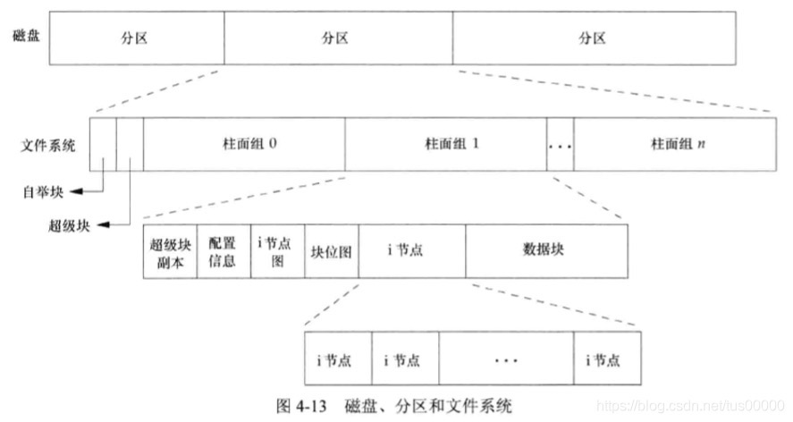
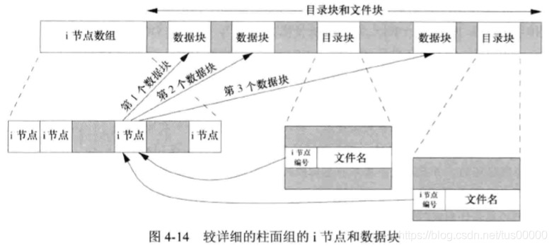
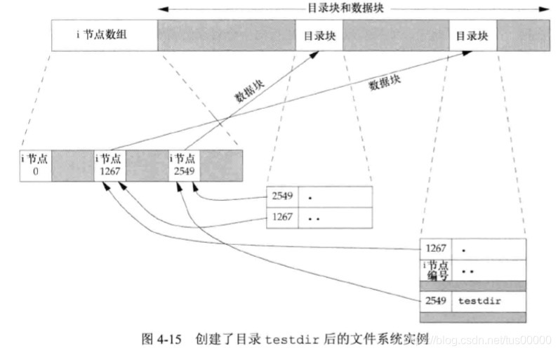
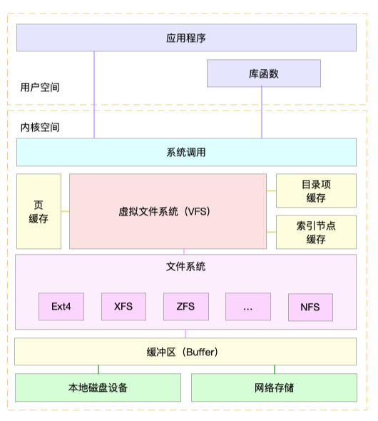

## 文件系统

### 一、文件系统

Linux 中一切皆文件，普通的文件、目录、块设备、套接字、管道等都是文件，通过统一的文件系统来管理。Linux 文件系统为每个文件都分配两个数据结构，索引节点（index node）和目录项（directory entry）。他们主要用来记录文件的元信息和目录结构。

- 索引节点（inode）。用来记录文件的元数据，比如 inode 编号、文件大小、访问权限、修改日期、数据的位置等。索引节点和文件一一对应，它跟文件内容一样，都会被持久化存储到磁盘中。所以索引节点同样占用磁盘空间
- 目录项（dentry）。用来记录文件的名字、索引节点指针以及与其他目录项的关联关系。多个关联的目录项，就构成了文件系统的目录结构。不过，不同于索引节点，目录项是由内核维护的一个内存数据结构，所以通常也被叫做目录项缓存

索引节点是每个文件的唯一标志，而目录项维护的正是文件系统的树状结构。目录项和索引节点的关系是多对一。通过硬链接为文件创建的别名，会对应不同的目录项，不过这些目录项都有相同的 inode 编号，指向相同的 inode。

磁盘在执行文件系统格式化时，会被分成四个存储区域：

- 自举块、超级块：存储整个文件系统的状态
- 索引节点区：用来存储索引节点
- 数据块区：用来存储文件数据

我们把一个磁盘分成一个或多个分区。每个分区可以包含一个文件系统。i 节点是固定长度的记录项，它包含有关文件的大部分信息



如下是一个柱面组的 i 节点和数据块部分



- 硬链接，有两个目录项指向同一个 i 节点。每个 i 节点中都有一个链接计数，其值是指向该 i 节点的目录项数。只有当链接计数减少至 0 时，才可以删除该文件（也就是可以释放该文件占用的数据块）。在 stat 结构中，链接计数包含在 st_nlink 成员中，其基本系统数据类型是 nlink_t，称为硬链接。
- 符号链接（软链接）。符号链接文件的实际内容（在数据块中）包含了该符号链接所指向的文件的名字，比如 ` lib -> /usr/lib`，目录项中名为 lib 的文件保存了 7 字节的数据 `/usr/lib`。且该 i 节点中的文件类型是 S_IFLINK，系统就是知道这是一个符号链接
- i 节点包含了文件有关的所有信息：文件类型、文件访问权限位、文件长度和指向文件数据块的指针等。只有两项重要数据存放在目录项中：文件名和 i 节点编号。
- 因为目录项中的 i 节点编号指向同一文件系统中的相应 i 节点，一个目录项不能指向另一个文件系统的 i 节点。
- 当在不更新文件系统的情况下为一个文件重命名时，该文件的实际内容并未移动，只需要构造一个指向现有 i 节点的新目录项，并删除老的目录项。链接计数不会改变。

#### 创建一个目录场景

执行 `mkdir testdir` 命令之后



- 编号为 2549 的 i 节点，其类型字段表示他是一个目录，链接计数为 2
- 任何一个叶目录（不包含任何其他目录的目录）的链接计数总是 2，数值 2 来自于命名该目录（testdir）的目录项以及在该目录中的 `.` 项
- 编号为 1267 的 i 节点，其类型字段表示他是一个目录，链接计数大于或者等于 3，因为一个是命名它的目录项（未画出来），第二个是该目录中的 `.` 项，第三个是它的子目录中的 `..` 项
- 在父目录中的每一个字目录都使该父目录的链接计数增加 1

### 二、虚拟文件系统

为了支持各种不同的文件系统，Linux 内核在用户进程和文件系统的中间，引入了抽象层，也就是虚拟文件系统 VFS（Virtual File System）。VFS 定义了一组所有文件系统都支持的数据结构和标准接口。这样，用户进程和内核中的其他子系统，只需要跟 VFS 提供的统一接口进行交互就可以了，而不需要再关心底层各种文件系统的实现细节。



在 VFS 的下方，Linux 支持各种各样的文件系统。如 Ext4、XFS、NFS 等等。按照存储位置的不同，这些文件系统可以分为三类

- 第一类是基于磁盘的文件系统，也就是把数据直接存储在计算机本地挂载的磁盘中。常见的 Ext4、XFS、OverlayFS 等，都是这类文件系统。
- 第二类是基于内存的文件系统，也就是我们常说的虚拟文件系统。这类文件系统，不需要任何磁盘分配存储空间，但会占用内存。我们经常用到的 /proc 文件系统，其实就是一种最常见的虚拟文件系统。此外，/sys 文件系统也属于这一类，主要向用户空间导出层次化的内核对象
- 第三类是网络文件系统，也就是用来访问其他计算机数据的文件系统，比如 NFS、SMB、iSCSI 等。

这些文件系统，要先挂载到 VFS 目录树中的某个子目录（称为挂载点），然后才能访问其中的文件。拿第一类，也就是基于磁盘的文件系统为例，在安装系统时，要先挂载一个根目录（/），在根目录下再把其他文件系统（比如其他的磁盘分区、/proc 文件系统、/sys 文件系统、NFS 等）挂载进来。

### 三、观察文件系统性能

#### 1. 容量

- 查看文件系统的磁盘空间使用情况

```shell
➜  [/usr/local/bin] df -h
Filesystem      Size  Used Avail Use% Mounted on
/dev/vda1        99G   81G   14G  86% /
devtmpfs        7.7G     0  7.7G   0% /dev
tmpfs           7.7G     0  7.7G   0% /dev/shm
```

- 索引节点也占用磁盘空间，查看索引节点的使用情况

```shell
➜  [/usr/local/bin] df -i
Filesystem       Inodes   IUsed    IFree IUse% Mounted on
/dev/vda1       6553600 1295152  5258448   20% /
devtmpfs        2009249    1452  2007797    1% /dev
tmpfs           2011523       9  2011514    1% /dev/shm
```

当遇到空间不足时，使用 df 查看磁盘空间后，却发现剩余空间还有很多。这是我们可以查看索引节点的使用情况，索引节点的容量（也就是 inode 个数）是在格式化磁盘时设定好的，一般由格式化工具自动生成。当你发现索引节点空间不足，但磁盘空间充足时，很可能就是过多小文件导致的。

#### 2. 缓存

free 输出的 Cache，是页缓存和可回收 Slab 缓存的和，你可以从 /proc/meminfo ，直接得到它们的大小

```shell
➜  [/usr/local/bin] cat /proc/meminfo | grep -E 'SReclaimable|Cached'
Cached:          1932632 kB
SwapCached:            0 kB
SReclaimable:     324120 kB
```

内核使用 Slab 机制，管理目录项和索引节点的缓存。`/proc/meminfo` 只给出了 Slab 的整体大小，具体到每一种 Slab 缓存，还要查看 `/proc/slabinfo` 这个文件。

```shell
➜  [/usr/local/bin] cat /proc/slabinfo| grep -E '^#|dentry|inode'
# name            <active_objs> <num_objs> <objsize> <objperslab> <pagesperslab> : tunables <limit> <batchcount> <sharedfactor> : slabdata <active_slabs> <num_slabs> <sharedavail>
rpc_inode_cache       25     25    640   25    4 : tunables    0    0    0 : slabdata      1      1      0
mqueue_inode_cache    288    288    896   36    8 : tunables    0    0    0 : slabdata      8      8      0
udf_inode_cache        0      0    704   23    4 : tunables    0    0    0 : slabdata      0      0      0
isofs_inode_cache      0      0    608   26    4 : tunables    0    0    0 : slabdata      0      0      0
fat_inode_cache        0      0    688   23    4 : tunables    0    0    0 : slabdata      0      0      0
hugetlbfs_inode_cache     28     28    576   28    4 : tunables    0    0    0 : slabdata      1      1      0
jbd2_inode          7298  14110     48   85    1 : tunables    0    0    0 : slabdata    166    166      0
ext4_inode_cache  202624 202624    984   33    8 : tunables    0    0    0 : slabdata   6141   6141      0
ext2_inode_cache       0      0    728   22    4 : tunables    0    0    0 : slabdata      0      0      0
ext3_inode_cache       0      0    784   20    4 : tunables    0    0    0 : slabdata      0      0      0
inotify_inode_mark   5474   5474    120   34    1 : tunables    0    0    0 : slabdata    161    161      0
sock_inode_cache    1500   1500    640   25    4 : tunables    0    0    0 : slabdata     60     60      0
shmem_inode_cache  23400  23400    648   25    4 : tunables    0    0    0 : slabdata    936    936      0
proc_inode_cache    6618   7325    640   25    4 : tunables    0    0    0 : slabdata    293    293      0
inode_cache        16433  16907    560   29    4 : tunables    0    0    0 : slabdata    583    583      0
dentry            315911 316760    200   20    1 : tunables    0    0    0 : slabdata  15838  15838      0
```

- dentry 行表示目录项缓存，inode_cache 行表示 VFS 索引节点缓存，其余的则是各种文件系统的索引节点缓存

使用 slabtop 找到占用内存最多的缓存类型

```shell
# 按下 c 按照缓存大小排序，按下 a 按照活跃对象数排序
[/usr/local/bin] slabtop

Active / Total Objects (% used)    : 1364167 / 1441535 (94.6%)
 Active / Total Slabs (% used)      : 42114 / 42114 (100.0%)
 Active / Total Caches (% used)     : 132 / 205 (64.4%)
 Active / Total Size (% used)       : 389699.93K / 400512.44K (97.3%)
 Minimum / Average / Maximum Object : 0.01K / 0.28K / 8.00K

  OBJS ACTIVE  USE OBJ SIZE  SLABS OBJ/SLAB CACHE SIZE NAME                   
202624 202624 100%    0.96K   6141       33    196512K ext4_inode_cache
316940 316464  99%    0.20K  15847       20     63388K dentry
269997 266468  98%    0.10K   6923       39     27692K buffer_head
 23400  23400 100%    0.63K    936       25     14976K shmem_inode_cache
 18088  17703  97%    0.55K    646       28     10336K radix_tree_node
 16907  16436  97%    0.55K    583       29      9328K inode_cache
  1078    970  89%    6.45K    283        4      9056K task_struct
203286 203286 100%    0.04K   1993      102      7972K ext4_extent_status
```

如上，可以看到，ext4_inode_cache 和 dentry 占用了最多的 Slab 缓存，占用空间 259M （196512K + 63388K）

比如执行 find 命令时，就会增加 `inode cache & dentry & proc inode cache` 这些缓存会升高