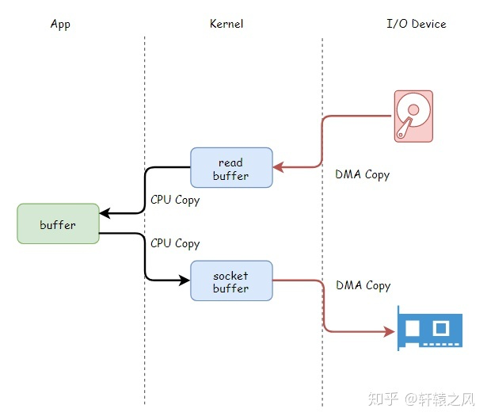
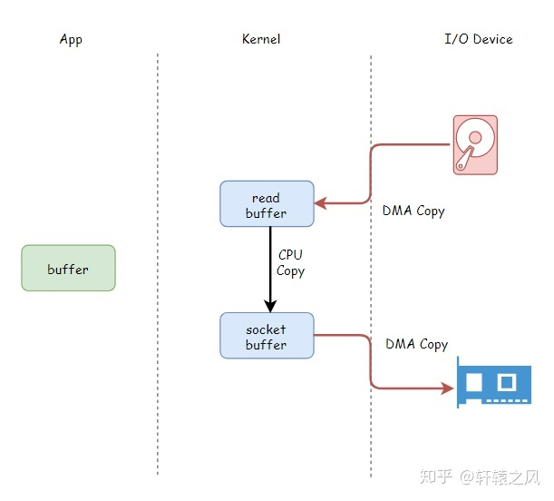
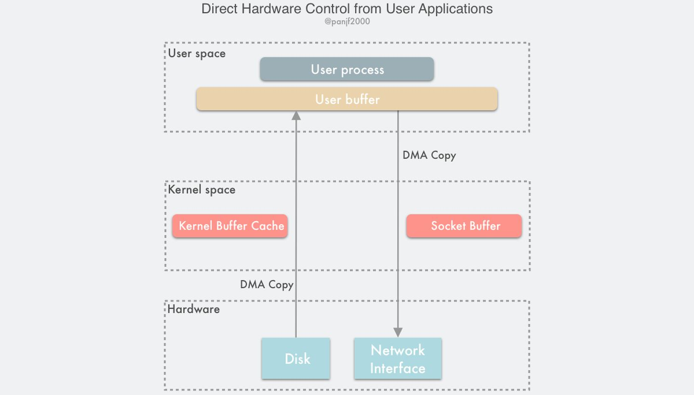

## DMA 和零拷贝技术

### 一、数据的四次拷贝与四次上下文切换

当数据从磁盘中读出来，然后通过网络发送。中间会调用 `File.read(file, buf, len)` 和 `Socket.send(socket, buf, len)` 这两个系统调用。

例如消息队列 kafka 就会从磁盘中读取一批消息后原封不动的写入网卡进行发送。

在没有任何优化技术使用背景下，操作系统会为此进行 4 次数据拷贝，以及 4 次上下文切换

**四次拷贝**：

- 物理设备和内存之间的拷贝
    - CPU 负责将数据从磁盘搬运到内核空间的 page cache 中
    - CPU 负责将数据从内核空间的 socket 缓冲区搬运到网卡中
- 内存内部拷贝
    - CPU 负责将数据从内核空间的 page cache 搬运到用户空间的缓冲区
    - CPU 负责将数据从用户空间的缓冲区搬运到内核空间的 socket 缓冲区中

**四次上下文切换**：

- read 系统调用时，和调用完毕；从用户态切换到内核态和从内核态切换到用户态
- write 系统调用时，和调用完毕；从用户态切换到内核态和从内核态切换回用户态

问题所在：

- CPU 全程负责内存内部的数据拷贝还可以接受，因为内存的数据拷贝效率还行（不过比CPU还要慢很多），但是如果要 CPU 全程负责内存与磁盘、内存与网卡的数据拷贝，效率将非常低下，因为磁盘、网卡的 IO 速度远远小于内存
- 四次拷贝太多，四次上下文切换也太频繁了

### 二、DMA 参与下的数据四次拷贝

DMA 技术就是我们在主板上放一块独立的芯片。在进行内存和 I/O 设备的数据传输的时候，我们不再通过 CPU 来控制数据传输，而直接通过 DMA 控制器（DMA Controller，简称 DMAC）。这块芯片，我们可以认为它其实就是一个协同处理器（Co-Processor）。也就是说，DMAC 是在协助CPU，完成对应的数据传输工作。在 DMAC 控制数据传输的过程中，DMAC 还是被 CPU 控制，只是数据的拷贝行为不再由 CPU 来完成。

比如：我们用千兆网卡或者硬盘传输大量数据的时候，如果都用 CPU 来搬运的话，肯定忙不过来，所以可以选择DMAC；如果当数据传输很慢的时候，DMAC可以等数据到齐了，再发送信号，给到 CPU 去处理，而不是让 CPU 在哪里忙等待

也就是说：

- 原本，计算机所有组件之间的数据拷贝必须经过 CPU

- 现在，DMAC 代替了CPU 负责内存与磁盘、内存与网卡之间的数据搬运，CPU 作为DMAC 的控制者

- 但是 DMAC 具有局限性，DMAC 仅仅能用于设备间交换数据时进行数据拷贝，但是设备内部的数据拷贝还需要 CPU 来亲力亲为。例如，CPU 需要负责内核空间与用户空间之间的数据拷贝（内存内部的拷贝）。如图，read buffer 就是 page cache；socket buffer 就是 socket 缓冲区

    

### 三、零拷贝技术

零拷贝指的是计算机执行操作时，CPU 不需要先将数据从某处内存复制到另一个特定区域。零拷贝的特点是 CPU 不全程负责内存中的数据写入其他组件，CPU仅仅起到管理的作用。但是，零拷贝不是不进行拷贝，而是 CPU 不再全程负责数据拷贝时的搬运工作。如果数据本身不在内存中，那么必须先通过某种方式拷贝到内存中（这个过程 CPU 可以仅仅负责管理，DMAC 来负责具体数据拷贝），因为数据只有在内存中，才能被转移，才能被CPU直接读取计算。

零拷贝计数的具体实现方式有很多：

- sendfile
- mmap
- Direct IO
- splice

这些实现方式有一些相同点：

- 使用 page cache 的零拷贝：
    - sendfile：一次性代替 read/write 系统，通过使用 DMA 计数以及传递文件描述符，实现了零拷贝
    - mmap：仅代替 read 系统调用，将内核空间地址映射为用户空间地址，write 操作直接作用于内核空间。通过 DMA 技术以及地址映射技术，用户空间与内核空间无须数据拷贝，实现了零拷贝
- 不使用 page cache 的 Direct IO：读写操作直接在磁盘上进行，不使用 page cache 机制，通常结合用户空间的用户缓存使用。通过 DMA 技术直接与磁盘/网卡进行数据交互，实现零拷贝

#### 3.1 sendfile 原理

sendfile 的应用场景是：用户从磁盘读取一些文件数据后不需要经过任何计算与处理就通过网络传输出去，比如消息队列

在传统 IO 下，从磁盘读数据后通过网络发送数据需要四次 CPU 全权负责的拷贝与四次上下文切换。sendfile 使用了 DMA 技术和传递文件描述符代替数据拷贝技术来进行零拷贝

- 利用 DMA 技术，将四次 CPU 全程负责的拷贝与四次上下文切换减少到两次。DMA 负责磁盘到内核空间中的 page cache（read buffer）的数据拷贝以及从内核空间中的 socket buffer 到网卡的数据拷贝

    

- 传递文件描述符可以代替数据拷贝。这是因为 page cache 以及 socket buffer 都在内核空间中；数据在传输中没有被更新。
    注意：只有网卡支持 SG-DMA（The Scatter-Gather Direct Memory Access）技术才可以通过传递文件描述符的方式避免内核空间内的一次 CPU 拷贝。这意味着此优化取决于 Linux 系统的物理网卡是否支持（Linux 在内核 2.4 版本里引入了 DMA 的 scatter/gather – 分散/收集功能，只要确保 Linux 版本高于 2.4 即可）

    

- 一次系统调用代替两次系统调用（read/write），因此 sendfile 可以将用户态与内核态之间的上下文切换从 4 次降到 2 次。

**sendfile 的局限性**：如果应用程序需要对从磁盘读取的数据进行写操作，例如解密或加密，那么 sendfile 系统调用就完全没法用。这是因为用户线程根本就不能够通过 sendfile 系统调用得到传输的数据。

**场景**：消息队列（kafka），涉及到磁盘 IO 主要有两个操作

- 生产者向 kafka 发送消息，kafka 负责将消息以日志的方式持久化落盘
- 消费者向 kafka 进行拉取消息，kafka 负责从磁盘中读取一批日志消息，然后再通过网卡发送

kafka 服务端接收生产者的消息并持久化的场景使用 mmap 机制，能够基于顺序磁盘 IO 提供高效的持久化能力。kafka 服务端向 consumer 发送消息的场景使用 sendfile 机制有两个好处：

- sendfile 避免了内核空间到用户空间的 CPU 全程负责的数据移动
- sendfile 基于 page cache 实现，因此如果有多个 consumer 在同时消费一个主题的消息，那么由于消息一直在 page cache 中进行缓存，因此只需一次磁盘 IO，就可以服务于多个 consumer 

#### 3.2 mmap 原理

见【mmap技术】

#### 3.3 Direct IO 原理

Direct IO 是用户空间读取文件直接与磁盘进行交互，没有中间 page cache 层。也就是说，在其他技术（缓存技术）中，数据至少需要在内核空间存储一份，但是在 Direct IO 技术中，数据直接存储在用户空间中，绕过了内核。

用户空间直接通过 DMA 的方式与磁盘以及网卡进行数据拷贝

Direct IO 的读写特点：

- Write 操作：由于其不使用 page cache，所以其进行写文件，如果返回成功，数据就真的落盘了（不考虑磁盘自带的缓存）
- Read 操作：由于其不使用 page cache，每次读操作是真的从磁盘中读取，不会从文件系统的缓存中读取

**事实上，Direct IO 还是可能需要操作系统的 fsync 系统调用**，为什么？

- 这是因为虽然文件的数据本身没有使用任何缓存，但是文件的元数据仍然需要缓存，包括 VFS（文件系统） 中的 inode cache 和 dentry cache（目录项缓存） 等。
- 在部分操作系统中，在 Direct I/O 模式下进行 write 系统调用能够确保文件数据落盘，但是文件元数据不一定落盘。如果在此类操作系统上，那么还需要执行一次 fsync 系统调用确保文件元数据也落盘。否则，可能会导致文件异常、元数据确实等情况

Direct IO 优点：

- 可以省略掉复杂的系统级别的缓存结构，使用程序自己定义的数据读写管理，从而降低系统级别的管理对应用程序访问数据的影响
- 与其他零拷贝技术一样，避免了内核空间到用户空间的数据拷贝，如果要传输的数据量很大，使用直接 I/O 的方式进行数据传输，而不需要操作系统内核地址空间拷贝数据操作的参与，这将会大大提高性能

Direct IO 缺点：

- 由于设备之间的数据传输是通过 DMA 完成的，因此**用户空间的数据缓冲区内存页必须进行 page pinning（页锁定）**，这是为了防止其物理页框地址被交换到磁盘或者被移动到新的地址而导致 DMA 去拷贝数据的时候在指定的地址找不到内存页从而引发缺页错误，而页锁定的开销并不比 CPU 拷贝小，所以为了避免频繁的页锁定系统调用，应用程序必须分配和注册一个持久的内存池，用于数据缓冲。
- 如果访问的数据不在应用程序缓存中，那么每次数据都会直接从磁盘进行加载，这种直接加载会非常缓慢
- 在应用层引入直接 I/O 需要应用层自己管理，这带来了额外的系统复杂性

使用场景：数据库管理系统

