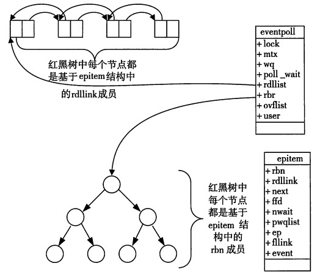

## 一、I/O复用之 select

用途：在一段指定时间内，监听用户感兴趣的文件描述符上的可读、可写、异常等事件

### （一）、使用

```c
int select(int nfds, fd_set* readfds, fd_set* writefds, fd_set* excetfds, struct timeval* timeout);
```

- nfds 参数指定被监听的文件描述符的总数。它通常被设置为 select 监听的所有文件描述符中的最大值加1，因为文件描述符是从0开始计数的

- readfds、writefds 和 exceptfds 参数分别指向可读、可写和异常等事件对应的文件描述符集合。应用程序调用 select 函数时，通过这 3 个参数传入自己感兴趣的文件描述符。select 调用返回时，内核将修改他们来通知应用程序哪些文件描述符已经就绪

    fd_set 结构体仅包含一个整形数组，该数组的每个元素的每一位（bit）标记一个文件描述符。fd_set 能容纳的文件描述符数量由 FD_SETSIZE 指定，这就限制了 select 能同时处理的文件描述符的总量
    可以使用一系列宏来访问 fd_set 结构体中的位

    ```c
    FD_ZERO(fd_set* fdset); // 清除 fdset 的所有位
    FD_SET(int fd, fd_set* fdset); // 设置 fdset 的位 fd
    FD_CLR(int fd, fd_set* fdset); // 清除 fdset 的位 fd
    int FD_ISSET(int fd, fd_set* fdset); // 测试 fdset 的位 fd 是否被设置
    ```

- timeout 参数用来设置 select 函数的超时时间。是一个 timeval 结构类型的指针，采用指针参数是因为内核将修改它以告诉应用程序 select 等待了多久。不过也不能完全信任 select 调用返回后的 timeout 值，比如调用失败时 timeout 值是不确定的。

    ```c
    struct timeval {
    	long tv_sec;  // 秒
    	long tv_usec; // 微秒
    }
    ```

    如果给 timeval 的成员都传递 0，则 select 将立即返回；如果给 timeout 传递 NULL，则阻塞直到某个文件描述符就绪。

- select 成功时返回就绪（可读、可写和异常）文件描述符的总数。如果在超时时间内没有任何文件描述符就绪，select 返回0。

### （二）、文件描述符就绪条件

以下情况 socket 是可读的

- socket 内核接收缓冲区中的字节数大于或者等于其低水位的标记 SO_RCVLOWAT 标记。此时，我们可以无阻塞的该 socket，并且读操作的返回值大于0
- socket 通信的对方关闭连接，此时对该 socket 的读操作将返回 0
- 监听 socket 上有新的连接请求
- socket 上有未处理的错误。此时我们可以使用 getsockopt 来读取和清除错误

以下情况 socket 是可写的

- socket 内核发送缓冲区中的可用字节数大于或者等于其低水位标记 SO_SNDLOWAT，此时我们可以无阻塞的读该 socket，并且返回值大于0
- socket 的写操作被关闭，对写操作被关闭的 socket 执行写操作会触发 SIGPIPE 的信号
- socket 使用非阻塞 connect 连接成功或者失败之后
- socket上有未处理的错误，此时我们可以通过 getsockopt 来读取和清除该错误

socket 是异常情况

- socket 上接收到带外数据

## 二、I/O复用之 poll

指定时间内轮询一定数量的文件描述符，以测试其中是否有就绪

```c
int poll(struct pollfd* fds, nfds_t nfds, int timeout);
```

- fds 参数指定我们感兴趣的文件描述符上发生的可读、可写和异常等事件。

    ```c
    struct pollfd {
    	int fd;  // 文件描述符
    	short events; // 注册的事件
    	short revents; // 实际发生的事件，由内核填充
    }
    ```

    events 成员告诉 poll 监听 fd 上的那些事件，他是一系列事件的按位或

    revents 成员则由内核修改，以通知应用程序 fd 上世纪发生了哪些事件

- nfds 指定被监听事件集合 fds 的大小。` typedef unsigned long int nfds_t; `

- timeout 指定 poll 的超时值，单位是毫秒。当 timeout 为 -1 时，poll 调用将永远阻塞。为 0 则立即返回

poll 文件描述符没有上限，只是解决了 select 句柄有限的问题

## 三、I/O复用之 epoll

### （一）、epoll 的实现

调用 epoll_create 方法，Linux 内核会创建一个 eventpoll 结构体，这个结构体中有两个成员和 epoll 的使用方式密切相关

```c
struct eventpoll {
	// 红黑树的根节点，这棵树中存储着所有添加到 epoll 中的事件，也就是这个 epoll 监控的事件 
	struct rb_root rbr;
	// 双向链表 rdllist 保存着将要通过 epoll_wait 返回给用户的、满足条件的事件
	struct list_hand rdllist;
	...
}
```



每一个 epoll 对象都有一个独立的 eventpoll 结构体，这个结构体会在内核空间中创造独立的内存，用于存储使用 epoll_ctl 方法向 epoll 对象中添加进来的事件。这些事件都会挂到 rbr 红黑树中，也可以通过红黑树快速识别重复添加的事件。

**所有添加到epoll中的事件都会与设备（如网卡）驱动程序建立回调关系**。也就是说，相应的事件发生时会调用这里的回调方法。这个回调方法在内核中叫做 ep_poll_callback，它会把这样的事件放到上面的 rdllist 双向链表中。

能实现多路复用，主要依赖于：将进程挂在对应的 fd 的等待队列上，这样当这个 fd 的事情产生的时候，设备驱动就会将这个队列上的进程唤醒，如果不依赖 epoll，毫无疑问进程无法把自己同时挂在多个 fd 的队列上，epoll 帮忙干了这个事情，而干这个事情的一个核心步骤，是调用对应 fd 驱动设备提供 poll 方法。

Linux 中，对设备模型进行了规范的标准化，比如设备分为字符设备、块设备、网络设备等，对于开发者而言，要给一个设备实现一个驱动程序就必须按照 linux 提供的规范来实现，其中对于跟用户层交互这里，内核要求开发者实现一个叫 file_operations 的结构，这个结构定义了一系列操作的回调指针，比如 read、write 等用户熟知的操作，当用户调用 read、write 等方法时，最终内核会回调到这个设备的 file_operations.read、file_operations.write 方法，这个方法的具体逻辑由驱动开发者实现，比如 accept 调用，实际上最终是调用了 socket 下面的 file_operations.accept 方法。因此，如果是进程自己调用 accept，则协议栈驱动会亲自把这个进程挂在 fd 的等待队列上；如果是 epoll 来调用，则会回调 poll 方法，最终由 epoll 来将进程挂在 fd 这个等待队列上。

在 epoll 中，每一个事件都会建立一个 epitem 结构体，就是一个事件对应的信息。

```c
struct epitem {
	// 红黑树节点
	struct rb_node rbn;
	// 双向链表节点
	struct list_head rdllist;
	// 事件句柄等信息
	struct epoll_filefd ffd;
	// 指向其所属的 eventpoll 对象
	struct eventpoll* ep;
	// 期待的事件类型
	struct epoll_event event;
	...
}
```

当调用 epoll_wait 检查是否有发生事件的连接时，只是检查 eventpoll 对象中的 rdllist 双向链表是否有 epitem 元素而已，如果 rdllist 链表不为空，则把这里的事件复制到用户态内存中，同时将事件数量返回给用户。因此 epoll_wait 的效率比较高。

epoll_ctl 在向 epoll 对象中添加、修改、删除事件时，从 rbr 红黑树中查找事件也非常快。

### （二）、epoll 的使用

##### 1. epoll_create 

```
int epoll_create(int size);
```

返回一个句柄，参数 size 是告诉 epoll 所要处理的大致事件数目，而不是能够处理的事件的最大个数。

##### 2. epoll_ctl 

```
int epoll_ctl(int epfd, int op, int fd, struct epoll_event* event);
```

- epfd 是 epoll_create 返回的句柄

- op 的取值

    | op的取值      | 意义                    |
    | ------------- | ----------------------- |
    | EPOLL_CTL_ADD | 添加新的事件到 epoll 中 |
    | EPOLL_CTL_MOD | 修改 epoll 中的事件     |
    | EPOLL_CTL_DEL | 删除 epoll 中的事件     |

- fd 是待监测的连接套接字

- event 告诉 epoll 对什么样的事件感兴趣

    ```c
    typedef union epoll_data {
        void* ptr;
        int fd;
        uint32_t u32;
        uint64_t u64;
    } epoll_data_t;
    
    struct epoll_event {
        __uint32_t events;
        epoll_data_t data;
    };
    ```

    epoll_event 中 events 的取值意义

    | events 取值  | 意义                                                         |
    | ------------ | ------------------------------------------------------------ |
    | EPOLLIN      | 连接上有数据可以读出，比如：TCP连接的远端主动关闭连接，需要处理发送过来的 FIN 包 |
    | EPOLLOUT     | 连接上有数据可以写入，比如：主动向上游服务器发起非阻塞的TCP连接，连接建立成功的事件相当于可写事件 |
    | EPOLLRDHUP   | TCP连接的远端关闭或半关闭连接                                |
    | EPOLLERR     | 对应的连接发生错误                                           |
    | EPOLLHUP     | 对应的连接被挂起                                             |
    | EPOLLET      | 将触发方式设置为边缘触发（ET），系统默认为水平触发（LT）     |
    | EPOLLONESHOT | 对这个事件只处理一次，下次需要处理时需重新加入 epoll         |
    | EPOLLPRI     | 对应的连接上有紧急数据需要读                                 |

##### 3. epoll_wait

收集在 epoll 监控的事件中已经发生的事件。

```
epoll_wait(int epfd, struct epoll_event* events, int maxevents, int timeout);
```

- 返回值为当前发生的事件个数。返回 0 表示没有本次调用没有事件发生；返回 -1 表示出现错误
- epfd 是 epoll 的描述符
- events 是分配好的 epoll_event 结构体数组，epoll 将会把发生的事件复制到 events 数组中（不可以是空指针，那个只负责拷贝）
- maxevents 可以返回的最大事件数目，通常 maxevents 参数于预分配的 events 数组的大小是相等的
- timeout 在没有监测到事件发生时最多等待的时间（毫秒），为 0 表示立即返回，-1 表示阻塞 

##### 4. ET 和 LT 模式

epoll 有两种工作模式，LT（水平触发）模式和ET（边缘触发）模式。默认情况 epoll 采用 LT 模式工作，可以处理阻塞和非阻塞套接字。
可以通过 epoll_ctl 设置事件为 ET 模式，ET 模式的效率比 LT 模式高，但它只支持非阻塞套接字。如果文件描述符是阻塞的，那么读或者写操作将会因为没有后续的事件而一直处于阻塞状态。

LT 和 ET 的区别：当一个新的事件到来时，ET 模式下，如果没有把这个到来的事件对应的套接字缓冲区处理完，那么在这个套接字没有新的事件再次到来时，ET 模式无法再次从 epoll_wait 调用中获取这个事件的。而 LT 模式，只要一个事件对应的套接字缓冲区还有数据，就总能从 epoll_wait 中获取这个事件。

nginx 是通过 ET 模式使用 epoll 的。

##### 5. EPOLLONESHOT 模式

抛出问题：即使我们使用 ET 模式，一个 socket 上的某个事件还是可能被触发多次。在并发程序中，一个线程在读取完某个 socket 上的数据后开始处理这些数据，而在数据处理过程中该 socket 上又有新数据可读（EPOLLIN再次被触发），此时另外一个线程被唤醒来读取这些新的数据。于是就出现了两个线程同时操作一个 socket 的局面。我们期望的是一个 socket 连接在任一时刻都只被一个线程处理。

对于注册了 EPOLLONESHOT 事件的文件描述符，操作系统最多触发其上注册的一个可读、可写或者异常事件，且只触发一次，除非我们使用 epoll_ctl 函数重置该文件描述符上注册的 EPOLLONESHOT 事件。这就可以实现一个线程在处理某个 socket 时，其他线程是不可能有机会操作该 socket 的

注意：注册了 EPOLLONESHOT 事件的 socket 一旦被某个线程处理完毕，该线程就应该立即重置这个 socket 上的 EPOLLONESHOT 事件，以确保这个 socket 下一次可读时，其 EPOLLIN 事件能被触发，进而让其他线程有机会继续处理这个 socket。

## 三、三组 I/O复用的比较

select

- select 的参数类型 fd_set 没有将文件描述符和事件绑定，它仅仅是一个文件描述符集合，因此 select 需要提供 3 个这种类型的参数来分别传入和输出可读、可写及异常等事件。因此 select 不能处理更新类型的事件
- select 中由于内核对 fd_set 集合的在线修改，应用程序下次调用 select 前必须重置这 3 个 fd_set 集合。
- select采用对所有注册的文件描述符集轮询的方式，会返回整个用户注册的事件集合，所以应用程序索引就绪文件的时间复杂度为O(n)
- select允许监听的最大文件描述符个数通常有限制，一般是1024，如果大于1024，可能会导致不可预期的后果
- 只能工作在 LT 模式

poll

- 将文件描述符和事件绑定，并且每次内核修改的是 pollfd 结构体的 revents 成员，而 events 成员保持不变。因此下次调用无须重置 pollfd 类型的事件集参数
- poll采用对所有注册的文件描述符集轮询的方式，会返回整个用户注册的事件集合，所以应用程序索引就绪文件的时间复杂度为O(n)
- poll用nfds参数指定最多监听多少个文件描述符和事件，这个数能达到系统允许打开的最大文件描述符数目，即（/proc/sys/fs/file-max）
- 只能工作在 LT 模式

epoll

- epoll 把用户注册的文件描述符和事件放到 epoll（eventpoll）中的红黑树上，提供了一个系统调用 epoll_ctl 来管理用户事件。增删改的效率都是 O(logn)
- epoll 将所有添加到 epoll 中的事件都会与设备（如网卡）驱动程序建立回调关系，事件发生后内核会将这个文件描述符和事件放到 epoll（eventpoll）的双向链表上。因此 epoll_wait 系统调用直接从 epoll 的双向链表上读取数据即可，时间复杂度变为 O(1) 
- epoll_wait 通过 maxevents 来决定最多监听多少个文件描述符和事件，这个数能达到系统允许打开的最大文件描述符数据，即（/proc/sys/fs/file-max）
- 支持高效的 ET 模式，并且还支持 EPOLLONESHOT 事件，能进一步减少可读、可写和异常等事件被触发的次数

从实现原理上来说，select 和 poll 采用的都是轮询的方式，即每次调用都要扫描整个注册文件描述符集合，并将其中就绪的文件描述符返回给用户程序，因此他们检测就绪事件的算法时间复杂度是 O(n) 。epoll_wait 则不同，他采用回调方式，内核检测到就绪的文件描述符时，将触发回调函数，回调函数就将该文件描述符上对应的事件插入内核就绪事件队列。内核最后在恰当的时机将该就绪事件队列中的内容拷贝到用户空间。epoll_wait 无需轮询整个文件描述符集合来检测哪些事件已经就绪，事件算法复杂度是 O(1) 

epoll 缺点：当活动连接比较多的时候，epoll_wait 的效率未必比 select 和 poll 高，因此此时回调函数被触发得过于频繁。
epoll 适应场景：epoll_wait 适用于连接数量多，但活动连接较少的情况。

 


