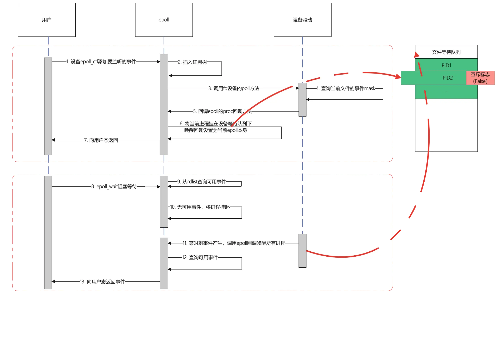

## 惊群效应

### 一、概念

Linux 中，对设备模型进行了规范的标准化，比如设备分为字符设备、块设备、网络设备等，对于开发者而言，要给一个设备实现一个驱动程序就必须按照 linux 提供的规范来实现，其中对于跟用户层交互这里，内核要求开发者实现一个叫 file_operations 的结构，这个结构定义了一系列操作的回调指针，比如 read、write 等用户熟知的操作，当用户调用 read、write 等方法时，最终内核会回调到这个设备的 file_operations.read、file_operations.write 方法，这个方法的具体逻辑由驱动开发者实现，比如 accept 调用，实际上最终是调用了 socket 下面的 file_operations.accept 方法。

因此，如果一个设备要支持 epoll/select 的调用，就必须实现 file_operations.poll 方法，epoll 在处理用户层传入的 fd 时，实际上最终是调用了这个方法，而这个方法做了一系列规范，要求开发者实现以下逻辑：

- 要求 poll 方法返回用户感兴趣的事件的标志，比如当前 fd 是否可读、是否可写等
- 如果poll传入一个poll专用的等待队列结构体，那他将会调用这个结构体，这个结构体中会有一个叫poll_table的东西，里面有一个回调函数，poll方法最终会调用这个回调，这个回调是由epoll来设定的，epoll在这个方法中实现的逻辑是：将当前进程挂在这个fd的等待队列上面

因此，如果是进程自己调用 accept，则协议栈驱动会亲自把这个进程挂在 fd 的等待队列上；如果是 epoll 来调用，则会回调 poll 方法，最终由 epoll 来将进程挂在 fd 这个等待队列上。这是引发 accept 惊群效应的根本原因

**惊群效应**（thundering herd）是指多进程（多线程）在同时阻塞等待同一个事件的时候（休眠状态），如果等待的这个事件发生，那么他就会唤醒等待的所有进程（或者线程），但是最终却只能有一个进程（线程）获得这个时间的“控制权”，对该事件进行处理，而其他进程（线程）获取“控制权”失败，只能重新进入休眠状态，这种现象和性能浪费就叫做惊群效应。

危害：

- **Linux内核对用户进程（线程）频繁地做无效的调度、上下文切换等使系统性能大打折扣。**上下文切换（context switch）过高会导致cpu像个搬运工，频繁地在寄存器和运行队列之间奔波，更多的时间花在了进程（线程）切换，而不是在真正工作的进程（线程）上面。直接的消耗包括cpu寄存器要保存和加载（例如程序计数器）、系统调度器的代码需要执行。间接的消耗在于多核cache之间的共享数据。
- **为了确保只有一个进程（线程）得到资源，需要对资源操作进行加锁保护，加大了系统的开销。**目前一些常见的服务器软件有的是通过锁机制解决的，比如Nginx（它的锁机制是默认开启的，可以关闭）；还有些认为惊群对系统性能影响不大，没有去处理，比如lighttpd。

### 二、Linux 的 Accept 的解决方案

Linux 2.6版本之前，监听同一个socket的进程会挂在同一个等待队列上，当请求到来时，会唤醒所有等待的进程。 
Linux 2.6版本之后，通过引入一个标记位 WQ_FLAG_EXCLUSIVE，解决掉了Accept惊群效应。

具体就是监听同一个 socket 的多个进程在加入 wait 队列前都会设置一个 WQ_FLAG_EXCLUSIVE 标志位。当有 tcp 连接完成，从半连接队列拷贝 socket 到连接队列，这个时候需要唤醒所有阻塞在 wait 队列上的进程，如果发现某个进程带有 WQ_FLAG_EXCLUSIVE 标志位，唤醒后直接退出，不再唤醒其他进程。

linux 的内核对进程唤醒提供了两种模式，一种是 prepare_to_wait，一种是 prepare_to_wait_exclusive。exclusive即互斥，如果调用的是prepare_to_wait_exclusive，则在对一个等待队列进程唤醒的时候，只会唤醒一个进程，而prepare_to_wait没有设置互斥位，会将挂在这个等待队列上的所有进程全部唤醒。Linux 2.6 之前版本是使用 prepare_to_wait 的。

accept 代码实现片段

```
// 当accept的时候，如果没有连接则会一直阻塞（没有设置非阻塞）
// 其阻塞函数就是：inet_csk_accept（accept的原型函数）  
struct sock *inet_csk_accept(struct sock *sk, int flags, int *err)
{
    ...  
    // 等待连接 
    error = inet_csk_wait_for_connect(sk, timeo); 
    ...  
}

static int inet_csk_wait_for_connect(struct sock *sk, long timeo)
{
    ...
    for (;;) {  
        // 只有一个进程会被唤醒。
        // 非exclusive的元素会加在等待队列前头，exclusive的元素会加在所有非exclusive元素的后头。
        prepare_to_wait_exclusive(sk_sleep(sk), &wait,TASK_INTERRUPTIBLE);  
    }  
    ...
}

void prepare_to_wait_exclusive(wait_queue_head_t *q, wait_queue_t *wait, int state)  
{  
    unsigned long flags;  
    // 设置等待队列的flag为EXCLUSIVE，设置这个就是表示一次只会有一个进程被唤醒，我们等会就会看到这个标记的作用。  
    // 注意这个标志，唤醒的阶段会使用这个标志。
    wait->flags |= WQ_FLAG_EXCLUSIVE;  
    spin_lock_irqsave(&q->lock, flags);  
    if (list_empty(&wait->task_list))  
        // 加入等待队列  
        __add_wait_queue_tail(q, wait);  
    set_current_state(state);  
    spin_unlock_irqrestore(&q->lock, flags);  
}
```

唤醒阻塞的 accept 代码片段

```
// 当有tcp连接完成，就会从半连接队列拷贝socket到连接队列，这个时候我们就可以唤醒阻塞的accept了。
int tcp_v4_do_rcv(struct sock *sk, struct sk_buff *skb)
{
    ...
    // 关注此函数
    if (tcp_child_process(sk, nsk, skb)) { 
        rsk = nsk;  
        goto reset;  
    }
    ...
}

int tcp_child_process(struct sock *parent, struct sock *child, struct sk_buff *skb)
{
    ...
    // Wakeup parent, send SIGIO 唤醒父进程
    if (state == TCP_SYN_RECV && child->sk_state != state)  
        // 调用sk_data_ready通知父进程
        // 查阅资料我们知道tcp中这个函数对应是sock_def_readable
        // 而sock_def_readable会调用wake_up_interruptible_sync_poll来唤醒队列
        parent->sk_data_ready(parent, 0);  
    }
    ...
}

void __wake_up_sync_key(wait_queue_head_t *q, unsigned int mode, int nr_exclusive, void *key)  
{  
    ...  
    // 关注此函数
    __wake_up_common(q, mode, nr_exclusive, wake_flags, key);  
    spin_unlock_irqrestore(&q->lock, flags);  
    ...  
} 

static void __wake_up_common(wait_queue_head_t *q, unsigned int mode, int nr_exclusive, int wake_flags, void *key)
{
    ...
    // 传进来的nr_exclusive是1
    // 所以flags & WQ_FLAG_EXCLUSIVE为真的时候，执行一次，就会跳出循环
    // 我们记得accept的时候，加到等待队列的元素就是WQ_FLAG_EXCLUSIVE的
    list_for_each_entry_safe(curr, next, &q->task_list, task_list) {  
        unsigned flags = curr->flags;  
        if (curr->func(curr, mode, wake_flags, key) 
        && (flags & WQ_FLAG_EXCLUSIVE) && !--nr_exclusive)
        break; 
    }
    ...
}
```

### 三、Linux 的 epoll 解决方案

##### 1. epoll 的惊群产生

epoll 和 file_operations.poll 方法的交互


当用户调用 epoll_ctl 的添加事件的时候，在第 6 步，epoll 会把当前进程挂在 fd 的等待队列下，但是默认情况下这种挂载不会设置互斥标志（类似Accept 的WQ_FLAG_EXCLUSIVE ）。就会导致如果有事件，当前队列有多个进程等待，就会全部唤醒。

但是唤醒并不一定会向用户态返回，因为唤醒之后 epoll 还要遍历一次就绪列表，确认有至少一个事件发生才会向用户态返回。至此，epoll 的惊群如下：

1. 当多个进程共享同一个监听端口并且都使用epoll进行多路复用的监听时，epoll将这些进程都挂在同一个等待队列下
2. 当事件产生时，socket的设备驱动都会尝试将等待队列的进程唤醒，但是由于挂载队列的时候使用的是epoll的挂载方式，没有设置互斥标志，所以这个队列下的所有进程将全部被唤醒
3. 唤醒之后此时这些进程还处于内核态，他们都会立刻检查事件就绪列表，确认是否有事件发生。对accept而言，accept->poll 方法将会检查在当前的 socket 的 tcp 全连接列表中是否有可用连接，如果是则返回可用事件标志
4. 当所有进程都被唤醒，但是还没有进行去真正做 accept 动作的时候，所有进行的事件检查都认为 accept 事件可用，所以这些进程都向用户态返回
5. 用户态检查到有 accept 事件可用，这时他们将会真正调用 accept 函数进行连接的获取
6. 此时只会有一个进程能真正获取连接，其他进程都会返回 EAGAIN 错误，使用 strace -p PID 命令可以跟踪到这种错误
7. 并不是所有进程都会返回用户态，关键点在于这些被唤醒的进程在检查事件的过程中，如果已经有进程成功 accept 到连接了，这时别的进程将不会检查到这个事件，从而他们会继续休眠，不会返回用户态
8. 虽然不一定会返回用户态，但也造成了内核上下文切换的发生，其实也是惊群效应的表现

##### 2. 惊群效应的解决

根本原因在于 epoll 的默认行为是对于多进程监听同一文件不会设置互斥，进而唤醒所有进程，linux 提供了两种解决方案

1. linux4.5 内核之后给 epoll 添加了一个 EPOLLEXCLUSIVE 的标志位，如果设置了这个标志位，那epoll将进程挂到等待队列时将会设置一下互斥标志位，这时实现跟内核原生accept一样的特性，只会唤醒队列中的一个进程
2. linux 3.9 内核之后给 socket 提供 SO_REUSEPORT 标志，这种方式解决得更彻底，他允许不同进程的 socket 绑定到同一个端口，取代以往需要子进程共享socket 监听的方式，这时候，每个进程的监听 socket 将指向 open_file_tables 下的不同节点，也就是说不同进程是在自己的设备等待队列下被挂起的，不存在共享 fd 的问题，也就不存在被同时唤醒的可能时，而内核则在驱动中将设置了 SO_REUSEPORT 并且绑定同一端口的这些 socket 分到同一个 group 中，当有 tcp 连接事件到达的时候，内核将会对源IP+源端口取 hash 然后指定这个 group 中其中一个进程来接受连接，相当于在内核级别中实现了一个负载均衡

问题：SO_REUSEPORT 根据数据包的四元组{src ip, src port, dst ip, dst port}和当前绑定同一个端口的服务器套接字数量进行数据包分发。若服务器套接字数量产生变化，内核会把本该上一个服务器套接字所处理的客户端连接所发送的数据包（比如三次握手期间的半连接，以及已经完成握手但在队列中排队的连接）分发到其它的服务器套接字上面，可能会导致客户端请求失败，一般可以使用：

- 使用固定的服务器套接字数量，不要在负载繁忙期间轻易变化
- 允许多个服务器套接字共享TCP请求表(Tcp request table)
- 不使用四元组作为Hash值进行选择本地套接字处理，挑选隶属于同一个CPU的套接字

https://www.cnblogs.com/alantu2018/p/8469546.html

基于上面的两种方法，epoll 基本不存在所谓的惊群效应了。但是有一些不严谨的做法，比如

- epoll_create 在 fork 之前创建
    epoll_create 在 fork 之前创建，多进程之间共享了同一个epfd（父进程创建epoll由多个子进程来调用），那就不能怪epoll了，因为这时候多个进程都被挂到这个epoll下，这种情况下，已经不是仅仅是惊群效应的问题了，比如说，A进程在epoll挂了socket1的连接事件，B进程调用了epoll_wait，由于属于同一个epfd，当socket1产生事件的时候，进程B也会被唤醒，而更严重的事情在于，只有进程A的空间下才有 socket1 这个 fd，在B的空间下并不存在socket1这个fd。accept之后，后续的读写事件和进程有了关联。从而把问题搞得很复杂。因此，不要在多线程/多进程之间共享epfd。
- epoll_create 在 fork 之后创建
    每个进程都有单独的 epoll 红黑树、等待队列、ready 事件列表等。还是会有惊群效应的出现。因此尽量使用 SO_REUSEPORT，让内核帮助我们解决这个问题。

### 四、Nginx 的惊群效应

nginx在1.11版本以上，已经默认打开了 SO_REUSEPORT 选项，解决了这个问题，应用层不需要做特别的事情

而在这之前，nginx解决惊群的方式是加锁，多个进程之间共享一个文件锁，只有在抢到这个锁的时候，这个进程才会将要监听的端口放到 epoll 中，当 epoll_wait 返回之后，nginx 会调用 accept 把连接取出来，然后释放文件锁，让别的进程去监听。这是一种折衷的办法，并没有很完美，首先进程间争抢锁会有性能开耗（即使是非阻塞的锁），中间可能会有小段时间没有进程去获取锁，比如A进程拿到锁，其他进程将会过一小段时间尝试再去获取锁，而这小段时间里面如果请求量很大，A仅接受一小部分请求就让出锁，则中间过程会有一些连接事件被hang住，总而言之，升级nginx版本吧，不要再依靠这种模式了！

---

参考：

Linux 惊群效应之 Nginx 解决方案 https://zhuanlan.zhihu.com/p/51251700

epoll惊群效应深度剖析： https://segmentfault.com/a/1190000039676522

