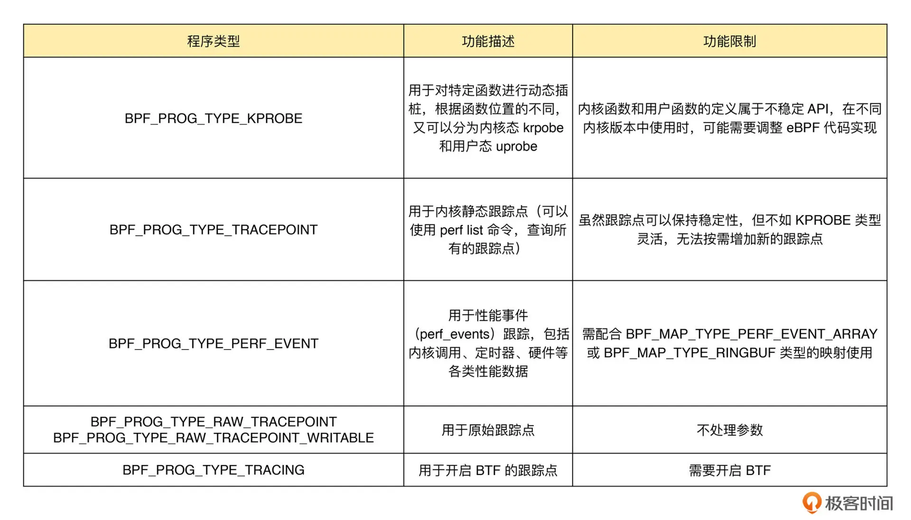

可以通过如下命令来查看当前系统支持的程序类型：

```
bpftool feature probe | grep program_type
```

根据具体功能和应用场景的不同，这些程序类型大致可以划分为三类：

- 第一类是跟踪，即从内核和程序的运行状态中提取跟踪信息，来了解当前系统正在发生什么
- 第二类是网络，即对网络数据包进行过滤和处理，以便了解和控制网络数据包的收发过程
- 第三类是除跟踪和网络之外的其他类型，包括安全控制、BPF 扩展等等

### 一、跟踪类 eBPF 程序

跟踪类 eBPF 程序主要用于从系统中提取跟踪信息，进而为监控、排错、性能优化等提供数据支撑。如下是常见的跟踪类 BPF 程序的主要功能及使用限制



这其中，KPROBE、TRACEPOINT 以及 PERF_EVENT 都是最常用的 eBPF 程序类型，大量应用于监控跟踪、性能优化以及调试排错等场景中。

### 二、网络类 eBPF 程序

网络类 eBPF 程序主要用于对网络数据包进行过滤和处理，进而实现网络的观测、过滤、流量控制以及性能优化等各种丰富的功能。根据事件触发位置的不同，网络类 eBPF 程序又可以分为 XDP（eXpress Data Path，高速数据路径）程序、TC（Traffic Control，流量控制）程序、套接字程序以及 cgroup 程序。

#### 1. XDP 程序

XDP 程序的类型定义为 `BPF_PROG_TYPE_XDP`，他在网络驱动程序刚刚收到数据包时触发执行。由于无需通过繁杂的内核网络协议栈，XDP 程序可用来实现高性能的网络处理方案，常用于 DDoS 防御、防火墙、4层负载均衡等场景

XDP 程序并不是绕过了内核协议栈，他只是在内核协议栈之前处理数据包，而处理过的数据包还可以正常通过内核协议栈继续处理。

根据网卡和网卡驱动是否原生支持 XDP 程序，XDP 运行模式可以分为如下三种：

- 通用模式。它不需要网卡和网卡驱动的支持，XDP 程序像常规的网络协议栈一样运行在内核中，性能相对较差，一般用于测试
- 原生模式。它需要网卡驱动程序的支持，XDP 程序在网卡驱动程序的早期路径运行
- 卸载模式。它需要网卡固件支持 XDP 卸载，XDP 程序直接运行在网卡上，而不再需要消耗主机的 CPU 资源，具有最好的性能

无论哪种模式，XDP 程序在处理过网络包之后，都需要根据 eBPF 程序执行结果，决定数据包的去处。这些执行结果对应以下 5 种 XDP 程序结果码。


BCC 提供了方便的库函数，让我们可以在同一程序中管理 XDP 程序的生命周期

```
from bcc import BPF

# 编译XDP程序
b = BPF(src_file="xdp-example.c")
fn = b.load_func("xdp-example", BPF.XDP)

# 加载XDP程序到eth0网卡
device = "eth0"
b.attach_xdp(device, fn, 0)

# 其他处理逻辑
...

# 卸载XDP程序
b.remove_xdp(device)
```

#### 2. TC 程序

TC 程序的类型定义为 BPF_PROG_TYPE_SCHED_CLS 和 BPF_PROG_TYPE_SCHED_ACT，分别作为 Linux 流量控制 的分类器和执行器。Linux 流量控制通过网卡队列、排队规则、分类器、过滤器以及执行器等，实现了对网络流量的整形调度和带宽控制。

同 XDP 程序相比，TC 程序可以直接获取内核解析后的网络报文数据结构 `sk_buff` （XDP 则是 `xdp_buff`），并且可在网卡的接收和发送两个方向上执行（XDP 只能用于接收）。TC 程序的执行位置：

- 对于接收的网络包，TC 程序在网卡接收（GRO）之后、协议栈处理（包括 IP 层处理和 iptables 等）之前执行
- 对于发送的网络包，TC 程序在协议栈处理（包括 IP 层处理和 iptables 等）之后、数据包发送到网卡队列（GSO）之前执行

除此之外，由于 TC 运行在内核协议栈中，不需要网卡驱动程序做任何改动，因而可以挂载到任意类型的网卡设备（包括容器等使用的虚拟网卡）上。

同 XDP 程序一样，TC eBPF 程序也可以通过 Linux 命令行工具来加载到网卡上，不过相应的工具要换成 tc。你可以通过下面的命令，分别加载接收和发送方向的 eBPF 程序：

```
# 创建 clsact 类型的排队规则
sudo tc qdisc add dev eth0 clsact

# 加载接收方向的 eBPF 程序
sudo tc filter add dev eth0 ingress bpf da obj tc-example.o sec ingress

# 加载发送方向的 eBPF 程序
sudo tc filter add dev eth0 egress bpf da obj tc-example.o sec egress
```

#### 3. 套接字程序

套接字程序用于过滤、观测或重定向套接字网络包，具体的种类也比较丰富。根据类型的不同，套接字 eBPF 程序可以挂载到套接字（socket）、控制组（cgroup ）以及网络命名空间（netns）等各个位置。可以根据具体的应用场景，选择一个或组合多个类型的 eBPF 程序，去控制套接字的网络包收发过程。


#### 4. cgroup 程序

cgroup 程序用于对 cgroup 内所有进程的网络过滤、套接字选项以及转发等进行动态控制，它最典型的应用场景是对容器中运行的多个进程进行网络控制。


这些类型的 BPF 程序都可以通过 BPF 系统调用的 BPF_PROG_ATTACH 命令来进行挂载，并设置挂载类型为匹配的 BPF_CGROUP_xxx 类型。比如，在挂载 BPF_PROG_TYPE_CGROUP_DEVICE 类型的 BPF 程序时，需要设置 bpf_attach_type 为 BPF_CGROUP_DEVICE：

```
union bpf_attr attr = {};
attr.target_fd = target_fd;            // cgroup文件描述符
attr.attach_bpf_fd = prog_fd;          // BPF程序文件描述符
attr.attach_type = BPF_CGROUP_DEVICE;  // 挂载类型为BPF_CGROUP_DEVICE

if (bpf(BPF_PROG_ATTACH, &attr, sizeof(attr)) < 0) {
  return -errno;
}
```

### 三、其他类 eBPF 程序

