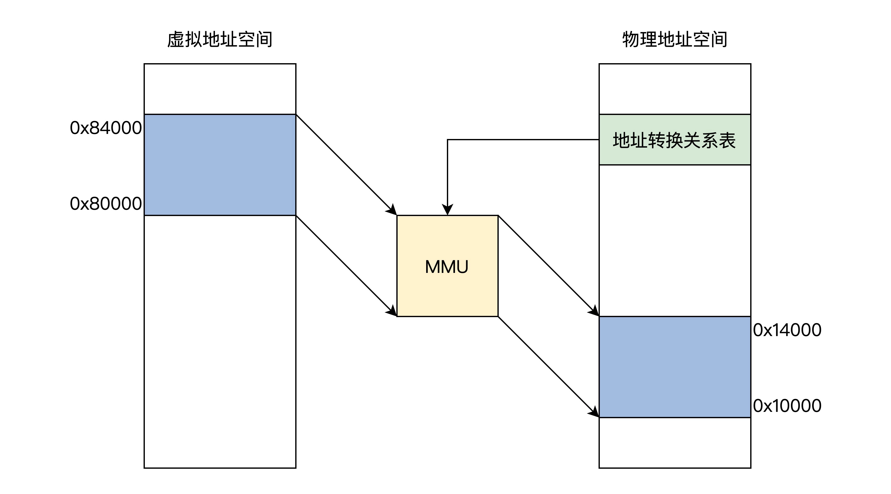

## 计算机的硬件

### 一、CPU 的工作模式

CPU 的工作模式有实模式、保护模式、长模式

#### 1. 实模式

实模式是实际地址模式，也就是说：

- 他会运行真实的指令，对指令的动作不作区分，直接执行指令的真实功能；
- 还有发往内存的地址是真实的，对任何地址不加限制的发往内存。

仅支持 16 位地址空间

#### 2. 保护模式

为了区分那些指令和那些资源可以被访问，CPU 实现了特权级。特权级分为 4 级，R0 - R3，每个特权级执行指令的数量不同，R0 可以执行所有指令，R1、R2、R3 依次递减。

保护模式包含特权级，对指令及其访问的资源进行控制，对内存段与段之间的访问进行严格检查，没有权限的绝不放行，对中断的响应也要进行严格的权限检查，扩展了 CPU 寄存器位宽，使之能够寻址 32 位的内存地址空间和处理 32 位的数据，从而 CPU 的性能大大提高

#### 3. 长模式

长模式又名 AMD64，因为这个标准是 AMD 公司最早定义的，他使 CPU 在现有的基础上有了 64 位的处理能力，既能完成 64 位的数据运算，也能寻址 64 位的地址空间。

长模式弱化段模式管理，只保留了权限级别的检查，忽略了段基址和段长度，而地址的检查则交给了 MMU

### 二、虚拟地址和MMU

虚拟地址：

链接器的主要工作就是把多个代码模块组装在一起，并解决模块之间的引用，即处理程序代码间的地址引用，形成程序运行的静态内存空间视图。并且填充数据的虚拟地址。

物理地址和虚拟地址之间的转换，如果用软件来实现太低效，用硬件实现没有灵活性。最终选择了软硬件结合的方式实现，他就是 MMU（内存管理单元）。MMU 可以接受软件给出的地址对应关系数据，进行地址转换。

MMU 通过地址关系转换表，将 0x80000 - 0x84000 的虚拟地址转换成 0x10000 - 0x14000 的物理地址空间，而地址关系转换表本身则是放在物理内存中的。那这个地址转换表要做到字节的一一对应，就会把地址空间用完。

因此，地址关系转换表，把虚拟地址空间和物理地址空间都分成同等大小的块，也称为页，按照虚拟页和物理页进行转换。根据软件配置不同，这个页的大小可以设置为 4KB、2MB、4MB、1GB。也就是分页模型

#### 1. MMU

MMU 是内存管理单元，是用硬件电路逻辑实现的一个地址转换器件，他负责接受虚拟地址和物理地址关系转换表，以及输出物理地址。MMU 可以是独立的芯片，也可以集成在 CPU 芯片中，x86、ARM 系列的 CPU 就是集成在 CPU 中的。

MMU 的地址关系转换表，专业的名字叫：页表。页表只存放物理页面的地址，MMU 以虚拟地址为索引去查表返回物理页面地址，而且页表是分级的，总体分为三个部分：一个顶级页目录，多个中级页目录，最后才是页表。

要使用分页模式就比先开启 MMU，但是开启 MMU 的前提是 CPU 进入保护模式或者长模式。

### 三、缓存和内存

CPU 大多数时间在执行相同的指令或者与此相邻的指令，这就是程序的局部性原理。

CPU 和内存的吞吐量要相差好几个数量级。又因为程序的局部性原理，因此我们可以使用高速缓存来缓解性能瓶颈。高速缓存可以集成在 CPU 内部，也可以做成独立的芯片放在总线上，现在 x86 CPU 和 ARM CPU 都是集成在 CPU 内部的。

高速缓存带来了性能的提升，但同时也带来了数据一致性问题。如下是 x86 CPU 的高速缓存图

Cache 的一致性问题，主要包括三个方面：

- 一个 CPU 核心中的指令 cache 和数据 cache 的一致性问题
- 多个 CPU 核心各自的 2 级 cache 的一致性问题
- CPU 的 3 级 cache 与设备内存，如 DMA、网卡帧储存、显存之间的一致性问题。

为了应对 cache 的一致性问题，可以关注 MESI 协议。