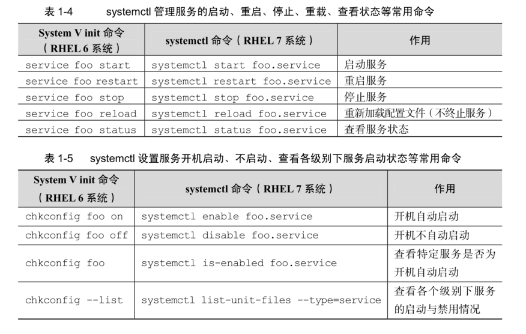
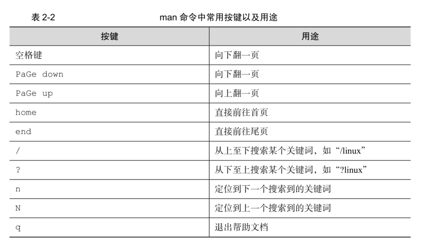
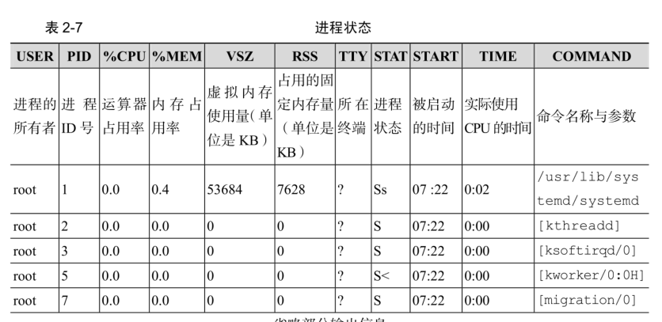
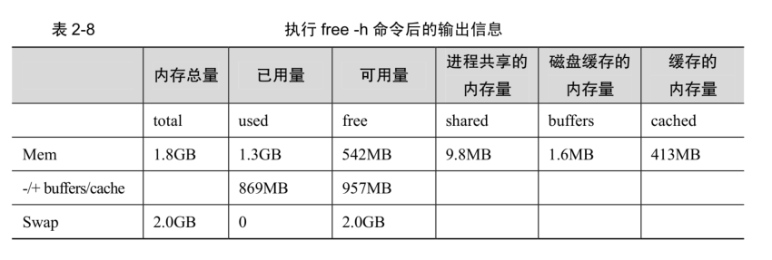

# 【linux就该这么学总结】一些名词的解析和基本的命令

#### 虚拟化技术

您的电脑的 CPU 需要支持 VT（VirtualizationTechnology，虚拟化技术）。所谓 VT，指的是让单台计算机能够分割出多个独立资源

区，并让每个资源区按照需要模拟出系统的一项技术，其本质就是通过中间层实现计算机资源的管理和再分配，让系统资源的利用率最大化。

#### RPM 软件包管理器

RPM 有点像 Windows 系统中的控制面板，会建立统一的数据库文件，详细记录软件信息并能够自动分析依赖关系。

常用的RPM软件包命令：

安装软件的命令格式 rpm -ivh filename.rpm

升级软件的命令格式 rpm -Uvh filename.rpm

卸载软件的命令格式 rpm -e filename.rpm

查询软件描述信息的命令格式 rpm -qpi filename.rpm

列出软件文件信息的命令格式 rpm -qpl filename.rpm

查询文件属于哪个 RPM 的命令格式 rpm -qf filename

#### yum软件仓库

Yum 软件仓库便是为了进一步降低软件安装难度和复杂度而设计的技术。Yum 软件仓库可以根据用户的要求分析出所需软件包及其相关的依赖关系，然后自动从服务器下载软件包并安装到系统。

yum repolist all 列出所有仓库

yum list all 列出仓库中所有软件包

yum info 软件包名称 查看软件包信息

yum install 软件包名称 安装软件包

yum reinstall 软件包名称 重新安装软件包

yum update 软件包名称 升级软件包

yum remove 软件包 移除软件包

yum clean all 清除所有仓库缓存

yum check-update 检查可更新的软件包

yum grouplist 查看系统中已经安装的软件包组

yum groupinstall 软件包组 安装指定的软件包组

yum groupremove 软件包组 移除指定的软件包组

yum groupinfo 软件包组 查询指定的软件包组信息

#### systemctl 的对比

#### man命令常用按键

#### 命令

echo、date、reboot (root) 、poweroff (root关闭系统)

* wget：用于在终端中下载网络文件    * -b：后台下载模式
    * -P：下载到指定目录
    * -t：最大尝试次数
    * -c：断点续传
    * -p：下载页面内所有资源，包括图片、视频等
    * -r：递归下载

* ps命令    * -a：显示所有进程（包括其他用户的进程）
    * -u：用户以及其他详细信息
    * -x：显示没有控制终端的进程
    
    
    R 运行：进程正在运行或者在运行队列中等待
    
    
    S 中断：进程处于休眠中，当某个条件形成后或者接收到信号时，则脱离该状态
    
    
    D 不可中断：进程不响应系统异步信号，即便用kill 命令也不能将其中断
    
    
    **注意：睡眠态是一个非常宽泛的概念，分为可中断睡眠和不可中断睡眠。可中断睡眠是允许接收外界信号和内核信号而被唤醒的睡眠，绝大多数睡眠都是可中断睡眠，能ps或top捕捉到的睡眠也几乎总是可中断睡眠；不可中断睡眠只能由内核发起信号来唤醒，外界无法通过信号来唤醒，主要表现在和硬件交互的时候。例如cat一个文件时，从硬盘上加载数据到内存中，在和硬件交互的那一小段时间一定是不可中断的，否则在加载数据的时候突然被人为发送的信号手动唤醒，而被唤醒时和硬件交互的过程又还没完成，所以即使唤醒了也没法将cpu交给它运行，所以cat一个文件的时候不可能只显示一部分内容。而且，不可中断睡眠若能被人为唤醒，更严重的后果是硬件崩溃。由此可知，不可中断睡眠是为了保护某些重要进程，也是为了让cpu不被浪费。**
    
    Z 僵死：进程已经终止，但是进程描述符依然存在，直到父进程调用wait 系统函数后将其释放
    
    
    T 停止：进程收到停止信号后停止运行
    
    
    
    
    注意：ps 命令可允许参数不加减号（-），因此可以直接写成ps aux 的样子

* top：用于动态的监视进程活动与系统负载等信息

top 命令执行结果的前 5 行为系统整体的统计信息，其所代表的含义如下：    * 第 1 行：系统时间、运行时间、登录终端数、系统负载（三个数值分别为 1 分钟、5分钟、15 分钟内的平均值，数值越小意味着负载越低）。
    * 第 2 行：进程总数、运行中的进程数、睡眠中的进程数、停止的进程数、僵死的进程数。
    * 第 3 行：用户占用资源百分比、系统内核占用资源百分比、改变过优先级的进程资源百分比、空闲的资源百分比等。
    * 第 4 行：物理内存总量、内存使用量、内存空闲量、作为内核缓存的内存量。
    * 第 5 行：虚拟内存总量、虚拟内存使用量、虚拟内存空闲量、已被提前加载的内存量。

* pidof 命令：用于查询某个指定服务进程的 PID 值

pidof 命令用于查询某个指定服务进程的 PID 值，格式为“pidof [参数] [服务名称]”。

pidof sshd
* kill：kill 命令用于终止某个指定 PID 的服务进程，格式为“kill [参数] [进程 PID]”。
* killall：killall 命令用于终止某个指定名称的服务所对应的全部进程，格式为：“killall [参数] [进程名称]”。

killall httpd

注意：在执行命令时在末尾添加上一个 & 符号，这样命令将进入系统后台来执行
* ifconfig
* uname：查看系统内核与系统版本等信息    * uname -a：一般会固定搭配 -a 参数来完整的查看当前系统的内核名称、主机名、内核发行版本、节点名、硬件名称、硬件平台、处理器类型以及操作系统名称等信息
    * 如果要查看当前系统版本的详细信息，则需要查看 redhat-release 文件

* uptime 命令：用于查看系统的负载信息    * 可以显示当前系统时间、系统已运行时间、启用终端数量以及平均负载值等信息。平均负载值指的是系统在最近1分钟、5分钟、15分钟内的压力情况，越低越好，尽量不要长期超过1，在生产环境下不要超过5。

* free 命令：显示当前系统中内存的使用量信息

-free -h

* who：用于查看当前登入主机的用户终端信息
* last：查看所有系统的登录记录

使用 last 命令可以查看本机的登录记录。但是这些信息都时以日志文件的形式保存在系统中，因此黑客可以很容易的对内容进行篡改。因此这些输出不能判断系统有无被恶意入侵。
* history：用于显示历史执行过的命令。    * -c：清空所有的命令历史记录
    * 使用 ”!编码数字“来重复执行某一次的命令
    * 历史命令会被保存到用户家目录中的 .bash_history 文件中，其中，history -c：不会清除这个文件中的内容

* ls ：-d：查看目录的属性信息
* cat：-n：查看的时候显示行号
* more：查看比较长的文件，可以使用它来翻页，空格翻页，回车换行
* head -n 20 xx.log：查看文件的前N行
* tail -n 20 xx.log：查看文件的后N行。tail -f xx.log：实时的刷新一个文件内容
* tr 命令用于替换文本文件中的字符，格式为“tr [原始字符] [目标字符]”。例如：cat xx.log | tr [a-z] [A-Z]
* wc：统计指定文本的 -l：行数 -w：单词数 -c：字节数

-stat：查看文件的具体存储信息和时间等信息，会显示出文件的三种时间状态：Access、Modify、Change
* cut：用于按“列”提取文本字符。-d：设置间隔符号，-

f：设置需要看的列数。例如：cut -d: -f1 /etc/passwd
* diff：用于比较多个文本文件之间的差异。    * -c：详细比较多个文件的差异之处
    * -brief：来确认两个文件是否不同
#### 文件目录管理命令

* touch：可以用于创建空白文件或者设置文件的时间    * 文件的内容的修改时间(mtime)、文件权限或者属性的更改时间(ctime)、文件的读取时间(atime)。
    * -a：仅修改atime。-m：仅修改mtime。-d：同时修改atime与mtime。
    * 例如：touch -d "2017-05-04 15:44" anaconda-ks.cfg
    * 很多黑客就是这样做的哦

* mkdir：创建空白的目录    * mkdir -p：可以递归创建具有嵌套叠层的文件目录

* cp：用于复制文件或者目录。cp [选项] 源文件 目标文件    * 如果目标文件是目录，则会把源文件复制到该目录中
    * 如果目标文件也是普通文件，则会询问是否要覆盖它
    * 如果目标文件不存在，则执行正常的复制操作
    * -p：保留原始文件的属性
    * -d：若对象为 链接文件，则保留该链接文件的属性
    * -r：递归持续复制(用于目录)
    * -i：若目标文件存在则询问是否覆盖
    * -a：相当于 -pdr 三个参数

* mv：用于剪切文件或者将文件重命名
* rm：用于删除文件或目录    * -f：强制删除。-r：递归删除

* dd：可以按照指定大小和个数的数据库来复制文件或者转换文件    * if：输入文件名称。of：输出文件名称。bs：设置每个块的大小。count：设置要复制的块的个数。
    * linux系统中有一个名为/dev/zero 的设备文件，这个文件不会占用系统存储空间，但却可以提供无穷的数据。可以使用它来作为dd 的输入文件，来生成一个指定大小的文件.
    * dd if=/dev/zero of=560_file count=1 bs=560M
    * 重点：如果想把光驱设备中的光盘制作成iso格式的镜像文件，就可以直接使用dd命令来完成：dd if=/dev/cdrom of=RHEL-server-7.0-x86_64-LinuxProbe.Com.iso

* file：用于查看文件的类型。    * linux下一切皆文件，可以使用file命令来查看文件类型了。
#### 打包压缩与搜索命令

* tar：用于对文件进行打包压缩或者解压    * -c：创建压缩文件。-x：解开压缩文件。-z：用Gzip压缩或者解压。-j：用bzip2压缩或者解压。-v：现实压缩或者解压的过程。-f：目标文件名 -p：保留原始的权限与属性。-P：使用绝对路径来压缩。-C：指定解压到的目录
    * 注意：-f参数必要要放到参数的最后一位。
    * 添加：--exclude 排除某个目录。例如：
    * 例如：tar -zcvf tomcat.tar.gz --exclude=tomcat/logs --exclude=tomcat/libs tomcat 等价于 tar -zcvf tomcat.tar.gz --exclude=tomcat/{logs,libs} tomcat

* grep：用于在文本中执行关键字搜索，并显示匹配的结果。    * -b：将可执行文件当作文本文件来搜索
    * -c：仅显示找到的行数
    * -i：忽略大小写
    * -n：显示行号
    * -v：反向选择，列出没有关键字的行

* find：按照指定条件来查找文件。find [查找路径] 寻找条件 操作    * -name：匹配名称
    * -perm：匹配权限(mode为完全匹配，-mode：包含即可)
    * -user：匹配所有者
    * -group：匹配所有组
    * -mtime -n +n：匹配修改内容的时间（-n指n天以内，+n指n天以前）
    * -atime -n +n：匹配访问文件的时间,上同。
    * -ctime -n +n：匹配修改文件权限的时间，上同。
    * -nouser：匹配无所有者的文件
    * -nogroup：匹配无所有组的文件
    * -newer f1 !f2：匹配比文件f1新但是比f2旧的文件
    * --type b/d/c/p/l/f：匹配文件类型(后面的字幕参数依次表示块设备、目录、字符设备、管道、链接文件、文本文件)
    * -size：匹配文件的大小(+50k为查找超过50KB的文件，而-50KB为查找小于50KB的文件)
    * -prune：忽略某个目录
    * -exec ...... {}; 后面可跟用于进一步处理搜索结果的命令.举例：find / -user linuxprobe -exec cp -a {} /root/findresults/ ; # 在整个文件系统中找出所有归属于linuxprobe用户的文件并复制到/root/findresults目录。
#### 输入输出重定向

* 标准输入重定向（STDIN，文件描述符为0）。标准输出重定向（STDOUT，文件描述符为1）。错误输出重定向（STDERR，文件描述符为2）。
* 命令 < 文件：将文件作为命令的标准输入
* 命令 << 分界符：从标准输入中读入，直到遇见分界符才停止
* 命令 < 文件1 > 文件2：将文件1作为命令的标准输入并将标准输出到文件2
* 命令 > 文件：将标准输出重定向到一个文件中（清空原有文件的数据）
* 命令 2> 文件：将错误输出重定向到一个文件中（清空原有文件的数据）
* 命令 >> 文件：将标准输出重定向到一个文件中（追加到原有内容的后面）
* 命令 2>> 文件：将错误输出重定向到一个文件中（追加）
* 命令 >> 文件 2 >&1 或者 命令 &>> 文件 :将标准输出与错误输出共同写入到文件（追加）

#### 管道符

#### 通配符

*     * 代笔匹配零个或者多个字符

* ？ 代表匹配单个字符
* [0-9] 代表匹配0-9之间的单个数字的字符
* [abc] 代表匹配a、b、c 三个字符中的任意一个字符识别
#### 转义字符

* 反斜杠（\）:使反斜杠后面的一个变量变为单纯的字符串
* 单引号（''）:转义其中的所有的变量为单纯的字符串
* 双引号（""）:保留其中的变量属性，不进行转义处理
* 反引号（``）：把其中的命令执行后返回结果
#### 环境变量

* 将环境变量添加到全局，所有用户。 /etc/profile
* 将环境变量添加到某个用户某个终端，export $PATH。环境变量以 ： 为分割。
### vim的使用

* 命令模式的常用命令：dd、5dd、yy、5yy、n、N、u、p
* :q！强制退出(放弃对文档的修改内容)。:set nu 显示行号。:set nonu 不显示行号。
* :s/one/two 将当前光标所在行的第一个one替换为two
* :s/one/two/g 将当前光标所在行的所有one替换为two
* :%s/one/two/g 将全文的所有one替换为two
* ?字符串 在文本中从下至上搜索该字符串
* /字符串 在文本中从上至下搜索字符串
#### 配置主机名称

* /etc/hostname 这个文件是这台主机的名称
#### 配置网卡信息

* /etc/sysconfig/network-scripts 这个目录存放着网卡的配置文件
#### shell脚本的交互性

* shell脚本用于接收参数的变量。# 对应总共有几个参数。* 对应所有位置的参数值。 $? 对应的是显示上一次命令的执行返回值。$1、$2、$3... 对应第n个位置的参数值
#### 定时任务

* crontab -e：创建、编辑计划任务。-l：查看当前计划任务。-r：删除某条计划任务。-u：如果是管理员，可以编辑他人的计划任务。
* crond服务设置任务的参数格式。“分、时、日、月、星期、命令”。如果有些字段没有设置，则需要使用星号(* )占位。
* 分：取值0-59的整数。时：取值0-23的任意整数。日：取值1-31的任意整数。月：取值1-12的任意整数。星期：取值0-7的任意整数，其中0和7都为星期日。命令：要执行的命令或者程序脚本。
* 例如：25 3 * * 1,3,5 命令。代表每周一、三、五的凌晨3点25分来执行一个命令。
* 逗号(,)表示多个时间段。减号(-)表示一段连续的时间周期（字段“日”的取值为“12-15”，表示每月的12-15日）。除号(/)表示执行任务的间隔时间(例如“/2”表示每隔2分钟执行一次任务)。
* 注意：所有命令一定要用绝对路径的方式来写。**计划任务中的“分”字段必须有数值，绝对不能为空或者是 * 号，而“日”和“星期”字段不能同时使用，否则就会发生冲突。**
### 用户身份与文件权限

* 管理员UID为0:系统的管理员用户
* 系统用户UID 为 1~999: Linux 系统为了避免因某个服务程序出现漏洞而被黑客提权至整台服务器，默认服务程序会有独立的系统用户负责运行，进而有效控制被破坏范围。
* 普通用户 UID 从 1000 开始:是由管理员创建的用于日常工作的用户。
* useradd：创建新的用户。默认的用户家目录会被存放在/home目录中，默认的shell解释器为/bin/bash，而且会创建一个与该用户同名的基本用户组。    * -d：指定用户的家目录
    * -e：账户的到期时间，格式为YYYY-MM-DD
    * -u：指定该用户的默认UID
    * -g：指定一个初始的用户基本组(必须已存在)
    * -G：指定一个或者多个扩展用户组
    * -N：不创建与用户同名的基本用户组
    * -s：指定该用户的默认shell解释器

* groupadd：创建用户组
* usermod：修改用户的属性    * -d -m 连用，可重新指定用户的家目录并自动把旧的数据转移过去。
    * -e：账户的到期时间
    * -g：变更所属用户组
    * -G：变更扩展用户组
    * -L：锁定用户禁止其登陆系统
    * -U：解锁用户，允许其登陆系统
    * -s：变更默认终端
    * -u：修改用户的UID

* passwd命令：修改用户密码、过期时间、认证信息等。    * 普通用户只能修改自己的系统密码，而root管理员则有权限修改其他所有人的密码。
    * -l：锁定用户，禁止其登陆
    * -u：解除锁定，允许用户登陆
    * --stdin：允许通过标准输入修改用户密码，echo "NewPassWord" | passwd --stdin Username
    * -d：使该用户可用空密码登陆系统
    * -e：强制用户在下次登陆时修改密码
    * -S：显示用户的密码是否被锁定，以及密码所采用的加密算法名称

* userdel：删除用户    * 在执行删除操作时，该用户的家目录默认会保留下来，此时可使用-r参数将其删除
    * -f：强制删除用户
    * -r：同时删除用户以及家目录

* chmod、chown：chmod [参数] 权限 文件或者目录名称 针对目录的时候一定加上 -R表示递归操作。
* 目录或者文件的隐藏权限。chattr、lsattr、
* su 命令与用户名之间有一个减号（-），这意味着完全切换到新的用户，即把环境变量信息也变更为新用户的相应信息，而不是保留原始的信息。强烈建议在切换用户身份时添加这个减号（-）。
|/boot      |开机所需文件 — 内核、开机菜单以及所需配置文件等           |
|/dev       |以文件形式存放任何设备与接口                               |
|/etc       |配置文件                                                   |
|/home      |用户家目录                                                 |
|/bin       |存放单用户模式下还可以操作的命令                           |
|/lib       |开机时用到的函数库，以及/bin 与/sbin 下面的命令要调用的函数|
|/sbin      |开机过程中需要的命令                                       |
|/media     |用于挂载设备文件的目录                                     |
|/opt       |放置第三方的软件                                           |
|/root      |系统管理员的家目录                                         |
|/srv       |一些网络服务的数据文件目录                                 |
|/tmp       |任何人均可使用的“共享”临时目录                           |
|/proc      |虚拟文件系统，例如系统内核、进程、外部设备及网络状态等     |
|/usr/local |用户自行安装的软件                                         |
|/usr/sbin  |Linux 系统开机时不会使用到的软件/命令/脚本                 |
|/usr/share |帮助与说明文件，也可放置共享文件                           |
|/var       |主要存放经常变化的文件，如日志                             |
|/lost+found|当文件系统发生错误时，将一些丢失的文件片段存放在这里       |
