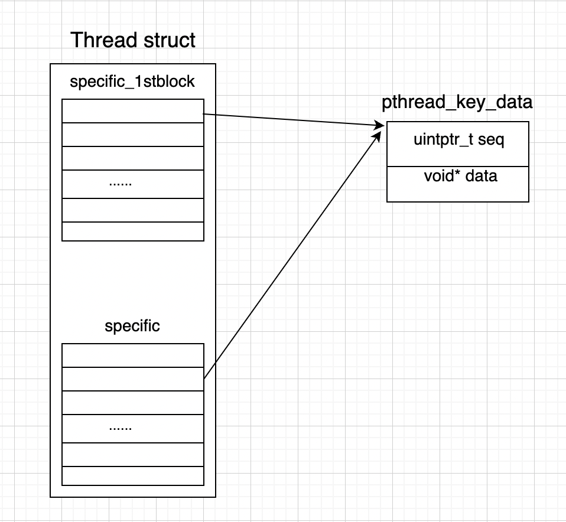

本文简单介绍线程局部缓存的原理，以及实现。本文代码来自于 `glibc 2.28`。

### 一、简单介绍

线程局部缓存（`Thread Local Storage`），他的特性就是线程私有的内存数据，每个线程都有，多线程场景中不会产生竞争，效率较高。

显式的 TLS 的 API 定义：
```c
/* Functions for handling thread-specific data.  */

/* Create a key value identifying a location in the thread-specific
   data area.  Each thread maintains a distinct thread-specific data
   area.  DESTR_FUNCTION, if non-NULL, is called with the value
   associated to that key when the key is destroyed.
   DESTR_FUNCTION is not called if the value associated is NULL when
   the key is destroyed.  */
extern int pthread_key_create (pthread_key_t *__key,
                   void (*__destr_function) (void *))
     __THROW __nonnull ((1));

/* Destroy KEY.  */
extern int pthread_key_delete (pthread_key_t __key) __THROW;

/* Return current value of the thread-specific data slot identified by KEY.  */
extern void *pthread_getspecific (pthread_key_t __key) __THROW;

/* Store POINTER in the thread-specific data slot identified by KEY. */
extern int pthread_setspecific (pthread_key_t __key,
                const void *__pointer) __THROW ;
```

隐式的做法：也可以使用 gcc 提供的 `__thread` 来定义。

具体使用不多说，主要说一下线程局部缓存的原理与底层实现。我们首先提几个问题？

- 线程局部缓存存储在什么位置？站在 ELF 文件角度（静态程序角度），和站在进程角度（运行的进程角度）
- 如何保证线程安全？

### 二、显式的线程局部存储的实现

我们以显式的 TLS 的 API 定义的底层实现作为出发点，来着重介绍下线程局部存储。

#### 1. 创建一个键

```c
int pthread_key_create (pthread_key_t *__key, void (*__destr_function) (void *))
```

可以创建一个对进程中所有线程可见的 “线程私有数据键”。第二个参数 `__destr_function ` 可以与 key 相关联，用于析构 key 占用的空间。我们来看看他的实现：

```c
/* Thread-local data handling.  */
struct pthread_key_struct {
  /* Sequence numbers.  Even numbers indicated vacant entries.  Note
     that zero is even.  We use uintptr_t to not require padding on
     32- and 64-bit machines.  On 64-bit machines it helps to avoid
     wrapping, too.  */
  uintptr_t seq;
  /* Destructor for the data.  */
  void (*destr) (void *);
};

struct pthread_key_struct __pthread_keys[PTHREAD_KEYS_MAX];

int __pthread_key_create (pthread_key_t *key, void (*destr) (void *)) {
  /* Find a slot in __pthread_keys which is unused.  */
  for (size_t cnt = 0; cnt < PTHREAD_KEYS_MAX; ++cnt) {
  	uintptr_t seq = __pthread_keys[cnt].seq;
    if (KEY_UNUSED (seq) && KEY_USABLE (seq)
      /* We found an unused slot.  Try to allocate it.  */
      && ! atomic_compare_and_exchange_bool_acq (&__pthread_keys[cnt].seq, seq + 1, seq)) {
      /* Remember the destructor.  */
      __pthread_keys[cnt].destr = destr;
      /* Return the key to the caller.  */
      *key = cnt;
      /* The call succeeded.  */
      return 0;
	  }
  }
  return EAGAIN;
}
```

我们可以看到他从 `__pthread_keys` 这个数组中获取一个未使用的、且可用的 key，并且 `__pthread_keys` 数组的元素是类型为 `pthread_key_struct` 的结构体，这个结构体中有 seq 的整数，还有一个 destr 的函数指针。

- seq 用于赋给 `key`，其类型为 `uintptr_t`，在 64 位系统中，为 `unsigned long int` 无符号长整形。
- destr 是一个函数指针，用于析构对应的空间。

注意，`__pthread_keys` 是一个全局的数组，数组长度为 `PTHREAD_KEYS_MAX`，默认为 1024。并且参数 key 其实就是这个 `__pthread_keys` 全局数组的下标，由 `atomic_compare_and_exchange_bool_acq` 这个 CAS 操作保证了分配 key 的线程安全。因此 `__pthread_key_create` 本身是线程安全的。

#### 2. 销毁一个键

```c
int pthread_key_delete (pthread_key_t __key);
```

删除一个键 key。他的实现比较简单。就是在 `__pthread_keys` 这个全局数组中拿到对应的 key，然后将此 key 设置为 “未使用” 状态，并且通过 `atomic_compare_and_exchange_bool_acq` 这个 CAS 操作，将这个 key 对应的 seq 加一。

```c
int __pthread_key_delete (pthread_key_t key) {
  int result = EINVAL;
  if (__glibc_likely (key < PTHREAD_KEYS_MAX)) {
      unsigned int seq = __pthread_keys[key].seq;
      if (__builtin_expect (! KEY_UNUSED (seq), 1)
	      && ! atomic_compare_and_exchange_bool_acq (&__pthread_keys[key].seq, seq + 1, seq))
        /* We deleted a valid key.  */
        result = 0;
    }
  return result;
}
```

因为 seq 是无符号整型，所以加到最大整数之后，会变为 0 继续轮循。

那么我们可以小结一下。一个进程可以创建的 key 有限，最多是 `PTHREAD_KEYS_MAX`，默认是 1024 个。key 其实就是全局数组 `__pthread_keys` 的下标。并且通过 CAS 保证的线程的安全。这个 key 对进程中所有线程都是可见的。

#### 3. 设置私有数据

```
int pthread_setspecific(pthread_key_t key, const void *pointer);
```

此接口为这个 key 设置线程数据。我们先来看看实现，然后用法就比较简单了。

```c
int __pthread_setspecific (pthread_key_t key, const void *value) {
  struct pthread *self;
  unsigned int idx1st;
  unsigned int idx2nd;
  struct pthread_key_data *level2;
  unsigned int seq;

  self = THREAD_SELF;
  /* Special case access to the first 2nd-level block.  This is the usual case.  */
  if (__glibc_likely (key < PTHREAD_KEY_2NDLEVEL_SIZE)) {
      /* Verify the key is sane.  */
      if (KEY_UNUSED ((seq = __pthread_keys[key].seq)))
        /* Not valid.  */
        return EINVAL;
      level2 = &self->specific_1stblock[key];
      /* Remember that we stored at least one set of data.  */
      if (value != NULL) THREAD_SETMEM (self, specific_used, true);
    } else {
      if (key >= PTHREAD_KEYS_MAX || KEY_UNUSED ((seq = __pthread_keys[key].seq)))
        /* Not valid.  */
        return EINVAL;
      idx1st = key / PTHREAD_KEY_2NDLEVEL_SIZE;
      idx2nd = key % PTHREAD_KEY_2NDLEVEL_SIZE;
      /* This is the second level array.  Allocate it if necessary.  */
      level2 = THREAD_GETMEM_NC (self, specific, idx1st);
      if (level2 == NULL) {
        if (value == NULL)
          /* We don't have to do anything.  The value would in any case
                   be NULL.  We can save the memory allocation.  */
          return 0;
        level2 = (struct pthread_key_data *) calloc (PTHREAD_KEY_2NDLEVEL_SIZE, sizeof (*level2));
        if (level2 == NULL)
          return ENOMEM;
        THREAD_SETMEM_NC (self, specific, idx1st, level2);
      }
      /* Pointer to the right array element.  */
      level2 = &level2[idx2nd];
      /* Remember that we stored at least one set of data.  */
      THREAD_SETMEM (self, specific_used, true);
  }
  /* Store the data and the sequence number so that we can recognize stale data.  */
  level2->seq = seq;
  level2->data = (void *) value;
  return 0;
}
```

首先通过 `struct pthread* self = THREAD_SELF;` 获取到当前线程。

- 如果 key 的值小于 `PTHREAD_KEY_2NDLEVEL_SIZE`，默认值为 32。那么就使用线程结构体中的 `specific_1stblock` 结构体。

  ```c
    /* Thread descriptor data structure.  */
    struct pthread {
        ...
        struct pthread_key_data {
          /* Sequence number.  We use uintptr_t to not require padding on
             32- and 64-bit machines.  On 64-bit machines it helps to avoid
             wrapping, too.  */
          uintptr_t seq;
  
          /* Data pointer.  */
          void *data;
        } specific_1stblock[PTHREAD_KEY_2NDLEVEL_SIZE];
        ...
    }
  ```

- 否则，对于大于 32 的。会使用另外一个数组 specific，同样也是定义在 线程 pthread 结构体中。

  ```c
  struct pthread {
  	...
  	struct pthread_key_data *specific[PTHREAD_KEY_1STLEVEL_SIZE];
  	...
  }
  ```

  这个数组，如果容量过小，会为其扩容。

最后为其赋值，包括键 key 和数据指针 pointer。

终于我们发现在线程结构体中的字段中，设置好了线程的私有数据。于是我们我们知道了线程私有函数存储的位置，就是在线程结构体中，那么自然其他线程是看不见的。而且只存储了一个指针，对应的内存块还是 `malloc` 申请出来的空间。

#### 4. 读取私有数据

```c
void * pthread_getspecific(pthread_key_t key);
```

获取 key 对应的数据。如下为源码

```c
void* __pthread_getspecific (pthread_key_t key) {
  struct pthread_key_data *data;
  /* Special case access to the first 2nd-level block.  This is the usual case.  */
  if (__glibc_likely (key < PTHREAD_KEY_2NDLEVEL_SIZE))
    data = &THREAD_SELF->specific_1stblock[key];
  else {
      /* Verify the key is sane.  */
      if (key >= PTHREAD_KEYS_MAX)
        /* Not valid.  */
        return NULL;
      unsigned int idx1st = key / PTHREAD_KEY_2NDLEVEL_SIZE;
      unsigned int idx2nd = key % PTHREAD_KEY_2NDLEVEL_SIZE;
      /* If the sequence number doesn't match or the key cannot be defined
         for this thread since the second level array is not allocated
         return NULL, too.  */
      struct pthread_key_data *level2 = THREAD_GETMEM_NC (THREAD_SELF, specific, idx1st);
      if (level2 == NULL)
        /* Not allocated, therefore no data.  */
        return NULL;
      /* There is data.  */
      data = &level2[idx2nd];
  }
  void *result = data->data;
  if (result != NULL) {
    uintptr_t seq = data->seq;
    if (__glibc_unlikely (seq != __pthread_keys[key].seq))
      result = data->data = NULL;
  }
  return result;
}
```

获取数据的过程就和设置数据的过程刚好相反。

如果 key 值小于 `PTHREAD_KEY_2NDLEVEL_SIZE`，那么从线程结构体的 `specific_1stblock` 数组中通过 key 获取到对应的值。

否则，从线程结构体的 `specific` 数组中通过 key 获取到对应的值。

#### 5. 小结

我们来画个图详细说明下。



图画的比较丑，哈哈哈。线程结构题 `Pthread struct` 中有两个数组，他们存储的元素类型都是相同的，都是 `pthread_key_value` 结构体。一个数组 `specific_1stblock` 长度是固定的，默认是 32 个元素。另一个数组 `specific` 的长度是可以动态增加的。

`pthread_key_data` 结构体中有两个元素，其中 data 即是线程私有数据的指针，而 key 是数组的下标。

### 三、隐式的线程局部缓存的实现

再来看看隐式的线程局部缓存，也就是通过 `__thread` 这种 gcc 扩展而来的。

我们简单的写个 demo 来看下。

```
#include <stdio.h>

__thread int tls_val;

int main() {
    tls_val = 10;
    printf("%d\n", tls_val);
    return 0;
}
```

进行反汇编，并且查看 tls_val 的符号类型

```
gcc main.c -m32 -g -o main  
```

我们查看 tls_val 的符号。

```
# readelf -s main      
Symbol table '.symtab' contains 74 entries:
   Num:    Value  Size Type    Bind   Vis      Ndx Name
   ...
   70: 00000000     4 TLS     GLOBAL DEFAULT   19 tls_val
   ...
```

我们看到 tls_val 符号的类型是 TLS，而 TLS 段就是存储的是线程局部缓存符号的段。

### 四、小结

- 线程局部缓存的数据一定是存储在线程私有数据中的。虽然进程中，内存对于线程来说是共享的，但是内存块的指针可以是私有的。
- 即然是线程私有数据，那也就不存在竞争，数据对于多线程来说，肯定是安全的。
- C++ 还提供了 `thread_local` 修饰符，可以用来声明一个 TLS 变量。
