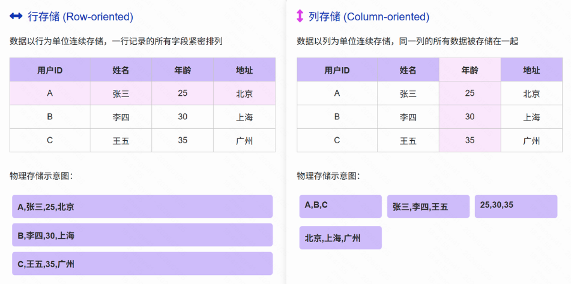
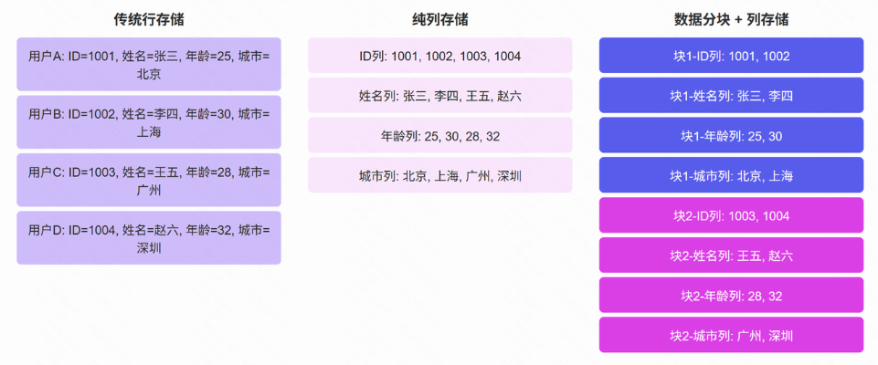
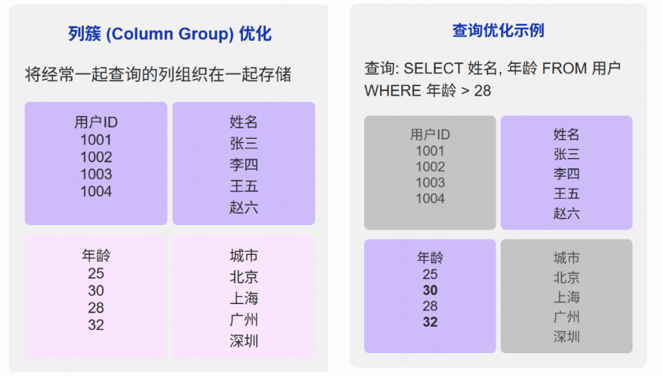
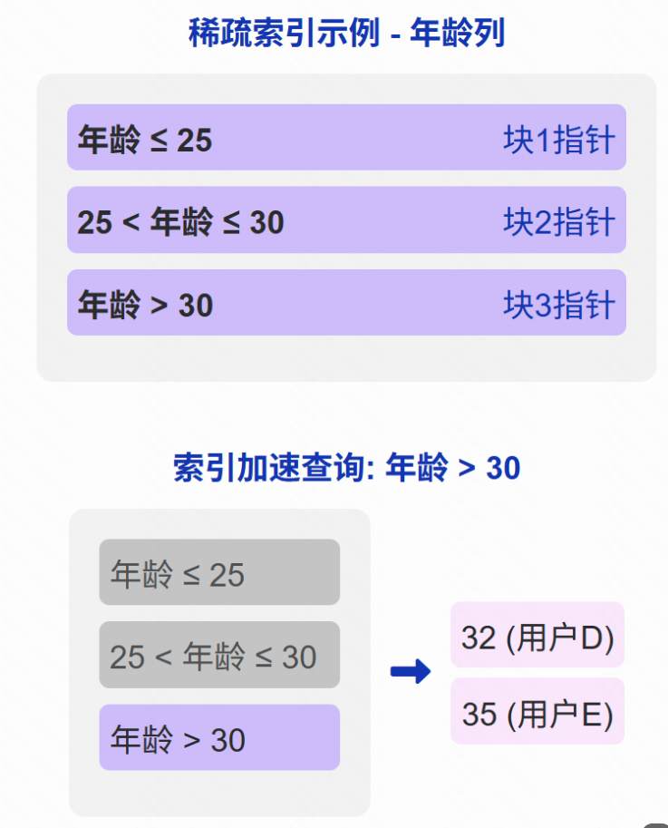
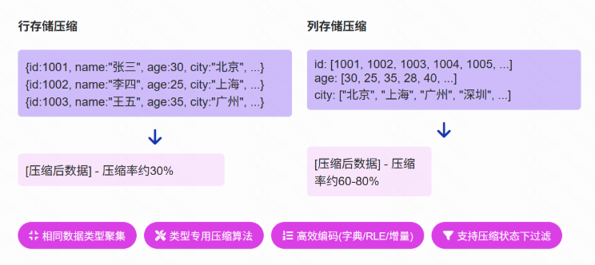
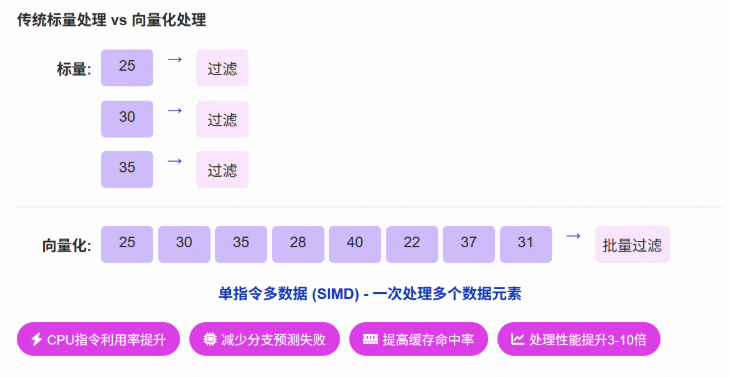

### 一、场景

在大数据时代，企业面临着海量数据分析的挑战。传统行式数据库在处理复杂分析查询时往往力不从心，查询缓慢且资源消耗大。随着数据量呈指数级增长，分析师们不得不等待漫长的查询时间，严重影响决策效率。列式数据库正是为解决这一痛点而生，通过创新的存储结构和处理机制，为大数据分析场景带来了革命性的性能提升。

### 二、什么是列式数据库

#### 1. 存储结构对比

在传统的行式数据库中，数据是水平存储的，每一行记录被连续存放。而列式数据库则采用垂直存储方式，将同一列的数据存储在一起。

列式存储使得列数据库在只需访问特定列时具有显著优势。因为它只需读取查询所需的列数据，不像行式数据库那样读取整行数据。这样，可以大幅减少IO消耗。

列式存储通过改变数据的物理组织方式，从根本上优化了“分析型查询”的性能表现。

#### 2. 关键特征

列式数据有几个关键特征，使其在分析场景中表现出色。

- 按列压缩与编码技术。同一列的数据通常具有相似性，可应用字典编码、位图索引等压缩算法，实现3-10倍的压缩率。
- 高效IO与向量化计算。列数据库只读取查询所需的列，大幅减少了IO操作。同时，许多现代列数据库支持向量化查询执行，能够同时对多个数据点执行操作，充分利用CPU的向量指令，提高处理效率。向量化可以近似理解为批量。
- 延迟物化（`Late Materialization`）：列数据库采用延迟物化原则，只在绝对必要时才将“列数据”组合成完整记录，最大限度减少数据移动，提高查询性能。

列式数据库通过这些关键特征，实现了数据分析场景下的高效查询处理和资源优化利用。

### 三、原理

#### 1. 存储结构

列式数据库的工作原理建立在其独特的数据结构基础上。在实际实现中，列数据库通常采用“数据分块”和“列簇”技术来优化存储和查询。

“数据分块”将大表划分为更小、更易于管理的部分，而“列簇”则将经常一起查询的列组合存储，在保持列式存储优势的同时减少跨列查询的开销。

此外，列数据库广泛应用稀疏索引来加速特定列的查询。由于数据按列存储，索引可以直接指向列中的特定值，而不必遍历整个表格。

这种索引结构特别适合于大规模数据集的过滤和聚合操作，能够快速定位满足条件的数据块。列式存储的数据结构设计充分考虑了分析型查询的特点，通过优化的物理组织方式提供卓越的查询性能。

#### 2. 底层逻辑

列数据库查询性能优越的核心在于两个方面：减少磁盘I/O和高效的执行引擎。

在减少磁盘I/O方面，列数据库只读取查询涉及的列，而不是整行数据。例如，如果一个表有100列，而查询只需要2列，列数据库只会读取这2列的数据，大幅减少了I/O操作。此外，由于同一列的数据类型相同，列数据库能够实现更高效的数据压缩，进一步减少了需要从磁盘读取的数据量。

在执行引擎方面，现代列数据库普遍采用向量化执行引擎，能够批量处理数据。这种引擎利用CPU的SIMD（单指令多数据）指令，同时对多个数据点执行相同操作，显著提高了CPU利用率。

同时，列数据库的数据结构也更适合并行处理，能够充分利用多核CPU的优势。列数据库通过最小化I/O操作和优化计算资源利用，从底层架构上实现了查询性能的质的飞跃。

### 四、适用场景

列数据库特别适合以下场景：

1. BI分析与报表生成：快速处理复杂的聚合查询和多维分析，是商业智能系统的理想选择；
2. 实时数据仓库：支持高频数据写入和复杂分析查询，适合构建实时数据仓库；
3. 日志分析与监控：处理半结构化数据如日志文件，实时监控系统健康状况，快速定位问题；
4. 用户行为分析：快速生成多维度报表，帮助企业深入了解用户行为模式；
5. 金融风控：实时计算各类风险指标，监测异常交易行为，及时发现和预防欺诈风险。

虽然列数据库在分析场景中表现出色，但并非所有场景都适合使用列数据库：

1. 高并发事务处理：对于OLTP系统，如订单处理、库存管理等，传统行式数据库通常更合适；
2. 单行查询密集型应用：对于主要执行单行查询的应用，行式数据库能提供更好的性能。

列数据库不是万能的解决方案，但在分析密集型场景中，它能够发挥最大价值。选择合适的数据库技术，应根据业务特点和查询模式进行评估，在适当的场景中选择适当的技术。

