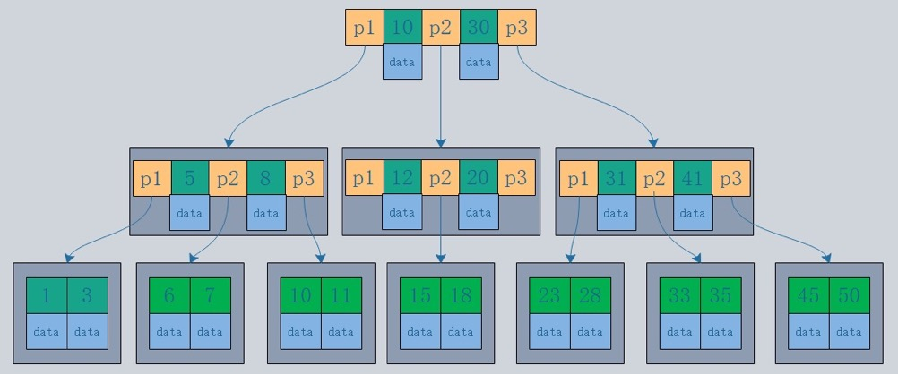
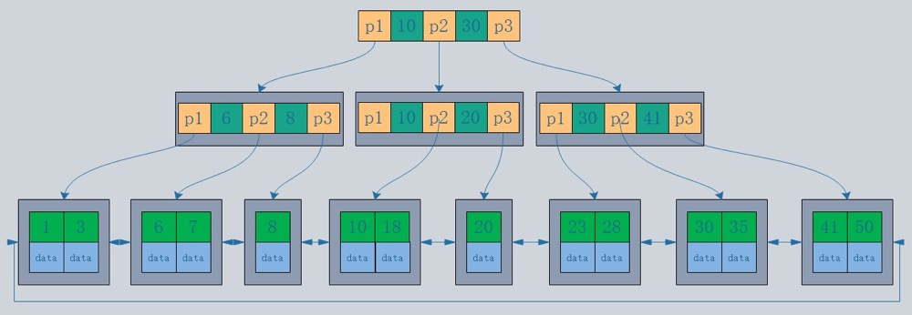

## 一、B 树

B 树也称为 B- 树，在一棵M阶B树中,下图是一棵阶数为3的树。B 树的定义：

- 每个节点最多有 M-1 个关键字
- 根节点最少可以只有一个关键字
- 非根节点最少有 M/2 个关键字
- 每个节点中的关键字都按照从小到大的顺序排列，每个关键字的左子树中的所有关键字都小于它，而右子树中的所有关键字都大于它
- 所有叶子节点都位于同一层，或者说根节点到每个叶子节点的长度都相同
- 每个节点都存有索引和数据，也就是对应的 key 和 value 

描述一颗B树时需要指定它的阶数，阶数表示了一个节点最多有多少个孩子节点，一般用字母m表示阶数。 
所以，根节点的关键字数量范围：` 1 <= k <= m-1 ` ，非根节点的关键字数量范围：`m/2 <= k <= m-1` 

## 二、B+ 树

B+树是为了磁盘或其他直接存取辅助设备设计的一种平衡查找树。在 B+ 树中，所有记录节点都是按键值的大小顺序存放在同一层的叶子节点上，由各叶子节点指针进行连接。定义如下：

和 B 树的相同点：

- 根节点至少一个元素
- 非根节点元素范围：`  m/2 <= k <= m-1  `

和 B 树的不同点：

-  B+ 树有两种类型的节点：内部节点（也称索引节点）和叶子节点。内部节点就是非叶子节点，内部节点不存储数据，只存储索引，数据都存储在叶子节点
- 内部节点中的 key 都按照从小到大的顺序排列，对与内部节点中的一个 key，左子树中的所有 key 都小于它，右子树中的 key 都大于等于它。叶子节点中的记录也按照 key 的大小排列
- 每个叶子节点都存有相邻叶子节点的指针，叶子节点本身按照关键字的大小从小到大的顺序连接
- 父节点存有右孩子的第一个元素的索引

B+ 树在 B 树的基础上演化而来，只有叶子节点才有 data 域，叶子节点包含所有的数据，叶子节点通过指针链接形成双向链表。

### 1. InnoDB 为什么选择 B+树，不选 B 数

- B+ 树的高扇出性，磁盘读取代价低。B 树每个节点都有 data 域，B+ 树只有叶子节点才有 data 域，相同大小的节点，B+树比B树能存储更多的关键字，一次性读入内存的关键字的数量也会更多，B+树的高度也会比B树低，磁盘 IO 次数就会更少。
- B+ 树对范围查询更友好，方便遍历。B 树叶子节点没有连接，而 B+ 树叶子节点通过双向指针连接，可以很方便的进行范围查询
- B+ 树查询效率稳定性好。在 B+ 树中，由于分支节点并不是最终指向文件内容的节点，分支节点只是叶子节点的索引，所以对于任意关键字的查找都必须从根节点走到分支节点，所有关键字查询路径长度相同，每个数据查询效率相当。而对于 B 树而言，其分支节点上也保存有数据，对于每一个数据的查询所走的路径长度是不一样的，效率也不一样，B 树稳定性不如 B+ 树好

### 2. InnoDB 为什么不选择搜索二叉树

不管是 AVL 树、红黑树等二叉树，都有一个特点，对于任意一个节点，它的子节点只有两个，树的高度会随着节点数增加而增加。数据库的索引是很大的，不可能直接装进内存，根节点可能是直接在内存中，其他节点存放在磁盘上，查找的时候每往下找一层需要读一次磁盘，导致磁盘 IO 次数特别多，效率是比较低的。

数据库是以页的形式存储的，InnoDB 存储引擎默认一页 16K，如果一页看成一个节点的话，二叉树一个节点只能存储一个数据，导致极大的空间浪费。

