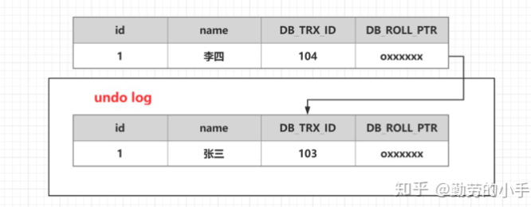
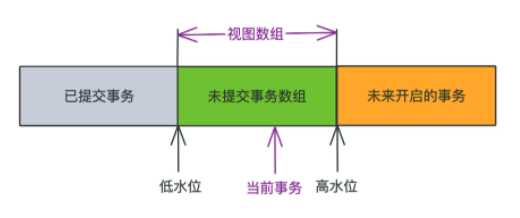
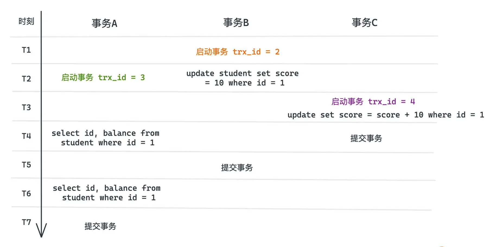

### 三、MVCC 多版本并发控制

（MVCC）（Multiversion concurrency control）同一个数据行，在数据库中存在多个版本号，这个版本号可以理解为当初操作这行数据的事务的事务ID。

当多个事务在并发进行的时候，判断某个事务是否可以读取到某一行时， 会使用行的版本号，和当前事务的ID进行比较。

- 如果发现比这个事务ID小，表示之前的事务提交的操作，对当前事务来说，此版本的数据可见。 
- 如果发现这个数据的版本号比当前事务的ID大，则表示有未来发生的事务提交生成的，对当前事务来说，此版本的数据不可见。 
- 如果发现这个行的版本号刚好等于某个正在运行的是事务ID，表示当前数据是由正运行的某个事务提交生成的，对当前事务来说，此版本数据不可见。 
- 如果当前事务自己修改的数据，当前事务还是可以看到的。

## MVCC

（MVCC）（Multiversion concurrency control）多版本并发控制

### 一、由来

MVCC是在并发访问数据库时，通过对数据做多版本管理，避免因为写锁的阻塞而造成读数据的并发阻塞问题。通俗的讲就是MVCC通过保存数据的历史版本，根据比较版本号来处理数据的是否显示，从而达到读取数据的时候不需要加锁就可以保证事务隔离性的效果

### 二、核心概念

#### 1. 事务ID

每次事务开启前都会从数据库获得一个自增长的事务ID，可以从事务ID判断事务的执行先后顺序。每个事务开始前就会申请一个这样的 ID，更大的事务 ID 一定更晚开始，但不一定更晚结束。在 InnoDB 中就是 trx_id，就可以为数据维护不同的版本了

#### 2. 表格的隐藏列

DB_TRX_ID：记录操作该数据事务的事务ID，代表该行数据是在那个 trx_id 中被修改的。这样在每个事务中看访问到表中的数据时，我们就可以对比是在当前事务之前的事务里被修改的，还是在之后的事务里被修改的。

DB_ROLL_PTR：指向上一个版本数据在 undo log 里的位置指针，也就是指向更早之前的数据记录。

DB_ROW_ID：隐藏ID，当创建表没有合适的索引作为聚集索引时，会用隐藏ID 创建聚集索引

#### 3. Undo log

undo log 主要用于记录数据被修改之前的日志，在表信息修改之前先会把数据拷贝到 undo log 里，undo log 存的是修改之前的所有原始数据。当事务进行回滚时可以通过 undo log 里的日志进行数据还原

undo log 的用途

- 保证事务进行 rollback 时的原子性和一致性，当事务进行回滚的时候可以用 undo log 的数据进行恢复
- 用于 MVCC 快照读的数据，在 MVCC 多版本控制中，通过读取 undo log 的历史版本数据可以实现不同事务版本号都拥有自己独立的快照数据版本

#### 4. 事务版本号、表格的隐藏列、undo log 的关系

1. 首先准备一张原始的数据表

    | Id   | Name | DB_TRX_ID | DB_ROLL_PTR |
    | ---- | ---- | --------- | ----------- |
    | 1    | 小明 | 103       | 0x xxx      |

2. 开启一个事务A，对 user_info 表执行 ` update user_info set name = "小红" where id=1;` 会进行如下流程操作

    - 首先获得一个事务编号 104
    - 把 user_info 表修改前的数据拷贝到 undo log 
    - 修改 user_info 表 id = 1 的数据
    - 把修改后的数据事务版本改成当前事务版本号，并把 DB_ROLL_PTR 地址指向 undo log 数据地址

3. 执行完的结果
    

由于 DB_ROLL_PTR 的存在，整个数据库中的每行数据，背后都可能有不止一条数据，每个事务的修改都会在表中留下痕迹，而它们**通过 DB_ROLL_PTR 形成了一个类似于单向链表的数据结构，我们称为版本链**。所以每次新插入一条数据，除了插入数据本身和申请事务 ID，还要把 DB_ROLL_PTR 指向此前数据的 undo_log。

MVCC 就是在这样的版本链上，通过事务 ID 和链上不同版本的对比，找到一个合适的可见版本的。快照读就是 MVCC 发挥作用的方式

##### 5. 快照读和当前读

在 select 数据的时候，我们会按照一定的规则，而不一定会读出表中最新的数据，有可能从版本链中选择一个合适的版本读出来，就像一个快照一样，称为快照读

在 InnoDB 中，默认的、可重复读的事务隔离等级下，使用的 select 都是快照读

```
select * from student where id < 10
```

而当前读，读的就是记录的最新值，**可能会幻读**，在 InnoDB 下我们会进行显示的加锁操作，比如 for update

```
select * from student where id < 10 for update
```

### 三、MVCC 和 Read view

在可重复读的隔离性下，MVCC 如何工作呢？核心的可见性保证来自于读视图的建立，本质就是每个事务开始前，会记录下当前仍在活跃也就是开始但未提交的所有事务，保存在一个数组中，我们称之为视图数组，然后会根据这个数组，基于一定的规则判断应该读取数据的那个快照。


首先，我们会记录视图数组中最小的事务 ID 和最大的事务 ID + 1，分别称为低水位和高水位。可以将所有的事物分为三个部分，小于低水位的部分一定是当前事物开始前就提交了的部分，大于或者等于高水位的则一定是还未提交的事物，是不可见的事务。处于中间的部分分类讨论：

- 事务 ID 如果在视图数组中，说明当前事务开始时，这些事务仍在活跃，所以应该是不可见的
- 事务 ID 如果不在数组中，有一些事务虽然不是开始最早的，但是结束的却比活跃数组中的事务早，以至于当前事务开始时，这些事务已经结束，所以应该是可见的。比如并发的事务A启动和事务B启动，事务A还未创建事务数组，事务B执行结束，已经 commit，事务A的事务数组就没有这个事务ID了，我们就可以认为这个事务 B 已经执行成功了。

总结：如果我们记录低水位为 low_id，高水位为 high_id，活跃事务数组为 trx_list。可见的 trx_id 就需要满足，下面两点是 或 的关系

1. ` trx_id < low_id `  要么比低水位更早
2. ` trx_id < hight_id && !trx_list.contains(trx_id) `   要么比高水位的 id 小，但是不能出现在活跃事务数组中

那**读视图的规则其实就是根据可见性的约束，在查询数据的时候拿到版本链从最新往前遍历，直至找到第一个可见的版本返回**。

##### 1. 举个例子

分析一下事务A 的执行情况，假设在 A 之前 id=1 的记录隐藏列中事务ID 为 1，且已经提交


在事务 A 启动的时候，由于晚于事务 B、早于事务 C，申请到的 trx_id=3，而视图数组里活跃的事务只有 trx_id=2 的事务B，也就是 [ trx_id = 2 ] 。

在 T4 时，事务 A 的访问情况：

-  trx_id = 4 的事务 C，无论有没有提交，由于 trx_id 大于视图数组中高水位，所以对当前事务来说不可见，这就避免了脏读
- 对于事务 B，不管是在什么时候提交，反正已经在当前事务的视图数组中，也就是事务 A 开始时已经在活跃的事务，所以也是不可见

所以 T6 的时候，事务A 访问的值和 T4 也是一样，这也就保证了可重复读的语义

##### 2. 对于读已提交的MVCC

对于读已提交的 MVCC，只要把条件简化为 ` trx_id < high_id `

MVCC 依赖全局唯一而且递增的 trx_id，只适用于单机版本，无法在网络环境下实现并发。


