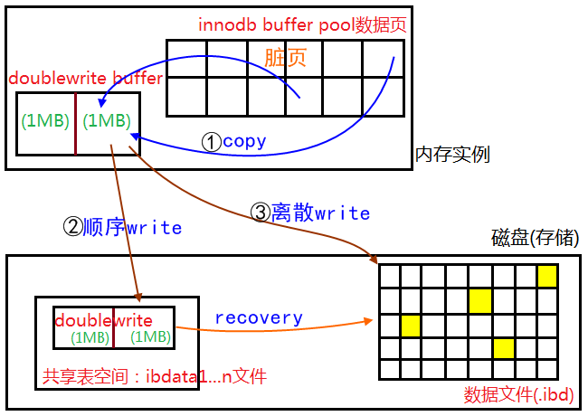

## 一、脏页刷盘风险

1. 数据库 IO 的最小单位是 16K （MySQL 默认，oracle 是 8K）
2. 文件系统 IO 的最小单位是 4K
3. 磁盘 IO 的最小单位是 512 字节

因此，存在 IO 写入导致 page 损坏的风险


## 二、double write

当数据库正在从内存向磁盘写一个数据页时，数据库宕机，从而导致这个页只写了部分数据。innodb 的 redo log 不会记录完整的一页数据，因为这样日志太大，只会记录那次（sequence）如何操作（insert、update）那页（page）的那行（row）。所以当 MySQL 恢复后，如果没有 double write 机制，MySQL 将 data file 数据捞到内存，重做刚才的那条 redo log，这个 redo log 要操作的数据页已经不一致了，有些是被修改的，有些没有修改；这就造成了数据不一致。

使用 double write 来提高 innodb 的可靠性，用来解决部分写失败导致的页断裂（partial page write）



double write 由两部分组成，一部分为内存中的 double write buffer，其大小为2MB，另一部分是磁盘上共享表空间(ibdata x)中连续的128个页，即2个区(extent)，大小也是2M。(`128 * 16K = 2M`)

1. 当一系列机制触发数据缓冲池中的脏页刷新时，并不直接写入磁盘数据文件中，而是先拷贝至内存中的 double write buffer中
2. 接着从两次写缓冲区分两次写入磁盘共享表空间中(连续存储，顺序写，性能很高)，每次写1MB
3. 待第二步完成后，再将double write buffer中的脏页数据写入实际的各个表空间文件(离散写)；(脏页数据固化后，即进行标记对应 double write 数据可覆盖)

#### 1. 崩溃恢复

如果操作系统在将页写入磁盘的过程中发生崩溃，在恢复过程中，innodb存储引擎可以从共享表空间的double write中找到该页的一个最近的副本，将其复制到表空间文件，再应用 redo log，就完成了恢复过程。因为有副本所以也不担心表空间中数据页是否损坏。

也就是说，在恢复时，检查double writer的数据的完整性，如果不完整直接丢弃double write buffer内容，重新执行哪条redo log，如果double write buffer的数据是完整的，用double buffer的数据更新该数据页，跳过该redo log 

- 为什么log write不需要doublewrite的支持？

    因为 redo log 写入的单位是 512 字节，也就是磁盘 IO 的最小单位，所以无所谓数据损坏

#### 2. double write 的副作用

1. double write 在磁盘上的共享表空间，是一个文件，会导致系统有更多的 fsync 操作，而硬盘的 fsync 性能是很慢的，会降低 MySQL 的整体性能
2. 但是写入磁盘共享表空间这个过程是连续存储，连续写，性能较随机写要高，因此牺牲一点写性能来保证数据页的完整还是很有必要的

#### 3. 监控 double write 工作负载

```
mysql> show global status like '%dblwr%';
+----------------------------+-------+
| Variable_name              | Value |
+----------------------------+-------+
| Innodb_dblwr_pages_written | 2     |
| Innodb_dblwr_writes        | 1     |
+----------------------------+-------+
```

开启doublewrite后，每次脏页刷新必须要先写doublewrite，而doublewrite存在于磁盘上的是两个连续的区，每个区由连续的页组成，一般情况下一个区最多有64个页，所以一次IO写入应该可以最多写64个页.

而根据以上系统Innodb_dblwr_pages_written与Innodb_dblwr_writes的比例来看，大概在3左右，远远还没到64(如果约等于64，那么说明系统的写压力非常大，有大量的脏页要往磁盘上写)，所以从这个角度也可以看出，系统写入压力并不高。

#### 4. 关闭 double write 适合的场景

1. 海量DML
2. 不惧怕数据损坏和丢失
3. 系统写负载成为主要负载

```
mysql> show variables like '%double%';
+--------------------+-------+
| Variable_name      | Value |
+--------------------+-------+
| innodb_doublewrite | ON    |
+--------------------+-------+
```

作为InnoDB的一个关键特性，doublewrite功能默认是开启的，但是在上述特殊的一些场景也可以视情况关闭，来提高数据库写性能。静态参数，配置文件修改，重启数据库。

#### 5. 为什么没有把double write里面的数据写到data page里面呢？

1. double write里面的数据是连续的，如果直接写到data page里面，而data page的页又是离散的，写入会很慢。
2. double write里面的数据没有办法被及时的覆盖掉，导致double write的压力很大；短时间内可能会出现double write溢出的情况。